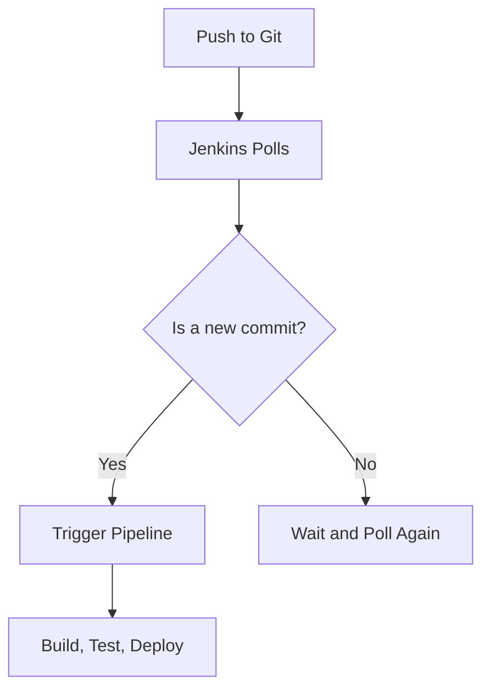
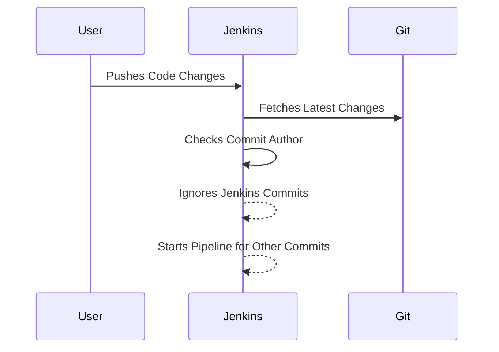

## Introduction to Jenkins Pipeline Integration with Git Versioning

In the realm of continuous integration and delivery (CI/CD), Jenkins stands out as one of the most widely used tools. Its robust pipeline capabilities allow developers to automate their build, test, and deployment processes efficiently. Integrating Jenkins with Git version control systems like GitLab, Bitbucket, and GitHub is crucial for modern DevOps practices. This chapter delves into the intricacies of Jenkins pipeline integration with Git versioning, focusing on the practical aspects and security considerations.

### Background Theory

#### What is Jenkins?

Jenkins is an open-source automation server written in Java. It supports building, testing, and deploying software projects continuously. Jenkins provides a rich ecosystem of plugins to support a variety of development tools and practices. One of its key features is the ability to define complex workflows using declarative or scripted pipelines.

#### What is Git Version Control?

Git is a distributed version control system designed to handle everything from small to very large projects with speed and efficiency. It allows developers to track changes in their codebase, collaborate with others, and maintain a history of modifications. GitLab, Bitbucket, and GitHub are popular platforms that provide hosting services for Git repositories.

### Jenkins Pipeline Integration with Git Versioning

When integrating Jenkins with Git, the primary goal is to trigger builds automatically whenever changes are pushed to the repository. This ensures that the latest code changes are tested and deployed promptly. Jenkins supports various Git providers, including GitLab, Bitbucket, and GitHub, each with its own specific integration methods.

#### Multi-Branch Pipelines

Multi-branch pipelines in Jenkins allow you to create a single pipeline definition that can be applied to multiple branches in your Git repository. This is particularly useful for managing different environments (e.g., development, staging, production) within the same project.



### Ignoring Commits from Jenkins

One common issue in Jenkins-Git integrations is the creation of a feedback loop where Jenkins commits changes back to the repository, triggering further builds. To avoid this, Jenkins provides plugins like the "Ignore Committer Strategy" plugin.

#### Installing the Ignore Committer Strategy Plugin

To install the Ignore Committer Strategy plugin, follow these steps:

1. **Access Jenkins Dashboard**: Log in to your Jenkins instance.
2. **Manage Plugins**: Navigate to `Manage Jenkins` > `Manage Plugins`.
3. **Available Tab**: Click on the `Available` tab.
4. **Search for Plugin**: Search for "Ignore Committer Strategy".
5. **Install Plugin**: Click `Install without restart`.

Once installed, the plugin adds new configuration options to your multi-branch pipelines.

#### Configuring the Plugin

After installing the plugin, you need to configure it in your multi-branch pipeline settings.

1. **Navigate to Pipeline Configuration**: Go to your multi-branch pipeline and click `Configure`.
2. **Scroll Down to Branch Sources**: Scroll down to the `Branch Sources` section.
3. **Add Build Strategy**: Under `Build Strategies`, add a new build strategy and select `Ignore Committer Strategy`.
4. **Enter Email Addresses**: Enter the email addresses of the Jenkins users whose commits should be ignored.



### Real-World Example: Recent Breach

A recent breach involving a CI/CD pipeline occurred in 2021, where an attacker gained access to a Jenkins instance and exploited it to push malicious code to a Git repository. This resulted in unauthorized changes being deployed to production environments.

#### How to Prevent / Defend

**Detection:**
- **Audit Logs**: Regularly review Jenkins audit logs to identify unauthorized access attempts.
- **Webhooks**: Monitor webhooks to detect unexpected triggers.

**Prevention:**
- **Secure Credentials**: Ensure that Jenkins credentials are securely stored and rotated regularly.
- **Least Privilege Principle**: Grant minimal permissions necessary for Jenkins to perform its tasks.

**Secure Coding Fixes:**

**Vulnerable Code:**
```yaml
pipeline {
    agent any
    stages {
        stage('Build') {
            steps {
                sh 'make'
            }
        }
        stage('Test') {
            steps {
                sh 'make test'
            }
        }
        stage('Deploy') {
            steps {
                sh 'make deploy'
            }
        }
    }
}
```

**Fixed Code:**
```yaml
pipeline {
    agent any
    environment {
        GIT_AUTHOR_EMAIL = 'jenkins@example.com'
    }
    stages {
        stage('Build') {
            steps {
                sh 'make'
            }
        }
        stage('Test') {
            steps {
                sh 'make test'
            }
        }
        stage('Deploy') {
            steps {
                sh 'make deploy'
            }
        }
    }
    options {
        ignoreCommitters('jenkins@example.com')
    }
}
```

### Complete Example: Full HTTP Request and Response

Consider a scenario where a Jenkins webhook is triggered by a Git push event.

**HTTP Request:**
```http
POST /webhook HTTP/1.1
Host: jenkins.example.com
Content-Type: application/json
User-Agent: GitLab Web Hook
X-Gitlab-Token: <your_token>
X-Gitlab-Event: Push Hook

{
  "object_kind": "push",
  "ref": "refs/heads/master",
  "checkout_sha": "b6568db1bc1dcd7f814dd95f4c46de7cc5ccf9d6",
  "user_id": 1,
  "author_email": "jenkins@example.com"
}
```

**HTTP Response:**
```http
HTTP/1.1 200 OK
Date: Tue, 14 Mar 2023 12:00:00 GMT
Content-Type: application/json
Content-Length: 18

{"status": "success"}
```

### Common Pitfalls and Best Practices

#### Pitfall: Insecure Webhooks
Insecurely configured webhooks can be exploited to trigger unauthorized actions in Jenkins.

**Best Practice:**
- **Use Secure Tokens**: Always use secure tokens for webhooks.
- **Validate Events**: Validate the events received by the webhook to ensure they come from trusted sources.

#### Pitfall: Excessive Permissions
Granting excessive permissions to Jenkins can lead to security vulnerabilities.

**Best Practice:**
- **Least Privilege Principle**: Assign minimal permissions required for Jenkins to function.
- **Regular Audits**: Perform regular audits to ensure permissions are up-to-date.

### Hands-On Labs

For hands-on practice with Jenkins pipeline integration and Git versioning, consider the following labs:

- **PortSwigger Web Security Academy**: Offers comprehensive labs on web application security.
- **OWASP Juice Shop**: A deliberately insecure web application for practicing security skills.
- **DVWA (Damn Vulnerable Web Application)**: A PHP/MySQL web application that is riddled with vulnerabilities.

These labs provide a safe environment to experiment with Jenkins and Git integrations, ensuring you gain practical experience in a controlled setting.

### Conclusion

Integrating Jenkins with Git versioning is a critical aspect of modern DevOps practices. By understanding the nuances of multi-branch pipelines and leveraging plugins like the Ignore Committer Strategy, you can effectively manage your CI/CD processes while maintaining security. Regular audits, secure configurations, and best practices are essential to preventing security breaches and ensuring smooth operations.

---
<!-- nav -->
[[DevOps/DevOps Bootcamp/06-CI CD & Build Tools/29-Jenkins Pipeline Integration With Git Versioning/00-Overview|Overview]] | [[02-Jenkins Pipeline Integration With Git Versioning|Jenkins Pipeline Integration With Git Versioning]]
