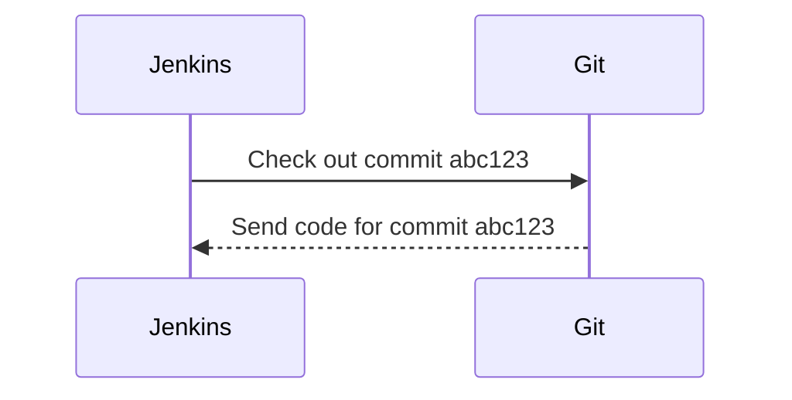
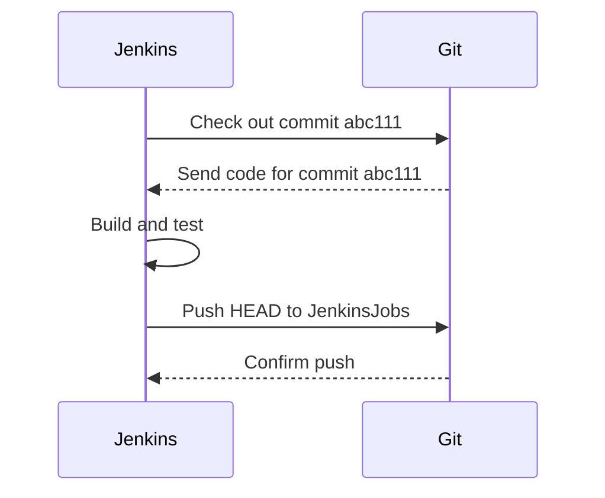

## Jenkins Pipeline Integration With Git Versioning

### Overview

Jenkins is a widely used open-source automation server that provides continuous integration and continuous delivery (CI/CD) services. One of the key features of Jenkins is its ability to integrate with version control systems like Git, allowing developers to automate their build and deployment processes. In this section, we will delve into how Jenkins interacts with Git, particularly focusing on how Jenkins checks out the latest code and integrates it into the pipeline.

### How Jenkins Checks Out Code

When Jenkins starts a pipeline, it needs to fetch the most recent code from the version control system. By default, Jenkins does not check out a specific branch but instead checks out a specific commit hash. This behavior ensures that Jenkins builds the exact version of the code that corresponds to a particular commit, providing consistency and reproducibility.

#### Commit Hash vs. Branch Name

A **commit hash** is a unique identifier for a specific version of the codebase. Each commit in Git has a unique hash value, which is a cryptographic hash of the commit's contents. Checking out a commit hash ensures that Jenkins builds the exact version of the code that was committed, regardless of any subsequent changes that might have been made to the branch.

In contrast, checking out a **branch name** would mean that Jenkins builds whatever the current state of that branch is at the time of checkout. This approach can lead to inconsistencies if new commits are pushed to the branch after the pipeline starts but before it completes.

#### Example of Commit Checkout

Consider a scenario where you have a Git repository with a `main` branch. The latest commit on this branch has the hash `abc123`. When Jenkins starts a pipeline, it checks out the commit `abc123`, ensuring that the build is based on this exact version of the code.



### Pushing Commits to Jenkins Jobs Branch

Once Jenkins has checked out the code, it may need to push changes back to the repository. This is often done to update the `Jenkins Jobs` branch with the latest build information or to trigger further actions in the pipeline.

#### Git Push Command

To push the changes to the `Jenkins Jobs` branch, you would typically use the following Git command:

```sh
git push origin HEAD:refs/heads/JenkinsJobs
```

This command pushes the current branch (`HEAD`) to the `JenkinsJobs` branch on the `origin` remote.

#### Example Workflow

Let's walk through an example workflow:

1. **Checkout Commit**: Jenkins checks out the latest commit from the `main` branch.
2. **Build and Test**: Jenkins runs the build and test steps.
3. **Push Changes**: Jenkins pushes the results of the build to the `JenkinsJobs` branch.



### Git Configuration

Jenkins often needs to configure Git settings to ensure that the build process runs smoothly. This includes setting the user name and email, which are used to identify the author of the commits.

#### Setting User Name and Email

To set the user name and email in Git, you can use the following commands:

```sh
git config --global user.name "Jenkins"
git config --global user.email "jenkins@example.com"
```

These settings are stored in the `.gitconfig` file in the user's home directory.

#### Listing Git Configurations

To list all the configurations in Git, you can use the following command:

```sh
git config --list
```

This command will display all the configurations, including the user name and email.

### Real-World Example

Consider a recent breach where a developer inadvertently committed sensitive credentials to a public repository. This incident highlights the importance of proper Git configuration and the need to ensure that Jenkins builds are consistent and secure.

#### CVE Example

CVE-2021-44228 (Log4Shell) is a real-world example where improper handling of log messages led to a critical vulnerability. In such scenarios, ensuring that Jenkins builds are consistent and that the codebase is properly secured can help mitigate risks.

### How to Prevent / Defend

#### Detection

To detect unauthorized changes or sensitive data leaks, you can use tools like `git-secrets` or `truffleHog` to scan your repositories for sensitive information.

```sh
# Install git-secrets
brew install git-secrets

# Configure git-secrets
git secrets --register-aws
git secrets --install .git
```

#### Prevention

To prevent unauthorized changes, you can enforce strict Git policies and use tools like `pre-commit` hooks to validate changes before they are committed.

```sh
# Install pre-commit
pip install pre-commit

# Create a pre-commit configuration
echo "repos:" > .pre-commit-config.yaml
echo "- repo: https://github.com/pre-commit/pre-commit-hooks" >> .pre-commit-config.yaml
echo "  rev: v4.0.1" >> .pre-commit-config.yaml
echo "  hooks:" >> .pre-commit-config.yaml
echo "  - id: trailing-whitespace" >> .pre-commit-config.yaml
```

#### Secure Coding Fixes

Here is an example of a vulnerable code snippet and its secure counterpart:

**Vulnerable Code:**

```python
import os
import logging

logging.basicConfig(filename='app.log', level=logging.DEBUG)
logging.debug('User credentials: %s', os.getenv('USER_CREDENTIALS'))
```

**Secure Code:**

```python
import os
import logging

logging.basicConfig(filename='app.log', level=logging.DEBUG)
if os.getenv('USER_CREDENTIALS'):
    logging.debug('User credentials present')
else:
    logging.debug('No user credentials found')
```

### Complete Example

Let's put everything together with a complete example:

#### Full HTTP Request and Response

```http
POST /api/jenkins/job HTTP/1.1
Host: jenkins.example.com
Content-Type: application/json

{
  "jobName": "my-job",
  "commitHash": "abc123",
  "branch": "main"
}
```

```http
HTTP/1.1 200 OK
Content-Type: application/json

{
  "status": "success",
  "message": "Job started successfully"
}
```

#### Git Commands

```sh
# Clone the repository
git clone https://github.com/myorg/myrepo.git

# Navigate to the repository
cd myrepo

# Set user name and email
git config --global user.name "Jenkins"
git config --global user.email "jenkins@example.com"

# Checkout the latest commit
git checkout abc123

# Build and test
make build
make test

# Push changes to JenkinsJobs branch
git push origin HEAD:refs/heads/JenkinsJobs
```

### Conclusion

Integrating Jenkins with Git versioning is crucial for maintaining consistent and reproducible builds. By understanding how Jenkins checks out code and pushes changes, you can ensure that your CI/CD pipelines are robust and secure. Using tools like `git-secrets` and `pre-commit` can help detect and prevent unauthorized changes, ensuring that your codebase remains secure.

### Practice Labs

For hands-on practice, consider using the following labs:

- **PortSwigger Web Security Academy**: Offers a comprehensive set of labs for learning web security.
- **OWASP Juice Shop**: A deliberately insecure web application for practicing web security skills.
- **DVWA (Damn Vulnerable Web Application)**: A PHP/MySQL web application that is riddled with vulnerabilities for educational purposes.
- **WebGoat**: An interactive, gamified training application designed to teach web application security.

By completing these labs, you can gain practical experience in integrating Jenkins with Git and securing your CI/CD pipelines.

---
<!-- nav -->
[[01-Introduction to Jenkins Pipeline Integration with Git Versioning|Introduction to Jenkins Pipeline Integration with Git Versioning]] | [[DevOps/DevOps Bootcamp/06-CI CD & Build Tools/29-Jenkins Pipeline Integration With Git Versioning/00-Overview|Overview]] | [[03-Jenkins Pipeline Integration with Git Versioning|Jenkins Pipeline Integration with Git Versioning]]
