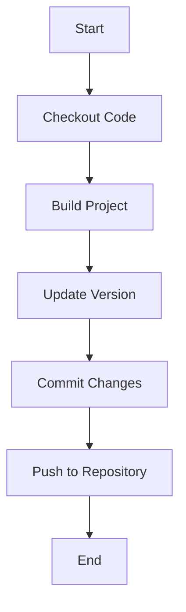

## Jenkins Pipeline Integration with Git Versioning

### Background Theory

Jenkins is a popular open-source automation server used for continuous integration and continuous delivery (CI/CD) processes. It allows developers to automate their software development lifecycle, including building, testing, and deploying applications. One of the key features of Jenkins is its ability to integrate with version control systems like Git, enabling seamless management of code changes and automated builds.

Git is a distributed version control system that tracks changes in code repositories. It is widely used in software development due to its flexibility, speed, and robustness. Integrating Jenkins with Git allows developers to automatically trigger builds whenever changes are pushed to the repository, ensuring that the latest code is tested and deployed.

### Problem Statement

In the given scenario, Jenkins successfully increments the version number in the `pom.xml` file during a build. However, this change is not committed back to the Git repository. As a result, every subsequent build starts with the initial version number, leading to incorrect versioning.

### Detailed Explanation

#### Version Increment Mechanism

When Jenkins builds a project, it often needs to manage version numbers, especially in Maven-based projects where the `pom.xml` file contains the version information. The typical process involves:

1. **Reading the Current Version**: Jenkins reads the current version from the `pom.xml` file.
2. **Incrementing the Version**: Jenkins uses a script or plugin to increment the version number.
3. **Updating the `pom.xml` File**: The updated version number is written back to the `pom.xml` file.

However, in the described scenario, the updated `pom.xml` file is not committed back to the Git repository. This means that the next time Jenkins runs, it reads the original version from the repository, rather than the incremented version.

#### Why Committing Back to Git Matters

Committing the updated `pom.xml` file back to the Git repository ensures that the version number is consistent across all builds. Without this step, the version number will reset to the initial value in every build, leading to incorrect versioning.

### Example Scenario

Consider a Maven-based project where the `pom.xml` file contains the following version information:

```xml
<project>
    <modelVersion>4.0.0</modelVersion>
    <groupId>com.example</groupId>
    <artifactId>example-project</artifactId>
    <version>1.1.0-SNAPSHOT</version>
</project>
```

During a Jenkins build, the version is incremented to `1.1.1-SNAPSHOT`. However, if this change is not committed back to the Git repository, the next build will read the original `1.1.0-SNAPSHOT` version from the repository.

### Solution: Committing the Updated `pom.xml` File

To ensure that the version number is correctly managed, Jenkins should commit the updated `pom.xml` file back to the Git repository after each build. This can be achieved using a combination of Jenkins plugins and Git commands.

#### Step-by-Step Implementation

1. **Install Necessary Plugins**:
   - **Git Plugin**: Enables Jenkins to interact with Git repositories.
   - **Maven Integration Plugin**: Facilitates Maven-based builds.
   - **Pipeline Plugin**: Allows defining complex build pipelines.

2. **Define the Jenkins Pipeline**:
   - Use a Jenkinsfile to define the pipeline steps.
   - Include steps to read, increment, and update the version in the `pom.xml` file.
   - Add steps to commit the updated `pom.xml` file back to the Git repository.

Here is an example Jenkinsfile that demonstrates this process:

```groovy
pipeline {
    agent any

    stages {
        stage('Checkout') {
            steps {
                git branch: 'main', url: 'https://github.com/example/repo.git'
            }
        }

        stage('Build') {
            steps {
                sh 'mvn clean install'
            }
        }

        stage('Update Version') {
            steps {
                script {
                    def pom = readMavenPom file: 'pom.xml'
                    def version = pom.version.replace('-SNAPSHOT', '')
                    def newVersion = version.tokenize('.').collect { it.toInteger() }
                    newVersion[-1]++
                    pom.version = newVersion.join('.') + '-SNAPSHOT'
                    writeMavenPom xml: pom
                }
            }
        }

        stage('Commit Changes') {
            steps {
                sh 'git config --global user.email "jenkins@example.com"'
                sh 'git config --global user.name "Jenkins"'
                sh 'git add pom.xml'
                sh 'git commit -m "Updated version to ${newVersion}"'
                sh 'git push origin main'
            }
        }
    }
}
```

### Diagram: Jenkins Pipeline Flow



### Common Pitfalls and How to Avoid Them

#### Pitfall 1: Incorrect Versioning

If the version number is not correctly incremented or committed, it can lead to incorrect versioning in the repository. This can cause confusion and issues in tracking the correct version of the software.

**How to Avoid**:
- Ensure that the version increment logic is correct and tested.
- Verify that the updated `pom.xml` file is committed back to the repository.

#### Pitfall 2: Git Authentication Issues

If Jenkins does not have the necessary credentials to commit changes to the Git repository, the build will fail.

**How to Avoid**:
- Configure Jenkins with the necessary SSH keys or access tokens to authenticate with the Git repository.
- Ensure that the Git URL and credentials are correctly configured in the Jenkins job.

### Real-World Example: CVE-2021-22205

CVE-2021-22205 is a vulnerability in Jenkins that allows attackers to execute arbitrary code on the Jenkins server. This vulnerability can be exploited if Jenkins is configured to automatically pull code from a Git repository without proper authentication.

**Impact**:
- Attackers can inject malicious code into the repository, which will be executed during the build process.
- This can lead to unauthorized access, data theft, or other malicious activities.

**Prevention**:
- Ensure that Jenkins is configured to use secure authentication methods when interacting with Git repositories.
- Regularly update Jenkins and its plugins to the latest versions to mitigate known vulnerabilities.

### Secure Coding Practices

#### Vulnerable Code Example

```groovy
pipeline {
    agent any

    stages {
        stage('Checkout') {
            steps {
                git branch: 'main', url: 'https://github.com/example/repo.git'
            }
        }

        stage('Build') {
            steps {
                sh 'mvn clean install'
            }
        }

        stage('Update Version') {
            steps {
                script {
                    def pom = readMavenPom file: 'pom.xml'
                    def version = pom.version.replace('-SNAPSHOT', '')
                    def newVersion = version.tokenize('.').collect { it.toInteger() }
                    newVersion[-1]++
                    pom.version = newVersion.join('.') + '-SNAPSHOT'
                    writeMavenPom xml: pom
                }
            }
        }
    }
}
```

#### Secure Code Example

```groovy
pipeline {
    agent any

    stages {
        stage('Checkout') {
            steps {
                git branch: 'main', url: 'https://github.com/example/repo.git'
            }
        }

        stage('Build') {
            steps {
                sh 'mvn clean install'
            }
        }

        stage('Update Version') {
            steps {
                script {
                    def pom = readMavenPom file: 'pom.xml'
                    def version = pom.version.replace('-SNAPSHOT', '')
                    def newVersion = version.tokenize('.').collect { it.toInteger() }
                    newVersion[-1]++
                    pom.version = newVersion.join('.') + '-SNAPSHOT'
                    writeM
```

### How to Prevent / Defend

#### Detection

- **Audit Logs**: Regularly review Jenkins audit logs to detect any unauthorized access or changes.
- **Code Scanning**: Use tools like SonarQube to scan the codebase for vulnerabilities and coding errors.

#### Prevention

- **Secure Configuration**: Ensure that Jenkins is configured with strong authentication mechanisms and access controls.
- **Regular Updates**: Keep Jenkins and its plugins up to date with the latest security patches.

#### Secure-Coding Fixes

- **Use Secure Credentials**: Store sensitive credentials securely using Jenkins credentials manager.
- **Validate Inputs**: Validate all inputs to prevent injection attacks.

### Conclusion

Integrating Jenkins with Git versioning is crucial for managing code changes and ensuring consistent versioning. By committing the updated `pom.xml` file back to the Git repository, developers can avoid incorrect versioning and maintain a reliable build process. Following secure coding practices and regularly auditing the system can help prevent vulnerabilities and ensure the integrity of the codebase.

### Practice Labs

For hands-on practice with Jenkins and Git integration, consider the following labs:

- **PortSwigger Web Security Academy**: Offers a comprehensive set of labs covering various aspects of web application security, including CI/CD pipelines.
- **OWASP Juice Shop**: A deliberately insecure web application for practicing web security skills, including CI/CD pipeline security.
- **DVWA (Damn Vulnerable Web Application)**: A PHP/MySQL web application that is riddled with vulnerabilities, useful for learning about web security and CI/CD pipelines.

These labs provide practical experience in setting up and securing Jenkins pipelines with Git integration, helping to reinforce the concepts learned in this chapter.

---
<!-- nav -->
[[02-Jenkins Pipeline Integration With Git Versioning|Jenkins Pipeline Integration With Git Versioning]] | [[DevOps/DevOps Bootcamp/06-CI CD & Build Tools/29-Jenkins Pipeline Integration With Git Versioning/00-Overview|Overview]] | [[DevOps/DevOps Bootcamp/06-CI CD & Build Tools/29-Jenkins Pipeline Integration With Git Versioning/04-Practice Questions & Answers|Practice Questions & Answers]]
