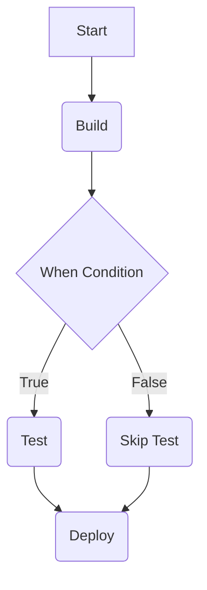

## Jenkins Pipeline Post-Build Actions and Conditional Stages

### Introduction to Jenkins Pipeline

Jenkins is one of the most widely used continuous integration and continuous delivery (CI/CD) tools. It allows developers to automate the building, testing, and deployment of their applications. A Jenkins pipeline is a series of steps that are executed in a specific order to achieve a desired outcome. Each step in the pipeline is referred to as a stage, and stages can be configured to perform various tasks such as building code, running tests, deploying applications, and more.

### Conditional Stages in Jenkins Pipeline

One powerful feature of Jenkins pipelines is the ability to define conditional stages. This means that certain stages can be executed based on specific conditions, such as the branch being built or the environment variables present during the build process. This flexibility allows teams to tailor their pipelines to their specific needs, ensuring that only necessary steps are executed for different types of builds.

#### Syntax for Conditional Stages

The syntax for defining conditional stages in a Jenkinsfile is straightforward. The `when` directive is used within a stage block to specify the conditions under which the stage should be executed. Here is an example of how to use the `when` directive:

```groovy
pipeline {
    agent any

    stages {
        stage('Build') {
            steps {
                echo 'Building...'
            }
        }

        stage('Test') {
            when {
                expression { return env.BRANCH_NAME == 'development' }
            }
            steps {
                echo 'Running tests...'
            }
        }

        stage('Deploy') {
            when {
                expression { return env.BRANCH_NAME == 'master' }
            }
            steps {
                echo 'Deploying to production...'
            }
        }
    }
}
```

In this example, the `Test` stage will only run if the current branch being built is `development`, and the `Deploy` stage will only run if the current branch is `master`.

### Environmental Variables in Jenkins

Jenkins provides several environmental variables that can be used within the pipeline to determine the context of the build. One of the most commonly used variables is `BRANCH_NAME`, which contains the name of the branch currently being built. This variable is automatically set by Jenkins and can be accessed within the pipeline using the `env` object.

Here is a breakdown of how to use the `BRANCH_NAME` variable:

```groovy
pipeline {
    agent any

    stages {
        stage('Check Branch') {
            steps {
                script {
                    echo "Current branch: ${env.BRANCH_NAME}"
                }
            }
        }

        stage('Conditional Test') {
            when {
                expression { return env.BRANCH_NAME == 'development' }
            }
            steps {
                echo 'Running tests on development branch...'
            }
        }
    }
}
```

In this example, the `Check Branch` stage prints the current branch name, and the `Conditional Test` stage runs only if the current branch is `development`.

### Real-World Examples and Recent Breaches

Conditional stages in Jenkins pipelines can help prevent unnecessary resource usage and ensure that sensitive operations are only performed in specific contexts. However, misconfigurations can lead to security vulnerabilities. For instance, if a stage intended to deploy to production is accidentally triggered on a development branch, it could result in unintended changes to the production environment.

A recent example of such a breach occurred in 2021 when a misconfigured Jenkins pipeline led to unauthorized access to a production environment. The pipeline was supposed to deploy only on the `master` branch but was incorrectly configured to deploy on any branch. This allowed attackers to push malicious code to the production environment.

To prevent such issues, it is crucial to thoroughly test and validate the conditions used in the `when` directive. Additionally, using automated testing and validation tools can help catch misconfigurations before they cause harm.

### How to Prevent / Defend

#### Detection

To detect misconfigurations in Jenkins pipelines, teams can use static analysis tools that scan Jenkinsfiles for potential issues. Tools like Jenkins Pipeline Linter can help identify problems such as incorrect conditions in the `when` directive.

#### Prevention

To prevent misconfigurations, teams should follow these best practices:

1. **Code Reviews**: Ensure that all Jenkinsfiles undergo thorough code reviews to catch any misconfigurations.
2. **Automated Testing**: Implement automated testing for Jenkins pipelines to verify that conditions are correctly configured.
3. **Environment Isolation**: Use separate environments for development, testing, and production to minimize the risk of accidental deployments.

#### Secure Coding Fixes

Here is an example of a vulnerable Jenkinsfile and its secure counterpart:

**Vulnerable Jenkinsfile:**

```groovy
pipeline {
    agent any

    stages {
        stage('Deploy') {
            when {
                expression { return env.BRANCH_NAME == 'feature' }
            }
            steps {
                echo 'Deploying to production...'
            }
        }
    }
}
```

**Secure Jenkinsfile:**

```groovy
pipeline {
    agent any

    stages {
        stage('Deploy') {
            when {
                expression { return env.BRANCH_NAME == 'master' }
            }
            steps {
                echo 'Deploying to production...'
            }
        }
    }
}
```

In the secure version, the `Deploy` stage is only executed if the current branch is `master`, ensuring that production deployments are only performed on the correct branch.

### Complete Example with Full HTTP Request and Response

While Jenkins pipelines typically do not involve HTTP requests directly, they often interact with external services via HTTP. Here is an example of how a Jenkins pipeline might make an HTTP request to an external service:

**HTTP Request:**

```http
POST /api/deploy HTTP/1.1
Host: example.com
Content-Type: application/json
Authorization: Bearer <token>

{
  "branch": "${env.BRANCH_NAME}",
  "commit": "${env.GIT_COMMIT}"
}
```

**HTTP Response:**

```http
HTTP/1.1 200 OK
Content-Type: application/json

{
  "status": "success",
  "message": "Deployment initiated for branch ${env.BRANCH_NAME} with commit ${env.GIT_COMMIT}"
}
```

In this example, the Jenkins pipeline makes an HTTP POST request to an external service to initiate a deployment. The request includes the branch name and commit hash as part of the payload.

### Mermaid Diagrams

#### Pipeline Architecture



This diagram illustrates the flow of a Jenkins pipeline with a conditional stage.

### Conclusion

Conditional stages in Jenkins pipelines provide a powerful mechanism for controlling the execution of stages based on specific conditions. By leveraging environmental variables and the `when` directive, teams can ensure that only necessary steps are executed for different types of builds. Proper configuration and validation are essential to prevent misconfigurations that could lead to security vulnerabilities. Using static analysis tools, code reviews, and automated testing can help catch and prevent such issues.

### Practice Labs

For hands-on practice with Jenkins pipelines and conditional stages, consider the following labs:

- **PortSwigger Web Security Academy**: Offers a variety of labs related to CI/CD pipelines and security.
- **OWASP Juice Shop**: Provides a vulnerable web application that can be used to practice securing CI/CD pipelines.
- **DVWA (Damn Vulnerable Web Application)**: Useful for practicing security in web applications, including CI/CD pipelines.

These labs provide practical experience in configuring and securing Jenkins pipelines, helping to reinforce the concepts learned in this chapter.

---
<!-- nav -->
[[04-Jenkins Pipeline Post-Build Actions User Input in Deployment Phases|Jenkins Pipeline Post-Build Actions User Input in Deployment Phases]] | [[DevOps/DevOps Bootcamp/06-CI CD & Build Tools/30-Jenkins Pipeline Post Build Actions Explained/00-Overview|Overview]] | [[DevOps/DevOps Bootcamp/06-CI CD & Build Tools/30-Jenkins Pipeline Post Build Actions Explained/06-Practice Questions & Answers|Practice Questions & Answers]]
