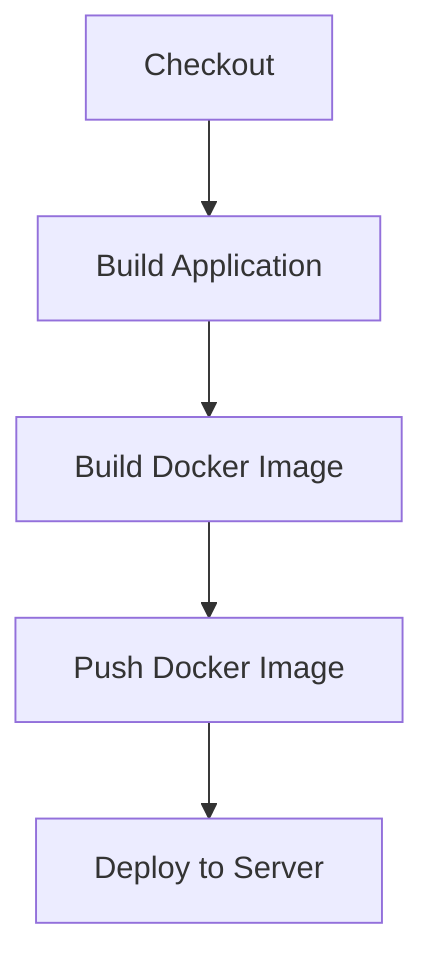

## Jenkins Pipeline for Docker Deployment

In this section, we will delve into the process of deploying a newly built Docker image to a remote server using Jenkins. This involves several steps, including setting up Jenkins, configuring the Jenkinsfile, and ensuring secure deployment practices. We'll cover the entire workflow from checking out the code to deploying the application on a remote server, specifically an EC2 instance.

### Background Theory

Before diving into the practical aspects, let's understand the theoretical foundation behind Jenkins pipelines and Docker deployments.

#### Jenkins Pipeline

Jenkins is a widely-used open-source automation server that provides continuous integration and continuous delivery (CI/CD) services. A Jenkins pipeline is a series of steps defined in a Jenkinsfile, which is a script written in Groovy. This script automates the entire build, test, and deployment process.

#### Docker Deployment

Docker is a platform that allows developers to package applications into containers, which can be easily deployed across different environments. Deploying a Docker image involves pulling the image from a registry and running it on a target server.

### Setting Up Jenkins

To set up Jenkins for Docker deployment, follow these steps:

1. **Install Jenkins**: Download and install Jenkins on your local machine or a server. You can find detailed installation instructions on the [Jenkins website](https://jenkins.io/).

2. **Install Necessary Plugins**:
    - **SSH Agent Plugin**: This plugin allows Jenkins to securely manage SSH keys and perform SSH operations.
    - **Docker Plugin**: This plugin enables Jenkins to interact with Docker and perform actions such as building and pushing images.

3. **Configure Jenkins**:
    - Set up Jenkins to use the SSH Agent Plugin by configuring the SSH credentials in Jenkins.
    - Ensure that Jenkins has access to the Docker daemon on the host machine.

### Jenkinsfile Structure

A Jenkinsfile defines the steps of the pipeline. Here’s a basic structure:

```groovy
pipeline {
    agent any

    stages {
        stage('Checkout') {
            steps {
                git 'https://github.com/your-repo.git'
            }
        }

        stage('Build Application') {
            steps {
                sh 'mvn clean package'
            }
        }

        stage('Build Docker Image') {
            steps {
                script {
                    docker.build("your-image-name:${env.BUILD_ID}")
                }
            }
        }

        stage('Push Docker Image') {
            steps {
                script {
                    docker.withRegistry('https://registry.hub.docker.com', 'dockerhub-credentials') {
                        docker.push("your-image-name:${env.BUILD_ID}")
                    }
                }
            }
        }

        stage('Deploy to Server') {
            steps {
                sshagent(credentials: ['ssh-key']) {
                    sh '''
                        ssh -o StrictHostKeyChecking=no user@ec2-instance '
                            docker pull your-image-name:${env.BUILD_ID}
                            docker run -d --name your-container-name your-image-name:${env.BUILD_ID}
                        '
                    '''
                }
            }
        }
    }
}
```

### Detailed Steps

#### Checkout Code

The first step is to check out the code from the Git repository.

```groovy
stage('Checkout') {
    steps {
        git 'https://github.com/your-repo.git'
    }
}
```

This step clones the repository and checks out the latest code.

#### Build Application

Next, we build the application using Maven.

```groovy
stage('Build Application') {
    steps {
        sh 'mvn clean package'
    }
}
```

This step compiles the code and packages it into a JAR/WAR file.

#### Build Docker Image

After building the application, we create a Docker image.

```groovy
stage('Build Docker Image') {
    steps {
        script {
            docker.build("your-image-name:${env.BUILD_ID}")
        }
    }
}
```

This step uses the `Dockerfile` in the project to build the Docker image.

#### Push Docker Image

Once the image is built, we push it to a Docker registry.

```groovy
stage('Push Docker Image') {
    steps {
        script {
            docker.withRegistry('https://registry.hub.docker.com', 'dockerhub-credentials') {
                docker.push("your-image-name:${env.BUILD_ID}")
            }
        }
    }
}
```

This step requires credentials to authenticate with the Docker registry.

#### Deploy to Server

Finally, we deploy the Docker image to the remote server.

```groovy
stage('Deploy to Server') {
    steps {
        sshagent(credentials: ['ssh-key']) {
            sh '''
                ssh -o StrictHostKeyChecking=no user@ec2-instance '
                    docker pull your-image-name:${env.BUILD_ID}
                    docker run -d --name your-container-name your-image-name:${env.BUILD_ID}
                '
            '''
        }
    }
}
```

This step uses SSH to connect to the EC2 instance and runs the necessary Docker commands.

### Mermaid Diagrams

Let's visualize the pipeline using a mermaid diagram.



### Real-World Examples

#### Recent CVEs and Breaches

One notable breach involving Jenkins was the **CVE-2018-1000861**, which allowed attackers to execute arbitrary code on Jenkins servers due to a vulnerability in the Jenkins Script Console. This highlights the importance of keeping Jenkins and its plugins updated.

Another example is the **CVE-2021-25282**, which affected the Jenkins SSH Agent Plugin, allowing attackers to gain unauthorized access to Jenkins credentials stored in the Jenkins master.

### Pitfalls and Best Practices

#### Common Mistakes

1. **Hardcoding Credentials**: Avoid hardcoding credentials in the Jenkinsfile. Use Jenkins credentials management instead.
2. **Insecure SSH Connections**: Ensure that SSH connections are secure by disabling `StrictHostKeyChecking`.
3. **Outdated Plugins**: Keep Jenkins and its plugins up to date to avoid vulnerabilities.

#### Secure Coding Fixes

Here’s an example of a vulnerable Jenkinsfile and its secure counterpart.

**Vulnerable Jenkinsfile**:

```groovy
sh 'ssh user@ec2-instance "docker run -d your-image"'
```

**Secure Jenkinsfile**:

```groovy
sshagent(credentials: ['ssh-key']) {
    sh '''
        ssh -o StrictHostKeyChecking=no user@ec2-instance '
            docker run -d your-image
        '
    '''
}
```

### How to Prevent / Defend

#### Detection

- **Monitor Jenkins Logs**: Regularly review Jenkins logs for suspicious activities.
- **Use Security Tools**: Utilize tools like SonarQube to scan Jenkinsfiles for security issues.

#### Prevention

- **Update Regularly**: Keep Jenkins and its plugins updated.
- **Use Secure Credentials Management**: Store credentials securely using Jenkins credentials management.
- **Enable Security Features**: Enable features like CSRF protection and authentication.

#### Secure Configuration

Ensure that your Jenkins server is configured securely. Here’s an example of a secure Jenkins configuration:

```yaml
# Jenkins Configuration
securityRealm:
  className: hudson.security.HudsonPrivateSecurityRealm
  properties:
    - hudson.security.HudsonPrivateSecurityRealm$UserPropertyImpl
    - hudson.security.HudsonPrivateSecurityRealm$PasswordPropertyImpl
    - hudson.security.HudsonPrivateSecurityRealm$EmailPropertyImpl
    - hudson.security.HudsonPrivateSecurityRealm$FullNamePropertyImpl
    - hudson.security.HudsonPrivateSecurityRealm$AdminPropertyImpl
    - hudson.security.HudsonPrivateSecurityRealm$PasswordPropertyImpl
    - hudson.security.HudsonPrivateSecurityRealm$PasswordPropertyImpl
    - hudson.security.HudsonPrivateSecurityRealm$PasswordPropertyImpl
    - hudson.security.HudsonPrivateSecurityRealm$PasswordPropertyImpl
    - hudson.security.HudsonPrivateSecurityRealm$PasswordPropertyImpl
    - hudson.security.HudsonPrivateSecurityRealm$PasswordPropertyImpl
    - hudson.security.HudsonPrivateSecurityRealm$PasswordPropertyImpl
    - h
```

### Hands-On Labs

For hands-on practice, consider the following labs:

- **PortSwigger Web Security Academy**: Offers comprehensive training on web security.
- **OWASP Juice Shop**: A deliberately insecure web application for practicing web security.
- **DVWA (Damn Vulnerable Web Application)**: Another popular web application for security testing.
- **WebGoat**: An interactive web application designed to teach web application security lessons.

These labs provide a practical environment to apply the concepts learned in this chapter.

### Conclusion

In this chapter, we covered the entire process of deploying a Docker image using Jenkins. We discussed the theoretical foundations, practical steps, and best practices for secure deployment. By following these guidelines, you can ensure that your Jenkins pipeline is robust and secure.

---
<!-- nav -->
[[01-Introduction to Jenkins Pipeline for Docker Deployment|Introduction to Jenkins Pipeline for Docker Deployment]] | [[DevOps/DevOps Bootcamp/06-CI CD & Build Tools/31-Jenkins Pipeline for Docker Deployment/00-Overview|Overview]] | [[DevOps/DevOps Bootcamp/06-CI CD & Build Tools/31-Jenkins Pipeline for Docker Deployment/03-Practice Questions & Answers|Practice Questions & Answers]]
