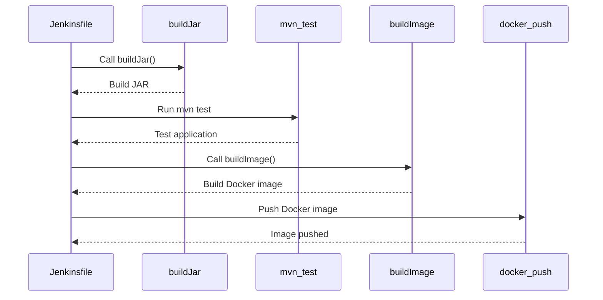

## Introduction to Jenkins Pipelines for Microservice Applications

Jenkins is a widely-used open-source automation server that provides continuous integration and continuous delivery (CI/CD) services. In the context of microservice applications, Jenkins pipelines play a crucial role in automating the build, test, and deployment processes. This chapter delves into the intricacies of Jenkins pipelines, focusing on how they can be effectively utilized for microservice applications. We will cover the creation of Jenkinsfiles, the use of shared libraries, and the implementation of reusable functions such as `build jar` and `build image`.

### Background Theory

Before diving into the practical aspects, it is essential to understand the theoretical foundation of Jenkins pipelines and their relevance in modern DevOps practices.

#### Continuous Integration and Continuous Delivery (CI/CD)

Continuous Integration (CI) is the practice of merging all developers' working copies to a shared mainline several times a day. Each merge triggers an automated build process that checks for integration errors. Continuous Delivery (CD) extends CI by ensuring that the software can be released to production at any time. Together, CI/CD form the backbone of modern software development practices, enabling rapid and reliable software releases.

#### Jenkins Pipelines

Jenkins Pipelines are a powerful feature that allows you to define your entire CD process as code. This approach, often referred to as "pipeline-as-code," enables teams to version control their pipeline definitions, collaborate on them, and ensure consistency across different environments.

A Jenkins Pipeline is defined using a Jenkinsfile, which is a text file written in either Groovy or Declarative Syntax. The Jenkinsfile contains the steps required to build, test, and deploy your application. By defining these steps in a file, you can easily share and reuse them across different projects.

### Creating a Jenkinsfile

Let's start by creating a basic Jenkinsfile for a microservice application. A typical Jenkinsfile might look like this:

```groovy
pipeline {
    agent any

    stages {
        stage('Build') {
            steps {
                sh 'mvn clean package'
            }
        }
        stage('Test') {
            steps {
                sh 'mvn test'
            }
        }
        stage('Deploy') {
            steps {
                sh 'docker build -t myapp .'
                sh 'docker push myapp'
            }
        }
    }
}
```

This Jenkinsfile defines three stages: Build, Test, and Deploy. Each stage contains a set of steps that are executed sequentially. The `sh` step runs shell commands, which in this case are Maven and Docker commands.

### Using Shared Libraries

One of the key benefits of Jenkins Pipelines is the ability to use shared libraries. Shared libraries allow you to define reusable functions and classes that can be used across multiple Jenkinsfiles. This promotes code reuse and consistency.

To use a shared library, you first need to define it. A shared library typically consists of a `vars` directory containing Groovy scripts that define functions. For example, let's create a shared library with a `buildJar` function.

#### Creating the Shared Library

1. **Create the Shared Library Directory Structure**

   ```
   jenkins-shared-library/
   ├── vars/
   │   └── buildJar.groovy
   ```

2. **Define the `buildJar` Function**

   ```groovy
   // vars/buildJar.groovy
   def call() {
       echo 'Building JAR...'
       sh 'mvn clean package'
   }
   ```

3. **Configure Jenkins to Use the Shared Library**

   To make the shared library available to your Jenkins pipelines, you need to configure Jenkins to load it. This can be done by adding the following snippet to your Jenkinsfile:

   ```groovy
   @Library('jenkins-shared-library') _
   ```

   This line tells Jenkins to load the shared library named `jenkins-shared-library`.

4. **Use the `buildJar` Function in Your Jenkinsfile**

   Now that the shared library is configured, you can use the `buildJar` function in your Jenkinsfile:

   ```groovy
   @Library('jenkins-shared-library') _

   pipeline {
       agent any

       stages {
           stage('Build') {
               steps {
                   buildJar()
               }
           }
           stage('Test') {
               steps {
                   sh 'mvn test'
               }
           }
           stage('Deploy') {
               steps {
                   sh 'docker build -t myapp .'
                   sh 'docker push myapp'
               }
           }
       }
   }
   ```

### Implementing Reusable Functions

In the given transcript, the lecturer mentions implementing reusable functions such as `build jar` and `build image`. Let's delve deeper into how these functions can be implemented and reused.

#### `buildJar` Function

The `buildJar` function is responsible for building a Java application into a JAR file. This function can be defined in a shared library as follows:

```groovy
// vars/buildJar.groovy
def call() {
    echo 'Building JAR...'
    sh 'mvn clean package'
}
```

This function uses the `sh` step to run the Maven command `mvn clean package`, which builds the JAR file.

#### `buildImage` Function

Similarly, the `buildImage` function is responsible for building a Docker image. This function can be defined in a shared library as follows:

```groovy
// vars/buildImage.groovy
def call() {
    echo 'Building Docker image...'
    sh 'docker build -t myapp .'
}
```

This function uses the `sh` step to run the Docker command `docker build -t myapp .`, which builds the Docker image.

### Example Jenkinsfile Using Shared Libraries

Here is a complete example of a Jenkinsfile that uses both the `buildJar` and `buildImage` functions from a shared library:

```groovy
@Library('jenkins-shared-library') _

pipeline {
    agent any

    stages {
        stage('Build') {
            steps {
                buildJar()
            }
        }
        stage('Test') {
            steps {
                sh 'mvn test'
            }
        }
        stage('Deploy') {
            steps {
                buildImage()
                sh 'docker push myapp'
            }
        }
    }
}
```

### Mermaid Diagrams

To better visualize the flow of the Jenkins pipeline, we can use Mermaid diagrams. Here is a sequence diagram showing the steps involved in the Jenkins pipeline:



### Pitfalls and Best Practices

While using Jenkins pipelines and shared libraries, there are several pitfalls to avoid and best practices to follow:

#### Pitfalls

1. **Overcomplicating the Pipeline**: Avoid making the pipeline overly complex. Keep it simple and modular.
2. **Hardcoding Values**: Avoid hardcoding values in the Jenkinsfile. Use environment variables or parameters instead.
3. **Ignoring Error Handling**: Ensure proper error handling in the pipeline. Use `catchError` blocks to handle failures gracefully.
4. **Not Versioning the Jenkinsfile**: Always version control the Jenkinsfile along with the rest of the project code.

#### Best Practices

1. **Modularize the Pipeline**: Break down the pipeline into smaller, reusable stages and steps.
2. **Use Parameters**: Utilize parameters to make the pipeline more flexible and configurable.
3. **Implement Error Handling**: Use `catchError` blocks to handle failures and provide meaningful feedback.
4. **Version Control the Jenkinsfile**: Ensure the Jenkinsfile is version-controlled alongside the project code.

### Real-World Examples

To illustrate the practical application of Jenkins pipelines and shared libraries, let's consider a real-world scenario involving a microservice application.

#### Scenario: Building and Deploying a Java Application

Suppose you have a Java microservice application that needs to be built and deployed using Jenkins. The application is managed in a Git repository, and you want to automate the build, test, and deployment process using Jenkins pipelines.

1. **Repository Structure**

   ```
   my-java-app/
   ├── src/
   ├── pom.xml
   ├── Jenkinsfile
   ```

2. **Jenkinsfile**

   ```groovy
   @Library('jenkins-shared-library') _

   pipeline {
       agent any

       stages {
           stage('Build') {
               steps {
                   buildJar()
               }
           }
           stage('Test') {
               steps {
                   sh 'mvn test'
               }
           }
           stage('Deploy') {
               steps {
                   buildImage()
                   sh 'docker push myapp'
               }
           }
       }
   }
   ```

3. **Shared Library**

   ```
   jenkins-shared-library/
   ├── vars/
   │   ├── buildJar.groovy
   │   └── buildImage.groovy
   ```

4. **buildJar.groovy**

   ```groovy
   def call() {
       echo 'Building JAR...'
       sh 'mvn clean package'
   }
   ```

5. **buildImage.groovy**

   ```groovy
   def call() {
       echo 'Building Docker image...'
       sh 'docker build -t myapp .'
   }
   ```

### How to Prevent / Defend

#### Detection

To detect issues in your Jenkins pipelines, you can use various tools and techniques:

1. **Static Code Analysis**: Use static code analysis tools like SonarQube to analyze the Jenkinsfile and identify potential issues.
2. **Logging and Monitoring**: Enable detailed logging and monitoring for the Jenkins pipeline to track the execution and identify any failures.

#### Prevention

To prevent issues in your Jenkins pipelines, follow these best practices:

1. **Code Reviews**: Conduct regular code reviews for the Jenkinsfile and shared libraries to catch any potential issues early.
2. **Automated Testing**: Implement automated testing for the Jenkins pipeline to ensure it behaves as expected.
3. **Security Scanning**: Use security scanning tools to identify and mitigate security vulnerabilities in the pipeline.

#### Secure Coding Fixes

Here is an example of a vulnerable Jenkinsfile and its secure counterpart:

**Vulnerable Jenkinsfile**

```groovy
pipeline {
    agent any

    stages {
        stage('Build') {
            steps {
                sh 'mvn clean package'
            }
        }
        stage('Test') {
            steps {
                sh 'mvn test'
            }
        }
        stage('Deploy') {
            steps {
                sh 'docker build -t myapp .'
                sh 'docker push myapp'
            }
        }
    }
}
```

**Secure Jenkinsfile**

```groovy
@Library('jenkins-shared-library') _

pipeline {
    agent any

    stages {
        stage('Build') {
            steps {
                catchError(buildResult: 'FAILURE', stageResult: 'FAILURE') {
                    buildJar()
                }
            }
        }
        stage('Test') {
            steps {
                catchError(buildResult: 'FAILURE', stageResult: 'FAILURE') {
                    sh 'mvn test'
                }
            }
        }
        stage('Deploy') {
            steps {
                catchError(buildResult: 'FAILURE', stageResult: 'FAILURE') {
                    buildImage()
                    sh 'docker push myapp'
                }
            }
        }
    }
}
```

### Conclusion

In this chapter, we have explored the use of Jenkins pipelines for microservice applications. We covered the creation of Jenkinsfiles, the use of shared libraries, and the implementation of reusable functions. We also discussed real-world examples, pitfalls, and best practices. By following these guidelines, you can effectively automate your build, test, and deployment processes using Jenkins pipelines.

### Practice Labs

For hands-on experience with Jenkins pipelines, consider the following practice labs:

- **PortSwigger Web Security Academy**: Offers a variety of labs related to web application security, including some that involve Jenkins pipelines.
- **OWASP Juice Shop**: A deliberately insecure web application that includes challenges related to CI/CD pipelines.
- **DVWA (Damn Vulnerable Web Application)**: Another web application with security vulnerabilities, which can be used to practice securing CI/CD pipelines.

By completing these labs, you can gain practical experience in implementing and securing Jenkins pipelines for microservice applications.

---
<!-- nav -->
[[DevOps/DevOps Bootcamp/06-CI CD & Build Tools/33-Jenkins Pipelines for Microservice Applications/00-Overview|Overview]] | [[02-Introduction to Jenkins Shared Libraries|Introduction to Jenkins Shared Libraries]]
