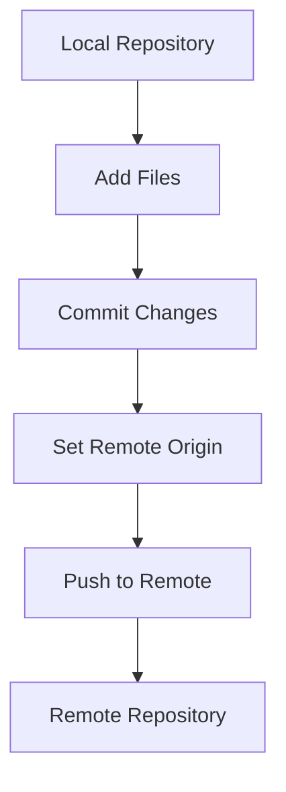

## Initializing and Pushing to a Remote Repository

### Background Theory

When working with version control systems like Git, it is essential to understand the process of initializing a repository and pushing changes to a remote server. This process ensures that your codebase is backed up and accessible to other team members.

#### Steps to Initialize and Push to a Remote Repository

1. **Initialize Local Repository**: 
    - Use `git init` to create a new Git repository in your local directory.
    - This creates a `.git` folder in your project directory, which contains all the necessary files for Git to track changes.

2. **Add Files to Staging Area**:
    - Use `git add <file>` to stage specific files or `git add .` to stage all files in the current directory.
    - Staging area is where you prepare the files that will be committed.

3. **Commit Changes Locally**:
    - Use `git commit -m "Initial commit"` to commit the staged files with a descriptive message.
    - This records the changes in your local repository.

4. **Set Up Remote Repository**:
    - Use `git remote add origin <remote-repository-url>` to link your local repository to a remote repository.
    - The `<remote-repository-url>` is typically provided by the hosting service (e.g., GitLab, GitHub).

5. **Push Changes to Remote Repository**:
    - Use `git push origin master` to push the changes to the remote repository.
    - This command pushes the `master` branch to the remote repository named `origin`.

### Example Commands

```sh
# Initialize local repository
git init

# Add all files to staging area
git add .

# Commit changes locally
git commit -m "Initial commit"

# Set up remote repository
git remote add origin https://gitlab.com/username/repository.git

# Push changes to remote repository
git push origin master
```

### Real-World Example

Consider a scenario where a developer initializes a new project and pushes it to a GitLab repository. This ensures that the code is backed up and accessible to other team members.

### Common Pitfalls

- **Incorrect Remote URL**: Ensure that the remote URL is correct and matches the actual repository location.
- **Branch Naming**: Make sure the branch name (`master`, `main`, etc.) exists in the remote repository.

### How to Prevent / Defend

- **Verify Remote URL**: Always verify the remote URL using `git remote -v`.
- **Check Branch Names**: Use `git branch -a` to check all branches and ensure the correct branch is being used.

### Diagram



---
<!-- nav -->
[[02-Introduction to Jenkins Shared Libraries|Introduction to Jenkins Shared Libraries]] | [[DevOps/DevOps Bootcamp/06-CI CD & Build Tools/33-Jenkins Pipelines for Microservice Applications/00-Overview|Overview]] | [[04-Jenkins Pipelines for Microservice Applications|Jenkins Pipelines for Microservice Applications]]
