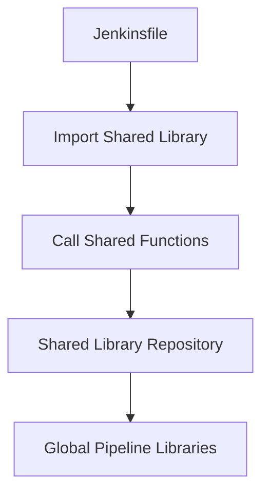

## Using Jenkins Shared Libraries

### Background Theory

Jenkins Shared Libraries allow teams to share common code across multiple Jenkins pipelines. This promotes code reuse and consistency across different projects.

#### Steps to Use Jenkins Shared Libraries

1. **Create a Shared Library Repository**:
    - Create a new Git repository for the shared library.
    - Structure the repository according to Jenkins requirements (e.g., `vars/`, `src/` directories).

2. **Configure Jenkins to Use the Shared Library**:
    - Navigate to `Manage Jenkins > Configure System`.
    - Scroll down to the `Global Pipeline Libraries` section.
    - Add a new library and specify the repository URL, credentials, and default version.

3. **Use the Shared Library in Jenkinsfiles**:
    - Import the shared library in your Jenkinsfile using `@Library('library-name')`.
    - Call the shared functions or classes as needed.

### Example Configuration

```sh
# Add the shared library to Jenkins
# Navigate to Manage Jenkins > Configure System > Global Pipeline Libraries

# Example configuration
Library Name: jenkins-shared-library
Default Version: master
Repository URL: https://gitlab.com/username/jenkins-shared-library.git
Credentials: <your-credentials>
```

### Example Jenkinsfile

```groovy
@Library('jenkins-shared-library') _

pipeline {
    agent any
    stages {
        stage('Build') {
            steps {
                script {
                    // Call a function from the shared library
                    sharedFunction()
                }
            }
        }
    }
}
```

### Real-World Example

A company-wide Jenkins library might contain common build, test, and deployment functions. By making this library available globally, all projects can benefit from these shared functions.

### Common Pitfalls

- **Incorrect Library Path**: Ensure the path to the shared library is correct and matches the Jenkins configuration.
- **Version Control**: Ensure the default version specified in Jenkins matches the actual version in the repository.

### How to Prevent / Defend

- **Verify Library Path**: Double-check the path to the shared library in both the Jenkins configuration and the Jenkinsfile.
- **Version Management**: Use semantic versioning and specify the exact version in Jenkins to avoid unexpected behavior.

### Diagram



### Practice Labs

For hands-on practice with Jenkins pipelines and shared libraries, consider the following labs:

- **PortSwigger Web Security Academy**: Offers a variety of labs related to Jenkins security.
- **OWASP Juice Shop**: Provides a vulnerable application that can be used to practice Jenkins security configurations.
- **DVWA (Damn Vulnerable Web Application)**: Useful for practicing various web application security concepts, including Jenkins.

By thoroughly understanding and implementing these steps, you can effectively manage your Git repositories and leverage Jenkins shared libraries to streamline your development processes.

---
<!-- nav -->
[[04-Jenkins Pipelines for Microservice Applications|Jenkins Pipelines for Microservice Applications]] | [[DevOps/DevOps Bootcamp/06-CI CD & Build Tools/33-Jenkins Pipelines for Microservice Applications/00-Overview|Overview]] | [[DevOps/DevOps Bootcamp/06-CI CD & Build Tools/33-Jenkins Pipelines for Microservice Applications/06-Practice Questions & Answers|Practice Questions & Answers]]
