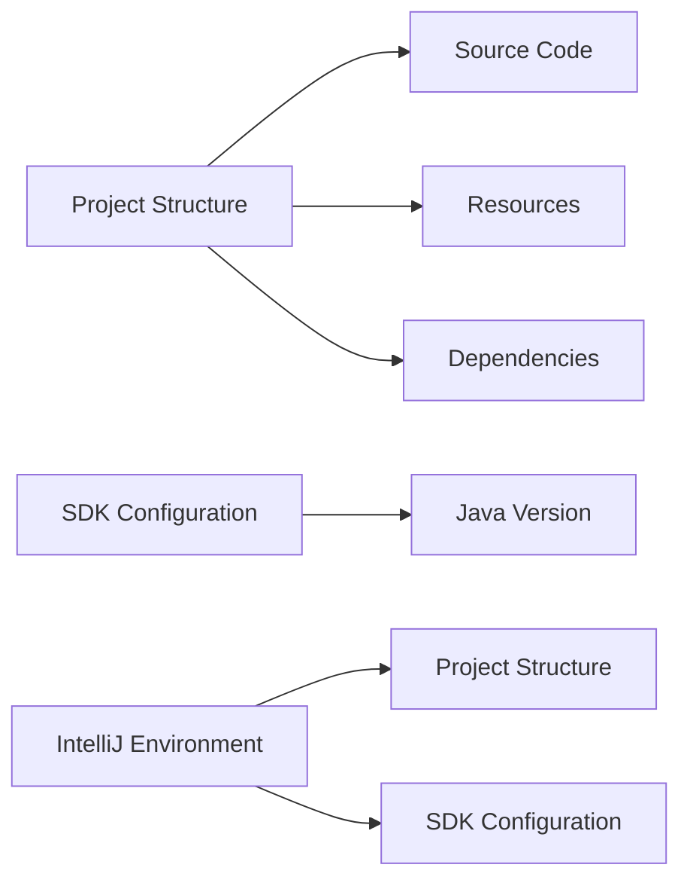

## Introduction to IntelliJ and Application Environments

When working with development tools such as IntelliJ IDEA, it's crucial to understand the different environments in which your application can be built and run. IntelliJ provides a rich integrated development environment (IDE) that simplifies many aspects of software development, including project management, code editing, debugging, and building. However, it's essential to recognize that IntelliJ operates within its own environment, distinct from the operating system environment where you might also run your application.

### IntelliJ Environment

The IntelliJ environment is primarily focused on providing a seamless experience for developers. It manages the project structure, dependencies, and configurations necessary for building and running your application. When you configure a project in IntelliJ, you define settings such as the SDK (Software Development Kit), which specifies the version of Java or other languages you're using. This configuration is specific to the IntelliJ environment and does not necessarily reflect the environment outside of IntelliJ.

#### Project Structure and SDK Configuration

In IntelliJ, the project structure includes the source code, resources, and dependencies required to build and run your application. The SDK configuration specifies the version of Java or other language runtime that IntelliJ uses to compile and run your application. This setup ensures that IntelliJ can manage the entire lifecycle of your application within its environment.



### Running Applications in IntelliJ

When you run an application within IntelliJ, the IDE takes care of compiling the source code, managing dependencies, and executing the application using the specified SDK. This process is abstracted away from the developer, making it easier to focus on coding rather than managing the underlying environment.

#### Example: Running a Simple Java Application

Let's consider a simple Java application:

```java
public class HelloWorld {
    public static void main(String[] args) {
        System.out.println("Hello, World!");
    }
}
```

To run this application in IntelliJ:

1. **Create a New Project**: Open IntelliJ and create a new Java project.
2. **Add Source Code**: Add the `HelloWorld` class to the project.
3. **Configure SDK**: Ensure the correct SDK is configured for the project.
4. **Run the Application**: Click the run button in IntelliJ.

IntelliJ will compile the source code and run the application using the specified SDK. You'll see the output in the Run tab:

```
Hello, World!
```

### Operating System Environment

While IntelliJ provides a convenient environment for developing and running applications, there are times when you need to interact with the application outside of IntelliJ. This typically involves using the command line or terminal in your operating system.

#### Terminal Environment

In the terminal environment, you interact directly with the operating system. This environment is independent of IntelliJ and requires proper configuration to ensure that the application can be built and run correctly.

#### Setting Up the Terminal Environment

To set up the terminal environment, you need to configure the following:

1. **JAVA_HOME**: Set the `JAVA_HOME` environment variable to point to the desired Java installation.
2. **PATH Variable**: Ensure that the `PATH` variable includes the directory containing the Java executable (`java`, `javac`, etc.).

For example, on a Unix-based system, you might set these variables in your shell profile (e.g., `.bashrc`):

```bash
export JAVA_HOME=/path/to/java
export PATH=$JAVA_HOME/bin:$PATH
```

On Windows, you would set these variables through the system environment settings.

### Maven Installation and Path Configuration

Maven is a popular build automation tool used for Java projects. To use Maven effectively, you need to install it and configure the environment properly.

#### Installing Maven

To install Maven, download the binary distribution from the Apache Maven website and extract it to a directory of your choice. For example, you might extract it to `/usr/local/apache-maven`.

#### Configuring the Environment

After installing Maven, you need to configure the environment to recognize the Maven installation. This involves setting the `MAVEN_HOME` environment variable and updating the `PATH` variable.

For example, on a Unix-based system, you might add the following lines to your shell profile:

```bash
export MAVEN_HOME=/usr/local/apache-maven
export PATH=$MAVEN_HOME/bin:$PATH
```

On Windows, you would set these variables through the system environment settings.

### Building and Running Applications in the Terminal

Once the environment is configured, you can use Maven commands to build and run your application from the terminal.

#### Example: Building a Maven Project

Consider a simple Maven project with the following `pom.xml`:

```xml
<project xmlns="http://maven.apache.org/POM/4.0.0"
         xmlns:xsi="http://www.w3.org/2001/XMLSchema-instance"
         xsi:schemaLocation="http://maven.apache.org/POM/4.0.0 http://maven.apache.org/xsd/maven-4.0.0.xsd">
    <modelVersion>4.0.0</modelVersion>
    <groupId>com.example</groupId>
    <artifactId>HelloWorld</artifactId>
    <version>1.0-SNAPSHOT</version>
    <dependencies>
        <!-- Add dependencies here -->
    </dependencies>
</project>
```

To build the project using Maven:

1. **Open Terminal**: Navigate to the project directory.
2. **Run Maven Command**: Execute the `mvn package` command.

```bash
cd /path/to/project
mvn package
```

This command will compile the source code, resolve dependencies, and package the application into a JAR file.

### Comparing IntelliJ and Terminal Environments

Understanding the differences between the IntelliJ environment and the terminal environment is crucial for effective development. Here’s a comparison:

#### IntelliJ Environment

- **Managed by IntelliJ**: IntelliJ handles the project structure, SDK configuration, and build process.
- **Abstracted**: Developers don’t need to worry about the underlying environment.
- **Convenient**: Ideal for iterative development and debugging.

#### Terminal Environment

- **Direct Interaction**: Interacts directly with the operating system.
- **Configuration Required**: Requires proper setup of environment variables.
- **Flexibility**: Allows for more control and customization.

### Real-World Examples and Pitfalls

#### Real-World Example: CVE-2021-44228 (Log4Shell)

The Log4Shell vulnerability (CVE-2021-44228) affected many Java applications, including those built with Maven. This vulnerability highlights the importance of keeping dependencies up-to-date and ensuring that the environment is properly configured.

#### Common Pitfall: Incorrect SDK Configuration

One common pitfall is configuring the wrong SDK in IntelliJ, leading to compatibility issues. For example, if your project requires Java 11 but IntelliJ is configured to use Java 8, you may encounter runtime errors.

#### How to Prevent / Defend

##### Detection

- **Dependency Checkers**: Use tools like `mvn dependency:tree` to check for outdated or vulnerable dependencies.
- **Vulnerability Scanners**: Integrate tools like OWASP Dependency-Check into your build process.

##### Prevention

- **Keep Dependencies Updated**: Regularly update dependencies to the latest versions.
- **Secure Coding Practices**: Follow secure coding guidelines to avoid common vulnerabilities.

##### Secure-Coding Fixes

**Vulnerable Code:**

```java
import org.apache.logging.log4j.LogManager;
import org.apache.logging.log4j.Logger;

public class VulnerableClass {
    private static final Logger logger = LogManager.getLogger(VulnerableClass.class);

    public void logMessage(String message) {
        logger.info(message);
    }
}
```

**Fixed Code:**

```java
import org.apache.logging.log4j.LogManager;
import org.apache.logging.log4j.Logger;

public class SecureClass {
    private static final Logger logger = LogManager.getLogger(SecureClass.class);

    public void logMessage(String message) {
        logger.info(message.replaceAll("\\$\\{", ""));
    }
}
```

##### Configuration Hardening

- **Environment Variables**: Ensure that environment variables like `JAVA_HOME` and `MAVEN_HOME` are correctly set.
- **Build Scripts**: Use build scripts to automate the setup and configuration process.

### Conclusion

Understanding the different environments in which your application can be built and run is crucial for effective development. IntelliJ provides a convenient environment for iterative development, while the terminal environment offers flexibility and control. By properly configuring both environments, you can ensure that your application is built and run correctly, avoiding common pitfalls and security vulnerabilities.

### Practice Labs

For hands-on practice with Maven and environment configuration, consider the following labs:

- **PortSwigger Web Security Academy**: Offers exercises related to web application security, including dependency management.
- **OWASP Juice Shop**: Provides a vulnerable web application for practicing security testing and dependency management.
- **DVWA (Damn Vulnerable Web Application)**: Another resource for practicing web application security.

These labs provide practical experience in configuring and securing development environments, reinforcing the concepts learned in this chapter.

---
<!-- nav -->
[[DevOps/DevOps Bootcamp/06-CI CD & Build Tools/35-Maven Installation and Path Configuration/00-Overview|Overview]] | [[02-Introduction to Maven Installation and Path Configuration|Introduction to Maven Installation and Path Configuration]]
