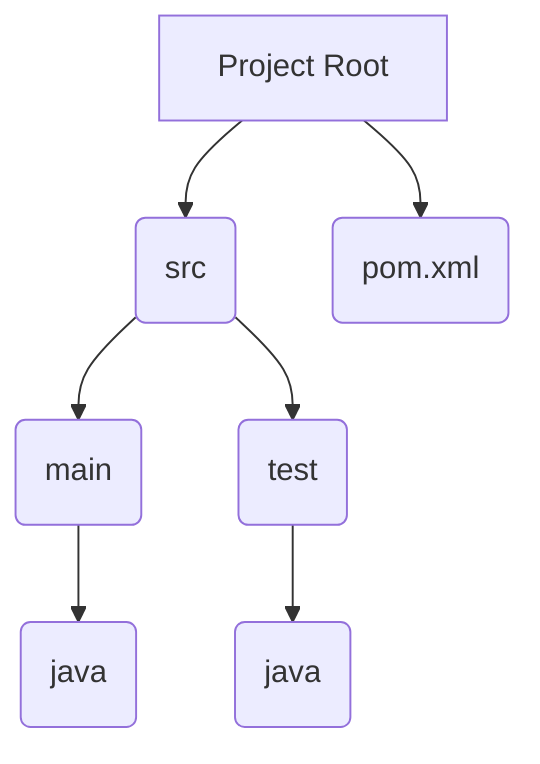
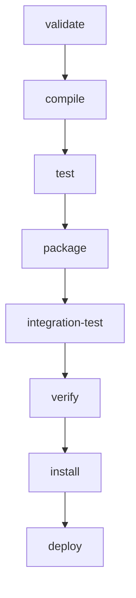

## Introduction to Maven Installation and Path Configuration

In this chapter, we will delve into the setup and configuration of Maven, a powerful build automation tool primarily used for Java projects. Maven simplifies the build process by managing project dependencies, compiling code, running tests, and packaging applications. This chapter will cover the installation of Maven, setting up the environment variables, and configuring the `PATH` to ensure Maven can be accessed from the command line.

### Background Theory

Maven is an open-source project management and comprehension tool developed by the Apache Software Foundation. It is based on the concept of a project object model (POM), which is stored in an XML file named `pom.xml`. This file contains information about the project and configuration details used by Maven to build the project.

#### Why Use Maven?

1. **Dependency Management**: Maven manages project dependencies automatically. You specify the dependencies in the `pom.xml` file, and Maven downloads them from remote repositories.
2. **Standardized Build Process**: Maven follows a standardized directory structure and lifecycle phases, making it easier to understand and maintain projects.
3. **Reusability**: Maven plugins and archetypes allow you to reuse code and configurations across different projects.
4. **Integration with IDEs**: Maven integrates seamlessly with popular IDEs like IntelliJ IDEA, Eclipse, and NetBeans, providing a smooth development experience.

### Installing Maven

To install Maven, follow these steps:

1. **Download Maven**:
   - Visit the [Apache Maven website](https://maven.apache.org/download.cgi) and download the latest binary distribution.
   - Extract the downloaded archive to a directory of your choice, e.g., `/usr/local/apache-maven`.

2. **Set Up Environment Variables**:
   - Add Maven to your system’s `PATH` variable to make it accessible from the command line.

#### Setting Up Environment Variables

To set up the environment variables, follow these steps:

1. **Locate the Maven Home Directory**:
   - The home directory is where Maven is installed, e.g., `/usr/local/apache-maven`.

2. **Add Maven to the PATH**:
   - On Unix-based systems (Linux, macOS), edit the `.bashrc`, `.zshrc`, or `.profile` file in your home directory and add the following lines:
     ```bash
     export MAVEN_HOME=/usr/local/apache-maven
     export PATH=$MAVEN_HOME/bin:$PATH
     ```
   - On Windows, you can set the environment variables through the System Properties dialog:
     1. Right-click on `This PC` or `Computer` on the desktop or in File Explorer.
     2. Select `Properties`.
     3. Click on `Advanced system settings`.
     4. Click on the `Environment Variables` button.
     5. In the `System variables` section, find the `Path` variable and click `Edit`.
     6. Add the path to the Maven `bin` directory, e.g., `C:\Program Files\apache-maven\bin`.

3. **Verify the Installation**:
   - Open a new terminal window and run the following command to verify that Maven is installed correctly:
     ```bash
     mvn --version
     ```

### Maven Project Structure

A typical Maven project has the following directory structure:



- **src/main/java**: Contains the source code for the main application.
- **src/test/java**: Contains the test code.
- **pom.xml**: The project object model file containing metadata and configuration.

### Configuring Maven Settings

Maven uses a `settings.xml` file to configure global settings such as repository locations, mirrors, and profiles. This file is typically located in the `~/.m2` directory.

#### Example `settings.xml`

```xml
<settings xmlns="http://maven.apache.org/SETTINGS/1.0.0"
          xmlns:xsi="http://www.w3.org/2001/XMLSchema-instance"
          xsi:schemaLocation="http://maven.apache.org/SETTINGS/1.0.0 http://maven.apache.org/xsd/settings-1.0.0.xsd">
  <localRepository>/path/to/local/repo</localRepository>
  <mirrors>
    <mirror>
      <id>central</id>
      <url>https://repo.maven.apache.org/maven2</url>
      <mirrorOf>*</mirrorOf>
    </mirror>
  </mirrors>
  <profiles>
    <profile>
      <id>default-profile</id>
      <repositories>
        <repository>
          <id>central</id>
          <url>https://repo.maven.apache.org/maven2</url>
        </repository>
      </repositories>
    </profile>
  </profiles>
</settings>
```

### Maven Lifecycle Phases

Maven follows a lifecycle model with predefined phases. Each phase represents a specific task in the build process.

#### Maven Lifecycle Phases Diagram



- **validate**: Validate the project is correct and all necessary information is available.
- **compile**: Compile the source code of the project.
- **test**: Test the compiled source code using a suitable unit testing framework.
- **package**: Package the compiled code into a distributable format, such as a JAR.
- **integration-test**: Perform integration testing on the packaged code.
- **verify**: Run any checks to verify the package is valid and meets quality criteria.
- **install**: Install the package into the local repository, for use as a dependency in other projects locally.
- **deploy**: Copy the final package to the remote repository for sharing with other developers and projects.

### Maven Dependencies

Dependencies are managed in the `pom.xml` file. Maven supports transitive dependencies, meaning it automatically resolves and includes dependencies of dependencies.

#### Example `pom.xml` with Dependencies

```xml
<project xmlns="http://maven.apache.org/POM/4.0.0"
         xmlns:xsi="http://www.w3.org/2001/XMLSchema-instance"
         xsi:schemaLocation="http://maven.apache.org/POM/4.0.0 http://maven.apache.org/xsd/maven-4.0.0.xsd">
    <modelVersion>4.0.0</modelVersion>
    <groupId>com.example</groupId>
    <artifactId>my-project</artifactId>
    <version>1.0-SNAPSHOT</version>
    <dependencies>
        <dependency>
            <groupId>junit</groupId>
            <artifactId>junit</artifactId>
            <version>4.12</version>
            <scope>test</scope>
        </dependency>
        <dependency>
            <groupId>org.springframework</groupId>
            <artifactId>spring-core</artifactId>
            <version>5.3.10</version>
        </_dependency>
    </dependencies>
</project>
```

### Maven Plugins

Plugins extend Maven's functionality by providing additional goals and lifecycle mappings. Commonly used plugins include:

- **maven-compiler-plugin**: Compiles the source code.
- **maven-surefire-plugin**: Runs unit tests.
- **maven-jar-plugin**: Packages the compiled code into a JAR file.

#### Example `pom.xml` with Plugins

```xml
<build>
    <plugins>
        <plugin>
            <groupId>org.apache.maven.plugins</groupId>
            <artifactId>maven-compiler-plugin</artifactId>
            <version>3.8.1</version>
            <configuration>
                <source>1.8</source>
                <target>1.8</target>
            </configuration>
        </plugin>
        <plugin>
            <groupId>org.apache.maven.plugins</groupId>
            <artifactId>maven-surefire-plugin</artifactId>
            <version>2.22.2</version>
        </plugin>
    </plugins>
</build>
```

### Maven Profiles

Profiles allow you to define different configurations for different environments, such as development, testing, and production.

#### Example `pom.xml` with Profiles

```xml
<profiles>
    <profile>
        <id>dev</id>
        <properties>
            <env>development</env>
        </properties>
    </profile>
    <profile>
        <id>prod</id>
        <properties>
            <env>production</env>
        </properties>
    </profile>
</profiles>
```

### Maven Commands

Common Maven commands include:

- `mvn compile`: Compiles the source code.
- `mvn test`: Runs the unit tests.
- `mvn package`: Packages the compiled code into a JAR file.
- `mvn install`: Installs the package into the local repository.
- `mvn clean`: Cleans the target directory.

#### Example Maven Command Execution

```bash
mvn clean install
```

### Maven Repositories

Maven repositories store artifacts (JAR files, WAR files, etc.) and their metadata. There are two types of repositories:

- **Local Repository**: Located on the developer's machine.
- **Remote Repository**: Located on a server, such as Maven Central.

#### Example Remote Repository Configuration

```xml
<repositories>
    <repository>
        <id>central</id>
        <url>https://repo.maven.apache.org/maven2</url>
    </repository>
</repositories>
```

### Maven Security Considerations

While Maven simplifies the build process, it also introduces potential security risks, especially when dealing with third-party dependencies.

#### Real-World Example: Log4j Vulnerability (CVE-2021-44228)

The Log4j vulnerability (CVE-2021-44228) affected many Java applications due to the widespread use of the Log4j library. This vulnerability allowed attackers to execute arbitrary code on the server.

##### How to Prevent / Defend

1. **Dependency Check**: Use tools like `mvn dependency:tree` to check for vulnerable dependencies.
2. **Security Plugins**: Use plugins like `OWASP Dependency-Check` to scan for vulnerabilities.
3. **Secure Coding Practices**: Follow secure coding practices and keep dependencies up to date.
4. **Configuration Hardening**: Harden the Maven configuration to restrict access to sensitive repositories.

#### Example Secure `pom.xml`

```xml
<build>
    <plugins>
        <plugin>
            <groupId>org.owasp</groupId>
            <artifactId>dependency-check-maven</artifactId>
            <version>6.5.2</version>
            <executions>
                <execution>
                    <goals>
                        <goal>check</goal>
                    </goals>
                </execution>
            </executions>
        </plugin>
    </plugins>
</build>
```

### Maven Integration with IDEs

Maven integrates seamlessly with popular IDEs like IntelliJ IDEA, Eclipse, and NetBeans. This integration provides features like dependency management, build automation, and project import/export.

#### Example IntelliJ IDEA Setup

1. **Open IntelliJ IDEA**.
2. **Import Project**: Choose `File > New > Project from Existing Sources`.
3. **Select `pom.xml`**: Navigate to the project directory and select the `pom.xml` file.
4. **Configure SDK**: Ensure the correct Java SDK is configured.

### Practice Labs

To practice Maven installation and configuration, consider the following labs:

- **PortSwigger Web Security Academy**: Focuses on web application security but includes Maven setup for building web applications.
- **OWASP Juice Shop**: A deliberately insecure web application for security training. Maven is used to build the application.
- **DVWA (Damn Vulnerable Web Application)**: Another web application for security training. Maven can be used to manage dependencies.

### Conclusion

In this chapter, we covered the installation and configuration of Maven, including setting up environment variables, configuring Maven settings, and integrating Maven with IDEs. We also discussed Maven security considerations and provided real-world examples to illustrate potential risks and mitigation strategies. By following these guidelines, you can effectively use Maven to manage and build your Java projects.

---
<!-- nav -->
[[01-Introduction to IntelliJ and Application Environments|Introduction to IntelliJ and Application Environments]] | [[DevOps/DevOps Bootcamp/06-CI CD & Build Tools/35-Maven Installation and Path Configuration/00-Overview|Overview]] | [[03-Maven Installation and Path Configuration|Maven Installation and Path Configuration]]
