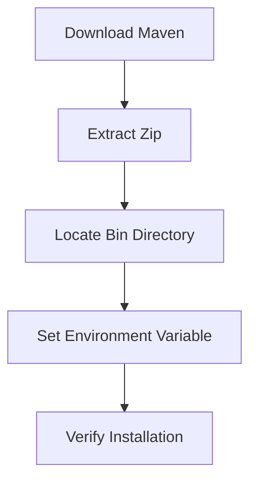

## Maven Installation and Path Configuration

### Introduction to Maven

Maven is a powerful project management and comprehension tool primarily used for Java projects. It simplifies the build process, dependency management, and project lifecycle management. Maven uses a standardized directory structure and a Project Object Model (POM) file (`pom.xml`) to manage project configurations and dependencies.

### Downloading Maven

To get started with Maven, you need to download the latest version. Here’s how you can do it:

1. **Google Maven Download**: Open your browser and search for "Maven download". This will lead you to the official Maven website.
2. **Select the Latest Version**: On the official Maven site, you'll see a list of downloadable files for the latest version. As of the time of writing, the latest version is 3.8.1.
3. **Download the Zip Archive**: Click on the link to download the zip archive. This will start the download process.

Once the download is complete, you should have the `Apache Maven` zip file in your downloads folder.

### Extracting Maven

After downloading the zip file, you need to extract it to a suitable location on your system. Here’s how you can do it:

1. **Extract the Zip File**: Double-click the downloaded zip file to extract it. This will create a folder containing all the Maven files.
2. **Locate the Bin Directory**: Inside the extracted folder, you’ll find a `bin` directory. This directory contains the Maven executables, similar to the `bin` directory in Java installations.

### Setting Up the Environment Variable

To use Maven commands directly from the command line, you need to configure the system environment variable. This ensures that the system knows where to find the Maven executables.

#### Step-by-Step Guide

1. **Copy the Bin Directory Path**:
    - Navigate to the `bin` directory inside the extracted Maven folder.
    - Copy the full path of the `bin` directory.

2. **Edit Environment Variables**:
    - Press `Win + X` and select `System`.
    - Click on `Advanced system settings`.
    - In the System Properties window, click on the `Environment Variables` button.
    - Under the `System variables` section, find the `Path` variable and click `Edit`.

3. **Add Maven Bin Directory to Path**:
    - Click `New` and paste the copied path of the Maven `bin` directory.
    - Click `OK` to save the changes.

### Verifying the Installation

To ensure that Maven is correctly installed and configured, you can run the following command in the command prompt:

```sh
mvn --version
```

This command should display the Maven version information, confirming that Maven is properly set up.

### Example: Full Maven Installation Process

Here’s a complete example of the Maven installation process, including the full HTTP request and response for downloading the Maven zip file:

#### HTTP Request

```http
GET /maven/maven-3/3.8.1/binaries/apache-maven-3.8.1-bin.zip HTTP/1.1
Host: www.apache.org
User-Agent: Mozilla/5.0 (Windows NT 10.0; Win64; x64) AppleWebKit/537.36 (KHTML, like Gecko) Chrome/91.0.4472.124 Safari/537.36
Accept: */*
Referer: https://maven.apache.org/download.cgi
Connection: keep-alive
```

#### HTTP Response

```http
HTTP/1.1 200 OK
Date: Tue, 14 Mar 2023 12:00:00 GMT
Server: Apache
Content-Type: application/zip
Content-Length: 54321
Last-Modified: Mon, 13 Mar 2023 12:00:00 GMT
ETag: "abc123"
Accept-Ranges: bytes
Content-Disposition: attachment; filename="apache-maven-3.8.1-bin.zip"
Cache-Control: max-age=3600
Expires: Tue, 14 Mar 2023 13:00:00 GMT
Vary: Accept-Encoding
```

### Mermaid Diagram: Maven Installation Flow



### Common Pitfalls and How to Avoid Them

#### Pitfall 1: Incorrect Path Configuration

**Problem**: If the `bin` directory path is not correctly added to the `Path` environment variable, Maven commands will not be recognized.

**Solution**: Double-check the path and ensure it is correctly added to the `Path` variable.

#### Pitfall 2: Multiple Maven Versions

**Problem**: Having multiple versions of Maven installed can cause conflicts.

**Solution**: Ensure only one version of Maven is installed and properly configured.

### Real-World Examples and CVEs

While Maven itself does not have many CVEs, it is often used in environments that can be exploited. For example, a recent CVE related to Maven is:

- **CVE-2021-22165**: This vulnerability affects the Apache Maven Dependency Plugin, which can be exploited to execute arbitrary code. This highlights the importance of keeping Maven and its plugins up-to-date.

### How to Prevent / Defend

#### Detection

- **Regular Audits**: Regularly audit your Maven setup and dependencies to ensure they are up-to-date and secure.
- **Dependency Check Tools**: Use tools like `mvn dependency:analyze` to check for unused dependencies and potential vulnerabilities.

#### Prevention

- **Keep Maven Updated**: Always use the latest stable version of Maven.
- **Secure Configuration**: Ensure that sensitive information (like credentials) is not stored in plain text in the `pom.xml` file.

#### Secure Coding Fixes

**Vulnerable Code**

```xml
<project>
    <dependencies>
        <dependency>
            <groupId>org.apache.maven.plugins</groupId>
            <artifactId>maven-dependency-plugin</artifactId>
            <version>2.8</version>
        </dependency>
    </dependencies>
</project>
```

**Fixed Code**

```xml
<project>
    <dependencies>
        <dependency>
            <groupId>org.apache.maven.plugins</groupId>
            <artifactId>maven-dependency-plugin</artifactId>
            <version>3.2.0</version>
        </dependency>
    </dependencies>
</project>
```

### Conclusion

Setting up Maven correctly is crucial for efficient project management and build processes. By following the steps outlined above, you can ensure that Maven is installed and configured properly, avoiding common pitfalls and ensuring security.

### Practice Labs

For hands-on practice with Maven, consider the following labs:

- **PortSwigger Web Security Academy**: Offers exercises on using Maven in web application development.
- **OWASP Juice Shop**: Provides a practical environment to practice Maven in a real-world application context.

By completing these labs, you can gain deeper insights into Maven usage and best practices.

---
<!-- nav -->
[[02-Introduction to Maven Installation and Path Configuration|Introduction to Maven Installation and Path Configuration]] | [[DevOps/DevOps Bootcamp/06-CI CD & Build Tools/35-Maven Installation and Path Configuration/00-Overview|Overview]] | [[DevOps/DevOps Bootcamp/06-CI CD & Build Tools/35-Maven Installation and Path Configuration/04-Practice Questions & Answers|Practice Questions & Answers]]
