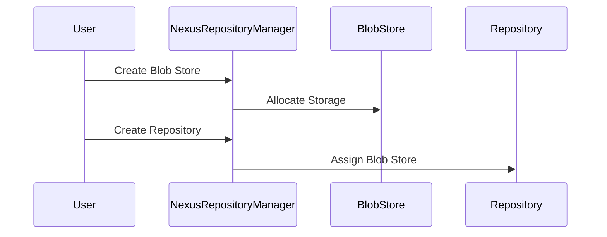
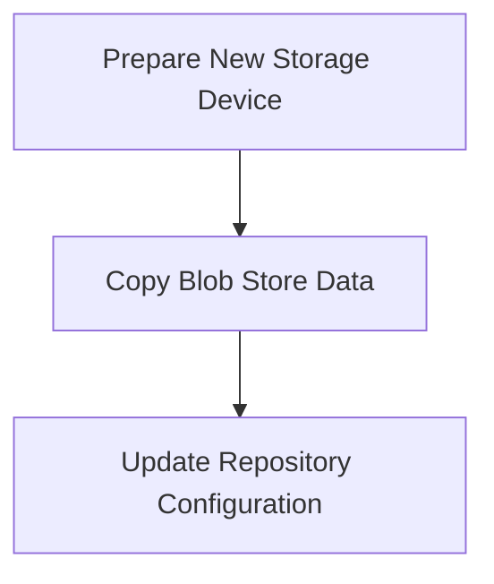
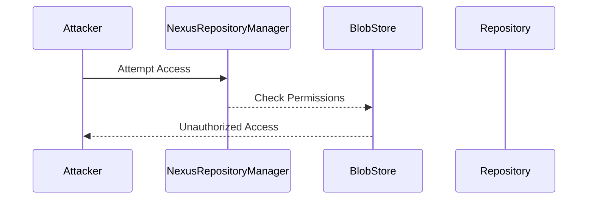
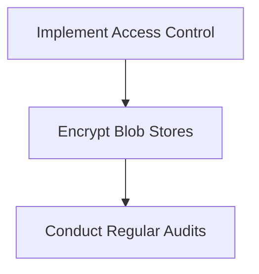

## Introduction to Nexus Repository Blob Store Management

In the context of DevOps and continuous integration/continuous deployment (CI/CD) pipelines, managing repositories efficiently is crucial. One such management aspect involves the Nexus Repository Manager, which is widely used for storing and managing artifacts like Docker images, Maven packages, and other binary files. A key component of this system is the **Blob Store**, which is essentially a storage area for the actual binary data of artifacts. Understanding how to manage Blob Stores effectively is essential for optimizing storage usage and ensuring smooth operations.

### What is a Blob Store?

A **Blob Store** is a dedicated storage area within the Nexus Repository Manager that holds the binary data (blobs) of artifacts. Each artifact stored in a repository is associated with a specific Blob Store. This separation allows for efficient management of storage resources and ensures that different types of artifacts can be stored independently.

#### Why Blob Stores Matter

Blob Stores are critical because they directly impact the performance and scalability of your repository management system. By allocating appropriate Blob Stores, you can:

- **Optimize Storage Usage**: Ensure that each repository has enough storage space to accommodate its artifacts.
- **Improve Performance**: Reduce the overhead of managing large volumes of data by distributing them across multiple Blob Stores.
- **Enhance Security**: Isolate sensitive artifacts in dedicated Blob Stores, reducing the risk of unauthorized access.

### Blob Store Allocation and Management

When creating a repository, you must allocate it to a specific Blob Store. Once a repository is assigned to a Blob Store, it remains there permanently. This means that careful planning is necessary to ensure that each repository has sufficient storage capacity.

#### Allocating Blob Stores

To allocate a Blob Store to a repository, follow these steps:

1. **Create a Blob Store**: Before assigning a Blob Store to a repository, you must first create it. This involves specifying the storage capacity and other parameters.
2. **Assign Blob Store to Repository**: When creating a new repository, you can select an existing Blob Store from the list of available options.



### Blob Store Size Considerations

The size of a Blob Store is a critical factor in its management. You must estimate the required storage capacity based on the type and volume of artifacts that will be stored. Overestimating can lead to wasted resources, while underestimating can cause performance issues and potential data loss.

#### Calculating Blob Store Size

To calculate the appropriate size for a Blob Store, consider the following factors:

- **Artifact Types**: Different types of artifacts (e.g., Docker images, Maven packages) have varying sizes.
- **Volume of Artifacts**: Estimate the number of artifacts that will be stored over time.
- **Retention Policies**: Determine how long artifacts will be retained and how often they will be updated.

For example, if you are storing Docker images, you might estimate the average size of an image and multiply it by the number of images you expect to store. Additionally, consider the growth rate of your artifact collection over time.

### Moving Blob Stores

While Blob Stores are permanently assigned to repositories, they can be moved from one storage device to another. This is useful if you need to increase the storage capacity or migrate to a different storage solution.

#### Steps to Move a Blob Store

1. **Prepare the New Storage Device**: Ensure that the new storage device has sufficient capacity and is properly configured.
2. **Copy Blob Store Data**: Manually copy the data from the old Blob Store to the new storage device.
3. **Update Repository Configuration**: Update the repository configuration to point to the new Blob Store location.



### Blob Store Limitations

There are several limitations to consider when working with Blob Stores:

- **Cannot be Split**: A Blob Store cannot be split into smaller parts. Once a Blob Store is created, it remains a single entity.
- **One Repository per Blob Store**: A single repository cannot use multiple Blob Stores. Each repository is tied to a single Blob Store.

These limitations mean that careful planning is essential to ensure that each repository has sufficient storage capacity and that Blob Stores are managed efficiently.

### Real-World Examples

Recent breaches and vulnerabilities have highlighted the importance of proper Blob Store management. For instance, in the case of a breach involving Docker images, improper management of Blob Stores could have led to unauthorized access to sensitive artifacts.

#### Example: Docker Image Breach

In a hypothetical scenario, a company experienced a breach due to improper management of Docker images stored in a Nexus Repository. The breach occurred because the Blob Store was not properly secured, allowing attackers to access sensitive images.



### How to Prevent / Defend

To prevent such breaches, it is essential to implement robust security measures and best practices for Blob Store management.

#### Secure Blob Store Configuration

1. **Access Control**: Implement strict access control policies to ensure that only authorized users can access Blob Stores.
2. **Encryption**: Encrypt Blob Stores to protect sensitive data from unauthorized access.
3. **Regular Audits**: Conduct regular audits to monitor access patterns and identify potential security issues.



#### Secure Code Fix

Here is an example of how to secure Blob Store configuration using secure coding practices:

```yaml
# Vulnerable Blob Store Configuration
blobStores:
  - name: my-blob-store
    type: file
    directory: /path/to/storage

# Secure Blob Store Configuration
blobStores:
  - name: my-blob-store
    type: file
    directory: /path/to/storage
    encryption:
      algorithm: AES
      key: <secure-key>
```

### Complete Example: Creating and Managing Blob Stores

Let's walk through a complete example of creating and managing Blob Stores in a Nexus Repository Manager.

#### Step 1: Create a Blob Store

First, create a Blob Store with a specified size.

```bash
# Create a Blob Store with 75GB capacity
curl -X POST -u admin:admin123 http://localhost:8081/service/rest/v1/blobstores \
-H "Content-Type: application/json" \
-d '{
  "name": "my-blob-store",
  "type": "file",
  "attributes": {
    "directory": "/path/to/storage",
    "capacity": 75000000000
  }
}'
```

#### Step 2: Verify Blob Store Creation

Verify that the Blob Store has been created successfully.

```bash
# List Blob Stores
curl -u admin:admin123 http://localhost:8081/service/rest/v1/blobstores
```

#### Step 3: Create a Repository and Assign Blob Store

Next, create a repository and assign it to the newly created Blob Store.

```bash
# Create a Docker Hosted Repository
curl -X POST -u admin:admin123 http://localhost:8081/service/rest/v1/repositories/docker/hosted \
-H "Content-Type: application/json" \
-d '{
  "name": "my-docker-repo",
  "online": true,
  "storage": {
    "blobStoreName": "my-blob-store"
  }
}'
```

#### Step 4: Verify Repository Creation

Verify that the repository has been created and is associated with the correct Blob Store.

```bash
# List Repositories
curl -u admin:admin123 http://localhost:8081/service/rest/v1/repositories
```

### Common Pitfalls and Best Practices

When managing Blob Stores, it is important to avoid common pitfalls and follow best practices:

- **Avoid Underestimating Storage Needs**: Always estimate the required storage capacity accurately to avoid running out of space.
- **Regularly Monitor Storage Usage**: Regularly monitor the usage of Blob Stores to ensure that they are being used efficiently.
- **Implement Access Controls**: Implement strict access controls to prevent unauthorized access to Blob Stores.

### Hands-On Labs

To gain practical experience with Blob Store management, consider the following hands-on labs:

- **PortSwigger Web Security Academy**: Offers a comprehensive set of labs covering various aspects of web security, including repository management.
- **OWASP Juice Shop**: Provides a vulnerable web application for practicing security testing and management techniques.
- **DVWA (Damn Vulnerable Web Application)**: Another popular web application for practicing security testing and management.

By following these guidelines and best practices, you can effectively manage Blob Stores in your Nexus Repository Manager, ensuring optimal performance and security.

### Conclusion

Managing Blob Stores in a Nexus Repository Manager is a critical aspect of DevOps and CI/CD pipeline management. By understanding the concepts, limitations, and best practices, you can ensure that your repository system is optimized for performance and security. Regular monitoring and implementation of robust security measures are essential to prevent breaches and ensure the integrity of your artifacts.

---
<!-- nav -->
[[DevOps/DevOps Bootcamp/06-CI CD & Build Tools/38-Nexus Repository Blob Store Management/00-Overview|Overview]] | [[02-Introduction to Nexus Repository Blob Stores|Introduction to Nexus Repository Blob Stores]]
