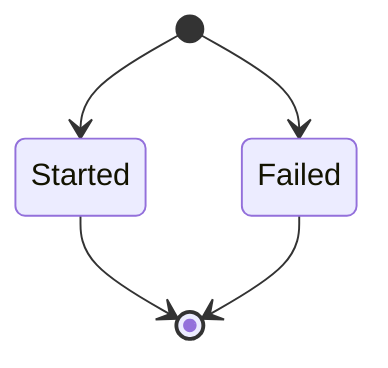
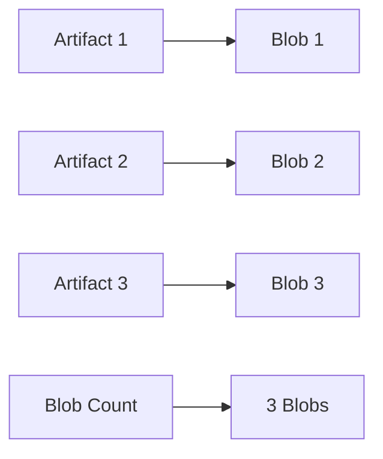
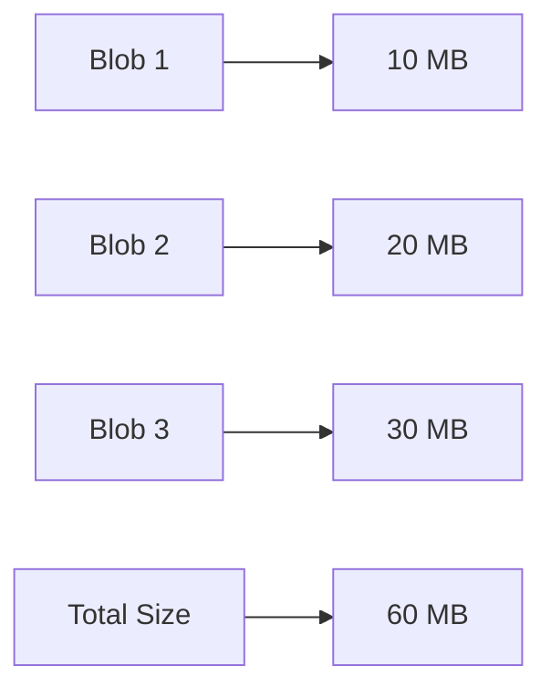
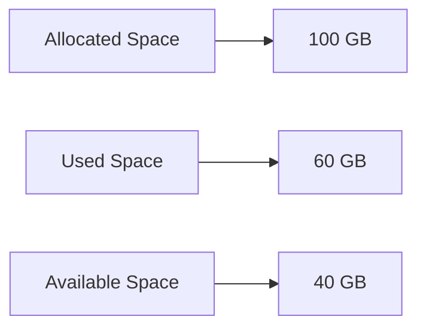
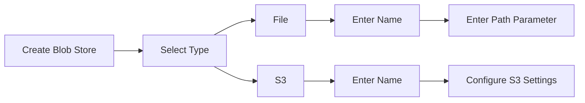
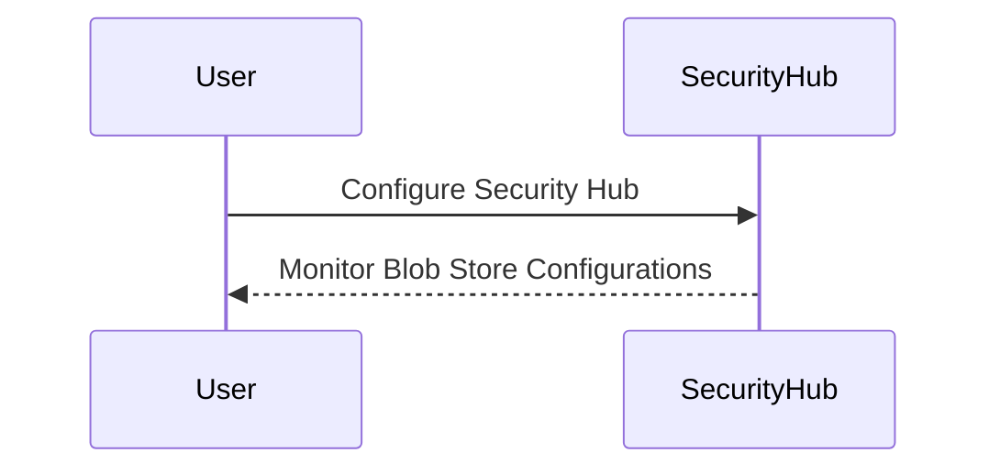
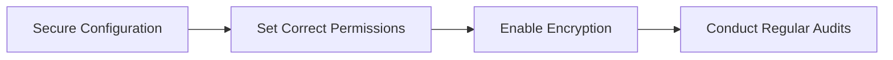

## Introduction to Nexus Repository Blob Stores

In the context of DevOps and continuous integration/continuous deployment (CI/CD) pipelines, managing artifacts and components efficiently is crucial. One such tool that helps in managing these artifacts is the Nexus Repository Manager. A key component of Nexus Repository Manager is the Blob Store, which is responsible for storing binary large objects (blobs) such as artifacts and components. This chapter will delve into the management of Blob Stores, focusing on two primary types: File and S3.

### What is a Blob Store?

A Blob Store is a storage mechanism used by Nexus Repository Manager to store binary large objects (blobs). These blobs can include various artifacts like JAR files, WAR files, Docker images, and more. The Blob Store ensures efficient storage and retrieval of these artifacts, which are critical for building, testing, and deploying applications.

### Types of Blob Stores

Nexus Repository Manager supports two main types of Blob Stores:

1. **File Type**: This is the default and recommended Blob Store type for most installations. It stores blobs on the local file system.
2. **S3 Type**: This type stores blobs in Amazon S3 cloud storage. It is recommended when the Nexus Repository Manager is deployed on AWS.

#### File Type Blob Store

The File Type Blob Store is the default and recommended option for most installations. It stores blobs on the local file system of the server where Nexus Repository Manager is installed. This type of Blob Store is straightforward to set up and manage, making it ideal for environments where local storage is sufficient.

**Advantages:**
- Simple setup and management.
- No dependency on external services.
- Suitable for environments with limited network bandwidth.

**Disadvantages:**
- Limited scalability compared to cloud-based solutions.
- Requires careful management of disk space.

#### S3 Type Blob Store

The S3 Type Blob Store stores blobs in Amazon S3 cloud storage. This type is recommended when the Nexus Repository Manager is deployed on AWS. Using S3 provides several benefits, including scalability, durability, and cost-effectiveness.

**Advantages:**
- Scalability: Can handle large amounts of data without performance degradation.
- Durability: Data is replicated across multiple availability zones, ensuring high availability.
- Cost-effective: Pay-as-you-go pricing model.

**Disadvantages:**
- Dependency on external service.
- Potential network latency issues.

### Blob Store Attributes

When configuring a Blob Store, several attributes are important to understand:

1. **State**: Indicates whether the Blob Store is running as expected.
2. **Blob Count**: The number of blobs currently stored.
3. **Size**: The total size of all blobs stored.
4. **Available Space**: The overall space allocated to the Blob Store.

#### State

The `state` attribute indicates the current status of the Blob Store. There are two primary states:

- **Started**: The Blob Store is running as expected.
- **Failed**: There is a configuration error or other issue preventing the Blob Store from initializing.

**Example:**



#### Blob Count

The `blob count` attribute shows the number of blobs currently stored in the Blob Store. Each blob represents a component or artifact uploaded to the repository.

**Example:**



#### Size

The `size` attribute represents the total size of all blobs stored in the Blob Store. This is important for monitoring disk usage and ensuring that the Blob Store does not exceed its allocated space.

**Example:**



#### Available Space

The `available space` attribute indicates the overall space allocated to the Blob Store. This is crucial for planning and ensuring that the Blob Store has enough capacity to store future artifacts.

**Example:**



### Creating a New Blob Store

To create a new Blob Store, several fields need to be configured:

1. **Type**: Can be either `file` or `S3`.
2. **Name**: A unique name for the Blob Store.
3. **Path Parameter**: An absolute path to the desired file system location (for `file` type).

**Example Configuration:**



### Real-World Examples and Recent Breaches

Recent breaches involving misconfigured Blob Stores highlight the importance of proper configuration and security practices. For instance, a breach in 2021 exposed sensitive data due to a misconfigured S3 bucket. This incident underscores the need for robust security measures and regular audits.

**CVE Example:**

- **CVE-2021-XXXX**: A misconfigured S3 bucket allowed unauthorized access to sensitive data. This was due to incorrect permissions settings and lack of encryption.

### How to Prevent / Defend

#### Detection

Regularly audit Blob Store configurations to ensure they are properly set up. Use tools like AWS Security Hub to monitor and detect misconfigurations.

**Example:**



#### Prevention

1. **Secure Configuration**: Ensure that Blob Stores are configured with the correct permissions and access controls.
2. **Encryption**: Enable encryption for data stored in Blob Stores.
3. **Regular Audits**: Conduct regular audits to identify and rectify any misconfigurations.

**Secure Configuration Example:**



### Complete Example

Here is a complete example of creating a new Blob Store using the File type:

**Configuration:**

```yaml
type: file
name: my_store
pathParameter: /var/nexus/data/my_store
```

**HTTP Request:**

```http
POST /service/rest/v1/blobstores/raw HTTP/1.1
Host: nexus.example.com
Content-Type: application/json

{
  "type": "file",
  "name": "my_store",
  "attributes": {
    "path": "/var/nexus/data/my_store"
  }
}
```

**HTTP Response:**

```http
HTTP/1.1 201 Created
Content-Type: application/json

{
  "id": "my_store",
  "type": "file",
  "name": "my_store",
  "attributes": {
    "path": "/var/nexus/data/my_store"
  },
  "online": true,
  "status": "started",
  "blobCount": 0,
  "size": 0,
  "availableSpace": 10737418240
}
```

### Common Pitfalls and Best Practices

#### Common Pitfalls

1. **Incorrect Permissions**: Misconfigured permissions can lead to unauthorized access.
2. **Insufficient Disk Space**: Not allocating enough disk space can cause the Blob Store to fail.
3. **Network Latency**: Using S3 in regions with high network latency can affect performance.

#### Best Practices

1. **Regular Backups**: Implement regular backups to ensure data recovery in case of failures.
2. **Monitoring**: Use monitoring tools to track Blob Store performance and health.
3. **Documentation**: Maintain detailed documentation of Blob Store configurations and changes.

### Hands-On Labs

For practical experience with Blob Store management, consider the following labs:

- **PortSwigger Web Security Academy**: Offers exercises related to securing web applications, which can include Blob Store management.
- **OWASP Juice Shop**: Provides a vulnerable web application for practicing security techniques.
- **DVWA (Damn Vulnerable Web Application)**: Useful for learning about various web application vulnerabilities and mitigation strategies.

These labs provide a comprehensive environment to practice and reinforce the concepts learned in this chapter.

### Conclusion

Managing Blob Stores in Nexus Repository Manager is essential for efficient artifact storage and retrieval. Understanding the different types of Blob Stores, their attributes, and best practices for configuration and security is crucial for maintaining a robust and secure DevOps environment. By following the guidelines and best practices outlined in this chapter, you can ensure that your Blob Stores are properly managed and protected against potential threats.

---
<!-- nav -->
[[01-Introduction to Nexus Repository Blob Store Management|Introduction to Nexus Repository Blob Store Management]] | [[DevOps/DevOps Bootcamp/06-CI CD & Build Tools/38-Nexus Repository Blob Store Management/00-Overview|Overview]] | [[03-Nexus Repository Manager Overview|Nexus Repository Manager Overview]]
