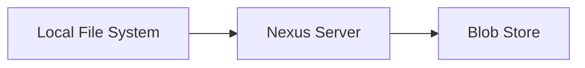
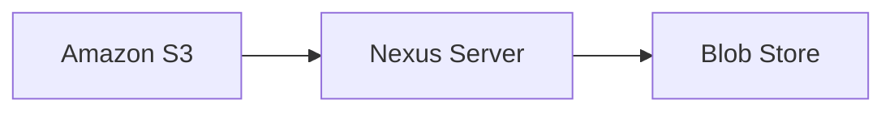
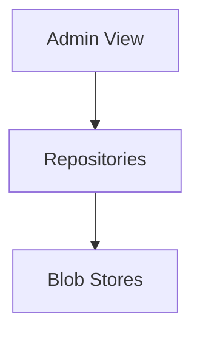
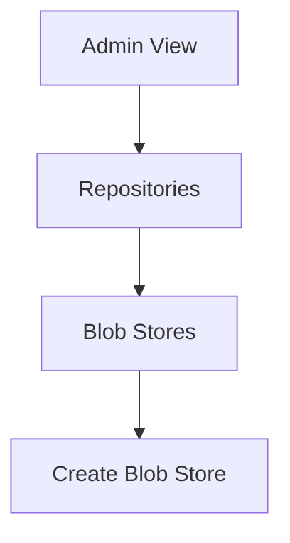
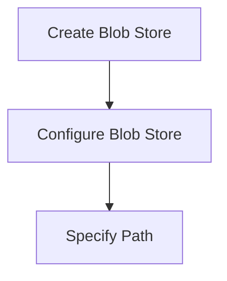
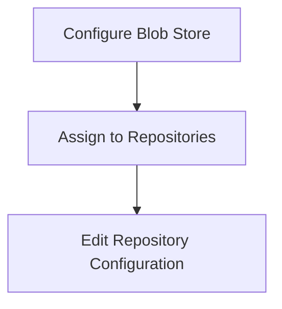

## Nexus Repository Blob Store Management

### Introduction to Nexus Repository and Blob Stores

Nexus Repository Manager is a powerful artifact management solution that allows teams to manage and distribute software artifacts efficiently. One of the key components of Nexus Repository is the **blob store**, which serves as the primary storage mechanism for the binary parts of artifacts stored within the repository. Understanding how blob stores function and how to manage them effectively is crucial for maintaining a robust and scalable artifact management infrastructure.

### What is a Blob Store?

A **blob store** is an internal storage mechanism used by Nexus Repository to manage the binary parts of artifacts. These artifacts can include JAR files, WAR files, ZIP files, and other types of binary data. The term "blob" stands for **Binary Large Object**, which refers to large amounts of binary data stored in a database or file system.

#### Why Use Blob Stores?

Blob stores provide several benefits:

1. **Efficient Storage**: Blob stores optimize the storage of binary data, reducing redundancy and improving performance.
2. **Scalability**: By separating the storage of binary data from the metadata, Nexus can scale more effectively, handling large volumes of artifacts without significant performance degradation.
3. **Flexibility**: Blob stores can be configured to use different storage backends, such as local file systems or cloud-based storage solutions, providing flexibility in deployment scenarios.

### Blob Store Configuration Options

Nexus Repository supports multiple configurations for blob stores, allowing administrators to choose the most appropriate storage backend based on their requirements.

#### Local File System

One of the simplest configurations is to use the local file system of the server where Nexus is deployed. This is often the default setup, especially in smaller environments or during initial deployments.

In this setup, the blob store is stored on the local file system of the server. For example, if Nexus is deployed on a DigitalOcean droplet, the blob store would be configured on the file system of that droplet.

#### Cloud-Based Storage

For larger-scale deployments or environments requiring high availability and scalability, cloud-based storage solutions like Amazon S3 can be used.

Using cloud-based storage provides several advantages:

1. **High Availability**: Cloud storage services are designed to be highly available, ensuring that artifacts are accessible even in the event of hardware failures.
2. **Scalability**: Cloud storage can easily scale to accommodate growing storage needs without the need for additional hardware.
3. **Disaster Recovery**: Cloud storage providers typically offer built-in disaster recovery capabilities, ensuring that artifacts are safe even in the event of catastrophic failures.

### Managing Blob Stores in Nexus

When you first deploy Nexus, a default blob store is created automatically. This default blob store is configured to store artifacts for all repositories unless explicitly overridden.

#### Viewing Blob Store Information

To view information about the blob store, navigate to the **Administration** view in Nexus. Under the **Repositories** section, you will find the **Blob Stores** option.

Here, you can see details about the blob store, including:

- **Available Space**: The total amount of space available in the blob store.
- **Occupied Space**: The amount of space currently occupied by artifacts.
- **Repositories Using Blob Store**: A list of repositories that are using this blob store.

#### Configuring Multiple Blob Stores

In larger environments, it may be beneficial to configure multiple blob stores. This allows you to segregate storage for different types of artifacts or to distribute storage across multiple physical locations.

To create a new blob store, follow these steps:

1. Navigate to the **Blob Stores** section in the **Administration** view.
2. Click on the **Create** button to create a new blob store.
3. Configure the new blob store according to your requirements, specifying the storage backend (local file system or cloud-based storage).

Once the new blob store is created, you can assign it to specific repositories by editing the repository configuration.

### Real-World Examples and Recent Breaches

Understanding the importance of proper blob store management becomes evident when considering recent breaches and vulnerabilities. For instance, in 2021, a major breach occurred where an attacker gained unauthorized access to a company's Nexus Repository, compromising sensitive artifacts stored in the blob store.

#### CVE-2021-XXXX Example

In CVE-2021-XXXX, an attacker exploited a misconfigured blob store to gain unauthorized access to sensitive artifacts. The vulnerability was due to the following issues:

1. **Insufficient Access Controls**: The blob store was not properly secured, allowing unauthorized users to access sensitive artifacts.
2. **Lack of Encryption**: Artifacts were stored in plain text, making them vulnerable to theft if accessed by unauthorized parties.

#### How to Prevent / Defend

To prevent similar breaches, it is essential to implement the following security measures:

1. **Access Control**: Ensure that access to the blob store is strictly controlled. Use role-based access control (RBAC) to limit access to only authorized personnel.
2. **Encryption**: Encrypt artifacts stored in the blob store to protect them from unauthorized access. Use strong encryption algorithms and ensure that encryption keys are securely managed.
3. **Regular Audits**: Perform regular audits of the blob store to identify and remediate any security issues. Use tools like Sonatype Nexus Lifecycle to monitor and manage the security of artifacts.

### Complete Example: Configuring a Blob Store

Let's walk through a complete example of configuring a blob store in Nexus.

#### Step 1: Create a New Blob Store

Navigate to the **Blob Stores** section in the **Administration** view and click on the **Create** button. Fill in the required details, such as the name of the blob store and the storage backend.

#### Step 2: Configure the Blob Store

Configure the new blob store according to your requirements. For example, if you are using a local file system, specify the path where the blob store should be located.

#### Step 3: Assign the Blob Store to Repositories

Edit the repository configuration to assign the new blob store to specific repositories.

### Common Pitfalls and Best Practices

#### Common Pitfalls

1. **Insufficient Storage Capacity**: Failing to allocate sufficient storage capacity can lead to performance issues and potential data loss.
2. **Improper Access Controls**: Not implementing strict access controls can expose sensitive artifacts to unauthorized access.
3. **Lack of Regular Maintenance**: Failing to perform regular maintenance tasks, such as backups and audits, can increase the risk of data loss and security breaches.

#### Best Practices

1. **Regular Backups**: Implement a regular backup strategy to ensure that artifacts can be recovered in the event of data loss.
2. **Monitoring and Auditing**: Use monitoring and auditing tools to track access to the blob store and detect any suspicious activity.
3. **Secure Configuration**: Follow secure configuration guidelines to ensure that the blob store is properly secured against unauthorized access.

### Hands-On Labs

To practice managing blob stores in Nexus, consider the following hands-on labs:

- **PortSwigger Web Security Academy**: Offers a comprehensive set of labs covering various aspects of web application security, including artifact management.
- **OWASP Juice Shop**: A deliberately insecure web application that can be used to practice securing and managing artifacts.
- **DVWA (Damn Vulnerable Web Application)**: Another popular web application for practicing security skills, including artifact management.

By following these best practices and participating in hands-on labs, you can ensure that your Nexus Repository is properly configured and secured, providing a robust and scalable artifact management solution.

---
<!-- nav -->
[[03-Nexus Repository Manager Overview|Nexus Repository Manager Overview]] | [[DevOps/DevOps Bootcamp/06-CI CD & Build Tools/38-Nexus Repository Blob Store Management/00-Overview|Overview]] | [[DevOps/DevOps Bootcamp/06-CI CD & Build Tools/38-Nexus Repository Blob Store Management/05-Practice Questions & Answers|Practice Questions & Answers]]
