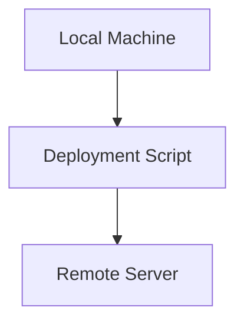
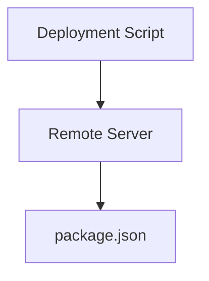
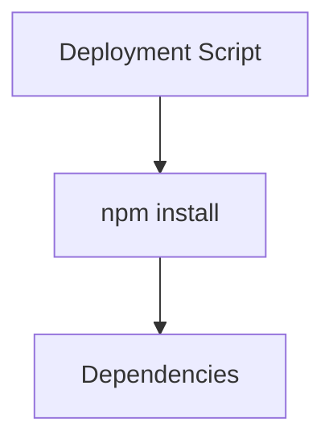
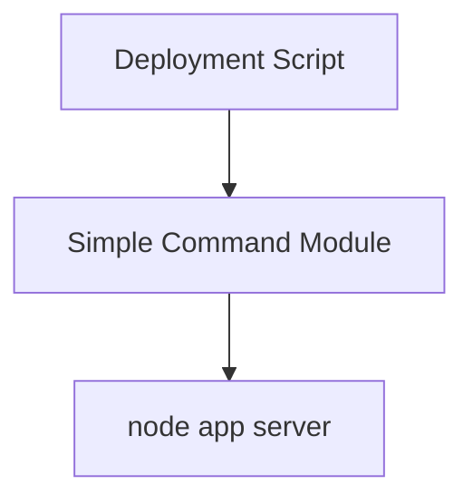
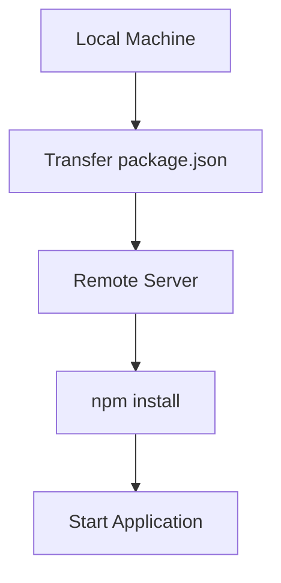

## Node.js Application Deployment with `npm install`

### Understanding the Host and Remote Execution

When deploying a Node.js application, it is crucial to understand the distinction between the host where the deployment script runs and the remote server where the actual application will run. Most of the commands in a deployment script are executed on the remote server, ensuring that the environment is set up correctly for the application to run.

#### Host vs. Remote Server

- **Host**: The machine where the deployment script is initiated. This could be your local development machine or a continuous integration (CI) server.
- **Remote Server**: The machine where the application will ultimately run. This could be a production server, a staging server, or any other remote machine.

In the context of the provided transcript, the deployment script is executed on a remote server. However, there is an exception where a file is sourced from the local machine. This is typically done using the `source` attribute, which specifies the path to the file on the local machine.



### Path to `package.json`

The `package.json` file is a crucial component of a Node.js project as it contains metadata about the project and its dependencies. When deploying a Node.js application, the path to the `package.json` file is specified to ensure that the correct dependencies are installed.

#### Specifying the Path

- **Path**: The path to the `package.json` file is specified relative to the root directory of the project on the remote server. For example, if the `package.json` file is located at `/root/package/package.json`, the path should be specified accordingly.



### Using `npm install`

The `npm install` command is used to install the dependencies listed in the `package.json` file. This ensures that the application has all the necessary modules to run correctly.

#### Community Modules and Ansible Installation

- **Community Modules**: Many useful modules are available from the npm community. These modules are not built-in and must be installed separately.
- **Ansible Installation**: Some modules, such as the one mentioned in the transcript, come pre-installed with Ansible. This means that you do not need to explicitly install them.



### Starting the Application

After installing the dependencies, the next step is to start the application. This is typically done by executing a command similar to `node app server`.

#### Executing Commands on the Remote Server

- **Command Module**: Since there is no built-in module for executing Node.js commands, a simple command module is used. This module allows you to execute any command on the remote server as if you were doing it manually.



### Complete Example

Let's walk through a complete example of deploying a Node.js application using `npm install` and starting the application.

#### Step-by-Step Deployment

1. **Source the File from Local Machine**:
   - Specify the path to the `package.json` file on the local machine.
   - Use the `source` attribute to transfer the file to the remote server.

2. **Install Dependencies**:
   - Execute the `npm install` command on the remote server.
   - Ensure that all dependencies listed in the `package.json` file are installed.

3. **Start the Application**:
   - Use the simple command module to execute the `node app server` command on the remote server.



### Real-World Examples and Recent CVEs

Recent vulnerabilities in Node.js applications often stem from improper handling of dependencies and insecure configurations. For example, the CVE-2021-21315 vulnerability in the `express` framework highlights the importance of keeping dependencies up-to-date and securing configurations.

#### CVE-2021-21315

- **Description**: This vulnerability allows attackers to bypass authentication mechanisms in certain versions of the `express` framework.
- **Impact**: Unauthorized access to sensitive data and functionality.
- **Mitigation**: Ensure that all dependencies are up-to-date and follow secure coding practices.

### How to Prevent / Defend

#### Detection

- **Dependency Auditing**: Regularly audit dependencies using tools like `npm audit`.
- **Logging and Monitoring**: Implement logging and monitoring to detect unauthorized access attempts.

#### Prevention

- **Secure Configuration**: Follow best practices for configuring Node.js applications.
- **Dependency Management**: Keep dependencies up-to-date and use tools like `npm-check-updates` to manage updates.

#### Secure Coding Fixes

- **Vulnerable Code**:
  ```javascript
  const express = require('express');
  const app = express();

  app.get('/api/data', (req, res) => {
      // Vulnerable code
  });
  ```

- **Fixed Code**:
  ```javascript
  const express = require('express');
  const app = express();
  const { authenticate } = require('./auth');

  app.get('/api/data', authenticate, (req, res) => {
      // Secure code
  });
  ```

### Hands-On Labs

For practical experience in deploying Node.js applications, consider the following labs:

- **PortSwigger Web Security Academy**: Offers comprehensive tutorials on web security, including Node.js deployment.
- **OWASP Juice Shop**: A deliberately insecure web application for practicing security skills.
- **DVWA (Damn Vulnerable Web Application)**: A PHP-based web application for learning web application security.

These labs provide real-world scenarios and challenges to help you master the deployment and security of Node.js applications.

### Conclusion

Deploying a Node.js application involves understanding the distinction between the host and remote server, specifying the correct paths, and using appropriate tools and modules. By following best practices and regularly auditing dependencies, you can ensure the security and reliability of your Node.js applications.

---
<!-- nav -->
[[04-Introduction to Task Registration in Ansible|Introduction to Task Registration in Ansible]] | [[DevOps/DevOps Bootcamp/06-CI CD & Build Tools/39-Nodejs Application Deployment With Npm Install/00-Overview|Overview]] | [[06-State Management in Configuration Tools|State Management in Configuration Tools]]
