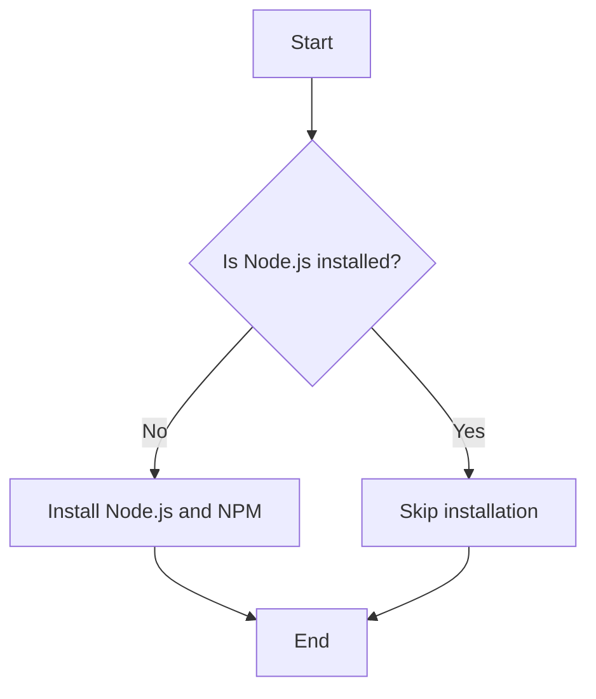
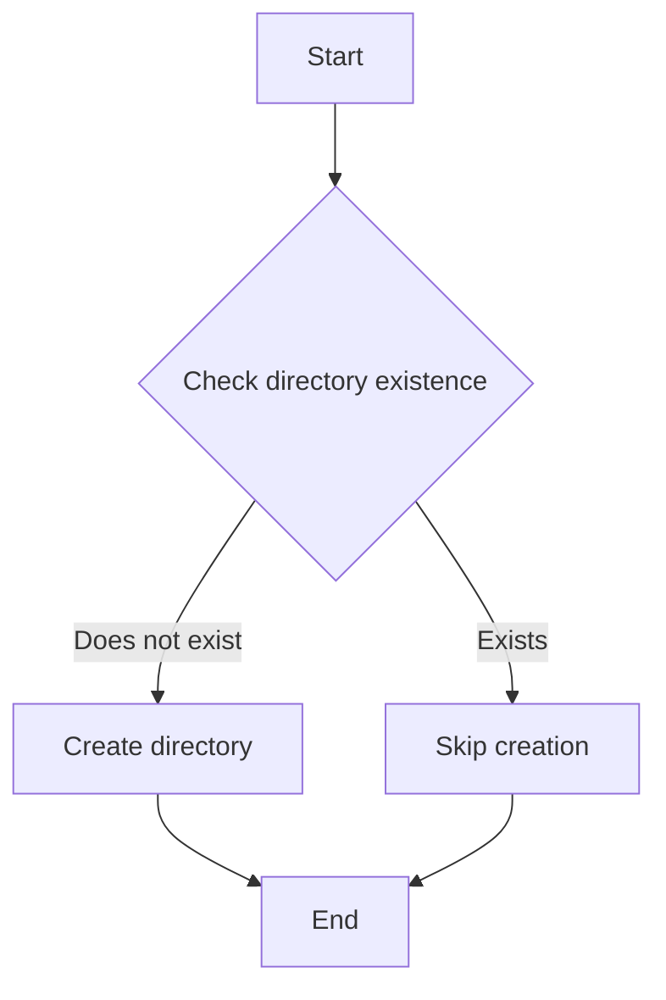

## Task Execution and State Management in DevOps

### Introduction to Task Execution and State Management

In the context of DevOps, task execution and state management are critical components of ensuring that your infrastructure and applications are deployed correctly and efficiently. This section will delve into the nuances of task execution, state management, and the importance of conditional checks in automation tools like Ansible.

### Understanding Task Execution

Task execution refers to the process of running specific commands or scripts on a target system to achieve a desired outcome. These tasks can range from simple operations like installing software packages to more complex actions like deploying a full-fledged application stack.

#### Example: Installing Node.js and NPM

Let's consider a common scenario where you need to install Node.js and NPM on a remote server. Here’s how you might typically approach this:

```bash
# Install Node.js and NPM
sudo apt-get update
sudo apt-get install -y nodejs npm
```

However, if Node.js and NPM are already installed, running these commands again would result in unnecessary overhead and potential errors.

### Importance of State Management

State management is crucial in automation because it ensures that tasks are only executed when necessary. Without proper state management, you might end up repeatedly running the same commands, leading to inefficiencies and potential issues.

#### Example: Checking Installation Status

To avoid redundant installations, you can check the installation status before proceeding:

```bash
# Check if Node.js is installed
if ! command -v node &> /dev/null; then
    echo "Node.js is not installed. Installing..."
    sudo apt-get update
    sudo apt-get install -y nodejs npm
else
    echo "Node.js is already installed."
fi
```

This script checks if `node` is available in the system's PATH. If it isn't, it proceeds with the installation. Otherwise, it skips the installation step.

### Conditional Checks in Automation Tools

Automation tools like Ansible provide built-in mechanisms to handle state management and conditional checks. Let's explore how Ansible handles these scenarios.

#### Ansible Playbook Example

Here’s an Ansible playbook that installs Node.js and NPM only if they are not already installed:

```yaml
---
- name: Ensure Node.js and NPM are installed
  hosts: all
  become: yes
  tasks:
    - name: Update package list
      apt:
        update_cache: yes

    - name: Install Node.js and NPM
      apt:
        name: "{{ item }}"
        state: present
      loop:
        - nodejs
        - npm
      when: "'nodejs' not in ansible_facts.packages"
```

In this playbook:
- `become: yes` ensures that the tasks are run with elevated privileges.
- `apt: update_cache: yes` updates the package list.
- The `when` clause checks if `nodejs` is already installed using `ansible_facts`.

### Comparison with Python Modules

Python modules often require explicit checks to manage state. For instance, when creating directories, you need to ensure that the directory does not already exist to avoid errors.

#### Example: Creating a Directory in Python

```python
import os

directory = "/path/to/directory"

if not os.path.exists(directory):
    os.makedirs(directory)
else:
    print(f"Directory {directory} already exists.")
```

This Python script checks if the directory exists before attempting to create it.

### Real-World Examples and Recent Breaches

Recent breaches and vulnerabilities often stem from improper state management and lack of conditional checks. For example, the Log4j vulnerability (CVE-2021-44228) exploited a flaw in logging mechanisms, which could have been mitigated with better state management and conditional checks.

#### Example: Log4j Vulnerability

The Log4j vulnerability allowed attackers to execute arbitrary code on affected systems. Proper state management and conditional checks could have helped in identifying and mitigating such risks.

### How to Prevent / Defend

#### Detection

- **Logging and Monitoring**: Implement comprehensive logging and monitoring to detect unauthorized changes or redundant executions.
- **Automated Scanning**: Use automated scanning tools to identify vulnerabilities and misconfigurations.

#### Prevention

- **Conditional Checks**: Always use conditional checks to ensure that tasks are only executed when necessary.
- **Secure Coding Practices**: Follow secure coding practices to minimize the risk of vulnerabilities.

#### Secure Code Fix

Here’s a comparison between insecure and secure code:

**Insecure Code:**

```bash
# Install Node.js and NPM without checking
sudo apt-get update
sudo apt-get install -y nodejs npm
```

**Secure Code:**

```bash
# Check if Node.js is installed before installing
if ! command -v node &> /dev/null; then
    echo "Node.js is not installed. Installing..."
    sudo apt-get update
    sudo apt-get install -y nodejs npm
else
    echo "Node.js is already installed."
fi
```

### Mermaid Diagrams

#### Task Execution Flow



#### Conditional Check Flow



### Conclusion

Proper task execution and state management are essential in DevOps to ensure efficient and secure deployments. By leveraging conditional checks and automation tools like Ansible, you can significantly reduce the risk of redundant operations and potential vulnerabilities.

### Practice Labs

For hands-on practice, consider the following labs:
- **PortSwigger Web Security Academy**: Focuses on web application security and includes practical exercises.
- **OWASP Juice Shop**: A deliberately insecure web application for security training.
- **DVWA (Damn Vulnerable Web Application)**: Another popular web application for learning about web security.

These labs provide real-world scenarios and challenges to help you master the concepts discussed in this chapter.

---
<!-- nav -->
[[07-Task Execution and Debugging in Ansible Playbooks|Task Execution and Debugging in Ansible Playbooks]] | [[DevOps/DevOps Bootcamp/06-CI CD & Build Tools/39-Nodejs Application Deployment With Npm Install/00-Overview|Overview]] | [[DevOps/DevOps Bootcamp/06-CI CD & Build Tools/39-Nodejs Application Deployment With Npm Install/09-Practice Questions & Answers|Practice Questions & Answers]]
