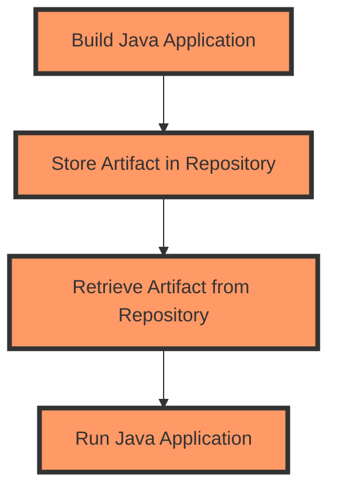

## Introduction to Artifact Repositories and Java Application Deployment

In the world of modern software development, especially within the DevOps ecosystem, artifact repositories play a crucial role in managing and distributing compiled applications. An artifact repository is essentially a storage location for software artifacts—compiled packages of code that can be deployed to production environments. These repositories are often used in conjunction with continuous integration and continuous deployment (CI/CD) pipelines to automate the build, test, and release processes.

Java applications, being one of the most widely used programming languages, are frequently managed through such repositories. This chapter will delve into the process of deploying and running Java applications from artifact repositories, covering the necessary steps, tools, and best practices.

### What is an Artifact Repository?

An artifact repository is a central storage location for software artifacts. These artifacts can be binary files, source code, documentation, or any other form of compiled or packaged software. Common types of artifact repositories include:

- **Maven Central**: A public repository for Maven artifacts.
- **JCenter**: Another public repository, now deprecated but still used.
- **Nexus Repository Manager**: A popular enterprise-grade repository manager.
- **Artifactory**: A repository manager provided by JFrog.

These repositories store artifacts in a structured manner, allowing developers to easily retrieve and deploy them as needed.

### Why Use Artifact Repositories?

Using artifact repositories offers several advantages:

- **Centralized Management**: All artifacts are stored in a single location, making it easier to manage and distribute them.
- **Version Control**: Artifacts can be versioned, ensuring that the correct version is deployed.
- **Dependency Resolution**: Many build tools (like Maven and Gradle) can automatically resolve dependencies from these repositories.
- **Security**: Access control can be implemented to ensure that only authorized users can access specific artifacts.

### Java Application Deployment Process

Deploying a Java application typically involves the following steps:

1. **Building the Application**: Compiling the source code into a runnable format, usually a JAR (Java Archive) file.
2. **Storing the Artifact**: Uploading the compiled JAR file to an artifact repository.
3. **Retrieving the Artifact**: Downloading the JAR file from the repository to the target server.
4. **Running the Application**: Executing the JAR file on the server.

### Building a Java Application

Before deploying a Java application, it must first be built. This process involves compiling the source code and packaging it into a JAR file. The most common tools for building Java applications are Maven and Gradle.

#### Maven Build Example

Maven is a popular build automation tool that uses a project object model (POM) to describe the project and its dependencies. Here’s a simple example of a Maven `pom.xml` file:

```xml
<project xmlns="http://maven.apache.org/POM/4.0.0"
         xmlns:xsi="http://www.w3.org/2001/XMLSchema-instance"
         xsi:schemaLocation="http://maven.apache.org/POM/4.0.0 http://maven.apache.org/xsd/maven-4.0.0.xsd">
    <modelVersion>4.0.0</modelVersion>
    <groupId>com.example</groupId>
    <artifactId>my-app</artifactId>
    <version>1.0-SNAPSHOT</version>
    <packaging>jar</packaging>
    <build>
        <plugins>
            <plugin>
                <groupId>org.apache.maven.plugins</groupId>
                <artifactId>maven-jar-plugin</artifactId>
                <version>3.2.0</version>
                <configuration>
                    <archive>
                        <manifest>
                            <mainClass>com.example.Main</mainClass>
                        </manifest>
                    </archive>
                </configuration>
            </plugin>
        </plugins>
    </build>
</project>
```

To build the project, run the following command:

```bash
mvn clean package
```

This command cleans the project and packages it into a JAR file located in the `target` directory.

### Storing the Artifact in a Repository

Once the JAR file is built, it needs to be stored in an artifact repository. This can be done manually or through automated CI/CD pipelines.

#### Manual Upload Example

For manual upload, you can use tools like `curl` to upload the JAR file to a repository. Here’s an example using Nexus Repository Manager:

```bash
curl -v -u username:password --upload-file target/my-app-1.0-SNAPSHOT.jar \
     http://localhost:8081/repository/maven-releases/com/example/my-app/1.0-SNAPSHOT/my-app-1.0-SNAPSHOT.jar
```

### Retrieving the Artifact from the Repository

To deploy the application, the JAR file needs to be retrieved from the repository and placed on the target server.

#### Manual Download Example

Here’s an example of downloading the JAR file using `curl`:

```bash
curl -O http://localhost:8081/repository/maven-releases/com/example/my-app/1.0-SNAPSHOT/my-app-1.0-SNAPSHOT.jar
```

### Running the Java Application

Once the JAR file is on the target server, it can be executed using the `java` command.

#### Executing the JAR File

The command to run a JAR file is:

```bash
java -jar my-app-1.0-SNAPSHOT.jar
```

This command starts the Java Virtual Machine (JVM) and runs the main class specified in the JAR file’s manifest.

### Detailed Example

Let’s walk through a detailed example of building, storing, retrieving, and running a Java application.

#### Step 1: Building the Application

Assume we have a simple Java application with a `Main.java` file:

```java
package com.example;

public class Main {
    public static void main(String[] args) {
        System.out.println("Hello, World!");
    }
}
```

We compile and package this application using Maven:

```bash
mvn clean package
```

This creates a JAR file in the `target` directory.

#### Step 2: Storing the Artifact

Upload the JAR file to a repository using `curl`:

```bash
curl -v -u username:password --upload-file target/my-app-1.0-SNAPSHOT.jar \
     http://localhost:8081/repository/maven-releases/com/example/my-app/1.0-SNAPSHOT/my-app-1.0-SNAPSHOT.jar
```

#### Step 3: Retrieving the Artifact

Download the JAR file from the repository:

```bash
curl -O http://localhost:8081/repository/maven-releases/com/example/my-app/1.0-SNAPSHOT/my-app-1.0-SNAPSHOT.jar
```

#### Step 4: Running the Application

Execute the JAR file:

```bash
java -jar my-app-1.0-SNAPSHOT.jar
```

### Pitfalls and Best Practices

While deploying Java applications from artifact repositories is straightforward, there are several pitfalls to avoid and best practices to follow.

#### Pitfall: Insecure Artifact Retrieval

One common pitfall is insecure retrieval of artifacts. If the repository is not properly secured, attackers could potentially inject malicious artifacts into the pipeline.

#### Best Practice: Secure Artifact Retrieval

Ensure that the repository is secured with proper authentication and authorization mechanisms. Use HTTPS for all communications and validate the integrity of downloaded artifacts using checksums or digital signatures.

#### Pitfall: Outdated Dependencies

Another pitfall is using outdated dependencies. Outdated dependencies can introduce vulnerabilities into the application.

#### Best Practice: Keep Dependencies Updated

Regularly update dependencies to their latest versions. Use tools like `mvn dependency:tree` to check for outdated dependencies and update them accordingly.

### Real-World Examples

#### CVE-2021-44228: Log4Shell

The Log4Shell vulnerability (CVE-2021-44228) is a critical vulnerability in the Apache Log4j library. This vulnerability allowed attackers to execute arbitrary code on affected systems. One of the ways this vulnerability was exploited was through insecure artifact retrieval.

#### Secure Artifact Retrieval Example

To mitigate such vulnerabilities, ensure that your artifact retrieval process is secure. Here’s an example of a secure retrieval process using HTTPS and validating the integrity of the artifact:

```bash
curl -O https://secure-repo.com/path/to/artifact.jar
sha256sum artifact.jar
```

Compare the computed SHA-256 hash with the expected value to ensure the artifact has not been tampered with.

### How to Prevent / Defend

#### Detection

- **Monitor Artifact Downloads**: Use logging and monitoring tools to track artifact downloads and detect any unusual activity.
- **Integrity Checks**: Regularly perform integrity checks on downloaded artifacts using checksums or digital signatures.

#### Prevention

- **Secure Repositories**: Ensure that artifact repositories are secured with proper authentication and authorization mechanisms.
- **Keep Dependencies Updated**: Regularly update dependencies to their latest versions to mitigate known vulnerabilities.

#### Secure-Coding Fixes

Compare the vulnerable and secure versions of a dependency management setup:

**Vulnerable Version:**

```xml
<dependencies>
    <dependency>
        <groupId>org.apache.logging.log4j</groupId>
        <artifactId>log4j-core</artifactId>
        <version>2.14.1</version>
    </dependency>
</dependencies>
```

**Secure Version:**

```xml
<dependencies>
    <dependency>
        <groupId>org.apache.logging.log4j</groupId>
        <artifactId>log4j-core</artifactId>
        <version>2.17.1</version>
    </dependency>
</dependencies>
```

### Conclusion

Deploying Java applications from artifact repositories is a fundamental aspect of modern software development. By following best practices and avoiding common pitfalls, you can ensure that your applications are securely built, stored, retrieved, and deployed.

### Practice Labs

For hands-on practice with deploying Java applications from artifact repositories, consider the following labs:

- **PortSwigger Web Security Academy**: Offers exercises on securing web applications, including those involving Java.
- **OWASP Juice Shop**: A deliberately insecure web application for practicing web security skills.
- **DVWA (Damn Vulnerable Web Application)**: A PHP-based web application with various security vulnerabilities for educational purposes.

These labs provide practical experience in deploying and securing Java applications, helping you master the concepts covered in this chapter.



This diagram illustrates the process of building, storing, retrieving, and running a Java application from an artifact repository. Each step is crucial for ensuring the successful deployment of the application.

---
<!-- nav -->
[[DevOps/DevOps Bootcamp/06-CI CD & Build Tools/41-Running Java Applications From Artifact Repositories/00-Overview|Overview]] | [[DevOps/DevOps Bootcamp/06-CI CD & Build Tools/41-Running Java Applications From Artifact Repositories/02-Practice Questions & Answers|Practice Questions & Answers]]
