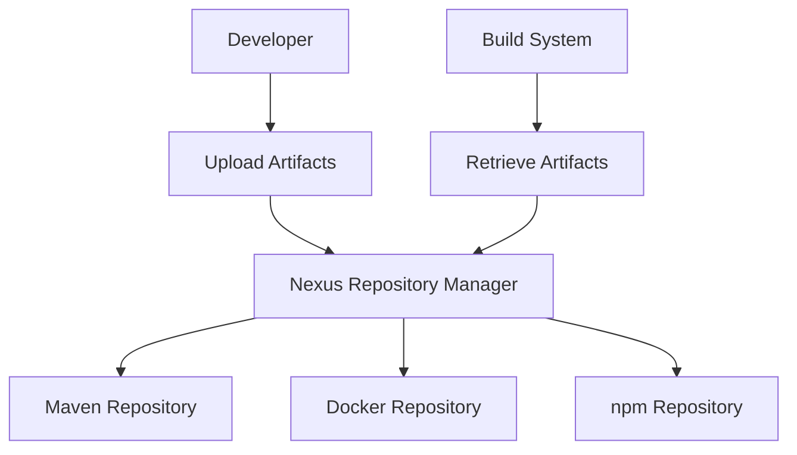

## Understanding Artifact Repositories and Managers

### What Are Artifacts?

Artifacts are compiled or packaged versions of software applications that are ready for deployment. These artifacts can take various forms depending on the programming language and development environment used. Common artifact formats include:

- **JAR (Java Archive)**: A file format used for aggregating many files into one. JAR files are typically used for distributing Java classes, libraries, and resources.
- **WAR (Web Application Archive)**: A JAR file that contains a complete web application, including Java class files, static web pages, and XML files.
- **ZIP**: A compressed file format that allows multiple files to be combined into a single archive.
- **TAR**: A format for collecting many files into one archive file. Often used in conjunction with compression utilities like gzip.
- **Docker Images**: Containerized applications that package the application along with its dependencies and runtime environment.

Each of these formats serves a specific purpose and is designed to work within particular ecosystems. For instance, JAR and WAR files are integral to Java-based applications, while Docker images are used extensively in containerized environments.

### Why Use Artifact Repositories?

An artifact repository is a storage location for artifacts. It serves as a central hub where developers can upload, store, and retrieve artifacts. This centralized approach offers several benefits:

- **Version Control**: Repositories allow for versioning of artifacts, making it easy to track changes and roll back to previous versions if necessary.
- **Dependency Management**: Many build systems and dependency managers rely on repositories to resolve and download dependencies.
- **Consistency and Reproducibility**: By storing artifacts in a repository, teams ensure that everyone is working with the same versions of dependencies, leading to more consistent and reproducible builds.

### Types of Artifact Repositories

Different types of artifacts require different repository formats. Here are some common types:

- **Maven Repository**: Used primarily for Java artifacts, Maven repositories store JAR and WAR files. Maven is a popular build automation tool that uses these repositories to manage project dependencies.
- **NPM Registry**: Used for JavaScript packages, the NPM registry stores `.tar.gz` files containing Node.js modules.
- **Docker Registry**: Stores Docker images, which are used to deploy containerized applications.
- **PyPI (Python Package Index)**: Stores Python packages in `.whl` (wheel) or `.tar.gz` formats.

### Managing Multiple Artifact Formats

In a typical enterprise environment, multiple programming languages and frameworks are used, resulting in a variety of artifact formats. For example:

- **Java Projects**: Produce JAR and WAR files.
- **Python Projects**: Produce `.whl` or `.tar.gz` files.
- **Node.js Projects**: Produce `.tar.gz` files.
- **Containerized Applications**: Produce Docker images.

To effectively manage these diverse artifacts, organizations often need separate repositories for each format. However, maintaining multiple repositories can become cumbersome and difficult to manage.

### Artifact Repository Managers

An artifact repository manager is a tool that simplifies the management of multiple artifact repositories. It acts as a single interface for accessing and managing artifacts across different formats. Some popular artifact repository managers include:

- **Sonatype Nexus**: Supports multiple artifact formats, including Maven, NPM, Docker, and PyPI.
- **JFrog Artifactory**: Another comprehensive repository manager that supports a wide range of artifact formats.
- **GitLab Package Registry**: Integrated with GitLab, it supports various package formats, including Docker, npm, and Maven.

#### Example: Sonatype Nexus

Sonatype Nexus is a widely-used artifact repository manager. It provides a unified interface for managing artifacts across different formats. Here’s how it works:

1. **Configuration**: Set up Nexus to handle different artifact formats. For example, configure Maven repositories for Java artifacts, Docker repositories for container images, and npm repositories for JavaScript packages.
2. **Upload Artifacts**: Developers can upload their artifacts to the appropriate repository within Nexus.
3. **Access Artifacts**: Build systems and dependency managers can access artifacts from Nexus using standard protocols.



### Real-World Examples and Security Implications

#### Example: CVE-2021-21315

CVE-2021-21315 is a critical vulnerability found in the Apache Maven Central Repository. This vulnerability allowed attackers to inject malicious code into legitimate artifacts, potentially compromising the integrity of software builds.

**Impact**: If a developer unknowingly downloaded a compromised artifact, their application could be infected with malware.

**Detection**: Organizations should regularly scan their repositories for known vulnerabilities using tools like Sonatype Nexus Lifecycle or JFrog Xray.

**Prevention**:
- **Use Secure Repositories**: Ensure that all repositories are properly secured and monitored.
- **Verify Artifacts**: Implement checksum verification and digital signatures to ensure the integrity of downloaded artifacts.
- **Regular Audits**: Conduct regular audits of repository contents to identify and remove suspicious artifacts.

#### Secure Coding Practices

Here’s an example of how to securely manage artifacts in a Maven project:

**Vulnerable Code**:
```xml
<dependencies>
    <dependency>
        <groupId>com.example</groupId>
        <artifactId>vulnerable-artifact</artifactId>
        <version>1.0.0</version>
    </dependency>
</dependencies>
```

**Secure Code**:
```xml
<dependencies>
    <dependency>
        <groupId>com.example</groupId>
        <artifactId>secure-artifact</artifactId>
        <version>1.0.0</version>
        <scope>compile</scope>
    </dependency>
</dependencies>

<repositories>
    <repository>
        <id>secure-repo</id>
        <url>https://secure-repo.example.com/repository/maven-public/</url>
    </repository>
</repositories>
```

**Explanation**:
- **Checksum Verification**: Ensure that Maven verifies the checksum of downloaded artifacts.
- **Repository Configuration**: Use secure repositories with proper authentication and encryption.

### How to Prevent / Defend

#### Detection

- **Regular Scans**: Use tools like Sonatype Nexus Lifecycle or JFrog Xray to scan repositories for known vulnerabilities.
- **Monitoring**: Implement monitoring to detect unauthorized access or modifications to repositories.

#### Prevention

- **Secure Repositories**: Ensure that all repositories are properly secured with authentication and encryption.
- **Checksum Verification**: Enable checksum verification for all downloaded artifacts.
- **Regular Audits**: Conduct regular audits of repository contents to identify and remove suspicious artifacts.

### Hands-On Labs

For practical experience with artifact repositories and managers, consider the following labs:

- **PortSwigger Web Security Academy**: Offers labs on securing web applications, including sections on managing dependencies and artifacts.
- **OWASP Juice Shop**: A deliberately insecure web application for practicing web security skills, including dependency management.
- **Sonatype Nexus Lifecycle**: Provides a free trial for experimenting with artifact repository management and security features.

By thoroughly understanding and implementing these practices, organizations can effectively manage their artifacts and mitigate potential security risks.

---
<!-- nav -->
[[DevOps/DevOps Bootcamp/06-CI CD & Build Tools/42-Understanding Artifact Repositories And Managers/00-Overview|Overview]] | [[DevOps/DevOps Bootcamp/06-CI CD & Build Tools/42-Understanding Artifact Repositories And Managers/02-Practice Questions & Answers|Practice Questions & Answers]]
