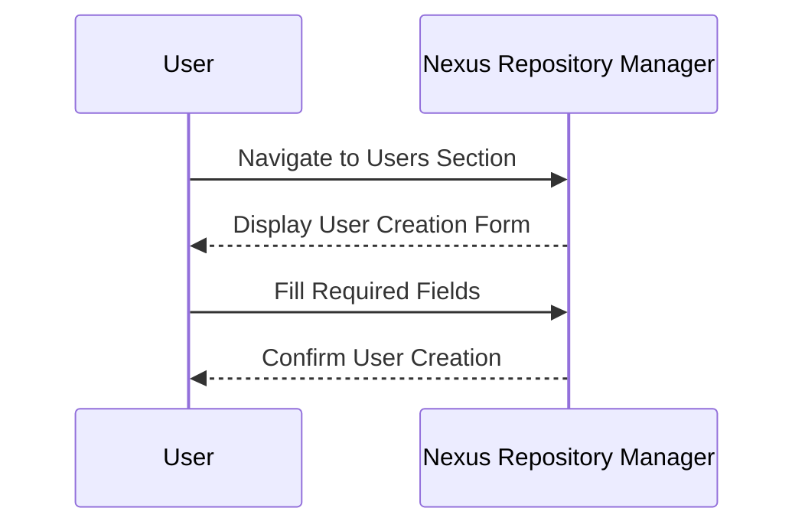
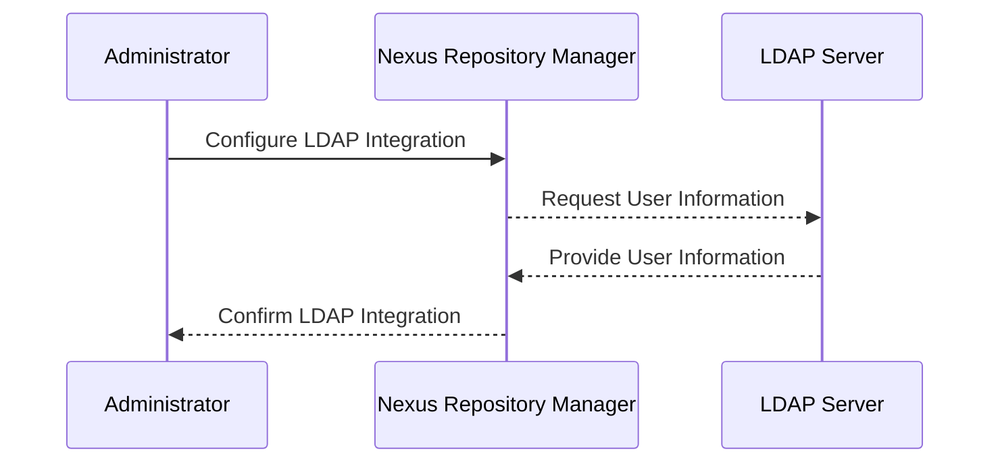
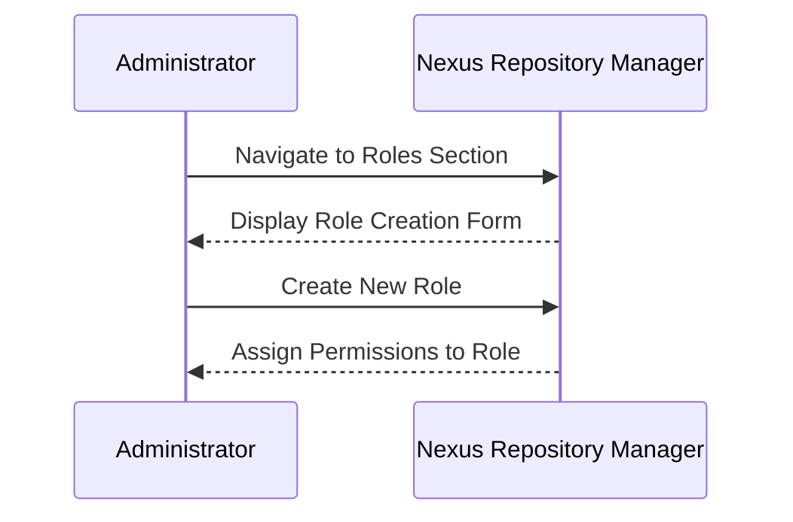
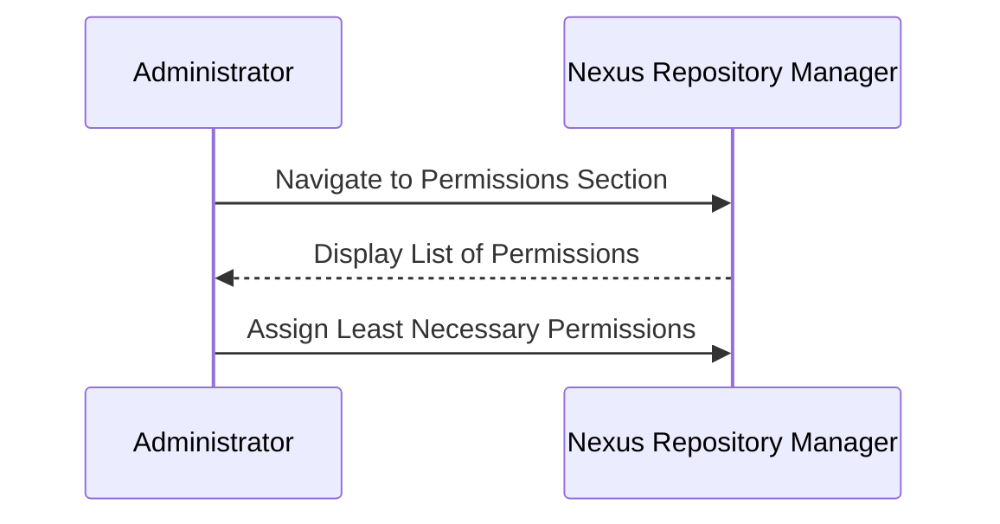
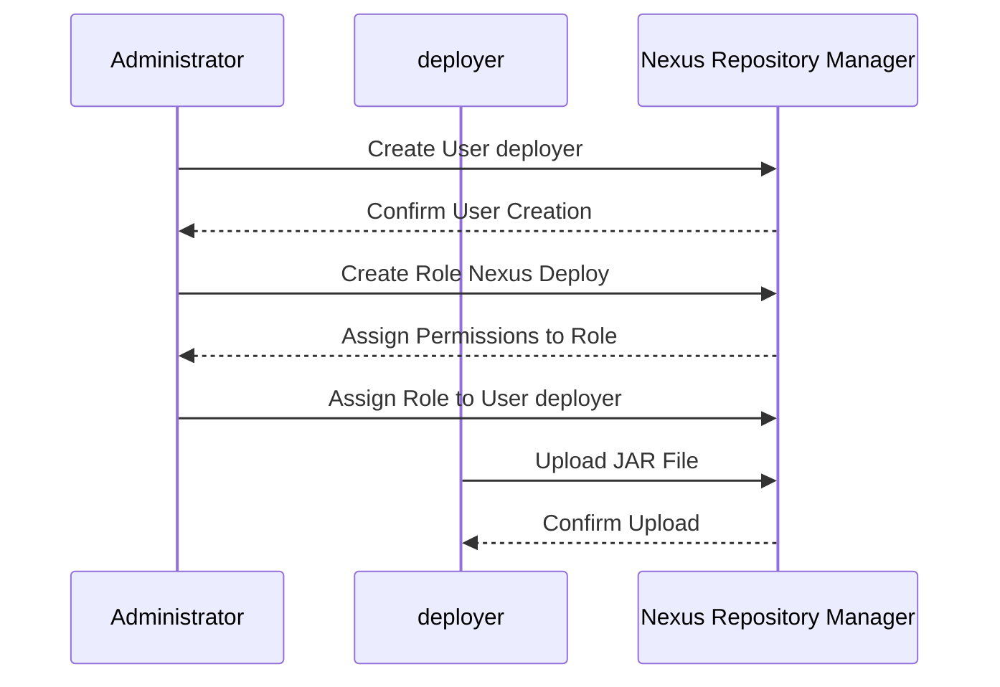

## Introduction to Nexus Repository Manager

Nexus Repository Manager is a powerful artifact management solution used extensively in DevOps environments. It allows teams to store, manage, and distribute software artifacts such as JAR files, WAR files, Docker images, and more. This chapter will delve into the process of uploading JAR files to Nexus Repository Manager, including user creation, role assignment, and permission management.

### Background Theory

Before diving into the practical steps, it's essential to understand the underlying concepts:

1. **Artifacts**: In the context of software development, an artifact is a compiled piece of code or data that is produced during the build process. Common examples include JAR files, WAR files, and Docker images.
2. **Repository Manager**: A repository manager is a centralized server that stores and manages these artifacts. It provides a single location for developers to access and share their work.
3. **Nexus Repository Manager**: Sonatype's Nexus Repository Manager is one of the most popular repository managers. It supports various types of repositories, including Maven, npm, Docker, and more.

### User Creation in Nexus Repository Manager

The first step in managing access to Nexus Repository Manager is to create a user. This user will be responsible for deploying JAR files to the repository.

#### Creating a User Manually

To create a user manually, follow these steps:

1. **Navigate to Users Section**: Log in to the Nexus Repository Manager interface and navigate to the "Users" section.
2. **Fill Required Fields**: Fill in all the required fields, such as username, password, and email address.
3. **Set User Status**: Set the user status to "active."



#### LDAP Integration

In a typical enterprise environment, it's more common to integrate existing users from the company's system using LDAP (Lightweight Directory Access Protocol) rather than creating users manually.

1. **LDAP Configuration**: Configure Nexus Repository Manager to integrate with the company's LDAP server.
2. **Assign Permissions**: Once the LDAP integration is set up, assign the necessary permissions to the users.



### Role Assignment

Once the user is created, the next step is to assign a role to the user. Roles define the permissions and actions that a user can perform within the Nexus Repository Manager.

#### Creating a Role

1. **Navigate to Roles Section**: Go to the "Roles" section in the Nexus Repository Manager interface.
2. **Create New Role**: Click on "Create Role" and provide a name for the role, such as "Nexus Deploy" or "XUS Java."
3. **Assign Permissions**: Assign the necessary permissions to the role.



### Permission Management

Permissions in Nexus Repository Manager are very granular, allowing administrators to control exactly what actions a user can perform. This is crucial for maintaining security and preventing unauthorized access.

#### Granular Permissions

1. **List of Permissions**: Each action that can be performed in Nexus Repository Manager has its own privilege. For example, actions related to Maven snapshots include repository admin, browse, delete, edit, read, and all with a star.
2. **Least Privilege Principle**: The best practice is to give users the least necessary permissions to execute the tasks they need to perform. This principle helps prevent unauthorized access and reduces the risk of security breaches.



### Example: Uploading JAR Files

Let's walk through a complete example of uploading a JAR file to Nexus Repository Manager.

#### Step-by-Step Process

1. **Create User**: Create a user named `deployer` with the necessary credentials.
2. **Create Role**: Create a role named `Nexus Deploy` and assign the following permissions:
   - `repository:maven-snapshots:browse`
   - `repository:maven-snapshots:read`
   - `repository:maven-snapshots:write`
3. **Assign Role to User**: Assign the `Nexus Deploy` role to the `deployer` user.
4. **Upload JAR File**: Use a tool like `mvn deploy` to upload the JAR file to the Nexus Repository Manager.



#### Full HTTP Request and Response

Here is an example of the full HTTP request and response for uploading a JAR file:

**HTTP Request:**

```http
PUT /repository/maven-snapshots/com/example/myapp/1.0-SNAPSHOT/myapp-1.0-SNAPSHOT.jar HTTP/1.1
Host: nexus.example.com
Authorization: Basic dGVzdDp0ZXN0
Content-Type: application/java-archive
Content-Length: 12345

[Binary Data]
```

**HTTP Response:**

```http
HTTP/1.1 201 Created
Date: Mon, 01 Jan 2024 12:00:00 GMT
Server: Nexus Repository Manager 3.38.0-01
Location: http://nexus.example.com/repository/maven-snapshots/com/example/myapp/1.0-SNAPSHOT/myapp-1.0-SNAPSHOT.jar
Content-Length: 0
```

### Pitfalls and Best Practices

#### Common Mistakes

1. **Overly Permissive Roles**: Assigning too many permissions to a user can lead to security vulnerabilities.
2. **Manual User Creation**: Relying solely on manual user creation can be time-consuming and error-prone.

#### Best Practices

1. **Use LDAP Integration**: Integrate with existing user systems to streamline user management.
2. **Follow Least Privilege Principle**: Assign only the necessary permissions to users to minimize security risks.

### How to Prevent / Defend

#### Detection

1. **Audit Logs**: Regularly review audit logs to identify unauthorized access attempts.
2. **Security Tools**: Use security tools like Sonatype Nexus Lifecycle to monitor and detect potential security issues.

#### Prevention

1. **Role-Based Access Control (RBAC)**: Implement RBAC to ensure that users have only the permissions they need.
2. **Regular Audits**: Conduct regular audits to ensure compliance with security policies.

#### Secure Coding Fixes

**Vulnerable Code:**

```java
// Vulnerable code snippet
public class Deployer {
    public void deployJar(String jarPath) {
        // Code to deploy JAR file
    }
}
```

**Secure Code:**

```java
// Secure code snippet
public class Deployer {
    @PreAuthorize("hasRole('Nexus Deploy')")
    public void deployJar(String jarPath) {
        // Code to deploy JAR file
    }
}
```

### Real-World Examples

#### Recent Breaches

1. **CVE-2021-21296**: A vulnerability in Nexus Repository Manager allowed attackers to bypass authentication and gain unauthorized access. This highlights the importance of following best practices and regularly updating security measures.

#### Lab Exercises

For hands-on practice, consider the following labs:

- **PortSwigger Web Security Academy**: Offers exercises on securing web applications, which can be adapted to Nexus Repository Manager scenarios.
- **OWASP Juice Shop**: Provides a vulnerable web application that can be used to practice securing repository managers.
- **DVWA (Damn Vulnerable Web Application)**: Another resource for practicing web application security.

### Conclusion

Uploading JAR files to Nexus Repository Manager involves several steps, including user creation, role assignment, and permission management. By following best practices and implementing robust security measures, organizations can ensure the integrity and security of their software artifacts.

---
<!-- nav -->
[[01-Introduction to Nexus Repository Manager and Gradle|Introduction to Nexus Repository Manager and Gradle]] | [[DevOps/DevOps Bootcamp/06-CI CD & Build Tools/43-Uploading Jar Files to Nexus Repository Manager/00-Overview|Overview]] | [[DevOps/DevOps Bootcamp/06-CI CD & Build Tools/43-Uploading Jar Files to Nexus Repository Manager/03-Common Pitfalls and How to Avoid Them|Common Pitfalls and How to Avoid Them]]
