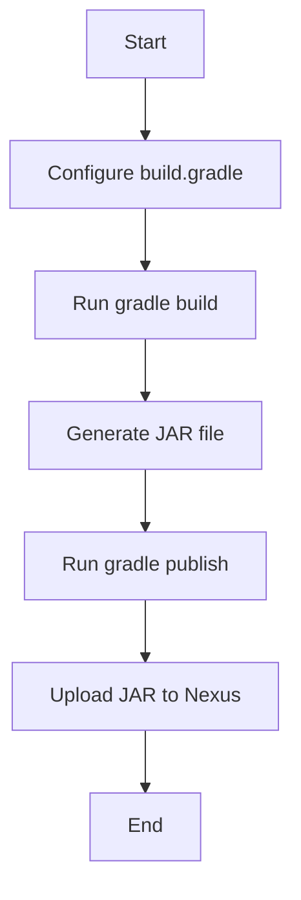

## Configuring Gradle to Upload JAR Files to Nexus

To configure Gradle to upload JAR files to a Nexus repository, you need to follow these steps:

1. **Add the Nexus Repository Plugin**.
2. **Configure the Repository URL and Credentials**.
3. **Build the Application**.
4. **Publish the JAR File to Nexus**.

### Step 1: Add the Nexus Repository Plugin

The first step is to add the Nexus Repository plugin to your `build.gradle` file. This plugin provides the necessary commands to publish artifacts to a Nexus repository.

```groovy
plugins {
    id 'maven-publish'
}
```

This plugin adds the `publish` task to Gradle, which can be used to publish artifacts to a remote repository.

### Step 2: Configure the Repository URL and Credentials

Next, you need to configure the repository URL and credentials in your `build.gradle` file. This involves specifying the repository URL and providing the necessary credentials.

```groovy
publishing {
    publications {
        mavenJava(MavenPublication) {
            from components.java
        }
    }
    repositories {
        maven {
            url = uri('https://your-nexus-repository-url')
            credentials {
                username = 'your-username'
                password = 'your-password'
            }
        }
    }
}
```

Here, `url` specifies the URL of the Nexus repository, and `credentials` provides the username and password needed to authenticate with the repository.

### Step 3: Build the Application

Once the configuration is set up, you can build your application using the `gradle build` command. This command compiles the source code and generates the JAR file.

```sh
./gradlew build
```

After running this command, a `build` directory is created in your project root, containing the compiled classes and the generated JAR file.

### Step 4: Publish the JAR File to Nexus

Finally, you can publish the JAR file to the Nexus repository using the `gradle publish` command.

```sh
./gradlew publish
```

This command executes the `publish` task, which uploads the JAR file to the specified Nexus repository.

### Example Configuration

Here is a complete example of a `build.gradle` file that configures Gradle to publish a JAR file to a Nexus repository:

```groovy
plugins {
    id 'java'
    id 'maven-publish'
}

group = 'com.example'
version = '1.0-SNAPSHOT'

repositories {
    mavenCentral()
}

dependencies {
    testImplementation 'org.junit.jupiter:junit-jupiter-api:5.7.0'
    testRuntimeOnly 'org.junit.jupiter:junit-jupiter-engine:5.7.0'
}

publishing {
    publications {
        mavenJava(MavenPublication) {
            from components.java
        }
    }
    repositories {
        maven {
            url = uri('https://your-nexus-repository-url')
            credentials {
                username = 'your-username'
                password = 'your-password'
            }
        }
    }
}
```

### Mermaid Diagram: Gradle Build and Publish Process

A visual representation of the Gradle build and publish process can help understand the flow better.



---
<!-- nav -->
[[DevOps/DevOps Bootcamp/06-CI CD & Build Tools/43-Uploading Jar Files to Nexus Repository Manager/03-Common Pitfalls and How to Avoid Them|Common Pitfalls and How to Avoid Them]] | [[DevOps/DevOps Bootcamp/06-CI CD & Build Tools/43-Uploading Jar Files to Nexus Repository Manager/00-Overview|Overview]] | [[05-Configuring Maven to Upload JAR Files to Nexus Repository Manager|Configuring Maven to Upload JAR Files to Nexus Repository Manager]]
