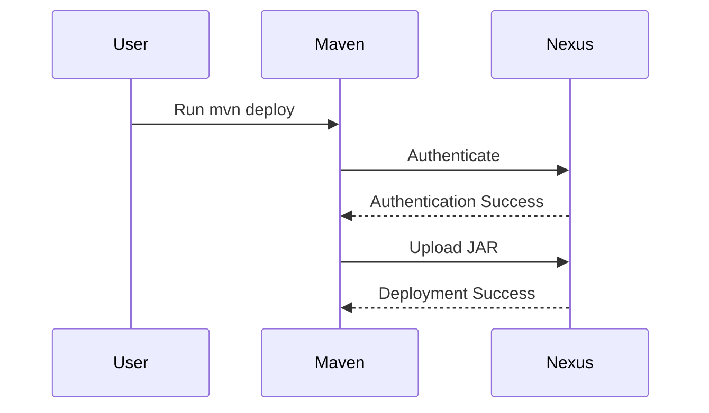

## Configuring Maven to Upload JAR Files to Nexus Repository Manager

In this section, we will delve into the process of configuring Maven to upload JAR files to a Nexus Repository Manager. This involves setting up the necessary plugins and configurations within Maven to ensure that the JAR files can be successfully deployed to the Nexus repository. We'll cover the theoretical background, practical steps, potential pitfalls, and security considerations.

### Background Theory

#### What is Maven?
Maven is a build automation tool primarily used for Java projects. It manages project builds, dependencies, documentation, reporting, and more through a project object model (POM) file. Maven simplifies the build process by providing a standardized directory structure and lifecycle phases.

#### What is Nexus Repository Manager?
Nexus Repository Manager is a powerful artifact management server developed by Sonatype. It provides a centralized repository for storing and managing artifacts such as JAR files, WAR files, and other binary packages. Nexus supports various protocols and formats, including Maven, Gradle, npm, and Docker.

### Configuring the Deploy Plugin in Maven

To enable Maven to upload JAR files to Nexus, we need to configure the `maven-deploy-plugin`. This plugin is responsible for deploying the built artifacts to a remote repository.

#### Step-by-Step Configuration

1. **Add the Plugin to the POM File**
   First, we need to define the `maven-deploy-plugin` in the `pom.xml` file. This involves specifying the plugin and its version.

```xml
<project>
    <build>
        <plugins>
            <plugin>
                <groupId>org.apache.maven.plugins</groupId>
                <artifactId>maven-deploy-plugin</artifactId>
                <version>3.0.0-M1</version>
            </plugin>
        </plugins>
    </build>
</project>
```

- **Explanation**: 
  - `<groupId>` specifies the group ID of the plugin, which is `org.apache.maven.plugins`.
  - `<artifactId>` specifies the artifact ID of the plugin, which is `maven-deploy-plugin`.
  - `<version>` specifies the version of the plugin. In this case, we are using version `3.0.0-M1`.

2. **Configure the Plugin Usage**
   Next, we need to configure how the plugin should be used. This involves specifying the deployment details such as the repository URL and credentials.

```xml
<project>
    <build>
        <plugins>
            <plugin>
                <groupId>org.apache.maven.plugins</groupId>
                <artifactId>maven-deploy-plugin</artifactId>
                <version>3.0.0-M1</version>
                <configuration>
                    <skip>true</skip>
                </configuration>
            </plugin>
        </plugins>
    </build>
</project>
```

- **Explanation**:
  - `<configuration>` allows us to specify additional configuration options for the plugin.
  - `<skip>` is set to `true` to prevent the plugin from running by default. This can be overridden during the build process.

### Configuring Credentials for Maven

To authenticate with the Nexus repository, we need to provide credentials. This can be done by configuring the `settings.xml` file in the `.m2` directory.

#### Step-by-Step Configuration

1. **Locate the Settings File**
   The `settings.xml` file is typically located in the `.m2` directory under the user's home directory (`~/.m2/settings.xml`).

2. **Add Server Configuration**
   Add the server configuration to the `settings.xml` file.

```xml
<settings>
    <servers>
        <server>
            <id>nexus-repo</id>
            <username>your-username</username>
            <password>your-password</password>
        </server>
    </servers>
</settings>
```

- **Explanation**:
  - `<id>` specifies the identifier for the server, which should match the ID used in the `distributionManagement` section of the `pom.xml`.
  - `<username>` and `<password>` specify the credentials for the Nexus repository.

### Configuring Distribution Management in Maven

The `distributionManagement` section in the `pom.xml` file specifies the repository where the artifacts should be deployed.

#### Step-by-Step Configuration

1. **Add Distribution Management Section**
   Add the `distributionManagement` section to the `pom.xml` file.

```xml
<project>
    <distributionManagement>
        <snapshotRepository>
            <id>nexus-repo</id>
            <url>http://localhost:8081/repository/maven-snapshots/</url>
        </snapshotRepository>
    </distributionManagement>
</project>
```

- **Explanation**:
  - `<id>` specifies the identifier for the repository, which should match the ID used in the `settings.xml`.
  - `<url>` specifies the URL of the Nexus repository where the snapshots will be deployed.

### Full Example

Here is the complete `pom.xml` and `settings.xml` configuration:

#### `pom.xml`

```xml
<project xmlns="http://maven.apache.org/POM/4.0.0"
         xmlns:xsi="http://www.w3.org/2001/XMLSchema-instance"
         xsi:schemaLocation="http://maven.apache.org/POM/4.0.0 http://maven.apache.org/xsd/maven-4.0.0.xsd">
    <modelVersion>4.0.0</modelVersion>
    <groupId>com.example</groupId>
    <artifactId>example-project</artifactId>
    <version>1.0-SNAPSHOT</version>

    <build>
        <plugins>
            <plugin>
                <groupId>org.apache.maven.plugins</groupId>
                <artifactId>maven-deploy-plugin</artifactId>
                <version>3.0.0-M1</version>
                <configuration>
                    <skip>true</skip>
                </configuration>
            </plugin>
        </plugins>
    </build>

    <distributionManagement>
        <snapshotRepository>
            <id>nexus-repo</id>
            <url>http://localhost:8081/repository/maven-snapshots/</url>
        </snapshotRepository>
    </distributionManagement>
</project>
```

#### `settings.xml`

```xml
<settings xmlns="http://maven.apache.org/SETTINGS/1.0.0"
          xmlns:xsi="http://www.w3.org/2001/XMLSchema-instance"
          xsi:schemaLocation="http://maven.apache.org/SETTINGS/1.0.0 http://maven.apache.org/xsd/settings-1.0.0.xsd">
    <servers>
        <server>
            <id>nexus-repo</id>
            <username>your-username</username>
            <password>your-password</password>
        </server>
    </servers>
</settings>
```

### Potential Pitfalls and How to Prevent Them

#### Pitfall 1: Incorrect Configuration
Incorrect configuration of the `pom.xml` or `settings.xml` files can lead to deployment failures.

- **Detection**: Check the logs for errors related to authentication or repository configuration.
- **Prevention**: Ensure that the `id`, `url`, `username`, and `password` are correctly specified and match the Nexus repository settings.

#### Pitfall 2: Missing Dependencies
Missing dependencies can cause the build to fail, preventing the deployment.

- **Detection**: Check the build output for missing dependency errors.
- **Prevention**: Ensure that all required dependencies are included in the `pom.xml` file.

#### Pitfall 3: Authentication Issues
Incorrect credentials or permissions can prevent successful authentication with the Nexus repository.

- **Detection**: Check the logs for authentication-related errors.
- **Prevention**: Verify that the credentials provided in the `settings.xml` file are correct and have the necessary permissions.

### Real-World Examples and Recent CVEs

#### Example: CVE-2021-21366
CVE-2021-21366 is a vulnerability in Nexus Repository Manager that allows unauthorized access to sensitive information due to improper validation of user input.

- **Impact**: Unauthorized users could gain access to sensitive data stored in the repository.
- **Mitigation**: Ensure that the Nexus Repository Manager is updated to the latest version and that proper input validation is implemented.

### Secure Coding Practices

#### Vulnerable Code Example

```xml
<settings>
    <servers>
        <server>
            <id>nexus-repo</id>
            <username>admin</username>
            <password>password123</password>
        </server>
    </servers>
</settings>
```

- **Vulnerability**: Using a weak password and storing it in plain text in the `settings.xml` file.

#### Secure Code Example

```xml
<settings>
    <servers>
        <server>
            <id>nexus-repo</id>
            <username>admin</username>
            <password>{SHA-256}hashed_password</password>
        </server>
    </servers>
</settings>
```

- **Security Improvement**: Use a strong, hashed password and store it securely.

### Mermaid Diagrams

#### Deployment Flow Diagram



### Hands-On Labs

For hands-on practice, consider the following labs:

- **PortSwigger Web Security Academy**: Offers a comprehensive set of labs covering various aspects of web application security.
- **OWASP Juice Shop**: A deliberately insecure web application for security training.
- **DVWA (Damn Vulnerable Web Application)**: A PHP/MySQL web application that is riddled with vulnerabilities for educational purposes.

These labs provide practical experience in configuring and securing Maven and Nexus Repository Manager.

By following these detailed steps and best practices, you can effectively configure Maven to upload JAR files to a Nexus Repository Manager, ensuring a secure and efficient deployment process.

---
<!-- nav -->
[[04-Configuring Gradle to Upload JAR Files to Nexus|Configuring Gradle to Upload JAR Files to Nexus]] | [[DevOps/DevOps Bootcamp/06-CI CD & Build Tools/43-Uploading Jar Files to Nexus Repository Manager/00-Overview|Overview]] | [[06-Uploading JAR Files to Nexus Repository Manager|Uploading JAR Files to Nexus Repository Manager]]
