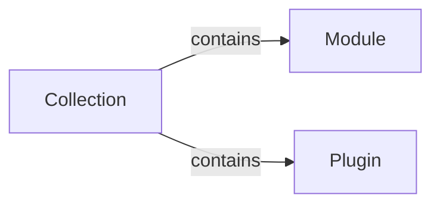

## Introduction to Ansible 2.10 Documentation Changes

Ansible is a powerful automation tool used widely in the DevOps community for managing infrastructure and automating tasks. With the release of Ansible 2.10, significant changes were introduced to improve organization, maintainability, and extensibility. One of the key changes is the restructuring of Ansible modules into collections. This chapter will delve deep into the concept of collections, their structure, and how they enhance Ansible's functionality.

### What Are Collections?

Collections in Ansible are logical groupings of related modules and plugins. Before Ansible 2.10, modules were scattered across the system, making it difficult to manage and maintain. By organizing modules into collections, Ansible provides a more structured and modular approach to automation.

#### Why Collections Matter

Collections offer several advantages:

1. **Organization**: Modules are grouped logically, making it easier to find and use them.
2. **Maintainability**: Updates and bug fixes can be applied to entire collections rather than individual modules.
3. **Extensibility**: New modules and plugins can be added to existing collections or new collections can be created.

### Structure of Collections

Each collection contains modules and plugins. Let's break down the components:

#### Modules

Modules are the core building blocks of Ansible. They perform specific tasks such as managing packages, services, or cloud resources. In Ansible 2.10, modules are grouped into collections based on their functionality.

For example, the `apt` and `service` modules, which were previously standalone, are now part of the `Ansible.Built-in` collection. This collection contains various built-in modules that are essential for basic automation tasks.



#### Plugins

Plugins extend the functionality of Ansible and its modules. They can add new features or modify existing ones. For instance, a plugin might enhance an AWS EC2 module to filter which instances to terminate.


### Example: Ansible.Built-in Collection

Let's take a closer look at the `Ansible.Built-in` collection. This collection includes essential modules and plugins that are commonly used in automation tasks.

#### Modules in Ansible.Built-in

The `Ansible.Built-in` collection contains several modules, including:

- `apt`: Manages Debian/Ubuntu package installations.
- `service`: Manages system services.

Here is an example of using the `apt` module within a playbook:

```yaml
---
- name: Install Apache
  hosts: all
  become: yes
  tasks:
    - name: Ensure Apache is installed
      apt:
        name: apache2
        state: present
```

#### Plugins in Ansible.Built-in

The `Ansible.Built-in` collection also includes plugins that extend the functionality of its modules. For example, a plugin might add filtering capabilities to the `apt` module.

### Real-World Examples

To illustrate the practical application of collections, let's consider a recent real-world scenario involving a cloud infrastructure management task.

#### Scenario: Managing AWS EC2 Instances

Suppose you need to automate the creation and termination of AWS EC2 instances. In Ansible 2.10, you would use the `aws_ec2` module, which is part of the `Ansible.Cloud` collection.

Here is an example of creating an EC2 instance:

```yaml
---
- name: Create EC2 Instance
  hosts: localhost
  gather_facts: false
  tasks:
    - name: Launch EC2 instance
      ec2:
        key_name: my-key-pair
        instance_type: t2.micro
        image_id: ami-0c94855ba95c71c99
        wait: true
        region: us-east-1
```

And here is an example of terminating an EC2 instance:

```yaml
---
- name: Terminate EC2 Instance
  hosts: localhost
  gather_facts: false
  tasks:
    - name: Terminate EC2 instance
      ec2:
        instance_ids: "{{ instance_id }}"
        state: absent
        region: us-east-1
```

### Enhancing Functionality with Plugins

Plugins can significantly enhance the functionality of Ansible modules. For instance, a plugin might add filtering capabilities to the `aws_ec2` module, allowing you to specify which instances to terminate based on certain criteria.

Here is an example of a plugin that adds filtering capabilities to the `aws_ec2` module:

```python
from ansible.plugins.action import ActionBase

class ActionModule(ActionBase):
    def run(self, tmp=None, task_vars=None):
        result = super(ActionModule, self).run(tmp, task_vars)
        instances = self._task.args.get('instances')
        filtered_instances = [instance for instance in instances if instance['state'] == 'running']
        result['instances'] = filtered_instances
        return result
```

This plugin filters out instances that are not in the "running" state before terminating them.

### How to Prevent / Defend

While collections and plugins provide powerful capabilities, they also introduce potential risks. Here are some best practices to ensure security and reliability:

#### Detection

Regularly audit your Ansible playbooks and collections to ensure they are up-to-date and free from vulnerabilities. Use tools like `ansible-lint` to check for common issues.

#### Prevention

1. **Use Secure Modules and Plugins**: Only use modules and plugins from trusted sources.
2. **Limit Permissions**: Ensure that Ansible tasks run with the minimum necessary permissions.
3. **Secure Configuration**: Harden your Ansible configurations to prevent unauthorized access.

#### Secure Coding Fixes

Here is an example of a vulnerable playbook and its secure counterpart:

**Vulnerable Playbook**

```yaml
---
- name: Install Apache
  hosts: all
  become: yes
  tasks:
    - name: Ensure Apache is installed
      apt:
        name: apache2
        state: present
```

**Secure Playbook**

```yaml
---
- name: Install Apache
  hosts: all
  become: yes
  tasks:
    - name: Ensure Apache is installed
      apt:
        name: apache2
        state: present
        update_cache: true
        cache_valid_time: 3600
```

In the secure version, we ensure that the package cache is updated and set a valid time to reduce the risk of outdated packages.

### Conclusion

Collections in Ansible 2.10 provide a more organized and modular approach to automation. By grouping related modules and plugins into collections, Ansible improves maintainability and extensibility. Understanding and effectively using collections can greatly enhance your automation capabilities.

### Practice Labs

To gain hands-on experience with Ansible collections, consider the following practice labs:

- **PortSwigger Web Security Academy**: Offers a comprehensive set of labs covering various aspects of web security.
- **OWASP Juice Shop**: A deliberately insecure web application for practicing web security skills.
- **DVWA (Damn Vulnerable Web Application)**: Another popular web application for learning web security.

These labs will help you apply the concepts learned in this chapter to real-world scenarios.

---
<!-- nav -->
[[DevOps/DevOps Bootcamp/07-Configuration Management (Ansible)/01-Ansible 2.10 Documentation Changes Explained/00-Overview|Overview]] | [[02-Introduction to Ansible Collections|Introduction to Ansible Collections]]
