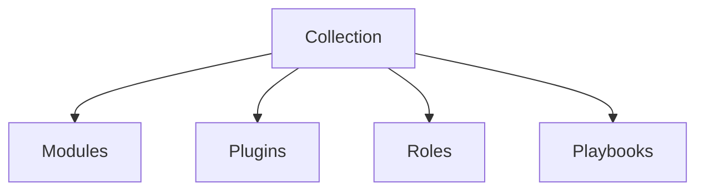

## Introduction to Ansible Collections

Ansible, a powerful automation tool, allows users to manage and automate IT infrastructure tasks efficiently. One of the key features of Ansible is the ability to organize and distribute reusable content through collections. This chapter will delve into the concept of Ansible collections, their structure, usage, and how they can be updated and managed effectively.

### What Are Ansible Collections?

Ansible collections are a way to package and distribute reusable content such as modules, plugins, roles, and playbooks. These collections provide a structured and organized approach to managing and sharing Ansible content. By using collections, users can easily update and maintain their Ansible installations without having to update the entire Ansible framework.

#### Why Use Collections?

Collections offer several benefits:

1. **Modularity**: Collections allow you to update individual components of your Ansible setup without needing to update the entire system.
2. **Reusability**: Collections can be shared and reused across different projects, promoting consistency and reducing redundancy.
3. **Organization**: Collections provide a standardized structure, making it easier to manage and locate specific pieces of content.

### Structure of an Ansible Collection

Ansible collections follow a predefined structure that includes the following components:

- **Modules**: Individual scripts that perform specific tasks.
- **Plugins**: Extensions that enhance Ansible's functionality.
- **Roles**: Predefined sets of tasks that can be applied to a host.
- **Playbooks**: Scripts that define a series of tasks to be executed.

The structure of a typical Ansible collection might look like this:



### Updating Ansible Collections

One of the significant advantages of Ansible collections is the ability to update individual collections without updating the entire Ansible installation. This feature is particularly useful when new versions of collections are released with additional features or bug fixes.

#### Example: Updating the Amazon.aWS Collection

Let's consider an example where the `Amazon.aWS` collection is updated from version 1.4.0 to 1.5.0. To update this collection, you can use the following Ansible command:

```bash
ansible-galaxy collection install amazon.aws:1.5.0
```

This command installs the latest version of the `Amazon.aWS` collection. After executing this command, you can verify the installed collections using the `ansible-galaxy collection list` command:

```bash
ansible-galaxy collection list
```

The output might look like this:

```plaintext
# Installed collections
amazon.aws,1.5.0
ansible.posix,1.2.0
```

### Managing Multiple Collection Locations

Ansible supports multiple locations for storing collections. Typically, these locations include:

1. **System-wide location**: `/usr/share/ansible/collections`
2. **User-specific location**: `~/.ansible/collections`

When you install a collection, it can be placed in either of these locations depending on the installation method used.

#### Example: Checking Collection Locations

To check the current collection locations, you can use the following command:

```bash
ansible-config dump | grep 'COLLECTIONS_PATHS'
```

The output might look like this:

```plaintext
COLLECTIONS_PATHS = ['/usr/share/ansible/collections', '~/.ansible/collections']
```

### Creating Your Own Collection

In addition to using existing collections, you can create your own collection to package and distribute your custom Ansible content. This is particularly useful for large-scale projects that involve multiple modules, plugins, roles, and playbooks.

#### Steps to Create a Collection

1. **Initialize the Collection**: Use the `ansible-galaxy init` command to create a new collection.
   
   ```bash
   ansible-galaxy init mycompany.myproject
   ```

2. **Add Content**: Place your modules, plugins, roles, and playbooks in the appropriate directories within the collection.

3. **Build the Collection**: Use the `ansible-galaxy build` command to create a distributable tarball of your collection.

   ```bash
   cd mycompany.myproject
   ansible-galaxy build .
   ```

4. **Install the Collection**: Install the built collection using the `ansible-galaxy collection install` command.

   ```bash
   ansible-galaxy collection install mycompany.myproject-1.0.0.tar.gz
   ```

### Real-World Examples and Security Considerations

#### Recent CVEs and Breaches

While Ansible itself does not have many publicly disclosed CVEs, vulnerabilities in third-party collections can affect the security of your Ansible environment. For example, a recent vulnerability in the `community.general` collection allowed unauthorized access due to insufficient input validation.

#### How to Prevent / Defend

1. **Regular Updates**: Keep your collections up-to-date with the latest versions to ensure you have the latest security patches.
2. **Security Audits**: Regularly audit your collections for known vulnerabilities using tools like `ansible-lint`.
3. **Secure Coding Practices**: Follow secure coding practices when creating your own collections. Ensure proper input validation and avoid hardcoding sensitive information.

#### Secure Code Example

Consider a module that retrieves data from an API. Here is an insecure version:

```python
def get_data(api_url):
    response = requests.get(api_url)
    return response.json()
```

And here is the secure version:

```python
import requests

def get_data(api_url):
    try:
        response = requests.get(api_url, timeout=10)
        response.raise_for_status()
        return response.json()
    except requests.RequestException as e:
        print(f"Error fetching data: {e}")
        return None
```

### Conclusion

Ansible collections provide a modular and organized approach to managing and distributing reusable content. By understanding the structure, usage, and management of collections, you can effectively leverage Ansible for your automation needs. Always keep your collections updated and follow secure coding practices to mitigate potential security risks.

### Practice Labs

For hands-on experience with Ansible collections, consider the following practice labs:

- **PortSwigger Web Security Academy**: Offers practical exercises related to web application security.
- **OWASP Juice Shop**: Provides a vulnerable web application for practicing security testing.
- **DVWA (Damn Vulnerable Web Application)**: Another popular web application for learning security concepts.

These labs will help you gain practical experience with Ansible and its collections in a controlled environment.

---
<!-- nav -->
[[01-Introduction to Ansible 2.10 Documentation Changes|Introduction to Ansible 2.10 Documentation Changes]] | [[DevOps/DevOps Bootcamp/07-Configuration Management (Ansible)/01-Ansible 2.10 Documentation Changes Explained/00-Overview|Overview]] | [[03-Introduction to Ansible Content Management|Introduction to Ansible Content Management]]
