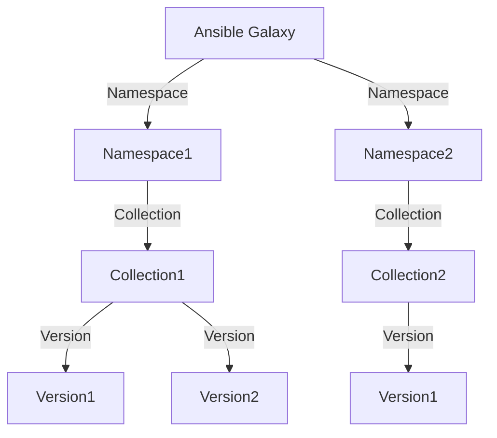

## Introduction to Ansible Content Management

Ansible is a powerful automation platform used extensively in DevOps environments for managing infrastructure and application deployment. At the core of Ansible are its content management systems, which include modules, plugins, and collections. These components are essential for extending the functionality of Ansible to meet specific operational needs. In this chapter, we will delve deep into the documentation changes related to Ansible content management, focusing on how these changes affect the way we manage and utilize Ansible collections.

### What Are Modules, Plugins, and Collections?

Modules and plugins are pieces of code that extend the capabilities of Ansible. They provide additional functionalities such as managing cloud resources, interacting with databases, or automating complex workflows. Collections, on the other hand, are groups of modules and plugins that are bundled together to serve a particular purpose. These collections are stored in a centralized location called Ansible Galaxy, which acts as a repository for all Ansible collections.

#### Why Centralize Collections?

Centralizing collections in Ansible Galaxy provides several benefits:

1. **Ease of Access**: Users can easily find and download the necessary collections without having to search through multiple sources.
2. **Version Control**: Ansible Galaxy maintains different versions of collections, allowing users to choose the most suitable version for their needs.
3. **Community Contributions**: The community can contribute to the development and maintenance of collections, ensuring a wide variety of functionalities.
4. **Security and Reliability**: Centralized management ensures that collections are regularly updated and tested for security vulnerabilities.

### Ansible Galaxy: The Hub of Collections

Ansible Galaxy is the primary hub where Ansible collections are stored and managed. It serves as a repository for all Ansible collections, similar to how npm acts as a repository for JavaScript packages or Docker Hub for container images.

#### Structure of Ansible Galaxy

Ansible Galaxy is organized into namespaces and collections. Each namespace can contain multiple collections, and each collection can have multiple versions. This hierarchical structure allows for easy organization and retrieval of collections.



### Downloading and Managing Collections

To utilize Ansible collections, users need to download them from Ansible Galaxy. This process is facilitated by the Ansible Galaxy command-line tool, which provides a straightforward interface for fetching and managing collections.

#### Using the Ansible Galaxy Command-Line Tool

The Ansible Galaxy command-line tool allows users to interact with Ansible Galaxy to perform various operations such as downloading, installing, and updating collections.

```sh
# Install a specific collection
ansible-galaxy collection install <namespace>.<collection>

# List installed collections
ansible-galaxy collection list

# Update an existing collection
ansible-galaxy collection update <namespace>.<collection>
```

### Real-World Example: AWS Resource Actions Collection

Let's consider a real-world example using the AWS Resource Actions collection. This collection provides modules and plugins for managing AWS resources such as EC2 instances, S3 buckets, and RDS databases.

#### Downloading the AWS Resource Actions Collection

To download the AWS Resource Actions collection, we can use the following command:

```sh
ansible-galaxy collection install aws.resource_actions
```

This command will fetch the latest version of the `aws.resource_actions` collection from Ansible Galaxy and install it locally.

#### Full HTTP Request and Response

When the Ansible Galaxy command-line tool fetches a collection, it sends an HTTP request to Ansible Galaxy. Here is an example of the HTTP request and response:

```http
GET /api/v2/collections/aws/resource_actions/versions/latest/ HTTP/1.1
Host: galaxy.ansible.org
User-Agent: ansible-galaxy/2.10
Accept: application/json
Authorization: Bearer <your_api_token>

HTTP/1.1 200 OK
Content-Type: application/json
Date: Mon, 01 Jan 2024 00:00:00 GMT
Content-Length: 1234

{
    "id": "aws.resource_actions",
    "version": "1.2.3",
    "download_url": "https://galaxy.ansible.org/api/v2/collections/aws/resource_actions/versions/1.2.3/download/",
    "dependencies": [
        {
            "name": "aws.core",
            "version": ">=1.0.0"
        }
    ]
}
```

In this example, the Ansible Galaxy command-line tool sends a GET request to fetch the latest version of the `aws.resource_actions` collection. The server responds with the details of the collection, including the download URL and dependencies.

### Use Cases for Installing and Updating Collections

There are several scenarios where installing or updating Ansible collections becomes necessary:

1. **Initial Setup**: When setting up a new Ansible environment, users often need to install specific collections to enable required functionalities.
2. **Feature Updates**: As new features are added to collections, users may want to update their local collections to access these features.
3. **Security Patches**: Collections are periodically updated to address security vulnerabilities. Keeping collections up-to-date is crucial for maintaining a secure environment.

### How to Prevent / Defend Against Vulnerabilities

#### Detection

To detect vulnerabilities in Ansible collections, users should regularly check for updates and monitor security advisories. Tools like Ansible Galaxy can notify users about available updates and security patches.

#### Prevention

1. **Regular Updates**: Always keep collections up-to-date to ensure you have the latest security patches.
2. **Secure Configuration**: Ensure that collections are configured securely. Avoid using default credentials and follow best practices for securing configurations.
3. **Dependency Management**: Carefully manage dependencies to avoid conflicts and ensure compatibility between collections.

#### Secure Coding Fixes

Here is an example of a vulnerable configuration and its secure counterpart:

**Vulnerable Configuration:**

```yaml
collections:
  - name: aws.resource_actions
    version: 1.0.0
    dependencies:
      - name: aws.core
        version: 1.0.0
```

**Secure Configuration:**

```yaml
collections:
  - name: aws.resource_actions
    version: 1.2.3
    dependencies:
      - name: aws.core
        version: >=1.1.0
```

In the secure configuration, we have updated the `aws.resource_actions` collection to the latest version and ensured that the dependency `aws.core` is also up-to-date.

### Conclusion

Managing Ansible collections is a critical aspect of using Ansible effectively. By understanding how to download, install, and update collections from Ansible Galaxy, users can leverage the full power of Ansible to automate their infrastructure and application deployments. Regularly updating collections and following best practices for security can help maintain a robust and secure environment.

### Hands-On Practice

For hands-on practice with Ansible collections, consider the following labs:

- **PortSwigger Web Security Academy**: While primarily focused on web security, this lab can help you understand the importance of keeping your tools and libraries up-to-date.
- **OWASP Juice Shop**: This lab includes exercises that involve managing and updating collections, providing practical experience in a simulated environment.

By completing these labs, you can gain practical experience in managing Ansible collections and applying the concepts learned in this chapter.

---
<!-- nav -->
[[02-Introduction to Ansible Collections|Introduction to Ansible Collections]] | [[DevOps/DevOps Bootcamp/07-Configuration Management (Ansible)/01-Ansible 2.10 Documentation Changes Explained/00-Overview|Overview]] | [[04-Introduction to Ansible Distribution Changes|Introduction to Ansible Distribution Changes]]
