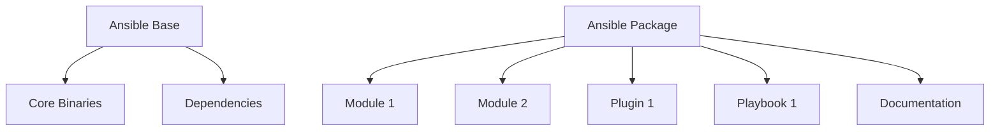

## Introduction to Ansible Distribution Changes

In this section, we will delve into the changes made to the Ansible distribution, focusing on the separation of the distribution into two distinct parts: the Ansible base and the Ansible package. We will explore the motivations behind these changes, the differences between modules and collections, and how these changes impact the development and distribution of Ansible content.

### Motivation Behind Splitting Ansible Distribution

The primary motivation behind splitting the Ansible distribution into two parts is to enhance modularity and ease of maintenance. By separating the core functionality from additional modules and plugins, developers can work independently on individual components without affecting the entire distribution. This modular approach allows for more efficient collaboration and reduces the complexity of managing large codebases.

#### Ansible Base

The Ansible base contains all the essential binaries and files required to execute Ansible itself. This includes the core functionalities and dependencies necessary for the basic operation of Ansible. The Ansible base ensures that the fundamental operations are stable and reliable, providing a solid foundation for additional modules and plugins.

#### Ansible Package

The Ansible package, on the other hand, contains the additional modules and plugins that extend the functionality of Ansible. These modules and plugins can be developed and maintained separately, allowing for greater flexibility and easier integration with other technologies. This separation enables contributors to focus on specific areas of development without impacting the core functionality.

### Differences Between Modules and Collections

Understanding the differences between modules and collections is crucial for effectively utilizing Ansible. While both serve to extend the functionality of Ansible, they differ in their packaging and distribution formats.

#### Modules

Modules are individual pieces of code that perform specific tasks within Ansible. They are typically small, self-contained units that can be easily integrated into larger systems. Modules are designed to be reusable and can be combined with other modules to create complex workflows.

#### Collections

Collections, on the other hand, are a packaging and distribution format for all types of Ansible content. A collection can contain multiple modules, plugins, playbooks, and documentation, bundled together in a single package. This format simplifies the distribution and sharing of Ansible content, making it easier to manage and deploy.

### Collection Index vs. Module Index

The introduction of a collection index instead of a module index is a significant change in Ansible. The collection index provides a centralized location for managing and accessing all the content within a collection. This approach streamlines the process of distributing and sharing Ansible content, reducing the complexity of managing multiple modules and plugins.

### Real-World Examples and Recent Breaches

To understand the practical implications of these changes, let's consider some real-world examples and recent breaches involving similar technologies.

#### Example: CVE-2021-44228 (Log4Shell)

CVE-2021-44228, commonly known as Log4Shell, is a critical vulnerability in the Apache Log4j library. This vulnerability allowed attackers to execute arbitrary code on affected systems, leading to widespread exploitation. The modular nature of Ansible helps mitigate such risks by isolating critical components and ensuring that vulnerabilities in one module do not affect the entire system.

#### Example: SolarWinds Supply Chain Attack

The SolarWinds supply chain attack in 2020 demonstrated the importance of secure distribution and management of software components. By compromising the update mechanism of SolarWinds Orion, attackers were able to inject malicious code into legitimate software updates. The use of collections in Ansible helps ensure that all components are securely packaged and distributed, reducing the risk of such attacks.

### Code Examples and Diagrams

To illustrate the concepts discussed, let's look at some code examples and diagrams.

#### Ansible Base Code Example

```python
# Ansible Base
import ansible_core

def main():
    ansible_core.initialize()
    ansible_core.run()

if __name__ == "__main__":
    main()
```

#### Ansible Package Code Example

```python
# Ansible Package
from ansible_modules import module1, module2

def main():
    module1.execute()
    module2.execute()

if __name__ == "__main__":
    main()
```

#### Mermaid Diagram: Ansible Architecture



### Pitfalls and Common Mistakes

When working with Ansible, it is important to be aware of potential pitfalls and common mistakes that can arise from improper usage.

#### Overloading Modules

One common mistake is overloading modules with too many responsibilities. This can lead to increased complexity and reduced maintainability. To avoid this, it is recommended to keep modules focused on specific tasks and to use collections to manage related modules and plugins.

#### Inconsistent Versioning

Another pitfall is inconsistent versioning of modules and collections. This can lead to compatibility issues and difficulties in managing dependencies. To mitigate this, it is important to follow consistent versioning practices and to document dependencies clearly.

### How to Prevent / Defend

To ensure the security and integrity of Ansible, it is crucial to implement proper detection, prevention, and mitigation strategies.

#### Detection

Detection involves monitoring the system for signs of unauthorized access or malicious activity. This can be achieved through the use of intrusion detection systems (IDS) and regular security audits.

#### Prevention

Prevention involves implementing security best practices and ensuring that all components are securely configured. This includes using strong authentication mechanisms, encrypting sensitive data, and regularly updating software to address known vulnerabilities.

#### Secure Coding Fixes

To demonstrate secure coding practices, let's compare a vulnerable code snippet with a secure version.

##### Vulnerable Code Snippet

```python
# Vulnerable Code
import os

def read_file(filename):
    with open(filename, 'r') as f:
        return f.read()

filename = input("Enter filename: ")
print(read_file(filename))
```

##### Secure Code Snippet

```python
# Secure Code
import os

def read_file(filename):
    if os.path.exists(filename):
        with open(filename, 'r') as f:
            return f.read()
    else:
        return "File does not exist"

filename = input("Enter filename: ")
print(read_file(filename))
```

#### Configuration Hardening

Configuration hardening involves securing the configuration settings of Ansible components. This includes disabling unnecessary services, setting strong passwords, and configuring firewalls to restrict access.

#### Mitigations

Mitigations involve implementing additional security measures to reduce the impact of potential vulnerabilities. This includes using containerization to isolate components, implementing least privilege principles, and regularly testing the system for vulnerabilities.

### Conclusion

In conclusion, the changes made to the Ansible distribution, including the separation into Ansible base and Ansible package, and the introduction of collections, provide significant benefits in terms of modularity, maintainability, and security. By understanding these concepts and implementing proper security practices, developers can effectively utilize Ansible to build robust and secure systems.

### Practice Labs

For hands-on practice with Ansible, consider the following labs:

- **PortSwigger Web Security Academy**: Focuses on web application security and can help you understand the security implications of Ansible in web environments.
- **OWASP Juice Shop**: Provides a vulnerable web application for practicing security testing and can help you apply Ansible in a real-world context.
- **DVWA (Damn Vulnerable Web Application)**: Another excellent resource for practicing web application security and understanding the security aspects of Ansible.

By engaging with these labs, you can gain practical experience and deepen your understanding of Ansible and its applications.

---
<!-- nav -->
[[03-Introduction to Ansible Content Management|Introduction to Ansible Content Management]] | [[DevOps/DevOps Bootcamp/07-Configuration Management (Ansible)/01-Ansible 2.10 Documentation Changes Explained/00-Overview|Overview]] | [[05-Introduction to Ansible and Its Evolution|Introduction to Ansible and Its Evolution]]
