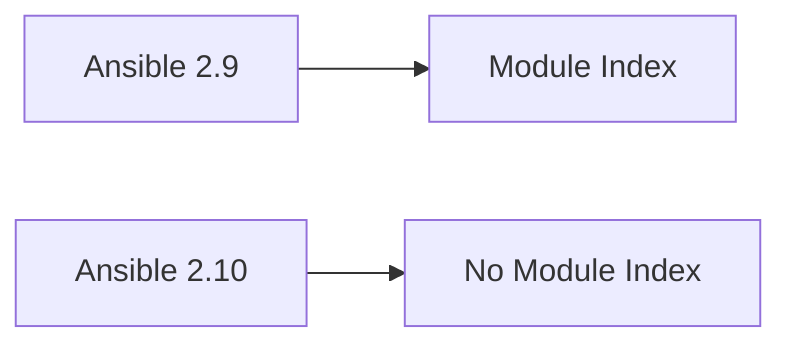
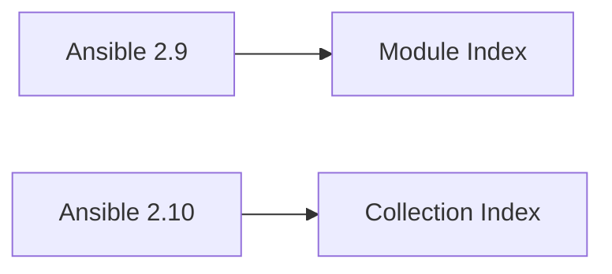

## Introduction to Ansible and Its Evolution

Ansible is an open-source automation framework designed to streamline various tasks in the DevOps ecosystem. Over the years, Ansible has evolved significantly, adapting to the growing complexity and diversity of DevOps environments. This evolution is particularly evident in the transition from Ansible 2.9 to Ansible 2.10, where significant changes were made to the way modules are organized and distributed.

### Background Theory

Before diving into the specifics of Ansible 2.10, it's essential to understand the fundamental concepts behind Ansible and its role in the DevOps landscape.

#### What is Ansible?

Ansible is a powerful automation tool that allows users to manage infrastructure, deploy applications, and automate repetitive tasks. It supports a wide range of platforms and technologies, making it a versatile choice for DevOps teams.

#### Why is Ansible Important?

Ansible plays a crucial role in modern DevOps practices by enabling:

- **Infrastructure as Code (IaC):** Ansible allows teams to define infrastructure configurations in code, making it easier to manage and version control.
- **Continuous Integration and Continuous Deployment (CI/CD):** Ansible can be integrated into CI/CD pipelines to automate deployment processes.
- **Task Automation:** Ansible simplifies the execution of complex tasks, reducing manual intervention and minimizing human error.

### Historical Context

To fully appreciate the changes introduced in Ansible 2.10, it's helpful to look at the historical context of Ansible's development.

#### Early Versions of Ansible

In its early versions, Ansible was designed as a monolithic application. This means that all modules and plugins were bundled together within a single distribution package. This approach had several advantages:

- **Ease of Installation:** Users could easily install Ansible and have access to all available modules out-of-the-box.
- **Unified Management:** All modules were managed centrally, making it simpler to maintain and update the system.

However, as Ansible grew in popularity and functionality, several challenges emerged:

- **Size and Complexity:** As more modules were added, the size of the Ansible distribution increased significantly. This made installation and updates more cumbersome.
- **Maintenance Overhead:** Managing thousands of modules within a single distribution became increasingly difficult, leading to potential issues with stability and performance.

### Transition to Ansible 2.10

Given these challenges, the Ansible development team decided to modularize the framework, separating the core Ansible code from the modules. This decision led to the release of Ansible 2.10, which introduced several key changes.

#### Removal of Module Index

One of the most noticeable changes in Ansible 2.10 is the removal of the module index. In previous versions, the module index provided a comprehensive list of all available modules. However, in Ansible 2.10, this index is no longer present.



#### Introduction of Collection Index

Instead of a module index, Ansible 2.10 introduces a collection index. This new structure organizes modules into collections, making it easier to manage and discover specific sets of modules.



### Detailed Explanation of Changes

Let's delve deeper into the changes introduced in Ansible 2.10 and understand why these modifications were necessary.

#### Modularization of Core Code

The primary goal of Ansible 2.10 was to modularize the core codebase. This involved separating the core Ansible functionality from the modules, allowing for more efficient management and scalability.

##### Benefits of Modularization

- **Improved Performance:** By separating the core code from the modules, Ansible can run more efficiently, reducing the overhead associated with managing a large number of modules.
- **Easier Maintenance:** Modules can now be updated independently of the core code, making it easier to maintain and improve the system.
- **Flexibility:** Users can choose to install only the modules they need, rather than having to install a large, monolithic distribution.

##### Challenges of Modularization

- **Complexity:** The modular approach adds some complexity to the installation process, as users may need to manually install additional modules.
- **Dependency Management:** Ensuring that all dependencies are correctly installed and configured can be challenging.

#### Collection Index

The introduction of the collection index in Ansible 2.10 is a significant change that aims to simplify the discovery and management of modules.

##### What is a Collection Index?

A collection index groups related modules into collections. This makes it easier to find and install specific sets of modules that serve particular purposes.

##### Example of Collection Index

Consider a scenario where a user wants to install modules related to cloud infrastructure management. In Ansible 2.10, the collection index might look like this:

```yaml
collections:
  - name: cloud_infrastructure
    description: "Modules for managing cloud infrastructure"
    modules:
      - aws_module
      - azure_module
      - gcp_module
```

This structure allows users to easily identify and install the modules they need.

### Real-World Examples and Recent Breaches

To illustrate the importance of these changes, let's consider some real-world examples and recent breaches involving similar frameworks.

#### Example: Ansible and Module Management

Ansible, another popular automation framework, faced similar challenges as Ansible. In earlier versions, Ansible modules were bundled together, leading to issues with maintenance and scalability. In response, Ansible introduced a modular architecture, similar to Ansible 2.10, to address these challenges.

#### Recent Breach: CVE-2021-44228 (Log4Shell)

While not directly related to Ansible, the Log4Shell vulnerability (CVE-2021-44228) highlights the importance of maintaining and updating modules. This vulnerability affected many systems due to outdated or unpatched modules. The modular architecture of Ansible 2.10 helps mitigate such risks by allowing independent updates of modules.

### Pitfalls and Common Mistakes

Despite the benefits of the modular architecture, there are several pitfalls and common mistakes that users should be aware of.

#### Incorrect Module Installation

One common mistake is installing modules incorrectly. This can lead to issues with dependencies and functionality.

##### Example of Incorrect Module Installation

```bash
# Incorrect installation
ansible module install aws_module
```

##### Correct Installation

```bash
# Correct installation
ansible collection install cloud_infrastructure
```

#### Dependency Issues

Another common issue is failing to properly manage dependencies. This can result in modules not functioning as expected.

##### Example of Dependency Issue

```yaml
# Incorrect dependency management
dependencies:
  - name: aws_module
    version: 1.0.0
```

##### Correct Dependency Management

```yaml
# Correct dependency management
dependencies:
  - name: cloud_infrastructure
    version: 1.0.0
```

### How to Prevent / Defend

To ensure the security and reliability of Ansible 2.10, it's crucial to follow best practices for module management and dependency handling.

#### Secure Module Installation

When installing modules, ensure that they come from trusted sources and are up-to-date.

##### Vulnerable Pattern

```bash
# Vulnerable pattern
ansible module install <untrusted_source>
```

##### Secure Pattern

```bash
# Secure pattern
ansible collection install <trusted_source>
```

#### Dependency Hardening

Properly manage dependencies to avoid conflicts and ensure that all required modules are installed.

##### Vulnerable Pattern

```yaml
# Vulnerable pattern
dependencies:
  - name: aws_module
    version: 1.0.0
```

##### Secure Pattern

```yaml
# Secure pattern
dependencies:
  - name: cloud_infrastructure
    version: 1.0.0
```

### Detection and Prevention

To detect and prevent issues with module management, it's essential to regularly audit and update your Ansible environment.

#### Regular Audits

Perform regular audits to ensure that all modules are up-to-date and functioning correctly.

##### Example Audit Script

```bash
#!/bin/bash

# Check for outdated modules
ansible module list | grep -v "latest"

# Update all modules
ansible module update --all
```

#### Automated Updates

Set up automated updates to ensure that modules are always up-to-date.

##### Example Configuration

```yaml
automation:
  updates:
    enabled: true
    frequency: daily
```

### Hands-On Practice Labs

To gain practical experience with Ansible 2.10, consider participating in the following hands-on labs:

- **PortSwigger Web Security Academy:** While primarily focused on web security, this lab provides valuable experience with automation tools like Ansible.
- **OWASP Juice Shop:** This lab offers a comprehensive environment for practicing DevOps skills, including module management with Ansible.
- **DVWA (Damn Vulnerable Web Application):** Another excellent resource for practicing DevOps skills, including the use of Ansible for automation.

By following these guidelines and participating in hands-on practice labs, you can effectively manage and utilize Ansible 2.10 in your DevOps environment.

---
<!-- nav -->
[[04-Introduction to Ansible Distribution Changes|Introduction to Ansible Distribution Changes]] | [[DevOps/DevOps Bootcamp/07-Configuration Management (Ansible)/01-Ansible 2.10 Documentation Changes Explained/00-Overview|Overview]] | [[06-Understanding Collections and Standard Structures in DevOps|Understanding Collections and Standard Structures in DevOps]]
