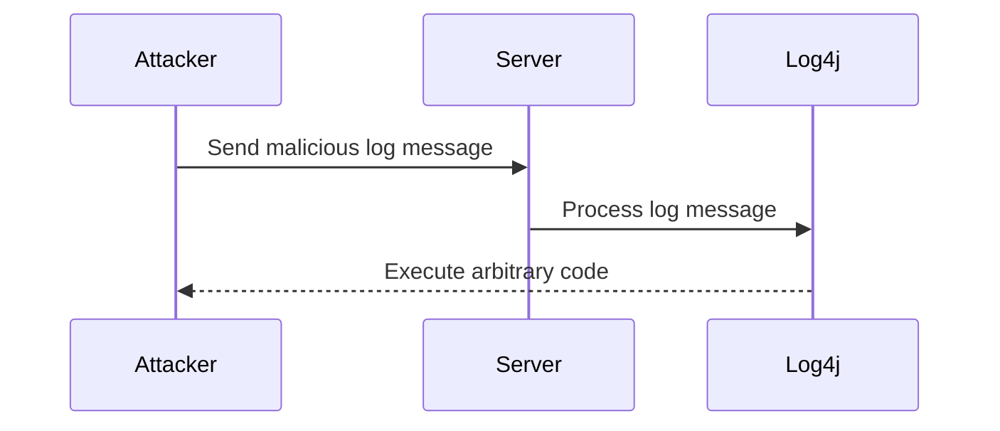

## Understanding Collections and Standard Structures in DevOps

### Introduction to Collections

In the realm of DevOps, working with collections is an essential skill. Collections are data structures that group multiple elements together. These elements can be of the same type or different types, depending on the specific collection type. Common examples of collections include arrays, lists, sets, and maps (or dictionaries).

#### Why Collections Matter

Collections are crucial because they allow us to manage and manipulate large amounts of data efficiently. They provide a structured way to store and retrieve information, which is particularly important in DevOps where automation and orchestration are key components. By using collections, we can easily perform operations such as filtering, sorting, and transforming data, which are fundamental tasks in many DevOps workflows.

### Standard Structures in Collections

A standard structure in collections refers to a consistent and predictable format for organizing data. This standardization is vital because it ensures that developers and operators can understand and interact with the data in a uniform manner. When everyone follows the same structure, it becomes easier to navigate through the collection and find the required information.

#### Example: JSON Structure

One common example of a standard structure is JSON (JavaScript Object Notation). JSON is widely used in DevOps for configuration files, API responses, and data exchange between services. Here’s an example of a JSON structure:

```json
{
  "name": "John Doe",
  "age": 30,
  "email": "john.doe@example.com",
  "address": {
    "street": "123 Main St",
    "city": "Anytown",
    "state": "CA"
  },
  "phoneNumbers": [
    { "type": "home", "number": "555-1234" },
    { "type": "mobile", "number": "555-5678" }
  ]
}
```

This JSON structure is organized in a standard way, making it easy to navigate and extract specific information. For instance, if you want to get the email address, you can simply access `data.email`.

### Navigating Collections

Navigating through collections involves accessing and manipulating the elements within them. This is typically done using various methods provided by the programming language or framework being used.

#### Example: Accessing Elements in Python

Let’s consider a simple example in Python where we have a list of dictionaries representing users:

```python
users = [
    {"name": "Alice", "age": 25, "email": "alice@example.com"},
    {"name": "Bob", "age": 30, "email": "bob@example.com"}
]

# Accessing the first user's name
first_user_name = users[0]["name"]
print(first_user_name)  # Output: Alice
```

In this example, we access the first user's name by indexing into the list (`users[0]`) and then accessing the `name` key in the dictionary.

### Adjusting and Changing Content

Adjusting and changing content in collections is another critical operation. This might involve updating existing elements, adding new elements, or removing elements.

#### Example: Updating and Adding Elements in Python

Continuing with our previous example, let’s update the age of the first user and add a new user:

```python
# Update the age of the first user
users[0]["age"] = 26

# Add a new user
new_user = {"name": "Charlie", "age": 35, "email": "charlie@example.com"}
users.append(new_user)

print(users)
```

The updated list of users would now look like this:

```python
[
    {"name": "Alice", "age": 26, "email": "alice@example.com"},
    {"name": "Bob", "age": 30, "email": "bob@example.com"},
    {"name": "Charlie", "age": 35, "email": "charlie@example.com"}
]
```

### Real-World Examples and Security Implications

#### Recent CVEs and Breaches

Understanding collections and their standard structures is not just about efficiency; it also has significant security implications. For instance, improper handling of collections can lead to vulnerabilities such as injection attacks, data leaks, and unauthorized access.

##### Example: CVE-2021-44228 (Log4Shell)

The Log4Shell vulnerability (CVE-2021-44228) is a prime example of how improper handling of collections can lead to severe security issues. In this case, the vulnerability was in the logging framework Log4j, which allowed attackers to inject malicious code into log messages. This could be exploited to execute arbitrary code on the server.



#### How to Prevent / Defend

To prevent such vulnerabilities, it is crucial to follow best practices in handling collections and ensure that all input is properly validated and sanitized. Here are some steps to take:

1. **Input Validation**: Always validate and sanitize input data before processing it. Ensure that the data conforms to expected formats and ranges.
   
2. **Use Secure Libraries**: Use libraries and frameworks that have been audited for security vulnerabilities. Keep them up to date with the latest security patches.

3. **Secure Configuration Management**: Manage configurations securely. Avoid hardcoding sensitive information in configuration files and use environment variables or secure vaults instead.

4. **Logging Best Practices**: Implement secure logging practices. Avoid logging sensitive information and ensure that logs are stored securely.

### Complete Example: Handling Collections in Terraform

Terraform is a popular infrastructure-as-code tool that uses collections extensively. Let’s look at an example of managing resources in Terraform using collections.

#### Vulnerable Code

Consider a Terraform configuration that creates multiple AWS EC2 instances based on a list of configurations:

```hcl
variable "instances" {
  type = list(object({
    name        = string
    instance_id = string
    ami         = string
    instance_type = string
  }))
}

resource "aws_instance" "example" {
  for_each = var.instances

  ami           = each.value.ami
  instance_type = each.value.instance_type
  tags          = {
    Name = each.value.name
  }
}
```

#### Secure Code

To secure this configuration, ensure that all input variables are validated and sanitized. Additionally, use secure practices for managing sensitive information.

```hcl
variable "instances" {
  type = list(object({
    name        = string
    instance_id = string
    ami         = string
    instance_type = string
  }))
}

locals {
  validated_instances = [
    for i in var.instances : {
      name        = i.name
      instance_id = i.instance_id
      ami         = i.ami
      instance_type = i.instance_type
    } if i.name != "" && i.instance_id != "" && i.ami != "" && i.instance_type != ""
  ]
}

resource "aws_instance" "example" {
  for_each = local.validated_instances

  ami           = each.value.ami
  instance_type = each.value.instance_type
  tags          = {
    Name = each.value.name
  }
}
```

### Conclusion

Working with collections and adhering to standard structures is a fundamental aspect of DevOps. It enhances efficiency, maintainability, and security. By understanding how to navigate, adjust, and change content in collections, and by following best practices for security, you can ensure that your DevOps workflows are robust and secure.

### Practice Labs

For hands-on practice with collections and standard structures in DevOps, consider the following labs:

- **PortSwigger Web Security Academy**: Focuses on web application security but includes exercises that involve handling collections in various contexts.
- **OWASP Juice Shop**: A deliberately insecure web application that includes challenges involving collections and data manipulation.
- **CloudGoat**: Provides scenarios for learning cloud security, including handling collections in cloud configurations.

These labs will help you apply the concepts learned in this chapter and gain practical experience in navigating and securing collections in DevOps environments.

---
<!-- nav -->
[[05-Introduction to Ansible and Its Evolution|Introduction to Ansible and Its Evolution]] | [[DevOps/DevOps Bootcamp/07-Configuration Management (Ansible)/01-Ansible 2.10 Documentation Changes Explained/00-Overview|Overview]] | [[DevOps/DevOps Bootcamp/07-Configuration Management (Ansible)/01-Ansible 2.10 Documentation Changes Explained/07-Practice Questions & Answers|Practice Questions & Answers]]
