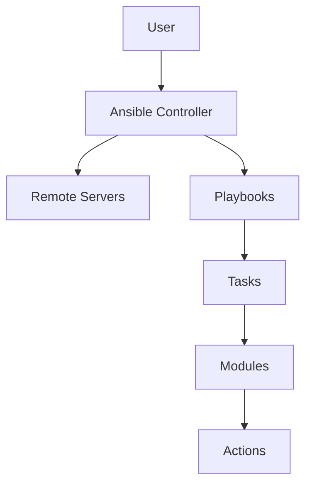

## Introduction to Ansible Automation and Configuration Management

Ansible is an open-source automation platform used extensively in the DevOps community for managing infrastructure and automating tasks across multiple systems. It allows you to define complex workflows using simple YAML-based playbooks, making it easier to manage configurations, deploy applications, and perform routine administrative tasks. In this chapter, we will delve deep into the concepts of Ansible automation and configuration management, covering everything from basic modules to advanced topics like dynamic inventory and integration with Terraform.

### What is Ansible?

Ansible is a powerful automation tool that simplifies the process of managing and deploying applications across multiple servers. It uses a declarative language called YAML to define tasks and workflows, which can be executed on remote servers via SSH. The core components of Ansible include:

- **Playbooks**: YAML files that contain a series of tasks to be executed.
- **Modules**: Pre-built functions that perform specific actions, such as installing packages, managing files, or configuring services.
- **Inventory**: A list of hosts and groups that Ansible manages.
- **Variables**: Dynamic data that can be used within playbooks to customize behavior.

### Why Use Ansible?

Ansible offers several advantages over traditional scripting methods:

- **Idempotency**: Tasks can be run multiple times without causing unintended side effects.
- **Declarative Language**: YAML is easy to read and write, making it accessible to both developers and operations teams.
- **Modular Design**: Modules encapsulate specific functionalities, making it easier to reuse and maintain code.
- **Extensibility**: Ansible supports custom modules and plugins, allowing you to extend its capabilities.

### How Does Ansible Work?

At a high level, Ansible works by connecting to remote servers via SSH and executing tasks defined in playbooks. Here’s a simplified overview of the workflow:



1. **User**: Initiates the execution of a playbook.
2. **Ansible Controller**: Connects to remote servers and executes tasks.
3. **Remote Servers**: The target machines where tasks are executed.
4. **Playbooks**: YAML files containing a series of tasks.
5. **Tasks**: Individual steps defined in playbooks.
6. **Modules**: Functions that perform specific actions.
7. **Actions**: The actual operations performed on the remote servers.

### Common Ansible Modules

Ansible provides a wide range of modules to handle various tasks. Some of the most commonly used modules include:

- **`apt`:** Manages packages on Debian/Ubuntu systems.
- **`yum`:** Manages packages on Red Hat/CentOS systems.
- **`file`:** Manages files and directories.
- **`copy`:** Copies files from the controller to remote servers.
- **`template`:** Renders templates and copies them to remote servers.
- **`service`:** Manages services (start, stop, restart).

#### Example: Installing Packages

Let’s look at an example of using the `apt` module to install packages on a Debian/Ubuntu system:

```yaml
---
- name: Install Apache2
  hosts: web_servers
  become: yes
  tasks:
    - name: Ensure Apache2 is installed
      apt:
        name: apache2
        state: present
```

In this playbook:

- **`hosts: web_servers`**: Specifies the group of hosts to apply the tasks to.
- **`become: yes`**: Enables privilege escalation to run tasks as root.
- **`tasks:`**: Defines the tasks to be executed.
- **`apt:`**: Uses the `apt` module to install the `apache2` package.

### Mapping Shell Scripts to Ansible Playbooks

One of the key benefits of Ansible is its ability to translate shell scripts into playbooks. This makes it easier to manage and maintain complex workflows. Let’s consider an example of a shell script and its equivalent Ansible playbook.

#### Shell Script Example

```bash
#!/bin/bash
sudo apt update
sudo apt install -y apache2
sudo systemctl start apache2
sudo systemctl enable apache2
```

#### Equivalent Ansible Playbook

```yaml
---
- name: Install and configure Apache2
  hosts: web_servers
  become: yes
  tasks:
    - name: Update package lists
      apt:
        update_cache: yes

    - name: Install Apache2
      apt:
        name: apache2
        state: present

    - name: Start Apache2 service
      service:
        name: apache2
        state: started

    - name: Enable Apache2 service
      service:
        name: apache2
        state: enabled
```

### Configuring Servers with Different Linux Distributions

Ansible can be used to configure servers running different Linux distributions. This is particularly useful when working with cloud providers like AWS and DigitalOcean, which offer a variety of Linux distributions.

#### Example: Configuring Ubuntu and CentOS Servers

```yaml
---
- name: Configure Ubuntu and CentOS servers
  hosts: all
  become: yes
  tasks:
    - name: Update package lists
      block:
        - name: Update package lists on Ubuntu
          apt:
            update_cache: yes
          when: ansible_os_family == 'Debian'

        - name: Update package lists on CentOS
          yum:
            update_cache: yes
          when: ansible_os_family == 'RedHat'

    - name: Install Apache2 on Ubuntu
      apt:
        name: apache2
        state: present
      when: ansible_os_family == 'Debian'

    - name: Install httpd on CentOS
      yum:
        name: httpd
        state: present
      when: ansible_os_family == 'RedHat'
```

### Ansible Collections and Ansible Galaxy

Ansible collections are a way to organize and distribute reusable content, such as roles, modules, and plugins. Ansible Galaxy is a repository where you can find and download collections.

#### Example: Using a Collection

To use a collection, you first need to install it using the `ansible-galaxy` command:

```bash
ansible-galaxy collection install community.general
```

Once installed, you can use the modules and roles provided by the collection in your playbooks:

```yaml
---
- name: Use a collection
  hosts: all
  become: yes
  tasks:
    - name: Install a package using a collection module
      community.general.package:
        name: apache2
        state: present
```

### Ansible Variables

Variables allow you to customize playbooks and make them more flexible. Ansible supports various ways to set variable values, including:

- **`vars:`**: Define variables directly in the playbook.
- **`vars_files:`**: Load variables from external files.
- **`group_vars/` and `host_vars/`**: Store variables specific to groups or hosts.

#### Example: Using Variables

```yaml
---
- name: Use variables in a playbook
  hosts: all
  vars:
    package_name: apache2
  tasks:
    - name: Install a package
      apt:
        name: "{{ package_name }}"
        state: present
```

### Troubleshooting and Conditionals

Troubleshooting is an essential part of using Ansible effectively. Ansible provides several tools and techniques to help diagnose issues, including:

- **`debug:`**: Print variable values to the console.
- **`when:`**: Execute tasks conditionally based on certain criteria.

#### Example: Debugging and Conditionals

```yaml
---
- name: Debug and conditional execution
  hosts: all
  tasks:
    - name: Check if a package is installed
      apt:
        name: apache2
        state: present
      register: result

    - name: Print the result
      debug:
        var: result
      when: result.changed
```

### Dynamic Inventory

Dynamic inventory is a powerful feature that allows Ansible to automatically discover and manage hosts in a dynamic environment. This is particularly useful when working with cloud providers like AWS, where the number of instances can change frequently.

#### Example: Dynamic Inventory with AWS

To use dynamic inventory with AWS, you can use the `amazon.aws.ec2` plugin:

```yaml
---
plugin: amazon.aws.ec2
regions:
  - us-east-1
  - us-west-2
keyed_groups:
  - key: tags.Name
    prefix: tag_Name
```

This inventory plugin will automatically discover EC2 instances in the specified regions and create groups based on tags.

### Executing Ansible Playbooks from Terraform

Terraform is a popular infrastructure-as-code tool that can be used to provision and manage infrastructure. Integrating Ansible with Terraform allows you to automate both infrastructure provisioning and configuration management.

#### Example: Terraform Integration

To integrate Ansible with Terraform, you can use the `local-exec` provisioner:

```hcl
resource "aws_instance" "example" {
  ami           = "ami-0c55b159cbfafe1f0"
  instance_type = "t2.micro"

  provisioner "local-exec" {
    command = "ansible-playbook -i inventory.ini playbook.yml"
  }
}
```

This Terraform configuration will provision an EC2 instance and then execute an Ansible playbook to configure the instance.

### Real-World Examples and CVEs

Ansible automation and configuration management have been used in many real-world scenarios, including:

- **CVE-2021-44228 (Log4Shell)**: Many organizations used Ansible to quickly patch vulnerable systems and ensure compliance.
- **AWS Outage (May 2021)**: Ansible was used to rapidly reconfigure and redeploy applications across multiple regions.

### How to Prevent / Defend

While Ansible provides powerful automation capabilities, it is important to follow best practices to ensure security and reliability:

- **Use Secure Connections**: Always use SSH keys and encrypted connections.
- **Limit Privilege Escalation**: Use `become` sparingly and only when necessary.
- **Validate Inputs**: Use conditionals and validation to ensure inputs are correct.
- **Regularly Update Modules**: Keep Ansible and its modules up-to-date to avoid vulnerabilities.

#### Vulnerable vs. Secure Code

Here’s an example of a vulnerable playbook and its secure counterpart:

**Vulnerable Playbook**

```yaml
---
- name: Install package
  hosts: all
  tasks:
    - name: Install package
      apt:
        name: "{{ package_name }}"
        state: present
```

**Secure Playbook**

```yaml
---
- name: Install package securely
  hosts: all
  vars:
    package_name: apache2
  tasks:
    - name: Validate package name
      assert:
        that:
          - package_name is defined
          - package_name is string
      when: package_name is defined

    - name: Install package
      apt:
        name: "{{ package_name }}"
        state: present
      when: package_name is defined
```

### Conclusion

Ansible is a powerful tool for automating and managing infrastructure. By leveraging its modules, variables, and dynamic inventory features, you can streamline your DevOps processes and ensure consistency across your environments. Whether you are configuring servers, deploying applications, or integrating with other tools like Terraform, Ansible provides a robust framework for achieving your goals.

### Practice Labs

For hands-on practice with Ansible automation and configuration management, consider the following labs:

- **PortSwigger Web Security Academy**: Offers exercises on securing web applications.
- **OWASP Juice Shop**: A deliberately insecure web application for practicing security skills.
- **DVWA (Damn Vulnerable Web Application)**: Another intentionally vulnerable web application for learning security.
- **WebGoat**: An interactive training application for learning web security.

These labs provide a practical way to apply the concepts learned in this chapter and gain hands-on experience with Ansible automation and configuration management.

---
<!-- nav -->
[[01-Detailed Explanation of Ansible Concepts|Detailed Explanation of Ansible Concepts]] | [[DevOps/DevOps Bootcamp/07-Configuration Management (Ansible)/02-Ansible Automation And Configuration Management/00-Overview|Overview]] | [[03-Introduction to Ansible|Introduction to Ansible]]
