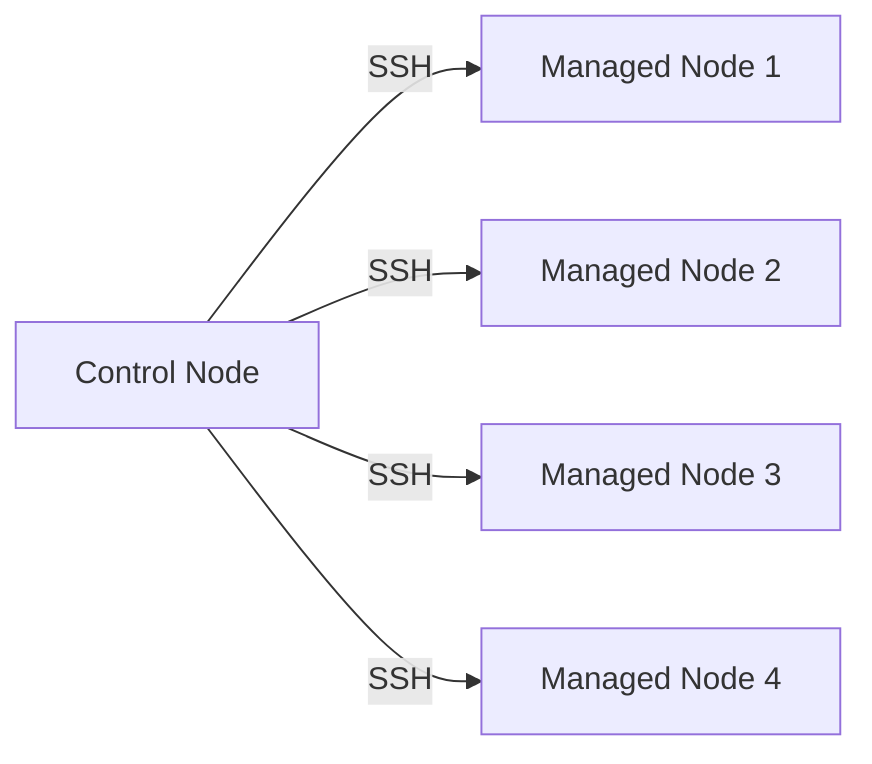

## Introduction to Ansible Automation in IT Infrastructure Management

In the realm of IT infrastructure management, the traditional manual approach involves SSHing into each server individually to perform necessary configurations, upgrades, or deployments. This method is time-consuming, error-prone, and difficult to scale as the number of servers increases. To address these challenges, automation tools like Ansible have emerged, providing a more efficient and reliable way to manage IT infrastructure.

### Manual Approach: Limitations and Challenges

The manual approach typically involves the following steps:

1. **SSH into the First Server**: Connect to the first server using SSH.
2. **Perform Configuration**: Execute the necessary commands to configure the server.
3. **Repeat for Each Server**: SSH into the next server and repeat the configuration process.
4. **Document Steps**: Write down the steps taken in a document or wiki page (e.g., Confluence) to ensure consistency and reproducibility.

This approach has several limitations:

- **Time-Consuming**: Manually performing the same steps on multiple servers is labor-intensive and time-consuming.
- **Error-Prone**: Human errors can occur during manual execution, leading to inconsistent configurations across servers.
- **Difficult to Scale**: As the number of servers grows, the manual approach becomes increasingly impractical and unmanageable.
- **Documentation Overhead**: Maintaining detailed documentation for each configuration step adds overhead and can become outdated quickly.

### Real-World Example: Manual Configuration Errors

A notable example of the risks associated with manual configuration is the Heartbleed bug (CVE-2014-0160). This vulnerability in OpenSSL allowed attackers to read sensitive information from memory, including private keys and passwords. In many cases, the vulnerability was exploited due to manual misconfigurations or outdated software versions. Automating the process of updating and maintaining software could have helped mitigate such issues.

### Ansible: A Solution for Efficient IT Infrastructure Management

Ansible is an open-source automation tool that simplifies the management of IT infrastructure. It allows you to automate tasks such as configuration management, application deployment, and orchestration across multiple servers. Ansible operates using a simple yet powerful model based on YAML files, making it accessible and easy to learn.

#### Key Features of Ansible

1. **Remote Execution**: Ansible allows you to execute tasks on remote servers from your local machine.
2. **YAML-Based Playbooks**: Tasks are defined in YAML playbooks, which are human-readable and easy to maintain.
3. **Reusability**: Playbooks can be reused for multiple tasks and across different environments.
4. **Idempotency**: Ansible ensures that tasks are idempotent, meaning they can be run multiple times without causing unintended changes.

### How Ansible Works

Ansible uses a client-server architecture where the client (control node) communicates with the servers (managed nodes) over SSH. The control node runs the Ansible playbook, which contains a series of tasks to be executed on the managed nodes.

#### Architecture Diagram



### Setting Up Ansible

To get started with Ansible, you need to install it on your control node and configure the managed nodes. Here’s a step-by-step guide:

1. **Install Ansible**:
   ```bash
   sudo apt-get update
   sudo apt-get install ansible
   ```

2. **Configure Managed Nodes**:
   Ensure that the managed nodes are reachable via SSH and have Python installed.

3. **Create Inventory File**:
   Define the managed nodes in an inventory file (`hosts`).

   ```yaml
   [webservers]
   web1.example.com
   web2.example.com

   [databases]
   db1.example.com
   ```

4. **Write a Playbook**:
   Create a YAML playbook (`playbook.yml`) to define the tasks.

   ```yaml
   ---
   - name: Configure webservers
     hosts: webservers
     tasks:
       - name: Install Apache
         apt:
           name: apache2
           state: present

       - name: Start Apache service
         service:
           name: apache2
           state: started
           enabled: yes
   ```

5. **Run the Playbook**:
   Execute the playbook using the `ansible-playbook` command.

   ```bash
   ansible-playbook -i hosts playbook.yml
   ```

### Detailed Example: Configuring Multiple Servers

Let’s walk through a detailed example of configuring multiple servers using Ansible.

#### Scenario: Deploying a Web Application

Suppose you need to deploy a web application on multiple servers. The steps involve installing the web server, copying the application files, and starting the service.

1. **Inventory File** (`hosts`):

   ```yaml
   [web_servers]
   server1.example.com
   server2.example.com
   ```

2. **Playbook** (`deploy_webapp.yml`):

   ```yaml
   ---
   - name: Deploy web application
     hosts: web_servers
     tasks:
       - name: Install Apache
         apt:
           name: apache2
           state: present

       - name: Copy application files
         copy:
           src: /path/to/app/
           dest: /var/www/html/

       - name: Start Apache service
         service:
           name: apache2
           state: started
           enabled: yes
   ```

3. **Running the Playbook**:

   ```bash
   ansible-playbook -i hosts deploy_webapp.yml
   ```

### HTTP Requests and Responses

When interacting with servers, Ansible often makes HTTP requests to check the status of services or retrieve configuration details. Here’s an example of an HTTP request and response:

#### HTTP Request

```http
GET /status HTTP/1.1
Host: server1.example.com
User-Agent: Ansible/2.10.0
Accept: */*
```

#### HTTP Response

```http
HTTP/1.1 200 OK
Date: Mon, 20 Mar 2023 12:00:00 GMT
Server: Apache/2.4.41 (Ubuntu)
Content-Type: text/plain
Content-Length: 14

Service is running.
```

### Common Pitfalls and Best Practices

#### Common Pitfalls

1. **Manual Configuration Errors**: Ensuring that all servers are consistently configured can be challenging.
2. **Documentation Overhead**: Maintaining detailed documentation for each configuration step can become outdated quickly.
3. **Security Risks**: Manual processes increase the risk of security vulnerabilities due to human error.

#### Best Practices

1. **Use Version Control**: Store Ansible playbooks in a version control system (e.g., Git) to track changes and collaborate effectively.
2. **Automate Testing**: Implement automated testing to verify that playbooks work as expected.
3. **Secure SSH Keys**: Use secure SSH key management practices to protect access to managed nodes.

### How to Prevent / Defend

#### Detection

- **Logging and Monitoring**: Enable logging and monitoring to detect any unauthorized changes or anomalies.
- **Audit Trails**: Maintain audit trails to track changes made by Ansible playbooks.

#### Prevention

- **Role-Based Access Control (RBAC)**: Implement RBAC to restrict access to Ansible playbooks and managed nodes.
- **Secure SSH Keys**: Use secure SSH key management practices to protect access to managed nodes.

#### Secure Coding Fixes

Here’s an example of a vulnerable and secure version of an Ansible playbook:

##### Vulnerable Playbook

```yaml
---
- name: Install Apache
  hosts: webservers
  tasks:
    - name: Install Apache
      apt:
        name: apache2
        state: present
```

##### Secure Playbook

```yaml
---
- name: Install Apache securely
  hosts: webservers
  tasks:
    - name: Install Apache
      apt:
        name: apache2
        state: present
      notify: Restart Apache

  handlers:
    - name: Restart Apache
      service:
        name: apache2
        state: restarted
```

### Hands-On Labs

For practical experience with Ansible, consider the following labs:

- **PortSwigger Web Security Academy**: Offers hands-on labs for web application security.
- **OWASP Juice Shop**: Provides a vulnerable web application for practicing security skills.
- **DVWA (Damn Vulnerable Web Application)**: A deliberately insecure web application for security training.

These labs provide a comprehensive learning experience and help you master Ansible automation in IT infrastructure management.

### Conclusion

Ansible provides a powerful and efficient solution for managing IT infrastructure. By automating tasks and reducing manual intervention, Ansible helps improve consistency, reduce errors, and enhance security. With the right practices and tools, you can effectively manage complex IT environments and ensure robust security.

---
<!-- nav -->
[[DevOps/DevOps Bootcamp/07-Configuration Management (Ansible)/03-Ansible Automation in IT Infrastructure Management/00-Overview|Overview]] | [[02-What is Ansible|What is Ansible]]
