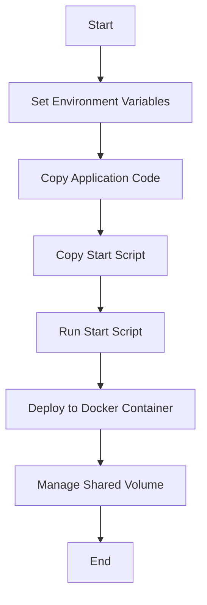

## Environmental Variables and Start Scripts in Application Deployment

When deploying applications, especially in complex environments like cloud infrastructure or containerized systems, setting up the environment correctly is crucial. This includes defining and setting environmental variables and copying in start scripts that should be executed before the application starts. These steps prepare the environment for the application startup, ensuring that all dependencies and configurations are in place.

### Environmental Variables

Environmental variables are dynamic-named values that can affect the way running processes will behave on a computer. They are used to store information about the runtime environment of a process, such as the path to libraries, database connection strings, or API keys. Setting these variables correctly ensures that the application has access to the necessary resources and configurations.

#### Example of Setting Environmental Variables

```bash
export DB_HOST=localhost
export DB_PORT=5432
export DB_NAME=mydatabase
```

These variables can be used within the application to dynamically configure database connections or other services.

### Start Scripts

Start scripts are typically shell scripts that are executed before the main application starts. These scripts can perform various tasks such as setting up directories, configuring permissions, or initializing services. A typical start script might look like this:

```bash
#!/bin/bash

# Create necessary directories
mkdir -p /app/logs

# Set permissions
chmod 755 /app/logs

# Initialize services
service myservice start
```

### Dockerfile and Container Preparation

Traditionally, Dockerfiles have been used to build Docker images, which encapsulate the application and its environment. A Dockerfile might look like this:

```Dockerfile
FROM python:3.9-slim

# Set environment variables
ENV DB_HOST=localhost
ENV DB_PORT=5432
ENV DB_NAME=mydatabase

# Copy application code
COPY . /app

# Copy start script
COPY start.sh /app/start.sh

# Set working directory
WORKDIR /app

# Run start script
CMD ["sh", "/app/start.sh"]
```

This Dockerfile sets the environment variables, copies the application code and start script, and specifies the command to run the start script.

### Ansible Playbooks for Environment Management

Ansible is a powerful automation tool that can be used to manage and deploy applications across various environments. Unlike Dockerfiles, which are limited to building Docker images, Ansible playbooks can manage Docker containers, Vagrant containers, cloud instances, and even bare-metal servers. This flexibility makes Ansible a versatile tool for managing complex infrastructures.

#### Example Ansible Playbook

An Ansible playbook can be used to set up the environment and deploy the application. Here’s an example playbook:

```yaml
---
- name: Deploy application
  hosts: all
  become: yes
  vars:
    db_host: localhost
    db_port: 5432
    db_name: mydatabase

  tasks:
    - name: Ensure application directory exists
      file:
        path: /app
        state: directory

    - name: Set environment variables
      lineinfile:
        path: /etc/environment
        line: "{{ item }}"
      with_items:
        - "DB_HOST={{ db_host }}"
        - "DB_PORT={{ db_port }}"
        - "DB_NAME={{ db_name }}"

    - name: Copy application code
      copy:
        src: /path/to/application
        dest: /app

    - name: Copy start script
      copy:
        src: /path/to/start.sh
        dest: /app/start.sh
        mode: '0755'

    - name: Run start script
      command: sh /app/start.sh
```

This playbook sets up the application directory, defines environment variables, copies the application code and start script, and runs the start script.

### Managing Containers and Hosts

One of the key advantages of using Ansible is the ability to manage both the container and the host where the container is running. This is particularly useful when the container has dependencies on the host, such as storage or network configurations.

#### Example of Managing Dependencies

Consider a scenario where the container needs to access a shared volume on the host. An Ansible playbook can ensure that the shared volume is created and mounted correctly.

```yaml
---
- name: Manage shared volume
  hosts: all
  become: yes

  tasks:
    - name: Ensure shared volume exists
      file:
        path: /shared_volume
        state: directory

    - name: Mount shared volume in Docker container
      docker_container:
        name: myapp
        image: myapp_image
        volumes:
          - /shared_volume:/app/shared_volume
```

This playbook ensures that the shared volume is created and mounted in the Docker container.

### Mermaid Diagrams

To visualize the deployment process, we can use a mermaid diagram. Here’s an example of a deployment flow:



### Real-World Examples and Security Implications

In recent years, there have been several high-profile breaches related to misconfigured environments and insecure deployment practices. For example, the Capital One breach in 2019 was partly due to misconfigured AWS S3 buckets, which allowed unauthorized access to sensitive data.

#### Secure Configuration Practices

To prevent such issues, it is essential to follow secure configuration practices. This includes:

- **Using environment variables securely**: Avoid hardcoding sensitive information in your environment variables. Use tools like `ansible-vault` to encrypt sensitive data.
  
  ```yaml
  ---
  - name: Encrypt sensitive data
    hosts: all
    become: yes

    tasks:
      - name: Encrypt environment variables
        ansible.builtin.vault:
          src: /path/to/environment_variables.txt
          dest: /path/to/encrypted_environment_variables.txt
  ```

- **Limiting permissions**: Ensure that the application and start scripts have the minimum necessary permissions. Use `chown` and `chmod` commands to set appropriate ownership and permissions.

  ```bash
  chown appuser:appgroup /app
  chmod 755 /app
  ```

- **Monitoring and logging**: Implement monitoring and logging to detect any unauthorized access or suspicious activities. Use tools like `Prometheus` and `Grafana` for monitoring and `ELK Stack` for logging.

  ```yaml
  ---
  - name: Configure monitoring and logging
    hosts: all
    become: yes

    tasks:
      - name: Install Prometheus
        apt:
          name: prometheus
          state: present

      - name: Install Grafana
        apt:
          name: grafana
          state: present

      - name: Install ELK Stack
        apt:
          name: elasticsearch
          state: present
        apt:
          name: logstash
          state: present
        apt:
          name: kibana
          state: present
  ```

### How to Prevent / Defend

#### Detection

- **Use intrusion detection systems (IDS)**: Tools like `Snort` and `Suricata` can help detect and alert on potential intrusions.

  ```yaml
  ---
  - name: Install Snort
    hosts: all
    become: yes

    tasks:
      - name: Install Snort
        apt:
          name: snort
          state: present
  ```

- **Regular audits**: Perform regular security audits and penetration testing to identify and mitigate vulnerabilities.

  ```yaml
  ---
  - name: Perform security audit
    hosts: all
    become: yes

    tasks:
      - name: Run Nessus scan
        command: nessuscli scan --name "Security Audit"
  ```

#### Prevention

- **Use secure coding practices**: Follow secure coding guidelines to prevent common vulnerabilities like SQL injection and cross-site scripting (XSS).

  ```python
  # Vulnerable code
  cursor.execute("SELECT * FROM users WHERE username = '" + username + "'")

  # Secure code
  cursor.execute("SELECT * FROM users WHERE username = %s", (username,))
  ```

- **Implement least privilege principle**: Ensure that the application and start scripts have the minimum necessary permissions.

  ```bash
  chown appuser:appgroup /app
  chmod 755 /app
  ```

- **Use encryption**: Encrypt sensitive data at rest and in transit using tools like `ansible-vault` and `TLS`.

  ```yaml
  ---
  - name: Encrypt sensitive data
    hosts: all
    become: yes

    tasks:
      - name: Encrypt environment variables
        ansible.builtin.vault:
          src: /path/to/environment_variables.txt
          dest: /path/to/encrypted_environment_variables.txt
  ```

### Conclusion

Ansible provides a powerful and flexible framework for managing and deploying applications across various environments. By leveraging Ansible playbooks, you can automate the setup of environment variables, start scripts, and other configurations, ensuring that your application is deployed securely and efficiently. Additionally, by following secure configuration practices and implementing robust detection and prevention mechanisms, you can significantly reduce the risk of security breaches and ensure the integrity of your infrastructure.

### Practice Labs

For hands-on practice with Ansible and Docker, consider the following labs:

- **PortSwigger Web Security Academy**: Offers a variety of labs focused on web application security, including some that involve Docker and Ansible.
- **OWASP Juice Shop**: A deliberately insecure web application that can be used to practice various security techniques, including deployment and configuration management.
- **DVWA (Damn Vulnerable Web Application)**: Another intentionally vulnerable web application that can be used to practice secure deployment and configuration management.
- **CloudGoat**: A cloud security training platform that includes labs focused on AWS security, including deployment and configuration management using Ansible.

By completing these labs, you can gain practical experience in using Ansible to manage and deploy applications securely.

---
<!-- nav -->
[[02-What is Ansible|What is Ansible]] | [[DevOps/DevOps Bootcamp/07-Configuration Management (Ansible)/03-Ansible Automation in IT Infrastructure Management/00-Overview|Overview]] | [[DevOps/DevOps Bootcamp/07-Configuration Management (Ansible)/03-Ansible Automation in IT Infrastructure Management/04-Hands-On Practice|Hands-On Practice]]
