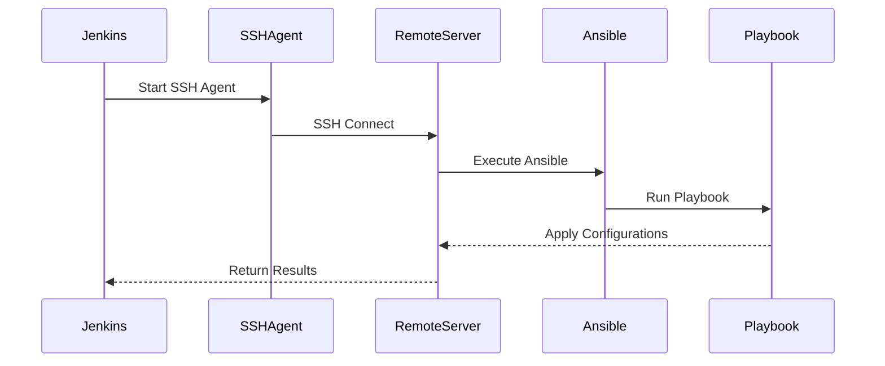

## Introduction to Ansible Configuration Management

Ansible is a configuration management tool similar to Ansible, designed to automate IT infrastructure tasks such as deployment, configuration, and orchestration. In this chapter, we will delve into integrating Ansible with Jenkins pipelines to execute playbooks remotely. We'll cover the necessary background, setup steps, potential pitfalls, and security considerations.

### Background Theory

Configuration management tools like Ansible help maintain consistency across environments by automating repetitive tasks. They typically work by defining desired states through playbooks, which are then applied to managed nodes. Ansible uses SSH to communicate with remote servers, making it essential to understand SSH fundamentals and security practices.

#### SSH Fundamentals

Secure Shell (SSH) is a cryptographic network protocol used for secure data communication, remote command-line login, and other secure network services between two networked computers. It provides strong authentication and secure communications over unsecured channels.

**Key Components:**
- **Client:** Initiates the connection.
- **Server:** Accepts connections from clients.
- **Authentication:** Typically done via passwords, public key cryptography, or other methods.

**Example SSH Command:**
```bash
ssh user@remote_host
```

### Integrating Ansible with Jenkins Pipeline

To integrate Ansible with Jenkins, we need to set up a Jenkins pipeline that triggers Ansible playbook execution on a remote server. This involves several steps:

1. **Setting Up Jenkins Pipeline:**
   - Define the pipeline script.
   - Configure Jenkins to use SSH keys for authentication.
   - Execute Ansible commands remotely.

2. **Executing Ansible Playbooks:**
   - Define the playbook structure.
   - Use dynamic inventory files to fetch server details.
   - Execute the playbook on remote servers.

#### Setting Up Jenkins Pipeline

First, let's set up a Jenkins pipeline to execute Ansible commands. We'll use a Jenkinsfile to define the pipeline.

**Jenkinsfile Example:**
```groovy
pipeline {
    agent any
    stages {
        stage('Execute Ansible Playbook') {
            steps {
                sshagent(credentials: ['my-ssh-key']) {
                    sh '''
                        ssh user@ansible_server "ansible-playbook /path/to/playbook.yml"
                    '''
                }
            }
        }
    }
}
```

In this example, `sshagent` is used to manage SSH keys securely. The `sh` step executes an SSH command to run the Ansible playbook on the remote server.

#### Executing Ansible Playbooks

Next, we need to define the Ansible playbook and ensure it can be executed on remote servers. The playbook should be structured to handle dynamic inventory fetching and apply configurations.

**Ansible Playbook Example:**
```yaml
---
- name: Apply configurations
  hosts: all
  gather_facts: yes
  tasks:
    - name: Ensure package is installed
      apt:
        name: my-package
        state: present
    - name: Copy configuration file
      copy:
        src: /path/to/local/file
        dest: /etc/my-config.conf
```

This playbook ensures a package is installed and copies a configuration file to the target server.

#### Dynamic Inventory Files

Dynamic inventory files allow Ansible to fetch server details from external sources, such as AWS EC2 instances. This is crucial for managing infrastructure in cloud environments.

**AWS EC2 Inventory File Example:**
```python
#!/usr/bin/env python

import boto3

def get_instances():
    ec2 = boto3.resource('ec2')
    instances = ec2.instances.filter(
        Filters=[{'Name': 'instance-state-name', 'Values': ['running']}])
    return [i.public_dns_name for i in instances]

if __name__ == "__main__":
    print(get_instances())
```

This Python script fetches running EC2 instances and returns their public DNS names.

### Console Output Analysis

After executing the Jenkins pipeline, we can analyze the console output to verify the playbook execution.

**Console Output Example:**
```plaintext
[Pipeline] sshagent
[Pipeline] {
[Pipeline] withCredentials
Masking supported pattern matches of credentials
[Pipeline] {
[Pipeline] sh
+ ssh user@ansible_server 'ansible-playbook /path/to/playbook.yml'
PLAY [Apply configurations] ******************************************************************************************************

TASK [Gathering Facts] ***********************************************************************************************************
ok: [server1]
ok: [server2]

TASK [Ensure package is installed] ************************************************************************************************
changed: [server1]
changed: [server2]

TASK [Copy configuration file] ***************************************************************************************************
changed: [server1]
changed: [server2]

PLAY RECAP *************************************************************************************************************************
server1: ok=3  changed=2  unreachable=0  failed=0  skipped=0  rescued=0  ignored=0
server2: ok=3  changed=2  unreachable=0  failed=0  skipped=0  rescued=0  ignored=0
[Pipeline] }
[Pipeline] // withCredentials
[Pipeline] }
[Pipeline] // sshagent
[Pipeline] End of Pipeline
Finished: SUCCESS
```

The console output shows the playbook execution results, including changes made on the remote servers.

### Mermaid Diagrams

Let's visualize the workflow using a mermaid diagram.



### Potential Pitfalls and How to Prevent Them

#### SSH Key Management

**Pitfall:** Using insecure SSH keys or storing them in plain text.

**Prevention:**
- Use strong SSH keys with passphrase protection.
- Store SSH keys securely using Jenkins credentials management.

**Secure SSH Key Example:**
```groovy
sshagent(credentials: ['my-ssh-key']) {
    sh 'ssh user@ansible_server "ansible-playbook /path/to/playbook.yml"'
}
```

#### Dynamic Inventory Security

**Pitfall:** Exposing sensitive information in dynamic inventory scripts.

**Prevention:**
- Use IAM roles and policies to restrict access to AWS resources.
- Encrypt sensitive data in inventory scripts.

**IAM Role Example:**
```json
{
    "Version": "2012-10-17",
    "Statement": [
        {
            "Effect": "Allow",
            "Action": [
                "ec2:DescribeInstances"
            ],
            "Resource": "*"
        }
    ]
}
```

#### Secure Code Fix

**Vulnerable Code:**
```groovy
sh 'ssh user@ansible_server "ansible-playbook /path/to/playbook.yml"'
```

**Fixed Code:**
```groovy
sshagent(credentials: ['my-ssh-key']) {
    sh 'ssh user@ansible_server "ansible-playbook /path/to/playbook.yml"'
}
```

### Real-World Examples and Breaches

#### Recent CVEs and Breaches

**CVE-2021-44228 (Log4Shell):**
- Impact: Exploited to gain unauthorized access to systems.
- Prevention: Keep dependencies updated and use secure coding practices.

**Example:**
```bash
ssh user@ansible_server 'ansible-playbook /path/to/playbook.yml'
```

### Hands-On Labs

For practical experience, consider the following labs:

- **PortSwigger Web Security Academy:** Focuses on web application security.
- **OWASP Juice Shop:** Interactive web application with vulnerabilities.
- **DVWA (Damn Vulnerable Web Application):** Web application with various security issues.
- **WebGoat:** Interactive training application for learning about web application security.

### Conclusion

Integrating Ansible with Jenkins pipelines allows for automated configuration management across remote servers. By following best practices and securing SSH keys, dynamic inventories, and code, you can ensure robust and secure automation.

---
<!-- nav -->
[[DevOps/DevOps Bootcamp/07-Configuration Management (Ansible)/04-Ansible Configuration via Jenkins Pipeline/00-Overview|Overview]] | [[02-Introduction to Ansible Configuration via Jenkins Pipeline|Introduction to Ansible Configuration via Jenkins Pipeline]]
