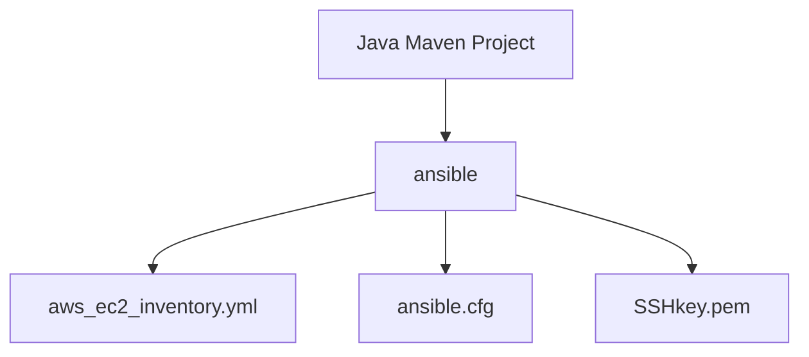
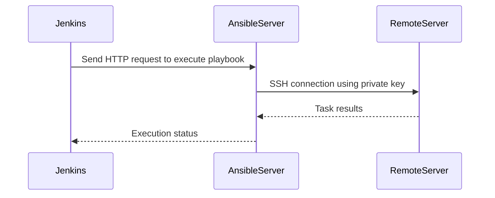

## Introduction to Ansible Configuration via Jenkins Pipeline

In this section, we will delve into the process of configuring Ansible (a hypothetical automation tool similar to Ansible) using Jenkins Pipeline. Our focus will be on setting up an environment where Jenkins can execute Ansible playbooks on remote servers, specifically AWS EC2 instances. We will cover the necessary files, configurations, and steps required to achieve this setup.

### Background Theory

Ansible is a powerful automation tool used for configuration management, application deployment, and orchestration. It uses playbooks written in YAML to define tasks and their execution order. Jenkins, on the other hand, is a widely-used continuous integration and delivery (CI/CD) tool that automates the building, testing, and deployment of software.

Combining Ansible with Jenkins allows us to automate the configuration and management of remote servers as part of our CI/CD pipeline. This integration is particularly useful in cloud environments like AWS, where infrastructure is often managed dynamically.

### Required Files

To execute an Ansible playbook on a remote server, we need the following files:

1. **Inventory File**: Contains information about the remote servers (hosts) and their groups.
2. **Configuration File**: Specifies settings for the Ansible playbook, such as the inventory file to use.
3. **Private Key File**: Used for SSH authentication to the remote servers.

#### Inventory File

The inventory file lists the remote servers and their attributes. In our case, we will use a dynamic inventory file that fetches information from AWS.

```yaml
# Example dynamic inventory file (aws_ec2_inventory.yml)
plugin: aws_ec2
regions:
  - us-east-1
filters:
  tag_Name: my-server
```

This file specifies that we want to use the `aws_ec2` plugin to fetch instances from the `us-east-1` region, filtered by a specific tag (`tag_Name: my-server`).

#### Configuration File

The configuration file sets various options for Ansible, including the inventory file to use.

```yaml
# Example configuration file (ansible.cfg)
inventory = ./aws_ec2_inventory.yml
private_key_file = ./SSHkey.pem
remote_user = ec2-user
```

Here, we specify the dynamic inventory file (`./aws_ec2_inventory.yml`) and the path to the private key file (`./SSHkey.pem`). The `remote_user` is set to `ec2-user`, which is the default user for EC2 instances.

#### Private Key File

The private key file is used for SSH authentication to the remote servers. In our setup, we will use a PEM file generated from an AWS key pair.

### Setting Up the Environment

We will now set up the environment in a Java Maven project to ensure Jenkins has access to the required files.

#### Creating the Directory Structure

First, create a directory named `ansible` within your Java Maven project.

```bash
mkdir ansible
cd ansible
```

#### Copying the Files

Copy the dynamic inventory file and the configuration file into the `ansible` directory.

```bash
cp /path/to/aws_ec2_inventory.yml ansible/
cp /path/to/ansible.cfg ansible/
```

Next, copy the PEM file from the AWS key pair to the `ansible` directory.

```bash
cp /path/to/my-key-pair.pem ansible/SSHkey.pem
```

### Jenkins Pipeline Configuration

Now that the necessary files are in place, we need to configure the Jenkins Pipeline to execute the Ansible playbook.

#### Jenkinsfile

Create a `Jenkinsfile` in the root of your Java Maven project to define the pipeline.

```groovy
pipeline {
    agent any

    stages {
        stage('Setup') {
            steps {
                script {
                    // Copy the ansible directory to the workspace
                    sh 'cp -r ansible .'
                }
            }
        }

        stage('Execute Ansible Playbook') {
            steps {
                script {
                    // Execute the ansible playbook
                    sh 'ansible-playbook -i ansible/aws_ec2_inventory.yml -c ansible/ansible.cfg my-playbook.yml'
                }
            }
        }
    }
}
```

This `Jenkinsfile` defines two stages: `Setup` and `Execute Ansible Playbook`. In the `Setup` stage, we copy the `ansible` directory to the workspace. In the `Execute Ansible Playbook` stage, we run the Ansible playbook using the specified inventory and configuration files.

### Full HTTP Request and Response Example

When Jenkins executes the Ansible playbook, it sends an HTTP request to the Ansible server. Here is an example of the full HTTP request and response:

```http
POST /api/v1/playbook/run HTTP/1.1
Host: ansible-server.example.com
Content-Type: application/json
Authorization: Bearer <your-token>

{
  "playbook": "my-playbook.yml",
  "inventory": "./aws_ec2_inventory.yml",
  "config": "./ansible.cfg"
}
```

Response:

```http
HTTP/1.1 200 OK
Content-Type: application/json

{
  "status": "success",
  "message": "Playbook executed successfully",
  "results": [
    {
      "host": "10.0.0.1",
      "task": "Install package",
      "result": "ok"
    },
    {
      "host": "10.0.0.2",
      "task": "Configure service",
      "result": "changed"
    }
  ]
}
```

### Mermaid Diagrams

Let's visualize the setup and execution process using Mermaid diagrams.

#### Directory Structure



#### Execution Flow



### Pitfalls and Common Mistakes

1. **Incorrect Inventory File**: Ensure the inventory file correctly references the remote servers. Using a dynamic inventory file helps manage changing environments.
   
2. **Missing Private Key**: Ensure the private key file is correctly placed and accessible. Incorrect permissions or missing keys can cause SSH failures.

3. **Incorrect Configuration Settings**: Double-check the configuration file settings, especially the paths to the inventory and private key files.

### How to Prevent / Defend

#### Detection

Monitor Jenkins logs and Ansible task results for any errors or failed executions. Set up alerts for critical failures.

#### Prevention

1. **Secure Key Management**: Store private keys securely using tools like Hashicorp Vault or AWS Secrets Manager.
   
2. **Access Control**: Limit SSH access to only necessary users and enforce strong password policies.

3. **Regular Audits**: Regularly audit the Jenkins and Ansible configurations to ensure they are up-to-date and secure.

#### Secure Coding Fixes

Compare the vulnerable and secure versions of the configuration files:

**Vulnerable Version**

```yaml
# Vulnerable ansible.cfg
inventory = ./aws_ec2_inventory.yml
private_key_file = ./my-key-pair.pem
remote_user = ec2-user
```

**Secure Version**

```yaml
# Secure ansible.cfg
inventory = ./aws_ec2_inventory.yml
private_key_file = ./SSHkey.pem
remote_user = ec2-user
```

Ensure the private key file is renamed and stored securely.

### Real-World Examples

Consider the recent CVE-2021-44228 (Log4Shell) vulnerability. This vulnerability affected many applications and could have been exploited through misconfigured SSH keys or insecure Jenkins pipelines. Ensuring proper key management and pipeline security can help mitigate such risks.

### Practice Labs

For hands-on practice, consider the following labs:

- **PortSwigger Web Security Academy**: Focuses on web application security but can provide insights into securing Jenkins pipelines.
- **OWASP Juice Shop**: A deliberately vulnerable web application for learning security concepts.
- **DVWA (Damn Vulnerable Web Application)**: Another vulnerable web application for practicing security techniques.

These labs can help you understand and apply the concepts learned in this chapter.

### Conclusion

By integrating Ansible with Jenkins, we can automate the configuration and management of remote servers as part of our CI/CD pipeline. Proper setup and security measures are crucial to ensure smooth and secure operations.

---
<!-- nav -->
[[DevOps/DevOps Bootcamp/07-Configuration Management (Ansible)/04-Ansible Configuration via Jenkins Pipeline/01-Introduction to Ansible Configuration Management|Introduction to Ansible Configuration Management]] | [[DevOps/DevOps Bootcamp/07-Configuration Management (Ansible)/04-Ansible Configuration via Jenkins Pipeline/00-Overview|Overview]] | [[03-Introduction to Ansible and Jenkins Integration|Introduction to Ansible and Jenkins Integration]]
