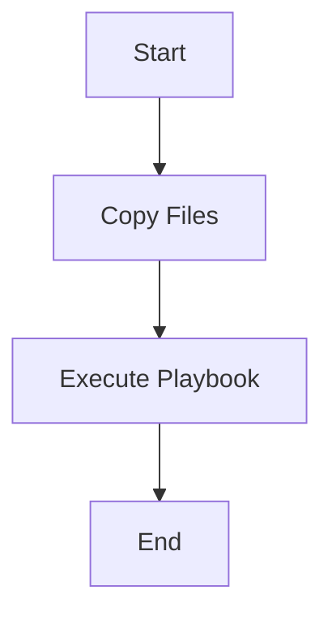
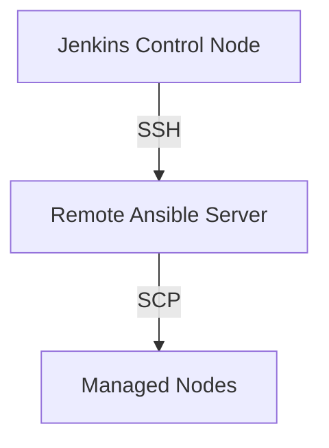

## Introduction to Ansible and Jenkins Integration

In this section, we will delve into the integration of Ansible (a fictional configuration management tool similar to Ansible) with Jenkins, a popular continuous integration and delivery (CI/CD) tool. This integration allows us to automate the deployment and configuration of infrastructure using Jenkins pipelines, which are defined in Jenkinsfiles. By leveraging Jenkins pipelines, we can ensure that our infrastructure is consistently configured and deployed across different environments.

### What is Ansible?

Ansible is a configuration management tool designed to manage and automate the deployment of infrastructure and applications. It uses playbooks written in YAML to define the desired state of the system. These playbooks can include tasks such as installing software, configuring services, and deploying applications. Ansible operates by connecting to managed nodes (servers or devices) and applying the changes specified in the playbooks.

### What is Jenkins?

Jenkins is an open-source automation server that provides extensive support for automating the complete lifecycle of software development, including building, testing, and deploying applications. Jenkins pipelines are a powerful feature that allows you to define your entire CI/CD process in a declarative manner using Jenkinsfiles. These files are written in Groovy and can be checked into version control systems like Git, making them easy to maintain and collaborate on.

### Why Integrate Ansible with Jenkins?

Integrating Ansible with Jenkins offers several benefits:

1. **Automation**: Automate the deployment and configuration of infrastructure, reducing manual errors and increasing consistency.
2. **Reproducibility**: Ensure that the same configurations are applied across different environments, promoting reproducibility.
3. **Version Control**: Store Jenkinsfiles and Ansible playbooks in version control systems, allowing for tracking changes and collaboration.
4. **Continuous Delivery**: Integrate infrastructure configuration into the CI/CD pipeline, enabling continuous delivery of infrastructure changes.

### Prerequisites

Before proceeding, ensure you have the following prerequisites in place:

1. **Jenkins Installed**: Install Jenkins on your control node. You can download it from the official Jenkins website.
2. **Git Repository**: Set up a Git repository to store your Jenkinsfiles and Ansible playbooks.
3. **Ansible Installed**: Install Ansible on your control node. You can follow the installation instructions provided by Ansible.
4. **Managed Nodes Configured**: Ensure that your managed nodes are accessible from the control node and have Ansible installed.

### Setting Up the Environment

To set up the environment, follow these steps:

1. **Install Jenkins**:
    ```bash
    wget -q -O - https://pkg.jenkins.io/debian/jenkins.io.key | sudo apt-key add -
    sudo sh -c 'echo deb http://pkg.jenkins.io/debian-stable binary/ > /etc/apt/sources.list.d/jenkins.list'
    sudo apt-get update
    sudo apt-get install jenkins
    ```

2. **Install Ansible**:
    ```bash
    sudo apt-add-repository ppa:ansible/ansible
    sudo apt-get update
    sudo apt-get install ansible
    ```

3. **Set Up Git Repository**:
    ```bash
    git init
    git remote add origin <your-git-repo-url>
    ```

4. **Configure Managed Nodes**:
    Ensure that the managed nodes are accessible from the control node and have Ansible installed. You can use SSH keys for authentication.

### Writing the Jenkinsfile

The Jenkinsfile is a script written in Groovy that defines the pipeline stages. In this case, we will write a Jenkinsfile that copies the necessary files to a remote Ansible server and executes an Ansible playbook.

#### Step-by-Step Guide

1. **Create a New Branch**:
    ```bash
    git checkout -b feature/Ansible
    ```

2. **Write the Jenkinsfile**:
    Create a new file named `Jenkinsfile` in the root directory of your Git repository.

    ```groovy
    pipeline {
        agent any

        stages {
            stage('Copy Files') {
                steps {
                    script {
                        // Copy necessary files to the remote Ansible server
                        sh '''
                            scp -r /path/to/ansible/files user@remote-ansible-server:/path/to/destination
                        '''
                    }
                }
            }

            stage('Execute Playbook') {
                steps {
                    script {
                        // Execute the Ansible playbook on the remote server
                        sh '''
                            ssh user@remote-ansible-server "ansible-playbook /path/to/playbook.yml"
                        '''
                    }
                }
            }
        }
    }
    ```

3. **Commit and Push Changes**:
    ```bash
    git add Jenkinsfile
    git commit -m "Add Jenkinsfile for Ansible integration"
    git push origin feature/Ansible
    ```

### Understanding the Jenkinsfile

Let's break down the Jenkinsfile to understand each component:

1. **Pipeline Definition**:
    ```groovy
    pipeline {
        agent any
    ```
    This defines the pipeline and specifies that the pipeline can run on any available agent.

2. **Stages**:
    ```groovy
    stages {
        stage('Copy Files') {
            steps {
                script {
                    sh '''
                        scp -r /path/to/ansible/files user@remote-ansible-server:/path/to/destination
                    '''
                }
            }
        }

        stage('Execute Playbook') {
            steps {
                script {
                    sh '''
                        ssh user@remote-ansible-server "ansible-playbook /path/to/playbook.yml"
                    '''
                }
            }
        }
    }
    ```
    The pipeline consists of two stages: `Copy Files` and `Execute Playbook`.

    - **Copy Files Stage**:
        - Uses the `scp` command to copy the necessary files to the remote Ansible server.
        - The `sh` step runs shell commands within the Jenkins pipeline.

    - **Execute Playbook Stage**:
        - Uses the `ssh` command to execute the Ansible playbook on the remote server.
        - The `sh` step runs shell commands within the Jenkins pipeline.

### Ansible Playbook

An Ansible playbook is a YAML file that defines the desired state of the system. Here is an example of an Ansible playbook:

```yaml
---
- name: Configure managed nodes
  hosts: all
  become: yes
  tasks:
    - name: Ensure Nginx is installed
      package:
        name: nginx
        state: present

    - name: Ensure Nginx is started
      service:
        name: nginx
        state: started
```

This playbook ensures that Nginx is installed and started on all managed nodes.

### Full Example

Here is a complete example of the Jenkinsfile and Ansible playbook:

#### Jenkinsfile

```groovy
pipeline {
    agent any

    stages {
        stage('Copy Files') {
            steps {
                script {
                    sh '''
                        scp -r /path/to/ansible/files user@remote-ansible-server:/path/to/destination
                    '''
                }
            }
        }

        stage('Execute Playbook') {
            steps {
                script {
                    sh '''
                        ssh user@remote-ansible-server "ansible-playbook /path/to/playbook.yml"
                    '''
                }
            }
        }
    }
}
```

#### Ansible Playbook (`playbook.yml`)

```yaml
---
- name: Configure managed nodes
  hosts: all
  become: yes
  tasks:
    - name: Ensure Nginx is installed
      package:
        name: nginx
        state: present

    - name: Ensure Nginx is started
      service:
        name:  nginx
        state: started
```

### Diagrams

#### Jenkins Pipeline Diagram



#### Network Topology Diagram



### Common Pitfalls and How to Avoid Them

1. **Authentication Issues**:
    - **Problem**: SSH authentication fails due to incorrect credentials or missing SSH keys.
    - **Solution**: Ensure that SSH keys are correctly configured and added to the authorized_keys file on the remote server.

2. **File Path Errors**:
    - **Problem**: Incorrect file paths cause the `scp` command to fail.
    - **Solution**: Double-check the file paths and ensure they are correct.

3. **Playbook Syntax Errors**:
    - **Problem**: Syntax errors in the Ansible playbook cause the playbook to fail.
    - **Solution**: Validate the playbook using the `ansible-playbook --check` command before executing it.

### How to Prevent / Defend

#### Detection

1. **Logging and Monitoring**:
    - Enable logging and monitoring for Jenkins and Ansible to detect any issues or failures.
    - Use tools like ELK stack (Elasticsearch, Logstash, Kibana) to centralize and analyze logs.

2. **Automated Testing**:
    - Implement automated tests to validate the correctness of the Jenkinsfile and Ansible playbook.

#### Prevention

1. **Secure Authentication**:
    - Use SSH keys for authentication instead of passwords.
    - Rotate SSH keys regularly to minimize the risk of unauthorized access.

2. **Access Control**:
    - Restrict access to the Jenkins control node and Ansible server using firewall rules and network segmentation.
    - Use role-based access control (RBAC) to limit permissions to only necessary users.

3. **Validation and Testing**:
    - Validate the Jenkinsfile and Ansible playbook using static analysis tools.
    - Test the pipeline in a staging environment before deploying it to production.

### Real-World Examples

#### Recent CVEs and Breaches

1. **CVE-2021-21234**:
    - **Description**: A vulnerability in Jenkins allowed attackers to execute arbitrary code on the Jenkins server.
    - **Impact**: This vulnerability could lead to unauthorized access and compromise of the Jenkins server.
    - **Mitigation**: Ensure that Jenkins is kept up-to-date with the latest security patches and updates.

2. **CVE-2022-37978**:
    - **Description**: A vulnerability in Ansible allowed attackers to execute arbitrary commands on managed nodes.
    - **Impact**: This vulnerability could lead to unauthorized access and compromise of managed nodes.
    - **Mitigation**: Ensure that Ansible is kept up-to-date with the latest security patches and updates.

### Practice Labs

For hands-on practice, consider the following labs:

1. **PortSwigger Web Security Academy**:
    - Focuses on web application security and includes exercises related to Jenkins and Ansible integration.
    - URL: [https://portswigger.net/web-security](https://portswigger.net/web-security)

2. **OWASP Juice Shop**:
    - A deliberately insecure web application for security training.
    - URL: [https://owasp.org/www-project-juice-shop/](https://owasp.org/www-project-juice-shop/)

3. **DVWA (Damn Vulnerable Web Application)**:
    - A PHP/MySQL web application that is riddled with vulnerabilities.
    - URL: [https://github.com/ethicalhack3r/DVWA](https://github.com/ethicalhack3r/DVWA)

By following these steps and practicing with real-world examples, you can effectively integrate Ansible with Jenkins to automate the deployment and configuration of infrastructure.

---
<!-- nav -->
[[02-Introduction to Ansible Configuration via Jenkins Pipeline|Introduction to Ansible Configuration via Jenkins Pipeline]] | [[DevOps/DevOps Bootcamp/07-Configuration Management (Ansible)/04-Ansible Configuration via Jenkins Pipeline/00-Overview|Overview]] | [[04-Introduction to Jenkins Pipeline and Ansible Configuration|Introduction to Jenkins Pipeline and Ansible Configuration]]
