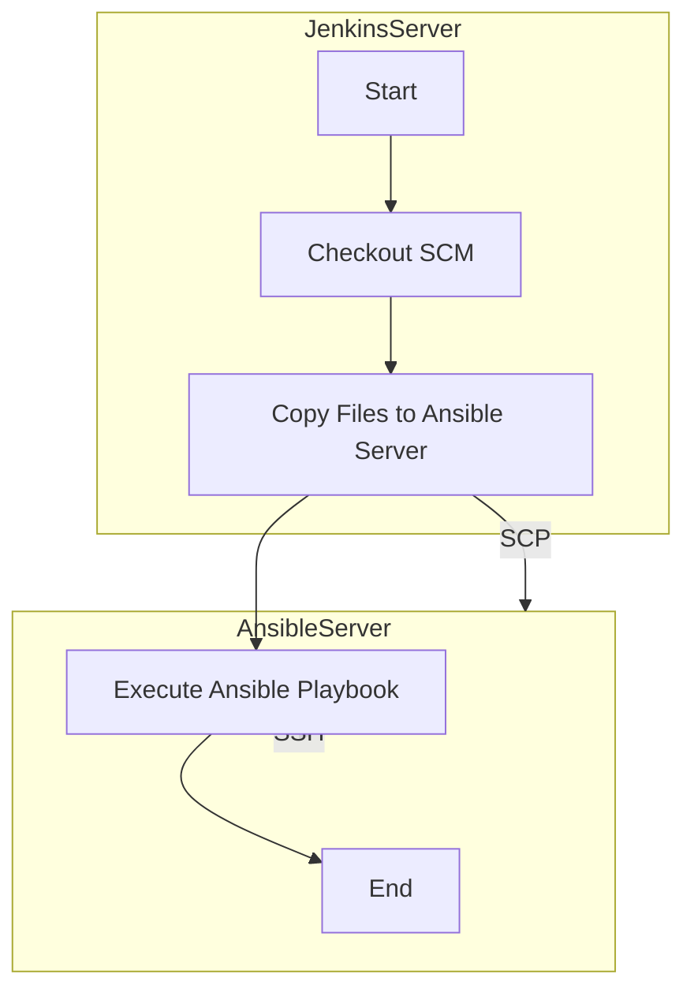

## Introduction to Jenkins Pipeline and Ansible Integration

In the realm of DevOps, automation is key to maintaining efficiency and consistency across development, testing, and deployment processes. One of the most powerful tools for achieving this is the integration between Jenkins, a popular continuous integration and continuous delivery (CI/CD) tool, and Ansible, an open-source automation tool. This chapter delves into the intricacies of using Jenkins pipelines to execute Ansible playbooks, focusing on the necessary configurations and steps to ensure seamless execution.

### Background Theory

#### Jenkins Pipeline

Jenkins Pipeline is a suite of plugins that supports implementing and integrating declarative and scripted pipelines as a first-class citizen of Jenkins. A pipeline is a model of a series of tasks that need to be executed in a specific order, often used to automate the build, test, and deploy process of software applications. Jenkins pipelines can be defined using either a Declarative or Scripted syntax, allowing for flexibility and customization.

#### Ansible

Ansible is an open-source automation tool that simplifies IT automation, including configuration management, application deployment, orchestration, and task automation. It uses a simple language called YAML to define tasks and plays, making it accessible to both developers and system administrators. Ansible operates agentless, meaning it does not require any additional software to be installed on managed nodes, relying instead on SSH for communication.

### Integration Overview

The goal of integrating Jenkins with Ansible is to leverage Jenkins for orchestrating the execution of Ansible playbooks. This setup allows for automated provisioning, configuration, and deployment of infrastructure and applications. The following sections will cover the necessary steps to achieve this integration, including setting up the required files and ensuring they are correctly copied to the Ansible server.

### Setting Up Required Files

To execute an Ansible playbook from a Jenkins pipeline, several files need to be prepared:

1. **Playbook File**: This file contains the instructions for configuring and deploying the desired infrastructure or application.
2. **Inventory File**: This file lists the hosts and groups of hosts that Ansible will manage.
3. **Ansible Configuration File**: This file specifies global settings for Ansible, such as the location of the inventory file and other configuration options.
4. **Private Key File**: This file is used for SSH authentication when connecting to remote servers.

#### Example Playbook

Let's consider a simple playbook that installs Python 3, Docker, and Docker Compose on EC2 instances:

```yaml
---
- name: Install Python 3, Docker, and Docker Compose
  hosts: all
  become: yes
  tasks:
    - name: Ensure Python 3 is installed
      apt:
        name: python3
        state: present

    - name: Ensure Docker is installed
      apt:
        name: docker.io
        state: present

    - name: Ensure Docker Compose is installed
      get_url:
        url: https://github.com/docker/compose/releases/download/1.29.2/docker-compose-Linux-x86_64
        dest: /usr/local/bin/docker-compose
      notify:
        - Make docker-compose executable

  handlers:
    - name: Make docker-compose executable
      file:
        path: /usr/local/bin/docker-compose
        mode: '0755'
```

#### Inventory File

An example inventory file might look like this:

```ini
[ec2_instances]
ec2-instance-1 ansible_host=192.168.1.100
ec2-instance-2 ansible_host=192.168.1.101
```

#### Ansible Configuration File

A basic Ansible configuration file (`ansible.cfg`) might include:

```ini
[defaults]
inventory = ./inventory
remote_user = ec2-user
private_key_file = ./id_rsa
```

#### Private Key File

Ensure you have a private key file (`id_rsa`) that matches the public key stored on your EC2 instances.

### Copying Files to the Ansible Server

Once the required files are prepared, they need to be copied to the Ansible server. This can be achieved through a Jenkins pipeline script. Below is an example of a Jenkins pipeline script that copies these files to the Ansible server:

```groovy
pipeline {
    agent any

    stages {
        stage('Checkout') {
            steps {
                checkout scm
            }
        }

        stage('Copy Files to Ansible Server') {
            steps {
                sh '''
                    scp -i id_rsa playbook.yml ansible@ansible-server:/path/to/ansible/
                    scp -i id_rsa inventory ansible@ansible-server:/path/to/ansible/
                    scp -i id_rsa ansible.cfg ansible@ansible-server:/path/to/ansible/
                    scp -i id_rsa id_rsa ansible@ansible-server:/path/to/ansible/
                '''
            }
        }

        stage('Execute Ansible Playbook') {
            steps {
                sshagent(credentials: ['ansible-ssh-key']) {
                    sh '''
                        ssh ansible@ansible-server '
                            cd /path/to/ansible/
                            ansible-playbook -i inventory playbook.yml
                        '
                    '''
                }
            }
        }
    }
}
```

### Diagramming the Setup

Below is a `mermaid` diagram illustrating the flow of the Jenkins pipeline and the interaction with the Ansible server:



### Common Pitfalls and How to Prevent Them

#### Incorrect SSH Key Permissions

**Problem**: If the SSH key file (`id_rsa`) has incorrect permissions, SSH will fail to authenticate.

**Solution**: Ensure the SSH key file has the correct permissions:

```sh
chmod 600 id_rsa
```

#### Missing Dependencies

**Problem**: If the Ansible server lacks necessary dependencies (e.g., Python 3, Docker), the playbook will fail.

**Solution**: Ensure all required dependencies are installed on the Ansible server before running the playbook.

#### Incorrect Inventory Configuration

**Problem**: If the inventory file is incorrectly configured, Ansible will not be able to communicate with the target hosts.

**Solution**: Double-check the inventory file to ensure it correctly lists the target hosts and their corresponding IP addresses.

### Real-World Examples and Recent Breaches

#### CVE-2021-44228 (Log4Shell)

While not directly related to Jenkins or Ansible, the Log4Shell vulnerability highlights the importance of keeping all software components up-to-date. This includes Jenkins, Ansible, and any dependencies used in your pipeline.

#### Example Breach: Capital One Data Breach (2019)

In the Capital One data breach, an attacker exploited a misconfigured firewall rule to access sensitive data. This underscores the importance of proper configuration management, which can be automated using tools like Ansible within a Jenkins pipeline.

### Secure Coding Practices

#### Vulnerable Code Example

Consider a scenario where the SSH key file is not properly secured:

```sh
scp -i id_rsa playbook.yml ansible@ansible-server:/path/to/ansible/
```

#### Secure Code Example

Ensure the SSH key file has the correct permissions and is not world-readable:

```sh
chmod 600 id_rsa
scp -i id_rsa playbook.yml ansible@ansible-server:/path/to/ansible/
```

### Hands-On Labs

For practical experience with Jenkins and Ansible integration, consider the following labs:

- **PortSwigger Web Security Academy**: Offers hands-on labs for web application security.
- **OWASP Juice Shop**: A deliberately insecure web application for practicing security skills.
- **DVWA (Damn Vulnerable Web Application)**: Another intentionally vulnerable web app for security training.
- **WebGoat**: An interactive, gamified training application for learning about web application security.

### Conclusion

Integrating Jenkins with Ansible provides a powerful framework for automating the provisioning, configuration, and deployment of infrastructure and applications. By carefully preparing and copying the necessary files to the Ansible server, you can ensure smooth execution of Ansible playbooks within a Jenkins pipeline. Always follow secure coding practices and stay vigilant against potential vulnerabilities to maintain the integrity and security of your automation processes.

---
<!-- nav -->
[[04-Introduction to Jenkins Pipeline and Ansible Configuration|Introduction to Jenkins Pipeline and Ansible Configuration]] | [[DevOps/DevOps Bootcamp/07-Configuration Management (Ansible)/04-Ansible Configuration via Jenkins Pipeline/00-Overview|Overview]] | [[06-Introduction to Jenkins Pipeline and Remote Execution|Introduction to Jenkins Pipeline and Remote Execution]]
