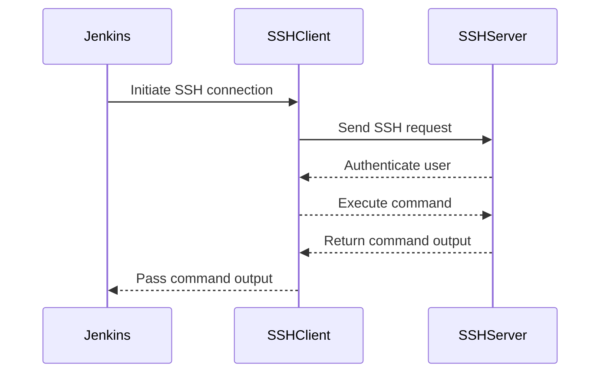

## Introduction to Jenkins Pipeline and Remote Execution

In the context of DevOps, Jenkins is a widely used open-source automation server that helps organizations automate their software delivery processes. One of the key features of Jenkins is its ability to define pipelines using a Groovy-based DSL (Domain Specific Language). These pipelines can be used to orchestrate various stages of the software development lifecycle, including building, testing, and deploying applications. A crucial aspect of these pipelines is the ability to execute commands on remote servers, which is often necessary for tasks such as deploying applications to production environments.

### Understanding Jenkins Pipeline Syntax

Jenkins pipelines are defined using a Groovy-based DSL, which allows for a high degree of flexibility and customization. The pipeline script is typically stored in a `Jenkinsfile` within the repository of the project being built. This file is executed by Jenkins to carry out the defined steps.

#### Example Jenkinsfile

```groovy
pipeline {
    agent any
    stages {
        stage('Build') {
            steps {
                sh 'make'
            }
        }
        stage('Test') {
            steps {
                sh 'make test'
            }
        }
        stage('Deploy') {
            steps {
                script {
                    def remote = [:]
                    remote.name = 'Ansible Server'
                    remote.host = '192.168.1.100'
                    remote.allowAnyHosts = true
                    remote.credentialsId = 'ssh-user-private-key'
                    sshCommand remote: remote, command: 'ls -l'
                }
            }
        }
    }
}
```

### Creating a Remote Object in Jenkins Pipeline

To execute commands on a remote server, Jenkins uses the `ssh` plugin, which provides the `sshCommand` step. This step requires a `remote` object that contains the necessary information to establish an SSH connection to the remote server.

#### Parameters of the Remote Object

The `remote` object is a Groovy map that contains several key-value pairs:

- **name**: A descriptive name for the remote server.
- **host**: The IP address or hostname of the remote server.
- **allowAnyHosts**: A boolean flag indicating whether to allow connections to any host without interactive confirmation.
- **credentialsId**: The ID of the Jenkins credentials that contain the SSH private key and username.

#### Example Remote Object Creation

```groovy
def remote = [:]
remote.name = 'Ansible Server'
remote.host = '192.168.1.100'
remote.allowAnyHosts = true
remote.credentialsId = 'ssh-user-private-key'
```

### Setting Up Credentials in Jenkins

Before executing commands on a remote server, you need to configure the necessary credentials in Jenkins. This typically involves creating an SSH private key and associating it with a username.

#### Steps to Set Up Credentials

1. **Generate SSH Key Pair**:
   - Use `ssh-keygen` to generate an SSH key pair.
   - Ensure the private key is kept secure and the public key is added to the authorized_keys file on the remote server.

2. **Add Credentials to Jenkins**:
   - Navigate to `Manage Jenkins > Manage Credentials`.
   - Click on `Global credentials (unrestricted)` and then `Add Credentials`.
   - Select `SSH Username with private key` and provide the username and path to the private key file.

#### Example SSH Key Generation

```bash
ssh-keygen -t rsa -b 4096 -C "jenkins@yourdomain.com"
```

### Executing Commands on the Remote Server

Once the `remote` object is configured, you can use the `sshCommand` step to execute commands on the remote server.

#### Example Command Execution

```groovy
sshCommand remote: remote, command: 'ls -l'
```

This command will execute `ls -l` on the remote server and return the output.

### Handling SSH Connections in Jenkins

When establishing an SSH connection, Jenkins uses the `ssh` plugin to handle the underlying SSH protocol. This plugin provides a convenient way to manage SSH connections and execute commands on remote servers.

#### SSH Protocol Overview

SSH (Secure Shell) is a cryptographic network protocol for operating network services securely over an unsecured network. It provides a secure channel over an insecure network in a client-server architecture, connecting an SSH client application with an SSH server.

#### SSH Connection Flow Diagram



### Common Pitfalls and Best Practices

#### Common Pitfalls

1. **Incorrect Credentials**: Ensure that the credentials ID provided in the `remote` object matches the actual credentials stored in Jenkins.
2. **Firewall Issues**: Ensure that the remote server's firewall allows incoming SSH connections from the Jenkins server.
3. **SSH Key Permissions**: Ensure that the private key file has the correct permissions (`chmod 600`).

#### Best Practices

1. **Use Strong SSH Keys**: Generate strong SSH keys with a sufficient number of bits (e.g., 4096 bits).
2. **Limit SSH Access**: Restrict SSH access to only the necessary users and limit the commands they can execute.
3. **Monitor SSH Activity**: Regularly monitor SSH activity logs to detect any unauthorized access attempts.

### Real-World Examples and Recent Breaches

#### Example: CVE-2021-20225

CVE-2021-20225 is a vulnerability in the Jenkins SSH plugin that allows attackers to execute arbitrary commands on the Jenkins master. This vulnerability highlights the importance of keeping Jenkins plugins up to date and securing SSH connections properly.

#### Example: SSH Key Exposure

In 2022, a breach occurred where an organization's SSH private key was exposed due to a misconfigured Jenkins job. This led to unauthorized access to the organization's infrastructure. This incident underscores the importance of securing SSH keys and limiting their exposure.

### How to Prevent / Defend

#### Detection

1. **Audit Logs**: Regularly review SSH audit logs to detect any unauthorized access attempts.
2. **Monitoring Tools**: Use monitoring tools like Splunk or ELK Stack to monitor SSH activity in real-time.

#### Prevention

1. **Secure SSH Keys**: Store SSH private keys securely and limit their exposure.
2. **Use SSH Agent**: Use the SSH agent to manage SSH keys instead of storing them directly in Jenkins jobs.
3. **Limit SSH Access**: Restrict SSH access to only the necessary users and limit the commands they can execute.

#### Secure Coding Fixes

##### Vulnerable Code

```groovy
def remote = [:]
remote.name = 'Ansible Server'
remote.host = '192.168.1.100'
remote.allowAnyHosts = true
remote.credentialsId = 'ssh-user-private-key'
sshCommand remote: remote, command: 'ls -l'
```

##### Secure Code

```groovy
def remote = [:]
remote.name = 'Ansible Server'
remote.host = '192.168.1.100'
remote.allowAnyHosts = false
remote.credentialsId = 'ssh-user-private-key'
sshCommand remote: remote, command: 'ls -l'
```

#### Configuration Hardening

1. **SSH Configuration**: Harden the SSH configuration on the remote server by disabling password authentication and enabling public key authentication.
2. **Jenkins Configuration**: Configure Jenkins to use strong encryption for storing credentials and limit the permissions of the Jenkins user.

### Conclusion

Executing commands on remote servers using Jenkins pipelines is a powerful feature that enables automation of complex tasks. However, it requires careful management of SSH keys and credentials to ensure security. By following best practices and regularly reviewing security configurations, you can effectively leverage Jenkins pipelines for remote execution while minimizing security risks.

### Hands-On Labs

For practical experience with Jenkins pipelines and remote execution, consider the following labs:

- **PortSwigger Web Security Academy**: Offers hands-on labs for learning web security concepts.
- **OWASP Juice Shop**: A deliberately insecure web application for practicing web security skills.
- **DVWA (Damn Vulnerable Web Application)**: A PHP/MySQL web application that is riddled with vulnerabilities for educational purposes.
- **WebGoat**: An interactive, gamified training application for learning about web application security.

These labs provide a comprehensive environment to practice and reinforce the concepts learned in this chapter.

---
<!-- nav -->
[[05-Introduction to Jenkins Pipeline and Ansible Integration|Introduction to Jenkins Pipeline and Ansible Integration]] | [[DevOps/DevOps Bootcamp/07-Configuration Management (Ansible)/04-Ansible Configuration via Jenkins Pipeline/00-Overview|Overview]] | [[07-Introduction to Jenkins Pipeline and SSH Agent Plugin|Introduction to Jenkins Pipeline and SSH Agent Plugin]]
