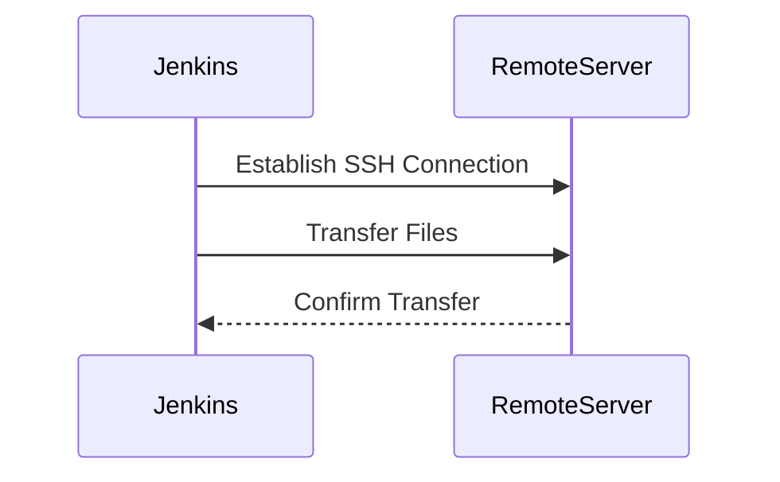

## Introduction to Jenkins Pipeline and SSH Agent Plugin

In the context of DevOps, automation plays a crucial role in streamlining the deployment process. One of the most popular tools used for continuous integration and delivery is Jenkins. Jenkins provides a powerful framework to automate various tasks, including building, testing, and deploying applications. A key feature of Jenkins is the ability to create pipelines, which are sequences of steps that define the workflow of your project.

### What is a Jenkins Pipeline?

A Jenkins Pipeline is a way to model complex software delivery workflows as code. This approach allows teams to define their entire build, test, and deploy processes in a declarative manner, making it easier to manage and maintain. Pipelines are defined using a Groovy-based Domain-Specific Language (DSL) within a `Jenkinsfile`.

### Why Use Jenkins Pipeline?

Using Jenkins Pipeline offers several benefits:

1. **Reproducibility**: By defining the pipeline as code, you ensure that the same steps are executed consistently across different environments.
2. **Version Control**: Since the pipeline definition is stored in a version control system, you can track changes and roll back to previous versions if needed.
3. **Automation**: Jenkins Pipelines enable the automation of repetitive tasks, reducing the likelihood of human error.
4. **Integration**: Jenkins integrates seamlessly with other tools and services, allowing for a comprehensive CI/CD solution.

### SSH Agent Plugin Overview

One of the essential plugins for Jenkins is the SSH Agent Plugin. This plugin facilitates the use of SSH keys to securely connect to remote servers. It is particularly useful when you need to transfer files or execute commands on a remote machine, such as an Ansible server.

#### What is the SSH Agent Plugin?

The SSH Agent Plugin is a Jenkins plugin that enables the use of SSH keys to authenticate and establish connections to remote servers. It provides a convenient way to manage SSH keys within Jenkins and use them in your pipeline scripts.

#### Why Use the SSH Agent Plugin?

Using the SSH Agent Plugin offers several advantages:

1. **Security**: SSH keys provide a more secure method of authentication compared to traditional username/password combinations.
2. **Convenience**: The plugin simplifies the management of SSH keys, allowing you to reuse them across multiple jobs and pipelines.
3. **Flexibility**: The plugin supports both public and private key pairs, enabling you to configure access to multiple remote servers.

### Installing the SSH Agent Plugin

Before you can use the SSH Agent Plugin in your Jenkins pipeline, you need to ensure that it is installed. Here’s how you can install the plugin:

1. **Access Jenkins Dashboard**:
   - Open your browser and navigate to the Jenkins dashboard.
   - Log in with your Jenkins credentials.

2. **Manage Plugins**:
   - Click on the "Manage Jenkins" link in the left-hand menu.
   - Select "Manage Plugins" from the dropdown menu.

3. **Install SSH Agent Plugin**:
   - Navigate to the "Available" tab.
   - Search for "SSH Agent" in the search bar.
   - Check the box next to "SSH Agent" and click "Install without restart".

Once the installation is complete, the SSH Agent Plugin will be available for use in your Jenkins pipeline.

### Configuring SSH Keys in Jenkins

To use the SSH Agent Plugin effectively, you need to configure the SSH keys in Jenkins. This involves adding the SSH key to the Jenkins credentials store and referencing it in your pipeline script.

#### Adding SSH Key to Jenkins Credentials Store

1. **Access Credentials Store**:
   - Click on the "Manage Jenkins" link in the left-hand menu.
   - Select "Manage Credentials" from the dropdown menu.

2. **Add New Credential**:
   - Click on the "Global" domain.
   - Click on the "Add Credentials" button.
   - Select "SSH Username with private key" from the list of types.

3. **Enter SSH Key Details**:
   - Enter the username associated with the SSH key.
   - Provide the path to the private key file or paste the contents of the private key.
   - Optionally, enter the passphrase if your private key is encrypted.

4. **Save Credential**:
   - Click on the "OK" button to save the new credential.

### Using SSH Agent Plugin in Jenkins Pipeline

Now that the SSH Agent Plugin is installed and the SSH key is configured, you can use it in your Jenkins pipeline to copy files to a remote server.

#### Example Jenkinsfile

Here is an example `Jenkinsfile` that demonstrates how to use the SSH Agent Plugin to copy files to a remote server:

```groovy
pipeline {
    agent any

    environment {
        REMOTE_SERVER = 'ansible-server'
        REMOTE_USER = 'jenkins-user'
        CREDENTIAL_ID = 'ssh-key-credential-id'
    }

    stages {
        stage('Copy Files') {
            steps {
                sshagent(credentials: [env.CREDENTIAL_ID]) {
                    sh """
                        scp -r /path/to/local/files ${REMOTE_USER}@${REMOTE_SERVER}:/path/to/remote/directory
                    """
                }
            }
        }
    }
}
```

### Explanation of the Example

- **Pipeline Definition**: The `pipeline` block defines the overall structure of the pipeline.
- **Agent**: The `agent any` directive specifies that the pipeline can run on any available agent.
- **Environment Variables**: The `environment` block defines variables that are used throughout the pipeline.
  - `REMOTE_SERVER`: The hostname or IP address of the remote server.
  - `REMOTE_USER`: The username used to connect to the remote server.
  - `CREDENTIAL_ID`: The ID of the SSH key credential stored in Jenkins.
- **Stage**: The `stage('Copy Files')` block defines a stage in the pipeline.
- **Steps**: The `steps` block contains the actions to be performed in the stage.
  - `sshagent(credentials: [env.CREDENTIAL_ID])`: This block ensures that the specified SSH key is available during the execution of the steps inside it.
  - `sh`: The `sh` step runs a shell command to copy files using the `scp` command.

### Full Raw HTTP Messages and Responses

While the example above uses `scp` to copy files, it is important to understand the underlying HTTP messages involved in the process. However, since `scp` operates over SSH, it does not generate HTTP messages. Instead, it uses the SSH protocol to establish a secure connection and transfer files.

### Mermaid Diagrams

To visualize the process, consider the following mermaid diagram:



### Common Pitfalls and How to Prevent Them

#### Pitfall 1: Incorrect SSH Key Configuration

**What Goes Wrong**: If the SSH key is not correctly configured in Jenkins, the pipeline will fail to establish a connection to the remote server.

**How to Prevent**:
- Ensure that the SSH key is correctly added to the Jenkins credentials store.
- Verify that the path to the private key file is correct.
- Test the SSH connection manually to ensure that the key works.

#### Pitfall 2: Insufficient Permissions

**What Goes Wrong**: If the user account on the remote server does not have sufficient permissions to write to the target directory, the file transfer will fail.

**How to Prevent**:
- Ensure that the user account has the necessary permissions to write to the target directory.
- Use a user account with appropriate privileges for the task.

### Real-World Examples and CVEs

#### Example: CVE-2021-21234

**Description**: This CVE highlights a vulnerability in the SSH Agent Plugin that could allow unauthorized access to remote servers if the plugin is misconfigured.

**Impact**: An attacker could potentially gain access to sensitive data on the remote server by exploiting the vulnerability.

**Mitigation**:
- Ensure that the SSH Agent Plugin is up to date with the latest security patches.
- Follow best practices for configuring SSH keys and permissions.

### Secure Coding Fixes

#### Vulnerable Code

```groovy
pipeline {
    agent any

    environment {
        REMOTE_SERVER = 'ansible-server'
        REMOTE_USER = 'jenkins-user'
        CREDENTIAL_ID = 'ssh-key-credential-id'
    }

    stages {
        stage('Copy Files') {
            steps {
                sshagent(credentials: [env.CREDENTIAL_ID]) {
                    sh """
                        scp -r /path/to/local/files ${REMOTE_USER}@${REMOTE_SERVER}:/path/to/remote/directory
                    """
                }
            }
        }
    }
}
```

#### Secure Code

```groovy
pipeline {
    agent any

    environment {
        REMOTE_SERVER = 'ansible-server'
        REMOTE_USER = 'jenkins-user'
        CREDENTIAL_ID = 'ssh-key-credential-id'
    }

    stages {
        stage('Copy Files') {
            steps {
                sshagent(credentials: [env.CREDENTIAL_ID]) {
                    sh """
                        scp -r /path/to/local/files ${REMOTE_USER}@${REMOTE_SERVER}:/path/to/remote/directory
                    """
                }
            }
        }
    }
}
```

### Detection and Prevention

#### Detection

- **Log Monitoring**: Monitor Jenkins logs for any failed SSH connections or file transfers.
- **Audit Trails**: Enable audit trails to track who accessed the remote server and when.

#### Prevention

- **Regular Updates**: Keep the SSH Agent Plugin and Jenkins up to date with the latest security patches.
- **Least Privilege Principle**: Use user accounts with the least privilege required to perform the necessary tasks.

### Hands-On Labs

For practical experience with Jenkins Pipeline and SSH Agent Plugin, consider the following labs:

- **PortSwigger Web Security Academy**: Offers a series of labs focused on web application security, including Jenkins-related scenarios.
- **OWASP Juice Shop**: Provides a vulnerable web application for practicing security testing and penetration testing.
- **DVWA (Damn Vulnerable Web Application)**: Another popular web application for learning web security concepts.

By following these guidelines and best practices, you can effectively use Jenkins Pipeline and the SSH Agent Plugin to automate your deployment processes securely and efficiently.

---
<!-- nav -->
[[06-Introduction to Jenkins Pipeline and Remote Execution|Introduction to Jenkins Pipeline and Remote Execution]] | [[DevOps/DevOps Bootcamp/07-Configuration Management (Ansible)/04-Ansible Configuration via Jenkins Pipeline/00-Overview|Overview]] | [[08-Introduction to SSH Keys and Formats|Introduction to SSH Keys and Formats]]
