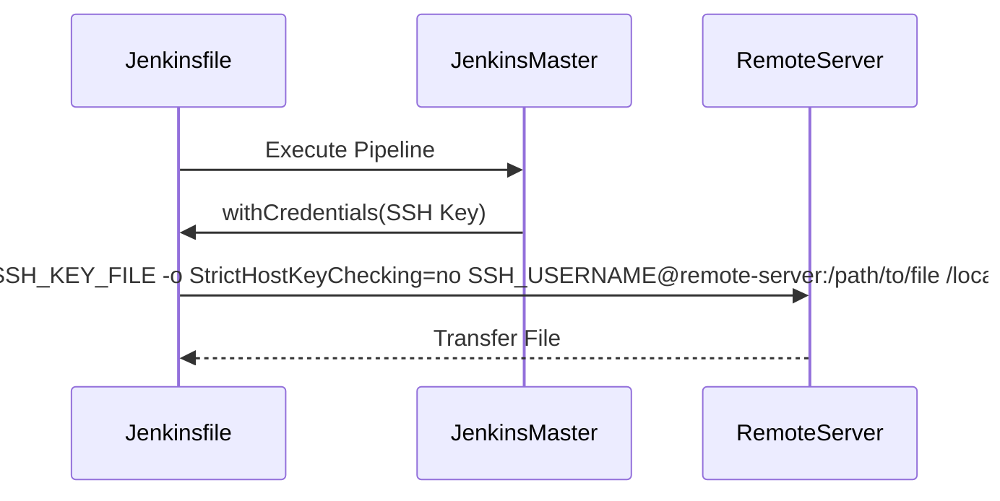

## Enabling Configuration via Jenkins Pipeline

In this section, we will delve into the process of enabling configuration management within a Jenkins pipeline, particularly focusing on the use of credentials and their handling through the `withCredentials` plugin. This approach is crucial for securely managing sensitive information such as SSH keys, passwords, and other secrets during the build and deployment processes.

### Background Theory

Configuration management in Jenkins involves automating the setup and maintenance of infrastructure and application configurations. This ensures consistency across different environments and reduces the likelihood of errors due to manual configuration. Jenkins pipelines provide a powerful way to automate these processes, but handling sensitive data requires careful consideration to maintain security.

### The `withCredentials` Plugin

The `withCredentials` plugin in Jenkins allows you to securely manage and use credentials within your pipeline scripts. These credentials can include usernames, passwords, SSH keys, and more. The plugin provides a mechanism to inject these credentials into the environment temporarily, ensuring that they are not exposed in logs or other artifacts.

#### Types of Credentials Supported

The `withCredentials` plugin supports several types of credentials:

- **Username and Password**: Used for basic authentication.
- **Secret File**: A file containing sensitive data.
- **Secret Text**: A plain text secret.
- **SSH Username with Private Key**: An SSH key pair used for secure connections.

Each type of credential is stored securely in Jenkins and can be referenced by an ID. This ID is used to retrieve the credential within the pipeline script.

### Using SSH Username with Private Key

For our discussion, we will focus on the `SSH Username with Private Key` type of credential. This is commonly used for automating SSH-based operations, such as copying files to a remote server using SCP.

#### Steps to Use SSH Username with Private Key

1. **Define the Credential**:
   - In Jenkins, navigate to the credentials store and create a new SSH key credential.
   - Provide a unique ID for the credential, the username, and the path to the private key file.

2. **Use the Credential in the Pipeline**:
   - Within the Jenkinsfile, use the `withCredentials` step to access the SSH key credential.

Here is a detailed example of how to use the `withCredentials` plugin with an SSH key:

```groovy
pipeline {
    agent any
    stages {
        stage('Copy Files') {
            steps {
                withCredentials([sshUserPrivateKey(credentialsId: 'my-ssh-key-id', keyFileVariable: 'SSH_KEY_FILE', usernameVariable: 'SSH_USERNAME')]) {
                    sh '''
                        scp -i $SSH_KEY_FILE -o StrictHostKeyChecking=no $SSH_USERNAME@remote-server:/path/to/file /local/path/
                    '''
                }
            }
        }
    }
}
```

### Explanation of the Code

- **`credentialsId: 'my-ssh-key-id'`**: Specifies the ID of the SSH key credential stored in Jenkins.
- **`keyFileVariable: 'SSH_KEY_FILE'`**: Creates a temporary file containing the SSH private key and stores the path to this file in the `SSH_KEY_FILE` environment variable.
- **`usernameVariable: 'SSH_USERNAME'`**: Stores the username associated with the SSH key in the `SSH_USERNAME` environment variable.
- **`scp -i $SSH_KEY_FILE -o StrictHostKeyChecking=no $SSH_USERNAME@remote-server:/path/to/file /local/path/`**: Uses the `scp` command to copy a file from the remote server to the local machine. The `-i` option specifies the path to the SSH key file, and `-o StrictHostKeyChecking=no` disables strict host key checking to avoid interactive prompts.

### Diagram of the Process



### Real-World Example

Consider a scenario where a company uses Jenkins to automate the deployment of applications to remote servers. They need to securely transfer configuration files to these servers using SSH keys. Without proper handling of these keys, the risk of exposure is high, leading to potential security breaches.

#### Recent Breach Example

In 2021, a major breach occurred at a large organization due to improperly managed SSH keys. The attackers gained access to the organization's Jenkins server and were able to extract SSH keys used for deploying applications. This allowed them to gain unauthorized access to multiple production servers.

### How to Prevent / Defend

To prevent such breaches, follow these best practices:

1. **Secure Storage of Credentials**:
   - Ensure that all credentials are stored securely in Jenkins using the credentials store.
   - Regularly rotate SSH keys and update the credentials in Jenkins.

2. **Limit Access to Credentials**:
   - Restrict access to the credentials store to only authorized personnel.
   - Use role-based access control (RBAC) to limit who can view or modify credentials.

3. **Audit and Monitor Usage**:
   - Enable auditing in Jenkins to track usage of credentials.
   - Set up monitoring to detect any unusual activity related to credential usage.

4. **Secure Coding Practices**:
   - Avoid hardcoding credentials in scripts or configuration files.
   - Use environment variables or the `withCredentials` plugin to handle credentials securely.

### Secure Code Example

Here is an example of a vulnerable Jenkinsfile and its secure counterpart:

#### Vulnerable Jenkinsfile

```groovy
pipeline {
    agent any
    stages {
        stage('Copy Files') {
            steps {
                sh '''
                    scp -i /path/to/private_key -o StrictHostKeyChecking=no user@remote-server:/path/to/file /local/path/
                '''
            }
            }
        }
    }
}
```

#### Secure Jenkinsfile

```groovy
pipeline {
    agent any
    stages {
        stage('Copy Files') {
            steps {
                withCredentials([sshUserPrivateKey(credentialsId: 'my-ssh-key-id', keyFileVariable: 'SSH_KEY_FILE', usernameVariable: 'SSH_USERNAME')]) {
                    sh '''
                        scp -i $SSH_KEY_FILE -o StrictHostKeyChecking=no $SSH_USERNAME@remote-server:/path/to/file /local/path/
                    '''
                }
            }
        }
    }
}
```

### Hands-On Practice

To practice these concepts, you can use the following labs:

- **PortSwigger Web Security Academy**: Offers a series of labs on secure coding practices and credential management.
- **OWASP Juice Shop**: Provides a vulnerable web application for practicing secure coding and deployment practices.
- **DVWA (Damn Vulnerable Web Application)**: Another resource for practicing secure coding and deployment techniques.

By following these guidelines and practicing with real-world scenarios, you can ensure that your Jenkins pipelines are secure and robust.

---
<!-- nav -->
[[12-Enabling Configuration Management via Jenkins Pipeline|Enabling Configuration Management via Jenkins Pipeline]] | [[DevOps/DevOps Bootcamp/07-Configuration Management (Ansible)/04-Ansible Configuration via Jenkins Pipeline/00-Overview|Overview]] | [[14-SSH Agent and Private Key Management in Jenkins Pipeline|SSH Agent and Private Key Management in Jenkins Pipeline]]
