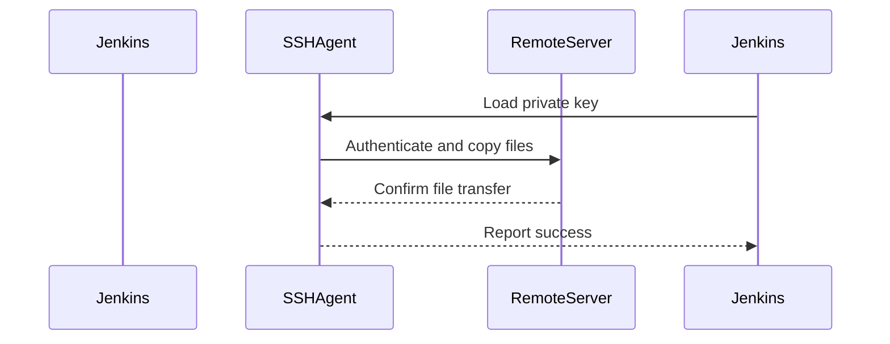

## SSH Agent and Private Key Management in Jenkins Pipeline

### Background Theory

In the context of DevOps and continuous integration/continuous deployment (CI/CD) pipelines, managing secure access to remote servers is crucial. One common method for achieving this is through the use of SSH keys. SSH (Secure Shell) is a cryptographic network protocol used for secure data communication, remote command-line login, remote command execution, and other secure network services between two networked computers. 

SSH keys consist of a public key and a private key. The public key is stored on the remote server, while the private key is kept securely on the client machine. When a connection is established, the client uses the private key to authenticate itself to the server. This ensures that only authorized users can access the server.

In Jenkins, the SSH Agent plugin is often used to manage SSH keys within a pipeline. The SSH Agent plugin allows you to load your private key into memory during the build process, making it available for SSH or SCP (Secure Copy Protocol) operations. This is particularly useful in automated pipelines where manual intervention to provide credentials is not feasible.

### SSH Agent Plugin in Jenkins

The SSH Agent plugin in Jenkins provides a way to manage SSH keys securely within a pipeline. Here’s how it works:

1. **Loading the Private Key**: The SSH Agent loads the private key into memory. This key is typically stored securely in Jenkins using the Credentials plugin.
2. **Making the Key Available**: Once loaded, the private key is made available for all subsequent SSH or SCP commands within the pipeline.
3. **Executing Commands**: The pipeline can now execute SSH or SCP commands that require authentication using the loaded private key.

#### Example Usage

Let's walk through an example of how to use the SSH Agent plugin in a Jenkins pipeline to copy files to a remote server.

```groovy
pipeline {
    agent any
    stages {
        stage('Copy Files') {
            steps {
                sshagent(credentials: ['my-private-key']) {
                    sh '''
                        scp -o StrictHostKeyChecking=no \
                            -r ./Ansible/* \
                            root@<remote-server-ip>:/root/
                    '''
                }
            }
        }
    }
}
```

### Explanation of the Code

1. **Pipeline Definition**:
    - `pipeline { ... }`: Defines the Jenkins pipeline.
    - `agent any`: Specifies that the pipeline can run on any available agent.
    - `stages { ... }`: Defines the stages of the pipeline.

2. **Stage: Copy Files**:
    - `stage('Copy Files') { ... }`: Defines a stage named "Copy Files".
    - `steps { ... }`: Defines the steps to be executed in this stage.

3. **SSH Agent Block**:
    - `sshagent(credentials: ['my-private-key']) { ... }`: Loads the private key specified by the credential ID `my-private-key` into memory.
    - `sh ''' ... '''`: Executes shell commands within the SSH Agent block.

4. **SCP Command**:
    - `scp -o StrictHostKeyChecking=no`: Disables strict host key checking to avoid interactive prompts.
    - `-r ./Ansible/*`: Recursively copies all files from the `Ansible` directory.
    - `root@<remote-server-ip>:/root/`: Specifies the destination as the root user's home directory on the remote server.

### Diagram: SSH Agent Workflow



### Detailed Explanation of Each Component

1. **SSH Agent Plugin**:
    - **Purpose**: Manages SSH keys securely within a pipeline.
    - **How it Works**: Loads the private key into memory, making it available for SSH or SCP commands.
    - **Why it Matters**: Ensures secure access to remote servers without exposing private keys in scripts.

2. **SCP Command**:
    - **Purpose**: Copies files securely between local and remote systems.
    - **How it Works**: Uses SSH for encryption and authentication.
    - **Why it Matters**: Provides a secure method for transferring files, especially in automated pipelines.

3. **Strict Host Key Checking**:
    - **Purpose**: Ensures the authenticity of the remote host.
    - **How it Works**: By default, SSH checks the host key of the remote server to prevent man-in-the-middle attacks.
    - **Why it Matters**: Disabling it (`-o StrictHostKeyChecking=no`) can be necessary for automated scripts but poses security risks.

### Full Raw HTTP Message Example

While SSH and SCP do not use HTTP, let's consider a similar scenario involving HTTP for completeness. Suppose we are using an HTTP-based API to transfer files securely.

```http
POST /api/upload HTTP/1.1
Host: example.com
Authorization: Bearer <access_token>
Content-Type: multipart/form-data; boundary=----WebKitFormBoundary7MA4YWxkTrZu0gW

------WebKitFormBoundary7MA4YWxkTrZu0gW
Content-Disposition: form-data; name="file"; filename="example.txt"
Content-Type: text/plain

(file contents)
------WebKitFormBoundary7MA4YWxkTrZu0gW--
```

### Explanation of Headers

- **Authorization**: Contains the access token for authentication.
- **Content-Type**: Specifies the format of the request body.
- **Content-Disposition**: Describes the file being uploaded.

### Common Pitfalls and How to Avoid Them

1. **Exposing Private Keys**:
    - **Pitfall**: Hardcoding private keys in scripts or pipelines.
    - **Avoidance**: Use Jenkins Credentials plugin to store and manage private keys securely.

2. **Disabling Strict Host Key Checking**:
    - **Pitfall**: Disabling strict host key checking can expose the system to man-in-the-middle attacks.
    - **Avoidance**: Ensure the remote server's host key is known and trusted before disabling strict host key checking.

3. **Incorrect User Permissions**:
    - **Pitfall**: Using incorrect user permissions can result in failed file transfers.
    - **Avoidance**: Ensure the user specified in the SCP command has the necessary permissions on the remote server.

### How to Prevent / Defend

#### Secure Coding Fixes

**Vulnerable Code**:
```groovy
pipeline {
    agent any
    stages {
        stage('Copy Files') {
            steps {
                sshagent(credentials: ['my-private-key']) {
                    sh '''
                        scp -o StrictHostKeyChecking=no \
                            -r ./Ansible/* \
                            root@<remote-server-ip>:/root/
                    '''
                }
            }
        }
    }
}
```

**Secure Code**:
```groovy
pipeline {
    agent any
    stages {
        stage('Copy Files') {
            steps {
                sshagent(credentials: ['my-private-key']) {
                    sh '''
                        scp -o StrictHostKeyChecking=yes \
                            -r ./Ansible/* \
                            root@<remote-server-ip>:/root/
                    '''
                }
            }
        }
    }
}
```

#### Configuration Hardening

1. **Use Strong Authentication Methods**:
    - Ensure that strong authentication methods are used, such as multi-factor authentication (MFA).

2. **Regularly Update and Patch Systems**:
    - Keep all systems up-to-date with the latest security patches.

3. **Monitor and Audit Access Logs**:
    - Regularly monitor and audit access logs to detect any unauthorized access attempts.

### Real-World Examples

#### Recent CVEs and Breaches

1. **CVE-2021-21972**: A vulnerability in Jenkins that could allow attackers to execute arbitrary code. This highlights the importance of keeping Jenkins and its plugins up-to-date.

2. **SolarWinds Supply Chain Attack**: Demonstrates the importance of securing supply chains and ensuring that all components are trustworthy.

### Practice Labs

For hands-on practice with Jenkins and SSH Agent, consider the following labs:

- **PortSwigger Web Security Academy**: Offers a variety of labs related to web application security, including some that involve Jenkins and SSH.
- **OWASP Juice Shop**: A deliberately insecure web application for security training.
- **DVWA (Damn Vulnerable Web Application)**: Another popular web application for security training.

These labs provide practical experience in setting up and securing Jenkins pipelines, including the use of SSH Agent for secure file transfers.

By thoroughly understanding and implementing these concepts, you can ensure that your Jenkins pipelines are secure and efficient.

---
<!-- nav -->
[[13-Enabling Configuration via Jenkins Pipeline|Enabling Configuration via Jenkins Pipeline]] | [[DevOps/DevOps Bootcamp/07-Configuration Management (Ansible)/04-Ansible Configuration via Jenkins Pipeline/00-Overview|Overview]] | [[15-Secret Management in Jenkins Pipelines|Secret Management in Jenkins Pipelines]]
