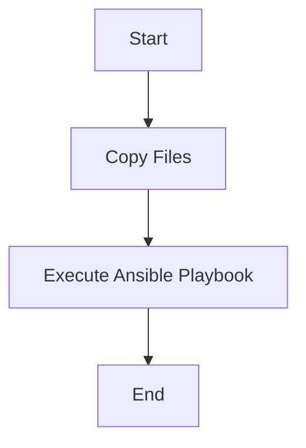
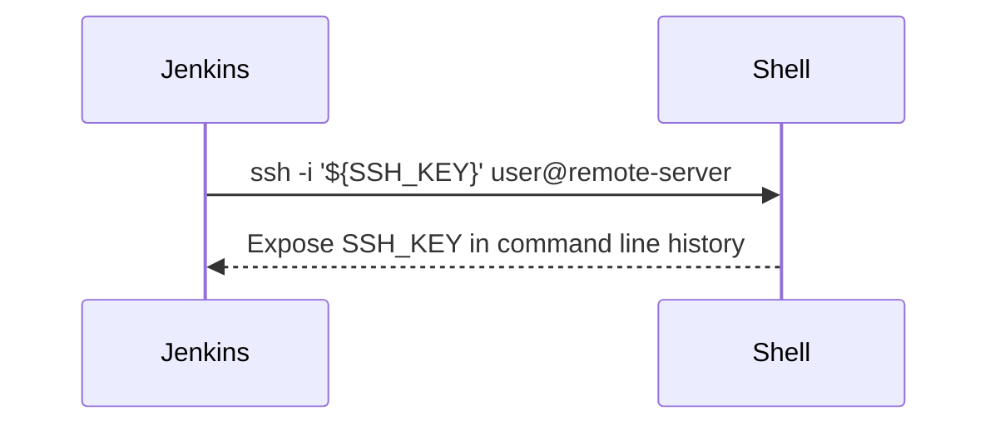

## Secret Management in Jenkins Pipelines

### Background Theory

In the context of DevOps and continuous integration/continuous deployment (CI/CD) pipelines, managing secrets securely is paramount. Secrets such as API keys, database passwords, and SSH keys are often required to automate various tasks within a pipeline. However, exposing these secrets in plain text can lead to significant security risks. One common scenario where this issue arises is when using Groovy scripts in Jenkins pipelines.

### Problem Description

When using Groovy scripts in Jenkins pipelines, the Groovy interpreter can inadvertently expose sensitive information on the command line. This exposure occurs because the Groovy script might pass secrets as arguments to shell commands, thereby leaving traces in the command line history. This is particularly problematic because command line histories can be accessed by unauthorized users, leading to potential data breaches.

#### Example Scenario

Consider a Jenkins pipeline that uses an SSH key to authenticate with a remote server. If the SSH key is passed as a plain text argument to a shell command, it could be exposed in the command line history. This exposure can be exploited by malicious actors to gain unauthorized access to the remote server.

```groovy
pipeline {
    agent any
    stages {
        stage('SSH Access') {
            steps {
                sh 'ssh -i ${SSH_KEY} user@remote-server'
            }
        }
    }
}
```

In the above example, `${SSH_KEY}` is a placeholder for the actual SSH key. If this key is passed directly to the `sh` step, it will be visible in the command line history.

### Solution: Using Single Quotes

To mitigate this issue, Jenkins provides a mechanism to handle secrets more securely by using single quotes instead of double quotes. Single quotes prevent the Groovy interpreter from expanding variables, thus keeping the secrets out of the command line history.

#### Syntax Explanation

Instead of using double quotes (`"`) around the secret, use single quotes (`'`). Additionally, remove the curly braces (`{}`) that are typically used for variable interpolation.

```groovy
pipeline {
    agent any
    stages {
        stage('SSH Access') {
            steps {
                sh 'ssh -i \'${SSH_KEY}\' user@remote-server'
            }
        }
    }
}
```

By using single quotes, the Groovy interpreter treats the entire string as a literal, preventing the expansion of variables. This ensures that the secret remains hidden from the command line history.

### Committing Changes

After making these changes, it is essential to commit them to the version control system and push the changes to the remote repository. This ensures that the updated pipeline configuration is applied.

```bash
git add Jenkinsfile
git commit -m "Fix security warning for SSH key"
git push origin main
```

### Verification

To verify that the changes have resolved the security issue, re-run the Jenkins pipeline and check the logs for any warnings related to secret exposure.

```bash
# Run the Jenkins pipeline
jenkins-cli build <job-name>

# Check the logs
cat jenkins-logs.txt | grep "warning"
```

If the changes are correctly implemented, there should be no warnings related to secret exposure in the logs.

### Extending the Pipeline

Once the initial security issue is resolved, the next step is to extend the Jenkins pipeline to execute an Ansible playbook on a remote server. This playbook will configure EC2 instances.

#### Adding a New Stage

Add a new stage to the Jenkins pipeline to execute the Ansible playbook.

```groovy
pipeline {
    agent any
    stages {
        stage('SSH Access') {
            steps {
                sh 'ssh -i \'${SSH_KEY}\' user@remote-server'
            }
        }
        stage('Execute Ansible Playbook') {
            steps {
                sh 'ansible-playbook -i inventory_file playbook.yml --private-key=\'${SSH_KEY}\''
            }
        }
    }
}
```

In this example, the `Execute Ansible Playbook` stage runs the Ansible playbook on the remote server using the SSH key stored securely.

### Real-World Examples

#### Recent Breaches

One notable breach involving secret management occurred in 2021 when a misconfigured Jenkins instance exposed sensitive credentials. The incident highlighted the importance of securing secrets in CI/CD pipelines.

#### CVE Example

CVE-2021-22205 is a critical vulnerability affecting Jenkins that allows attackers to execute arbitrary code by manipulating environment variables. This vulnerability underscores the need for robust secret management practices.

### How to Prevent / Defend

#### Detection

Regularly audit Jenkins pipelines and logs to identify any instances where secrets are exposed. Tools like `grep` can be used to search for patterns indicative of secret exposure.

```bash
grep -r '\$SSH_KEY' .
```

#### Prevention

1. **Use Single Quotes**: Always use single quotes to prevent variable expansion in shell commands.
2. **Secure Variable Storage**: Store secrets in a secure vault (e.g., HashiCorp Vault, AWS Secrets Manager) and retrieve them dynamically during pipeline execution.
3. **Pipeline Scanning Tools**: Utilize tools like Trivy or tfsec to scan Jenkinsfiles and other pipeline configurations for security issues.

#### Secure Code Fix

**Vulnerable Code**

```groovy
pipeline {
    agent any
    stages {
        stage('SSH Access') {
            steps {
                sh 'ssh -i ${SSH_KEY} user@remote-server'
            }
        }
    }
}
```

**Fixed Code**

```groovy
pipeline {
    agent any
    stages {
        stage('SSH Access') {
            steps {
                sh 'ssh -i \'${SSH_KEY}\' user@remote-server'
            }
        }
    }
}
```

### Complete Example

#### Full Pipeline Configuration

```groovy
pipeline {
    agent any
    stages {
        stage('Copy Files') {
            steps {
                sh 'scp -i \'${SSH_KEY}\' local-file user@remote-server:/path/to/remote/file'
            }
        }
        stage('Execute Ansible Playbook') {
            steps {
                sh 'ansible-playbook -i inventory_file playbook.yml --private-key=\'${SSH_KEY}\''
            }
        }
    }
}
```

#### Expected Result

The pipeline should successfully copy files to the remote server and execute the Ansible playbook without exposing secrets in the command line history.

### Mermaid Diagrams

#### Pipeline Flow



#### Command Line Exposure



### Hands-On Labs

For practical experience with Jenkins pipelines and secret management, consider the following labs:

- **PortSwigger Web Security Academy**: Offers exercises on secure coding practices and pipeline security.
- **OWASP Juice Shop**: Provides a vulnerable web application to practice secure pipeline configurations.
- **DVWA (Damn Vulnerable Web Application)**: Useful for understanding common vulnerabilities and how to secure pipelines.

### Conclusion

Managing secrets securely in Jenkins pipelines is crucial for maintaining the integrity and confidentiality of sensitive information. By using single quotes and avoiding variable expansion in shell commands, developers can significantly reduce the risk of secret exposure. Regular audits and the use of secure storage solutions further enhance the security posture of CI/CD pipelines.

---
<!-- nav -->
[[14-SSH Agent and Private Key Management in Jenkins Pipeline|SSH Agent and Private Key Management in Jenkins Pipeline]] | [[DevOps/DevOps Bootcamp/07-Configuration Management (Ansible)/04-Ansible Configuration via Jenkins Pipeline/00-Overview|Overview]] | [[DevOps/DevOps Bootcamp/07-Configuration Management (Ansible)/04-Ansible Configuration via Jenkins Pipeline/16-Practice Questions & Answers|Practice Questions & Answers]]
