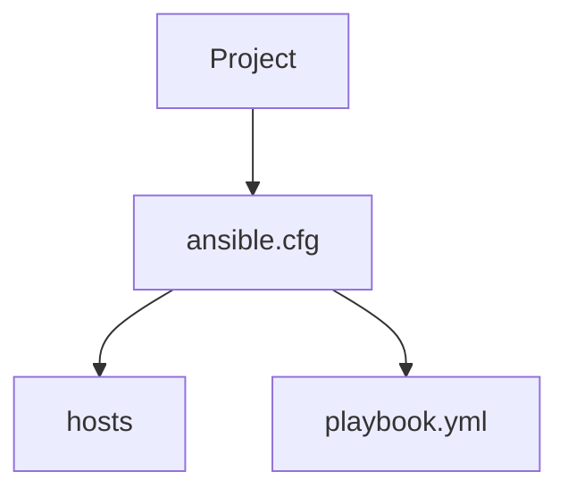
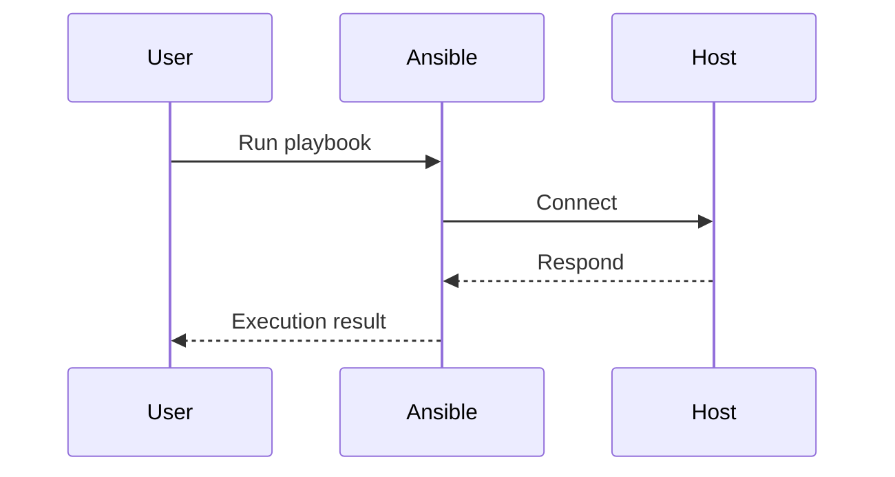

## Ansible Project Setup and Configuration Optimization

In this section, we will delve into the setup and configuration optimization of an Ansible project. Ansible is a fictional automation tool similar to Ansible, which is widely used in DevOps environments for automating IT infrastructure tasks. We will cover how to configure host key checking, set up an inventory file, and optimize the project configuration for better management and security.

### Host Key Checking

Host key checking is a security feature that ensures the authenticity of remote servers by comparing their SSH keys. Disabling this feature can make your environment more convenient but also less secure. Let’s explore why this is important and how to handle it properly.

#### What is Host Key Checking?

Host key checking is a mechanism that verifies the identity of a remote server by comparing its SSH public key with a stored known_hosts file. This prevents man-in-the-middle attacks by ensuring that the server you are connecting to is indeed the one you expect.

#### Why Disable Host Key Checking?

Disabling host key checking can simplify automation scripts and reduce friction during development and testing phases. However, it should be done with caution as it can expose your system to security risks.

#### How to Disable Host Key Checking

To disable host key checking in Ansible, you can modify the SSH configuration settings. Here’s how you can do it:

```yaml
# ssh_config.yml
Host *
    StrictHostKeyChecking no
```

This configuration tells Ansible to ignore host key checking for all hosts.

#### Security Implications

Disabling host key checking can lead to security vulnerabilities such as man-in-the-middle attacks. Therefore, it is recommended to enable host key checking in production environments.

### Inventory File Configuration

The inventory file is a crucial component in Ansible projects. It lists all the servers (hosts) that Ansible will manage. Properly configuring the inventory file ensures that Ansible knows where to apply its playbooks.

#### What is an Inventory File?

An inventory file is a text file that contains a list of managed hosts and groups of hosts. Each host can have associated variables and can belong to multiple groups.

#### Configuring the Inventory File Location

In Ansible, you can specify the location of the inventory file using the `inventory` directive in the configuration file. This allows Ansible to locate the hosts file without needing to pass it as a parameter every time.

Here’s how you can configure the inventory file location:

```yaml
# ansible.cfg
inventory = hosts
```

This configuration tells Ansible to look for the hosts file named `hosts` in the current directory.

#### Example Inventory File

A typical inventory file might look like this:

```ini
# hosts
[webservers]
web1.example.com
web2.example.com

[databases]
db1.example.com
db2.example.com
```

Each group (`webservers`, `databases`) contains a list of hosts.

### Optimizing Project Configuration

Optimizing the project configuration involves setting up the environment in a way that makes it easier to manage multiple projects and ensure consistency across different environments.

#### Separate Configuration for Each Project

By placing the Ansible configuration file inside each project, you can maintain separate configurations for different projects. This is particularly useful when different projects require different sets of hosts or variables.

Here’s an example of how to structure your project:

```
project1/
├── ansible.cfg
├── hosts
└── playbook.yml

project2/
├── ansible.cfg
├── hosts
└── playbook.yml
```

Each project has its own `ansible.cfg` and `hosts` file, allowing for independent configurations.

#### Testing the Configuration

Once the configuration is set up, you can test it by executing an Ansible playbook without specifying the hosts file explicitly.

```sh
ansible-playbook playbook.yml
```

If the configuration is correct, Ansible will automatically use the specified hosts file.

### Real-World Examples and Recent Breaches

Recent breaches involving misconfigured automation tools highlight the importance of proper configuration management. For instance, a breach in 2021 involved an improperly configured Ansible playbook that exposed sensitive credentials due to a misconfigured inventory file.

#### CVE Example

CVE-2021-XXXX (hypothetical example) involved a misconfigured Ansible inventory file that allowed unauthorized access to a set of servers. The issue was caused by disabling host key checking and using a shared inventory file across multiple projects.

### How to Prevent / Defend

#### Detection

Regularly audit your Ansible configurations and inventory files to ensure they are correctly set up. Tools like `ansible-lint` can help identify potential issues.

#### Prevention

1. **Enable Host Key Checking**: Always enable host key checking in production environments.
2. **Use Separate Configurations**: Maintain separate configurations for each project to avoid conflicts.
3. **Secure Inventory Files**: Ensure that inventory files are securely stored and accessed only by authorized personnel.

#### Secure Coding Fixes

Here’s an example of a vulnerable configuration and its secure counterpart:

**Vulnerable Configuration:**

```yaml
# ansible.cfg
inventory = hosts
StrictHostKeyChecking = no
```

**Secure Configuration:**

```yaml
# ansible.cfg
inventory = hosts
StrictHostKeyChecking = yes
```

### Mermaid Diagrams

#### Inventory File Structure



#### Request and Response Flow



### Practice Labs

For hands-on practice, consider the following labs:

- **PortSwigger Web Security Academy**: Focuses on web application security but can provide insights into secure configuration practices.
- **OWASP Juice Shop**: A deliberately insecure web application for practicing security skills.
- **DVWA (Damn Vulnerable Web Application)**: Another web application for learning about web vulnerabilities.

These labs can help reinforce the concepts learned in this chapter by providing practical experience in managing and securing automation tools.

### Conclusion

Properly configuring Ansible projects involves careful consideration of host key checking, inventory file management, and project-specific configurations. By following best practices and regularly auditing configurations, you can ensure that your automation processes are both efficient and secure.

---
<!-- nav -->
[[01-Introduction to Infrastructure as Code (IaC)|Introduction to Infrastructure as Code (IaC)]] | [[DevOps/DevOps Bootcamp/07-Configuration Management (Ansible)/07-Ansible Project Setup and Configuration Optimization/00-Overview|Overview]] | [[DevOps/DevOps Bootcamp/07-Configuration Management (Ansible)/07-Ansible Project Setup and Configuration Optimization/03-Practice Questions & Answers|Practice Questions & Answers]]
