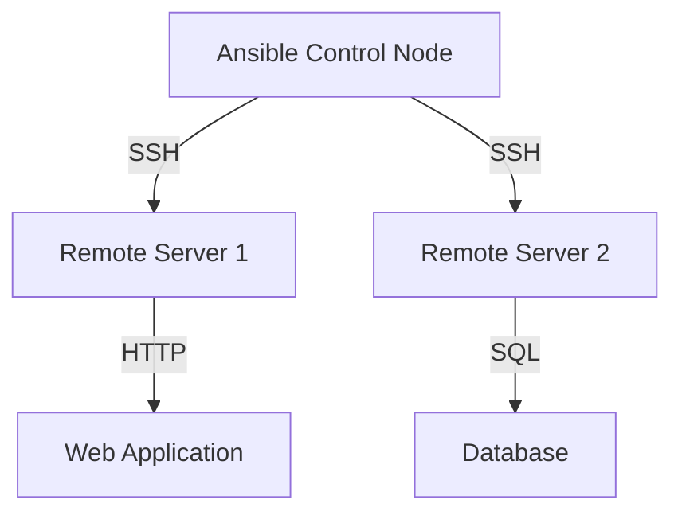

## Introduction to Ansible Server Management

Ansible, often referred to as Ansible in the DevOps community, is a powerful automation tool used for configuring systems, deploying applications, and orchestrating complex IT tasks. This chapter will delve into setting up Ansible to manage remote servers using inventory files. We'll cover the necessary steps, configurations, and best practices to ensure secure and efficient management of your infrastructure.

### What is Ansible?

Ansible is an open-source automation tool that simplifies the process of managing and configuring IT infrastructure. It uses a simple language called YAML to define tasks and configurations. Unlike other automation tools, Ansible does not require an agent to be installed on the managed nodes; instead, it uses SSH to communicate with the servers.

### Why Use Ansible?

Ansible offers several advantages:

1. **Agentless**: No need to install additional software on the managed nodes.
2. **Idempotent**: Tasks can be run repeatedly without causing unintended side effects.
3. **Declarative**: You describe the desired state, and Ansible ensures it is achieved.
4. **Extensible**: A vast library of modules and plugins allows for customization and integration with various systems.

### Setting Up Ansible

To begin managing remote servers with Ansible, you need to configure an inventory file. This file contains information about the servers you want to manage, including their IP addresses or hostnames and authentication details.

#### Creating the Inventory File

The inventory file is a crucial component of Ansible. It lists all the servers that Ansible will manage and provides details such as IP addresses, hostnames, and authentication methods.

```yaml
# Example inventory file (hosts)
[webservers]
web1 ansible_host=192.168.1.10 ansible_ssh_private_key_file=/home/user/.ssh/id_rsa
web2 ansible_host=192.168.1.11 ansible_ssh_private_key_file=/home/user/.ssh/id_rsa

[databases]
db1 ansible_host=192.168.1.20 ansible_ssh_private_key_file=/home/user/.ssh/id_rsa
```

In this example, we have two groups of servers: `webservers` and `databases`. Each server is defined with its IP address and the path to the SSH private key file.

### Understanding the Inventory File

Let's break down the components of the inventory file:

- **Groups**: Servers are grouped together based on their roles. This allows you to apply specific configurations to certain groups.
- **Hosts**: Each server is listed with its IP address or hostname.
- **Variables**: Additional variables can be specified for each host, such as the path to the SSH private key file.

#### Specifying Authentication Details

Ansible uses SSH to communicate with the remote servers. Therefore, it needs credentials to authenticate. There are two main methods:

1. **Username and Password**: This method is less secure and generally discouraged.
2. **SSH Private Key**: This is the recommended method due to its security benefits.

In the inventory file, you can specify the path to the SSH private key file using the `ansible_ssh_private_key_file` variable.

### SSH Key Authentication

Using SSH keys for authentication is more secure than using passwords. Here’s how it works:

1. **Generate SSH Keys**: On the local machine, generate an SSH key pair using the `ssh-keygen` command.
    ```sh
    ssh-keygen -t rsa -b 4096 -C "your_email@example.com"
    ```
2. **Copy Public Key to Remote Server**: Copy the public key to the remote server using the `ssh-copy-id` command.
    ```sh
    ssh-copy-id user@remote_server_ip
    ```

This sets up SSH key-based authentication, allowing Ansible to connect to the remote servers without needing to enter a password.

### Configuring the Inventory File

Now that we understand the basics, let's configure the inventory file in detail.

#### Inventory File Structure

An inventory file can be structured in various ways, depending on your needs. Here’s a detailed example:

```yaml
# Example inventory file (hosts)
[webservers]
web1 ansible_host=192.168.1.10 ansible_ssh_private_key_file=/home/user/.ssh/id_rsa
web2 ansible_host=192.168.1.11 ansible_ssh_private_key_file=/home/user/.ssh/id_rsa

[databases]
db1 ansible_host=192.168.1.20 ansible_ssh_private_key_file=/home/user/.ssh/id_rsa

[all:vars]
ansible_user=admin
ansible_python_interpreter=/usr/bin/python3
```

In this example, we have two groups (`webservers` and `databases`) and a global variable section (`[all:vars]`). The global variables apply to all hosts in the inventory.

#### Specifying Variables

Variables can be specified at different levels:

- **Global Level**: Applies to all hosts.
- **Group Level**: Applies to all hosts in a specific group.
- **Host Level**: Applies to a specific host.

For example, you might want to specify a different SSH user for a particular host:

```yaml
[webservers]
web1 ansible_host=192.168.1.10 ansible_ssh_private_key_file=/home/user/.ssh/id_rsa
web2 ansible_host=192.168.1.11 ansible_ssh_private_key_file=/home/user/.ssh/id_rsa ansible_user=root
```

### Common Pitfalls and Best Practices

When setting up Ansible, there are several common pitfalls to avoid:

1. **Incorrect SSH Key Path**: Ensure the path to the SSH private key file is correct.
2. **Permissions Issues**: Make sure the SSH private key file has the correct permissions (`chmod 600 /path/to/private_key`).
3. **Firewall Rules**: Ensure that the firewall rules allow SSH traffic between the Ansible control node and the managed nodes.

### How to Prevent / Defend

#### Detection

Regularly monitor your infrastructure for unauthorized access attempts. Tools like `fail2ban` can help detect and block suspicious activity.

#### Prevention

1. **Use Strong SSH Keys**: Generate strong SSH keys with a high bit length.
2. **Limit SSH Access**: Restrict SSH access to specific IP addresses or ranges.
3. **Enable Two-Factor Authentication**: Consider enabling two-factor authentication for added security.

#### Secure Coding Fixes

Here’s an example of a vulnerable setup and the corresponding secure setup:

**Vulnerable Setup:**
```yaml
[webservers]
web1 ansible_host=192.168.1.10 ansible_ssh_private_key_file=/home/user/.ssh/id_rsa
web2 ansible_host=192.168.1.11 ansible_ssh_private_key_file=/home/user/.ssh/id_rsa
```

**Secure Setup:**
```yaml
[webservers]
web1 ansible_host=192.168.1.10 ansible_ssh_private_key_file=/home/user/.ssh/id_rsa ansible_user=admin
web2 ansible_host=192.168.1.11 ansible_ssh_private_key_file=/home/user/.ssh/id_rsa ansible_user=admin
```

In the secure setup, we explicitly specify the SSH user, reducing the risk of unauthorized access.

### Real-World Examples

Recent breaches have highlighted the importance of secure SSH key management. For example, the 2021 SolarWinds breach involved attackers gaining access to internal systems through compromised SSH keys. Ensuring proper SSH key management and monitoring can help prevent such incidents.

### Conclusion

Setting up Ansible to manage remote servers using inventory files is a critical step in automating your infrastructure. By following best practices and securing your SSH keys, you can ensure a robust and secure environment.

### Practice Labs

For hands-on practice, consider the following labs:

- **PortSwigger Web Security Academy**: Offers exercises on SSH key management and secure server configurations.
- **OWASP Juice Shop**: Provides a web application with vulnerabilities that can be exploited via SSH.
- **DVWA (Damn Vulnerable Web Application)**: Includes scenarios where SSH keys play a role in securing the application.

By completing these labs, you can gain practical experience in setting up and managing Ansible for server management.



This diagram illustrates the typical architecture where Ansible manages remote servers, which in turn interact with web applications and databases.

---
<!-- nav -->
[[02-Introduction to Ansible Inventory Files|Introduction to Ansible Inventory Files]] | [[DevOps/DevOps Bootcamp/07-Configuration Management (Ansible)/09-Ansible Server Management Setup Using Inventory Files/00-Overview|Overview]] | [[04-Introduction to Ansible and Server Management|Introduction to Ansible and Server Management]]
