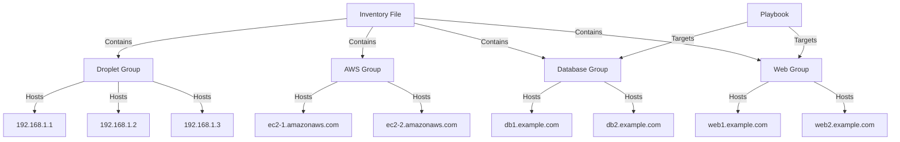

## Grouping Servers Using Inventory Files

Inventory files are central to Ansible's ability to manage multiple servers efficiently. They allow you to define groups of hosts and apply specific configurations to those groups. This is particularly useful when dealing with heterogeneous environments where different types of servers require different settings.

### Structure of an Inventory File

An inventory file is typically a plain text file that lists the hosts and groups. Here’s a basic structure:

```yaml
[digitalocean]
192.168.1.1
192.168.1.2
192.168.1.3

[aws]
ec2-1.amazonaws.com
ec2-2.amazonaws.com

[database]
db1.example.com
db2.example.com

[web]
web1.example.com
web2.example.com
```

### Grouping Servers

To group servers, you use square brackets `[ ]` to define the group name. Each group can contain a list of hostnames or IP addresses. For example:

```yaml
[digitalocean]
192.168.1.1
192.168.1.2
192.168.1.3

[aws]
ec2-1.amazonaws.com
ec2-2.amazonaws.com

[database]
db1.example.com
db2.example.com

[web]
web1.example.com
web2.example.com
```

### Applying Different Configurations to Groups

Once you have defined groups, you can create playbooks that target specific groups. Playbooks are YAML files that describe the tasks to be executed on the managed nodes. Here’s an example of a playbook that applies different configurations to database and web servers:

```yaml
---
- name: Configure database servers
  hosts: database
  tasks:
    - name: Install MySQL
      apt:
        name: mysql-server
        state: present

- name: Configure web servers
  hosts: web
  tasks:
    - name: Install Apache
      apt:
        name: apache2
        state: present
```

### Running the Playbook

To run the playbook, you use the `ansible-playbook` command followed by the path to the playbook file:

```sh
ansible-playbook -i inventory_file playbook.yml
```

### Diagramming the Inventory Structure

Here’s a mermaid diagram illustrating the structure of the inventory file and how it relates to the playbooks:



### Real-World Example: Recent Breaches

One recent example of a breach that could have been mitigated with proper server management is the Capital One data breach in 2019. The attacker exploited a misconfigured web application firewall (WAF) to access sensitive customer data. Properly grouping and configuring servers using Ansible could have helped ensure that the WAF was correctly set up and monitored.

### How to Prevent / Defend

#### Detection

1. **Logging and Monitoring**: Ensure that all servers have logging enabled and that logs are regularly reviewed. Tools like ELK Stack (Elasticsearch, Logstash, Kibana) can help centralize and analyze logs.
2. **Security Information and Event Management (SIEM)**: Implement SIEM solutions to detect anomalies and potential security incidents.

#### Prevention

1. **Secure Configuration Management**: Use Ansible to enforce consistent and secure configurations across all servers. Ensure that default passwords and unnecessary services are removed.
2. **Role-Based Access Control (RBAC)**: Limit access to servers based on roles. Only grant necessary permissions to users and services.

#### Secure Coding Fixes

Here’s an example of a vulnerable configuration and its secure counterpart:

**Vulnerable Configuration:**

```yaml
---
- name: Install Apache with default settings
  hosts: web
  tasks:
    - name: Install Apache
      apt:
        name: apache2
        state: present
```

**Secure Configuration:**

```yaml
---
- name: Install Apache with secure settings
  hosts: web
  tasks:
    - name: Install Apache
      apt:
        name: apache2
        state: present
    - name: Disable directory listing
      lineinfile:
        path: /etc/apache2/conf-available/security.conf
        regexp: '^#Options Indexes FollowSymLinks'
        line: 'Options -Indexes FollowSymLinks'
        state: present
```

### Complete Example: Full HTTP Request and Response

When configuring web servers, you often need to interact with them via HTTP requests. Here’s an example of a full HTTP request and response:

**HTTP Request:**

```http
GET / HTTP/1.1
Host: web1.example.com
User-Agent: curl/7.64.1
Accept: */*
```

**HTTP Response:**

```http
HTTP/1.1 200 OK
Date: Mon, 20 Mar 2023 12:00:00 GMT
Server: Apache/2.4.41 (Ubuntu)
Content-Type: text/html; charset=UTF-8
Content-Length: 1234
Connection: close

<!DOCTYPE html>
<html>
<head>
    <title>Welcome</title>
</head>
<body>
    <h1>Welcome to our website!</h1>
</body>
</html>
```

### Pitfalls and Common Mistakes

1. **Incomplete Inventory Files**: Forgetting to include all necessary hosts in the inventory file can lead to missed configurations.
2. **Incorrect Grouping**: Incorrectly grouping servers can result in unintended configurations being applied.
3. **Manual Configuration Drift**: Relying too much on manual configuration can lead to drift over time, where the actual state of the servers diverges from the intended state.

### Hands-On Labs

For practical experience with Ansible and server management, consider the following labs:

- **PortSwigger Web Security Academy**: Offers hands-on labs for web application security.
- **OWASP Juice Shop**: A deliberately insecure web application for practicing security skills.
- **DVWA (Damn Vulnerable Web Application)**: A PHP/MySQL web application that is riddled with vulnerabilities for educational purposes.
- **WebGoat**: An interactive, gamified training application for learning about web application security.

By thoroughly understanding and implementing the concepts covered in this chapter, you can effectively manage and secure your server infrastructure using Ansible.

---
<!-- nav -->
[[04-Introduction to Ansible and Server Management|Introduction to Ansible and Server Management]] | [[DevOps/DevOps Bootcamp/07-Configuration Management (Ansible)/09-Ansible Server Management Setup Using Inventory Files/00-Overview|Overview]] | [[DevOps/DevOps Bootcamp/07-Configuration Management (Ansible)/09-Ansible Server Management Setup Using Inventory Files/06-Practice Questions & Answers|Practice Questions & Answers]]
