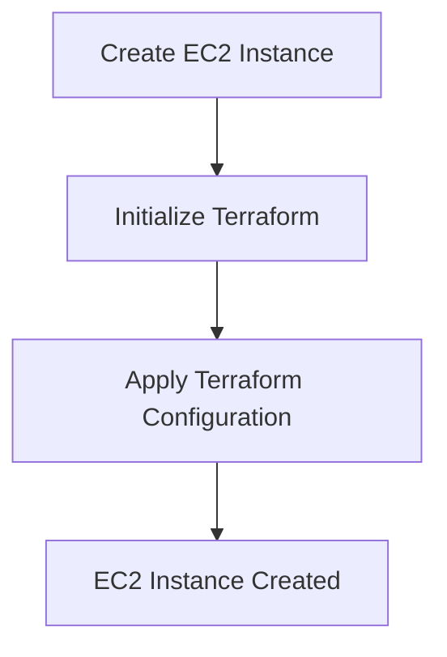
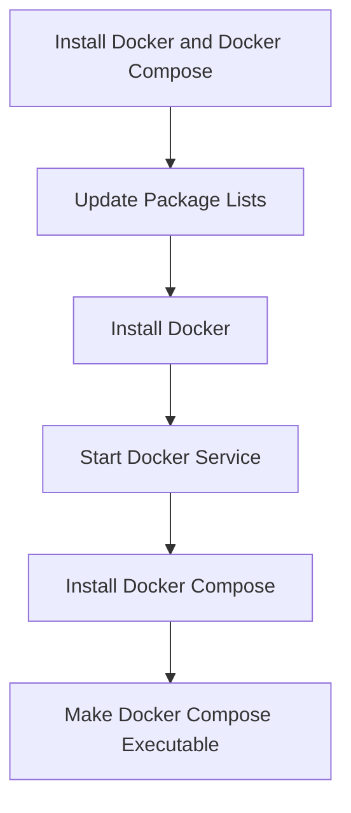
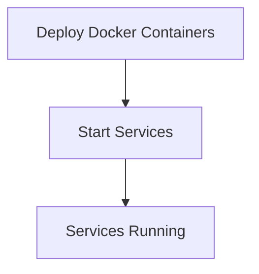

## Introduction to Automated Docker Setup on AWS EC2 with Ansible

In this section, we will delve into the process of setting up Docker and Docker Compose on an AWS EC2 server using Ansible (Ansible). This automation will streamline the deployment of containerized applications, ensuring consistency and reducing human error. We will cover the entire workflow, from creating the EC2 instance to deploying the Docker containers, using Ansible playbooks and Terraform scripts.

### Background Theory

#### What is Docker?
Docker is a platform that allows developers to package their applications into lightweight, portable containers. These containers can run consistently across different environments, whether it's a local development machine, a testing environment, or a production server. Docker uses a container runtime to manage the execution of these containers, providing a consistent and isolated environment for the application.

#### What is Docker Compose?
Docker Compose is a tool for defining and running multi-container Docker applications. With Compose, you use a YAML file to configure your application’s services. Then, with a single command, you create and start all the services from your configuration.

#### What is Ansible?
Ansible is an open-source automation tool that simplifies the process of configuring and managing infrastructure. It uses a simple language called YAML to define tasks and workflows. Ansible operates agentless, meaning it does not require any additional software to be installed on the managed nodes.

#### What is Terraform?
Terraform is an infrastructure as code (IaC) tool that allows you to define and provision infrastructure resources using declarative configuration files. Terraform supports a wide range of cloud providers, including AWS, and provides a consistent way to manage infrastructure across different environments.

### Why Automate with Ansible and Terraform?

Automating the setup of Docker and Docker Compose on an EC2 instance using Ansible and Terraform offers several benefits:

1. **Consistency**: Ensures that the environment is set up consistently across different deployments.
2. **Repeatability**: Allows you to recreate the environment easily and reliably.
3. **Scalability**: Simplifies the management of multiple instances and environments.
4. **Reduced Human Error**: Minimizes the risk of errors that can occur during manual setup.

### Setting Up the Environment

Before we dive into the specific steps, let's outline the overall process:

1. **Create an EC2 Instance Using Terraform**.
2. **Configure the EC2 Instance Using Ansible**.
3. **Deploy Docker Containers Using Docker Compose**.

### Step 1: Create an EC2 Instance Using Terraform

#### Prerequisites

To create an EC2 instance using Terraform, you need to have the following:

- An AWS account with appropriate permissions.
- Terraform installed on your local machine.
- Access keys and secret access keys configured in your AWS credentials file (`~/.aws/credentials`).

#### Terraform Configuration

Let's create a Terraform configuration file (`main.tf`) to define the EC2 instance.

```hcl
provider "aws" {
  region = "us-west-2"
}

resource "aws_instance" "example" {
  ami           = "ami-0c55b159cbfafe1f0"
  instance_type = "t2.micro"

  tags = {
    Name = "docker-instance"
  }
}
```

This configuration defines an EC2 instance in the `us-west-2` region with the specified AMI and instance type. The `tags` block adds a name tag to the instance.

#### Running Terraform

To apply the configuration and create the EC2 instance, run the following commands:

```sh
terraform init
terraform apply
```

The `terraform init` command initializes the Terraform working directory, and `terraform apply` creates the EC2 instance based on the configuration.

### Step 2: Configure the EC2 Instance Using Ansible

#### Prerequisites

To configure the EC2 instance using Ansible, you need to have the following:

- Ansible installed on your local machine.
- SSH access to the EC2 instance.
- A known_hosts file updated with the EC2 instance's public key.

#### Ansible Playbook

Let's create an Ansible playbook (`install_docker.yml`) to install Docker and Docker Compose on the EC2 instance.

```yaml
---
- name: Install Docker and Docker Compose on EC2
  hosts: docker-instance
  become: yes
  tasks:
    - name: Update package lists
      yum:
        name: "*"
        state: latest

    - name: Install Docker
      yum:
        name: docker
        state: present

    - name: Start Docker service
      service:
        name: docker
        state: started
        enabled: yes

    - name: Install Docker Compose
      get_url:
        url: https://github.com/docker/compose/releases/download/1.29.2/docker-compose-Linux-x86_64
        dest: /usr/local/bin/docker-compose
      register: compose_download

    - name: Make Docker Compose executable
      file:
        path: /usr/local/bin/docker-compose
        mode: '0755'
```

This playbook performs the following tasks:

1. **Update package lists**: Ensures that the package lists are up-to-date.
2. **Install Docker**: Installs the Docker package.
3. **Start Docker service**: Starts the Docker service and ensures it starts on boot.
4. **Install Docker Compose**: Downloads and installs Docker Compose.
5. **Make Docker Compose executable**: Sets the correct permissions for Docker Compose.

#### Running the Ansible Playbook

To run the Ansible playbook, execute the following command:

```sh
ansible-playbook -i inventory.ini install_docker.yml
```

Here, `inventory.ini` is an inventory file that specifies the EC2 instance's IP address and SSH details.

### Step 3: Deploy Docker Containers Using Docker Compose

#### Prerequisites

To deploy Docker containers using Docker Compose, you need to have the following:

- A Docker Compose file (`docker-compose.yml`) that defines the services to be deployed.
- The necessary images built and available in a Docker registry.

#### Docker Compose File

Let's create a sample Docker Compose file (`docker-compose.yml`) to define a simple application with two services: a web server and a database.

```yaml
version: '3'
services:
  web:
    image: my-web-server:latest
    ports:
      - "80:80"
  db:
    image: postgres:latest
    environment:
      POSTGRES_PASSWORD: mysecretpassword
```

This file defines two services: `web` and `db`. The `web` service maps port 80 on the host to port 80 on the container. The `db` service sets an environment variable for the PostgreSQL password.

#### Deploying the Application

To deploy the application using Docker Compose, run the following command on the EC2 instance:

```sh
docker-compose up -d
```

This command starts the services defined in the `docker-compose.yml` file in detached mode.

### Common Pitfalls and How to Prevent Them

#### Pitfall 1: Incorrect Permissions

**Issue**: If Docker Compose is not made executable, it may fail to run.

**Prevention**: Ensure that Docker Compose is made executable by setting the correct permissions.

**Secure Code Fix**:

```yaml
# Vulnerable code
- name: Install Docker Compose
  get_url:
    url: https://github.com/docker/compose/releases/download/1.29.2/docker-compose-Linux-x86_64
    dest: /usr/local/bin/docker-compose

# Secure code
- name: Install Docker Compose
  get_url:
    url: https://github.com/docker/compose/releases/download/1.29.2/docker-compose-Linux-x86_64
    dest: /usr/local/bin/docker-compose
  register: compose_download

- name: Make Docker Compose executable
  file:
    path: /usr/local/bin/docker-compose
    mode: '0755'
```

#### Pitfall 2: Outdated Packages

**Issue**: If the package lists are not updated, the installation may fail due to outdated dependencies.

**Prevention**: Always update the package lists before installing new packages.

**Secure Code Fix**:

```yaml
# Vulnerable code
- name: Install Docker
  yum:
    name: docker
    state: present

# Secure code
- name: Update package lists
  yum:
    name: "*"
    state: latest

- name: Install Docker
  yum:
    name: docker
    state: present
```

### Detection and Prevention

#### Detection

To detect issues with the setup, you can use the following methods:

- **Log Analysis**: Check the logs for any errors or warnings.
- **Health Checks**: Use health checks to ensure that the services are running correctly.

#### Prevention

To prevent issues, follow these best practices:

- **Use Version Control**: Store your Terraform and Ansible configurations in a version control system.
- **Automated Testing**: Implement automated testing to verify that the setup works as expected.
- **Regular Updates**: Keep your tools and dependencies up-to-date to avoid security vulnerabilities.

### Real-World Examples

#### Example 1: CVE-2021-21287

**Description**: A vulnerability in Docker Compose allowed unauthorized access to the Docker daemon.

**Impact**: An attacker could gain unauthorized access to the Docker daemon and potentially compromise the entire system.

**Mitigation**: Ensure that Docker Compose is properly configured and that the Docker daemon is secured.

#### Example 2: CVE-2021-25282

**Description**: A vulnerability in Docker allowed unauthorized access to the Docker API.

**Impact**: An attacker could gain unauthorized access to the Docker API and potentially compromise the entire system.

**Mitigation**: Ensure that the Docker API is properly secured and that access is restricted to authorized users.

### Conclusion

By automating the setup of Docker and Docker Compose on an EC2 instance using Ansible and Terraform, you can ensure consistency, repeatability, and scalability. This approach minimizes the risk of human error and provides a reliable way to manage your infrastructure.

### Practice Labs

For hands-on practice, consider the following labs:

- **PortSwigger Web Security Academy**: Offers a variety of labs for web application security.
- **OWASP Juice Shop**: A deliberately insecure web application for practicing web security skills.
- **DVWA (Damn Vulnerable Web Application)**: A PHP/MySQL web application that is riddled with vulnerabilities.
- **WebGoat**: A deliberately insecure Java web application designed to teach web application security lessons.

These labs provide a practical way to apply the concepts learned in this chapter and improve your skills in DevOps and security.

### Diagrams

#### Terraform Workflow Diagram



#### Ansible Workflow Diagram



#### Docker Compose Workflow Diagram



By following these detailed steps and understanding the underlying concepts, you can effectively automate the setup of Docker and Docker Compose on an AWS EC2 instance using Ansible and Terraform.

---
<!-- nav -->
[[02-Introduction to Ansible and Automated Docker Setup on AWS EC2|Introduction to Ansible and Automated Docker Setup on AWS EC2]] | [[DevOps/DevOps Bootcamp/07-Configuration Management (Ansible)/11-Automated Docker Setup on AWS EC2 with Ansible/00-Overview|Overview]] | [[04-Introduction to Docker Setup on AWS EC2 with Ansible|Introduction to Docker Setup on AWS EC2 with Ansible]]
