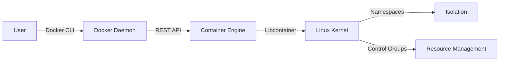
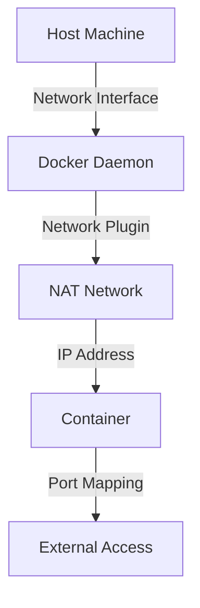

## Introduction to Docker Setup on AWS EC2 with Ansible

In this section, we will delve into the process of setting up Docker on an Amazon Web Services (AWS) Elastic Compute Cloud (EC2) instance using Ansible. This setup is crucial for automating the deployment and management of containerized applications. We'll cover the necessary steps to ensure Docker is properly installed, configured, and operational on an EC2 instance.

### Prerequisites

Before diving into the setup, ensure you have the following:

1. **AWS Account**: An active AWS account with access to EC2 instances.
2. **Ansible Installed**: Ansible should be installed on your local machine or a remote server.
3. **EC2 Instance**: An EC2 instance running a Linux distribution (e.g., Ubuntu, Amazon Linux).

### Step-by-Step Guide

#### 1. Update and Install Docker

First, we need to update the package list and install Docker on the EC2 instance. This can be done using Ansible's `apt` or `yum` modules depending on the Linux distribution.

```yaml
---
- name: Update and install Docker
  hosts: ec2_instance
  become: yes
  tasks:
    - name: Update package list
      apt:
        update_cache: yes
      when: ansible_os_family == 'Debian'

    - name: Install Docker
      apt:
        name: docker.io
        state: present
      when: ansible_os_family == 'Debian'

    - name: Update package list
      yum:
        update_cache: yes
      when: ansible_os_family == 'RedHat'

    - name: Install Docker
      yum:
        name: docker
        state: present
      when: ansible_os_family == 'RedHat'
```

This playbook updates the package list and installs Docker. The `become: yes` directive ensures that the tasks are executed with elevated privileges.

#### 2. Start Docker Service

After installing Docker, we need to start the Docker daemon. This can be achieved using the `systemd` module in Ansible.

```yaml
---
- name: Start Docker service
  hosts: ec2_instance
  become: yes
  tasks:
    - name: Start Docker service
      systemd:
        name: docker
        state: started
```

This playbook starts the Docker service using the `systemd` module. The `state: started` directive ensures that the Docker service is running.

#### 3. Verify Docker Installation

To verify that Docker is installed and running correctly, we can attempt to pull an image from Docker Hub. In this example, we will pull the Redis image.

```bash
docker pull redis
```

If Docker is not running, you will receive an error message indicating that Docker cannot connect to the Docker daemon.

#### 4. Handle Permission Issues

When executing Docker commands, you might encounter permission issues. This is because the default user on an EC2 instance does not have the necessary permissions to interact with the Docker daemon.

To resolve this issue, we need to add the EC2 user to the Docker group.

```yaml
---
- name: Add EC2 user to Docker group
  hosts: ec2_instance
  become: yes
  tasks:
    - name: Add EC2 user to Docker group
      user:
        name: ec2-user
        groups: docker
        append: yes
```

This playbook adds the `ec2-user` to the `docker` group. The `append: yes` directive ensures that the user is added to the group without removing any existing group memberships.

### Detailed Explanation

#### Docker Installation

**What is Docker?**
Docker is a platform that allows developers to package their applications into lightweight, portable containers. These containers can run consistently across different environments, ensuring that the application behaves the same way whether it is running locally or in production.

**Why Install Docker?**
Installing Docker on an EC2 instance enables you to deploy and manage containerized applications. This is particularly useful for DevOps teams who need to automate the deployment and scaling of applications.

**How Does Docker Work?**
Docker uses a client-server architecture. The Docker daemon runs on the host machine and manages the execution of containers. The Docker client communicates with the daemon to perform operations such as building images, running containers, and managing networks.

#### Starting Docker Service

**What is the Docker Daemon?**
The Docker daemon is the core component of the Docker platform. It listens for API requests and manages the lifecycle of Docker objects such as images, containers, networks, and volumes.

**Why Start the Docker Daemon?**
Starting the Docker daemon is essential for enabling the execution of Docker commands. Without a running Docker daemon, you will not be able to interact with Docker.

**How to Start the Docker Daemon?**
The Docker daemon can be started using various methods, including `systemctl`, `service`, or `init.d`. In this example, we use the `systemd` module in Ansible to start the Docker service.

#### Handling Permission Issues

**What Causes Permission Issues?**
Permission issues occur when the user executing Docker commands does not have the necessary permissions to interact with the Docker daemon. By default, only users in the `docker` group have the required permissions.

**Why Add the User to the Docker Group?**
Adding the user to the `docker` group grants them the necessary permissions to execute Docker commands without needing to use `sudo`.

**How to Add a User to the Docker Group?**
The `usermod` command can be used to add a user to a group. In this example, we use the `user` module in Ansible to add the `ec2-user` to the `docker` group.

### Real-World Examples

#### Recent CVEs and Breaches

**CVE-2019-14271:**
This vulnerability affects Docker versions prior to 19.03.1. It allows an attacker to escalate privileges and gain root access to the host machine. To mitigate this vulnerability, ensure that Docker is updated to the latest version.

**Example:**
```bash
# Check Docker version
docker --version

# Update Docker
sudo apt-get update
sudo apt-get upgrade docker-ce
```

#### Secure Configuration

**How to Prevent / Defend**

**Detection:**
Regularly monitor the Docker daemon logs for suspicious activity. Use tools like `auditd` to track changes to Docker configurations.

**Prevention:**
1. **Keep Docker Updated:** Ensure that Docker is updated to the latest version to patch known vulnerabilities.
2. **Use SELinux or AppArmor:** Enable SELinux or AppArmor to restrict the capabilities of Docker containers.
3. **Limit User Permissions:** Restrict the permissions of users who interact with Docker to minimize the risk of privilege escalation.

**Secure-Coding Fixes:**

**Vulnerable Code:**
```yaml
---
- name: Start Docker service
  hosts: ec2_instance
  become: yes
  tasks:
    - name: Start Docker service
      systemd:
        name: docker
        state: started
```

**Fixed Code:**
```yaml
---
- name: Start Docker service securely
  hosts: ec2_instance
  become: yes
  tasks:
    - name: Start Docker service
      systemd:
        name: docker
        state: started
    - name: Ensure Docker is updated
      apt:
        name: docker-ce
        state: latest
      when: ansible_os_family == 'Debian'
    - name: Ensure Docker is updated
      yum:
        name: docker-ce
        state: latest
      when: ansible_os_family == 'RedHat'
```

### Diagrams

#### Docker Architecture



#### Docker Network Topology



### Practice Labs

For hands-on practice, consider the following labs:

- **PortSwigger Web Security Academy**: Offers a comprehensive set of labs for learning web security concepts.
- **OWASP Juice Shop**: A deliberately insecure web application for practicing web security skills.
- **DVWA (Damn Vulnerable Web Application)**: A PHP/MySQL web application that is riddled with vulnerabilities.
- **WebGoat**: An interactive, gamified training application for learning about web security.

These labs provide practical experience in setting up and securing Docker on AWS EC2 instances.

### Conclusion

In this section, we covered the steps to set up Docker on an AWS EC2 instance using Ansible. We discussed the installation, starting the Docker service, handling permission issues, and provided real-world examples and secure configuration practices. By following these steps, you can ensure that Docker is properly installed and configured on your EC2 instance, enabling you to deploy and manage containerized applications effectively.

---
<!-- nav -->
[[03-Introduction to Automated Docker Setup on AWS EC2 with Ansible|Introduction to Automated Docker Setup on AWS EC2 with Ansible]] | [[DevOps/DevOps Bootcamp/07-Configuration Management (Ansible)/11-Automated Docker Setup on AWS EC2 with Ansible/00-Overview|Overview]] | [[05-Key Concepts and Background Theory|Key Concepts and Background Theory]]
