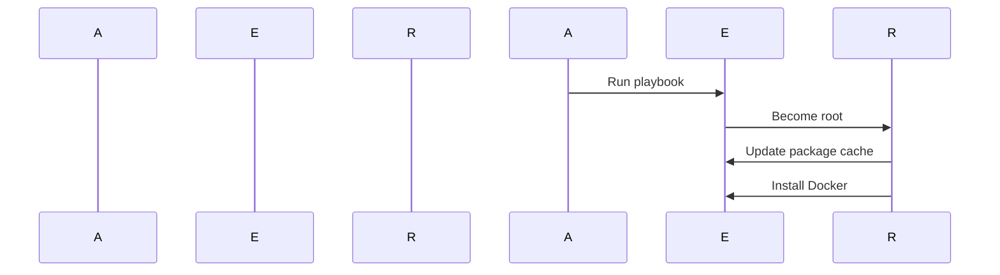

## Automated Docker Setup on AWS EC2 with Ansible

In this section, we will delve into the process of automating the setup of Docker on an AWS EC2 instance using Ansible. This involves understanding how to manage package installations, privilege escalation, and ensuring security throughout the process.

### Package Installation with Ansible

When working with Ansible, one of the primary tasks is managing packages on remote systems. Ansible provides a module called `yum` (for Red Hat-based systems) and `apt` (for Debian-based systems) to handle package management. In our context, we will focus on the `yum` module, but the principles apply similarly to `apt`.

#### Update Cache During Installation

Whenever you install a package, it's crucial to ensure that the package repository cache is up-to-date. This prevents issues where outdated information might cause installation failures or conflicts. Ansible allows you to update the cache as part of the installation process through the `update_cache` attribute.

```yaml
- name: Install Docker
  yum:
    name: docker
    state: present
    update_cache: yes
```

Here, the `update_cache: yes` attribute ensures that the package cache is updated before proceeding with the installation. This is particularly important because package repositories can change frequently, and having an outdated cache can lead to missing dependencies or incorrect versions being installed.

#### State Attribute

The `state` attribute in the `yum` module determines whether a package should be installed (`present`) or uninstalled (`absent`). This attribute is essential for maintaining the desired state of your system.

```yaml
- name: Ensure Docker is installed
  yum:
    name: docker
    state: present

- name: Ensure Docker is removed
  yum:
    name: docker
    state: absent
```

In the first task, `state: present` ensures that Docker is installed. In the second task, `state: absent` ensures that Docker is removed if it exists.

### Privilege Escalation

When performing administrative tasks such as installing packages, you often need elevated privileges. On most Linux systems, this means running commands as the `root` user. However, for security reasons, it's generally recommended to avoid logging in as `root` and instead use a regular user account with sudo privileges.

#### Using `become` in Ansible

Ansible provides the `become` attribute to escalate privileges during playbook execution. By default, Ansible runs tasks as the user specified in the inventory (or the current user if not specified). To run a task as `root`, you can use the `become` attribute.

```yaml
- name: Install Docker as root
  yum:
    name: docker
    state: present
  become: yes
```

Here, `become: yes` tells Ansible to run the `yum` task with elevated privileges. By default, `become_user` is set to `root`, so no additional configuration is needed unless you want to specify a different user.

#### Specifying a Different User

If you need to run a task as a different user other than `root`, you can specify the `become_user` attribute.

```yaml
- name: Install Docker as a specific user
  yum:
    name: docker
    state: present
  become: yes
  become_user: myadminuser
```

In this example, the `yum` task will be executed as the `myadminuser` user.

### Example Playbook

Let's put together a complete playbook that installs Docker on an AWS EC2 instance, ensuring the package cache is updated and using privilege escalation.

```yaml
---
- name: Setup Docker on AWS EC2
  hosts: ec2_instances
  become: yes

  tasks:
    - name: Update package cache
      yum:
        name: "*"
        state: latest
        update_cache: yes

    - name: Install Docker
      yum:
        name: docker
        state: present
```

This playbook performs the following steps:
1. Updates the package cache.
2. Installs Docker.

### Diagramming the Process

To visualize the process, let's create a sequence diagram using Mermaid:



### Common Pitfalls and How to Prevent Them

#### Incorrect Privilege Escalation

One common pitfall is forgetting to use `become` when running tasks that require elevated privileges. This can result in permission errors and failed tasks.

**Example of a Vulnerable Task:**

```yaml
- name: Install Docker (without become)
  yum:
    name: docker
    state: present
```

**Secure Version:**

```yaml
- name: Install Docker (with become)
  yum:
    name: docker
    state: present
  become: yes
```

#### Outdated Package Cache

Another common issue is not updating the package cache before installing packages. This can lead to missing dependencies or incorrect versions being installed.

**Example of a Vulnerable Task:**

```yaml
- name: Install Docker (without updating cache)
  yum:
    name: docker
    state: present
```

**Secure Version:**

```yaml
- name: Install Docker (with updating cache)
  yum:
    name: docker
    state: present
    update_cache: yes
```

### Detection and Prevention

To detect and prevent these issues, you can use Ansible's built-in error handling and logging mechanisms. Additionally, you can use tools like `ansible-lint` to check your playbooks for common mistakes.

#### Using `ansible-lint`

`ansible-lint` is a static analysis tool that checks Ansible playbooks for common errors and best practices.

```sh
ansible-lint playbook.yml
```

This command will analyze your playbook and report any potential issues.

### Real-World Examples

#### CVE-2021-25285

CVE-2021-25285 is a vulnerability in the `yum` package manager that could allow an attacker to execute arbitrary code. This vulnerability highlights the importance of keeping your package managers and their dependencies up-to-date.

**Mitigation:**

Ensure that your package cache is regularly updated and that you are using the latest version of the package manager.

### Hands-On Practice

For hands-on practice, you can use the following labs:

- **PortSwigger Web Security Academy**: While primarily focused on web security, this platform offers a variety of challenges that can help you understand the broader context of securing your infrastructure.
- **AWS Official Workshops**: These workshops provide detailed guides and hands-on exercises for setting up and securing various services on AWS, including EC2 instances.

By following these guidelines and practicing with real-world scenarios, you can ensure that your Docker setup on AWS EC2 is both efficient and secure.

---
<!-- nav -->
[[05-Key Concepts and Background Theory|Key Concepts and Background Theory]] | [[DevOps/DevOps Bootcamp/07-Configuration Management (Ansible)/11-Automated Docker Setup on AWS EC2 with Ansible/00-Overview|Overview]] | [[07-User Group Management and Docker Permissions on AWS EC2|User Group Management and Docker Permissions on AWS EC2]]
