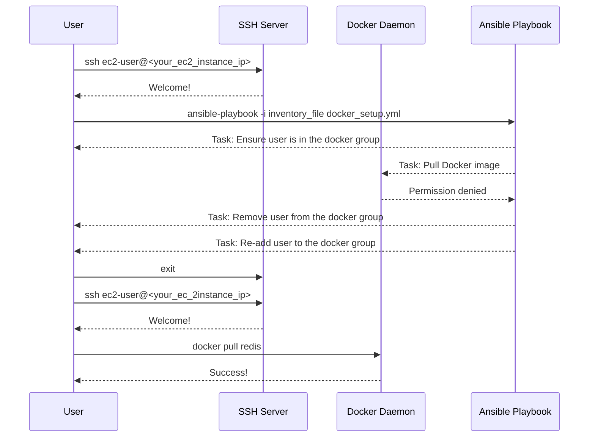

## User Group Management and Docker Permissions on AWS EC2

### Background Theory

When working with Docker on an AWS EC2 instance, managing user permissions is crucial for ensuring that users can interact with Docker without needing elevated privileges such as `root`. By default, Docker runs as a service that requires specific permissions to access and manage containers. Adding a user to the `docker` group allows them to run Docker commands without needing to prepend `sudo`.

#### Why Add Users to the Docker Group?

Adding a user to the `docker` group is necessary because Docker commands require certain permissions to interact with the Docker daemon. Without these permissions, users will receive a `permission denied` error when attempting to run Docker commands. This is particularly important in a multi-user environment where different users may need to manage Docker containers independently.

### Steps to Add a User to the Docker Group

To add a user to the Docker group, you typically use the following command:

```bash
sudo usermod -aG docker <username>
```

This command adds the specified user to the `docker` group. However, this change only takes effect after the user logs out and logs back in again. This is because the group membership is loaded at login time, and the current session retains the old group membership until the user logs out and logs back in.

### Demonstrating the Effectiveness of Group Membership Changes

Let's walk through a demonstration to illustrate this behavior.

1. **Add the User to the Docker Group:**

    ```bash
    sudo usermod -aG docker ec2-user
    ```

2. **Log Out and Log Back In:**

    After running the above command, the user must log out and log back in for the changes to take effect.

    ```bash
    exit
    ssh ec2-user@<your_ec2_instance_ip>
    ```

3. **Verify Group Membership:**

    Once logged back in, verify that the user is now part of the `docker` group:

    ```bash
    groups
    ```

    You should see `docker` listed among the groups.

### Automating Docker Setup with Ansible

Ansible is a powerful automation tool that can be used to automate the setup of Docker on an EC2 instance. Let's create an Ansible playbook to automate the process of adding a user to the Docker group and pulling a Docker image.

#### Creating the Ansible Playbook

Here is a sample Ansible playbook (`docker_setup.yml`) that automates the process:

```yaml
---
- name: Docker Setup on EC2
  hosts: all
  become: yes
  vars:
    user: ec2-user
    docker_image: redis

  tasks:
    - name: Ensure user is in the docker group
      user:
        name: "{{ user }}"
        groups: docker
        append: yes

    - name: Remove user from the docker group
      user:
        name: "{{ user }}"
        groups: ""
        append: no

    - name: Re-add user to the docker group
      user:
        name: "{{ user }}"
        groups: docker
        append: yes

    - name: Pull Docker image
      command: docker pull {{ docker_image }}
      register: docker_pull_result
      changed_when: docker_pull_result.stdout != ""

    - name: Display result of Docker pull
      debug:
        msg: "Docker pull result: {{ docker_pull_result.stdout }}"
```

#### Running the Ansible Playbook

To run the playbook, you would use the following command:

```bash
ansible-playbook -i inventory_file docker_setup.yml
```

Where `inventory_file` is your Ansible inventory file containing the IP address of your EC2 instance.

### Handling Permission Issues

If you encounter a `permission denied` error when trying to run Docker commands, it is likely due to the user not being part of the `docker` group. This can happen if the user has not logged out and logged back in after being added to the group.

#### Example Error Message

```plaintext
Got permission denied while trying to connect to the Docker daemon socket at unix:///var/run/docker.sock: Post http://%2Fvar%2Frun%2Fdocker.sock/v1.24/images/create?fromImage=redis: dial unix /var/run/docker.sock: connect: permission denied
```

### How to Prevent / Defend

#### Detection

To detect whether a user is part of the `docker` group, you can check the output of the `groups` command:

```bash
groups
```

If `docker` is not listed, the user is not part of the group.

#### Prevention

Ensure that users are added to the `docker` group and that they log out and log back in to apply the changes. Additionally, you can use Ansible to automate this process and ensure that the user is always part of the `docker` group.

#### Secure Coding Fix

Here is a comparison of the vulnerable and secure versions of the Ansible playbook:

**Vulnerable Version:**

```yaml
---
- name: Vulnerable Docker Setup
  hosts: all
  become: yes
  vars:
    user: ec2-user
    docker_image: redis

  tasks:
    - name: Ensure user is in the docker group
      user:
        name: "{{ user }}"
        groups: docker
        append: yes

    - name: Pull Docker image
      command: docker pull {{ docker_image }}
      register: docker_pull_result
      changed_when: docker_pull_result.stdout != ""

    - name: Display result of Docker pull
      debug:
        msg: "Docker pull result: {{ docker_pull_result.stdout }}"
```

**Secure Version:**

```yaml
---
- name: Secure Docker Setup
  hosts: all
  become: yes
  vars:
    user: ec2-user
    docker_image: redis

  tasks:
    - name: Ensure user is in the docker group
      user:
        name: "{{ user }}"
        groups: docker
        append: yes

    - name: Remove user from the docker group
      user:
        name: "{{ user }}"
        groups: ""
        append: no

    - name: Re-add user to the docker group
      user:
        name: "{{ user }}"
        groups: docker
        append: yes

    - name: Pull Docker image
      command: docker pull {{ docker_image }}
      register: docker_pull_result
      changed_when: docker_pull_result.stdout != ""

    - name: Display result of Docker pull
      debug:
        msg: "Docker pull result: {{ docker_pull_result.stdout }}"
```

### Diagrams

#### Mermaid Diagram for User Group Management



### Real-World Examples

#### Recent Breaches and CVEs

In recent years, there have been several instances where misconfigured Docker setups led to security breaches. For example, in 2021, a misconfigured Docker setup allowed attackers to gain unauthorized access to a company's internal systems. Ensuring proper user management and logging practices can help mitigate such risks.

### Hands-On Labs

For hands-on practice, consider the following labs:

- **PortSwigger Web Security Academy:** Offers a variety of labs related to Docker and container security.
- **OWASP Juice Shop:** A deliberately insecure web application for security training.
- **DVWA (Damn Vulnerable Web Application):** Another popular web application for security training.

These labs provide practical experience in managing Docker and securing container environments.

By thoroughly understanding and implementing the steps outlined above, you can effectively manage Docker permissions on AWS EC2 instances and ensure a secure and efficient environment.

---
<!-- nav -->
[[06-Automated Docker Setup on AWS EC2 with Ansible|Automated Docker Setup on AWS EC2 with Ansible]] | [[DevOps/DevOps Bootcamp/07-Configuration Management (Ansible)/11-Automated Docker Setup on AWS EC2 with Ansible/00-Overview|Overview]] | [[DevOps/DevOps Bootcamp/07-Configuration Management (Ansible)/11-Automated Docker Setup on AWS EC2 with Ansible/08-Practice Questions & Answers|Practice Questions & Answers]]
