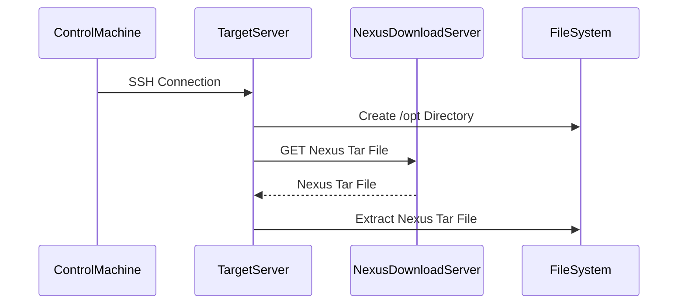

## Introduction to Ansible Playbooks for Nexus Installation

In this section, we will delve into the process of automating the installation of Nexus Repository Manager using Ansible. Ansible is a powerful automation tool that simplifies the deployment, configuration, and management of IT infrastructure. By leveraging Ansible, we can ensure consistency and reliability across our environments, reducing the likelihood of human error and streamlining operations.

### Background Theory

#### What is Ansible?

Ansible is an open-source automation tool that uses simple YAML-based playbooks to define and manage complex IT infrastructure. It operates agentless, meaning it does not require any additional software to be installed on the target systems. Instead, it relies on SSH for communication and execution.

#### What is Nexus Repository Manager?

Nexus Repository Manager is a popular artifact repository manager developed by Sonatype. It provides a centralized location for storing and managing various types of artifacts, such as Maven, npm, Docker, and more. Nexus Repository Manager helps organizations manage their software dependencies efficiently, ensuring consistent and reliable builds.

### Prerequisites

Before we begin, ensure you have the following:

1. **Ansible Installed**: Install Ansible on your control machine. You can do this using `pip`:
    ```bash
    pip install ansible
    ```

2. **SSH Access**: Ensure you have SSH access to the target server where Nexus will be installed.

3. **Inventory File**: Create an inventory file (`hosts`) that lists your target servers. For example:
    ```ini
    [servers]
    myserver ansible_host=192.168.1.100
    ```

### Step-by-Step Guide to Automating Nexus Installation

#### Step 1: Update the Package Repository

The first step in our playbook is to update the package repository on the target server. This ensures that we have the latest package information available for installation.

```yaml
---
- name: Update package repository
  hosts: servers
  become: yes
  tasks:
    - name: Update package repository
      apt:
        update_cache: yes
```

**Explanation:**
- **`become: yes`**: This directive allows the playbook to run with elevated privileges, typically required for system-level changes.
- **`apt:`**: This module is used to manage Debian/Ubuntu package installations. The `update_cache: yes` parameter updates the package cache.

#### Step 2: Install Java Version 8

Next, we need to install Java version 8 on the target server. Java is a prerequisite for running Nexus Repository Manager.

```yaml
    - name: Install Java version 8
      apt:
        name: openjdk-8-jdk
        state: present
```

**Explanation:**
- **`name: openjdk-8-jdk`**: Specifies the package name to be installed.
- **`state: present`**: Ensures that the package is installed.

#### Step 3: Install NetTools

NetTools is a collection of network utilities that can be useful for managing the server. We will also install this package.

```yaml
    - name: Install NetTools
      apt:
        name: net-tools
        state: present
```

**Explanation:**
- **`name: net-tools`**: Specifies the package name to be installed.
- **`state: present`**: Ensures that the package is installed.

#### Step 4: Download and Extract Nexus

After installing the necessary packages, we need to download the latest Nexus tar file and extract it.

```yaml
- name: Download and extract Nexus
  hosts: servers
  become: yes
  tasks:
    - name: Change directory to /opt
      file:
        path: /opt
        state: directory

    - name: Download Nexus tar file
      get_url:
        url: https://download.sonatype.com/nexus/3/latest-unix.tar.gz
        dest: /opt/nexus-latest.tar.gz

    - name: Extract Nexus tar file
      unarchive:
        src: /opt/nexus-latest.tar.gz
        dest: /opt/
        remote_src: yes
```

**Explanation:**
- **`file:`**: Ensures that the `/opt` directory exists.
- **`get_url:`**: Downloads the Nexus tar file from the specified URL.
- **`unarchive:`**: Extracts the downloaded tar file to the `/opt` directory.

### Complete Playbook Example

Here is the complete playbook that combines all the steps:

```yaml
---
- name: Update package repository
  hosts: servers
  become: yes
  tasks:
    - name: Update package repository
      apt:
        update_cache: yes

    - name: Install Java version 8
      apt:
        name: openjdk-8-jdk
        state: present

    - name: Install NetTools
      apt:
        name: net-tools
        state: present

- name: Download and extract Nexus
  hosts: servers
  become: yes
  tasks:
    - name: Change directory to /opt
      file:
        path: /opt
        state: directory

    - name: Download Nexus tar file
      get_url:
        url: https://download.sonatype.com/nexus/3/latest-unix.tar.gz
        dest: /opt/nexus-latest.tar.gz

    - name: Extract Nexus tar file
      unarchive:
        src: /opt/nexus-latest.tar.gz
        dest: /opt/
        remote_src: yes
```

### Diagrams

#### Network Topology

```mermaid
graph LR
A[Control Machine] -- SSH --> B(Target Server)
B -- HTTP --> C[Nexus Download Server]
B -- File System --> D[/opt Directory]
```

#### Sequence Diagram



### Common Pitfalls and How to Avoid Them

#### Pitfall 1: Missing Dependencies

Ensure that all necessary dependencies are installed before attempting to run Nexus. Missing dependencies can lead to runtime errors.

**How to Prevent:**
- Use Ansible to install all required dependencies as part of the playbook.

#### Pitfall 2: Incorrect Permissions

Incorrect permissions on the `/opt` directory can prevent the extraction of the Nexus tar file.

**How to Prevent:**
- Ensure that the `/opt` directory has the correct permissions by using the `file:` module in Ansible.

### Real-World Examples

#### Example 1: CVE-2021-44228 (Log4Shell)

The Log4Shell vulnerability (CVE-2021-44228) affected many Java applications, including those managed by Nexus Repository Manager. Ensuring that all Java dependencies are up-to-date and patched can help mitigate this vulnerability.

**How to Prevent:**
- Regularly update Java and all other dependencies using Ansible playbooks.

### Secure Coding Practices

#### Vulnerable Code

```yaml
- name: Install Java version 8
  apt:
    name: openjdk-8-jdk
    state: present
```

#### Secure Code

```yaml
- name: Install Java version 8
  apt:
    name: openjdk-8-jdk
    state: present
    update_cache: yes
```

**Explanation:**
- Adding `update_cache: yes` ensures that the package cache is updated before installation, reducing the risk of installing outdated packages.

### Detection and Prevention

#### Detection

Use tools like `ansible-galaxy` to scan your playbooks for vulnerabilities and best practices.

#### Prevention

Regularly review and update your playbooks to ensure they follow best practices and security guidelines.

### Conclusion

By automating the installation of Nexus Repository Manager using Ansible, we can ensure consistency and reliability across our environments. This approach reduces the likelihood of human error and streamlines operations. Always ensure that all necessary dependencies are installed and that permissions are correctly set to avoid common pitfalls.

### Practice Labs

For hands-on practice, consider the following labs:

- **PortSwigger Web Security Academy**: Focuses on web application security but can provide valuable context for securing your Nexus setup.
- **OWASP Juice Shop**: Another web application security lab that can help you understand the broader security landscape.

These labs will help you gain practical experience in automating and securing your IT infrastructure.

---
<!-- nav -->
[[DevOps/DevOps Bootcamp/07-Configuration Management (Ansible)/12-Automating Nexus Installation with Ansible/00-Overview|Overview]] | [[02-Introduction to Ansible and Nexus Installation Automation|Introduction to Ansible and Nexus Installation Automation]]
