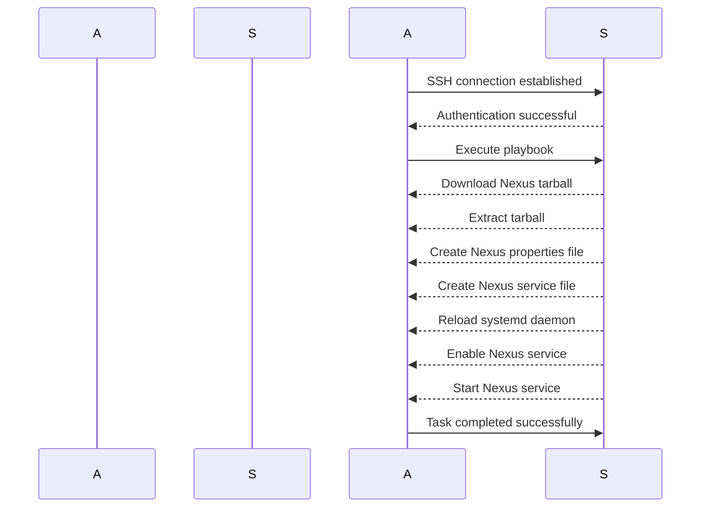

## Introduction to Automating Nexus Installation with Ansible

In this section, we will delve into automating the installation and startup of Nexus on a remote server using Ansible. This process builds upon previous manual steps where we created a droplet, SSHed into the server, and executed commands to download, unpack, and configure Nexus. By automating these steps with Ansible, we gain significant advantages in terms of repeatability and scalability.

### What is Nexus?

Nexus Repository Manager is a powerful artifact management solution that helps organizations manage their software artifacts efficiently. It supports various types of repositories such as Maven, npm, Docker, and more. Nexus provides features like proxying, caching, and hosting of artifacts, making it an essential tool in modern DevOps environments.

### What is Ansible?

Ansible is an open-source automation tool used for configuration management, application deployment, and task automation. It uses simple YAML-based playbooks to define tasks and orchestrate them across multiple servers. Ansible operates agentless, meaning it does not require any additional software to be installed on the target systems, making it lightweight and easy to deploy.

### Why Automate with Ansible?

Automating the installation and configuration of Nexus using Ansible offers several benefits:

1. **Repeatability**: You can consistently reproduce the same environment across different servers.
2. **Scalability**: Easily scale your infrastructure by deploying Nexus on multiple servers.
3. **Speed**: Quickly set up new servers with Nexus installed and running.
4. **Consistency**: Ensure that all installations follow the same best practices and configurations.
5. **Documentation**: Playbooks serve as living documentation of your infrastructure setup.

### Example Scenario

Imagine a scenario where you have a production server running Nexus, and due to unforeseen circumstances, the server fails. Without automation, you would need to manually recreate the entire setup, which is time-consuming and error-prone. With Ansible, you can quickly spin up a new server with Nexus installed and running within minutes.

### Prerequisites

Before diving into the automation process, ensure you have the following prerequisites:

1. **Ansible Installed**: Install Ansible on your control machine. You can install it using `pip`:
    ```bash
    pip install ansible
    ```

2. **SSH Access**: Ensure you have SSH access to the remote server where Nexus will be installed.

3. **Inventory File**: Create an inventory file (`hosts`) to specify the target server(s).

```ini
[nexus_servers]
remote_server_ip ansible_user=your_username
```

4. **Playbook Directory Structure**: Organize your playbook files in a directory structure. For example:
    ```
    nexus_install/
    ├── group_vars/
    │   └── all.yml
    ├── roles/
    │   └── nexus/
    │       ├── tasks/
    │       │   └── main.yml
    │       ├── templates/
    │       │   └── nexus.properties.j2
    │       └── defaults/
    │           └── main.yml
    └── playbook.yml
    ```

### Step-by-Step Automation Process

#### Step 1: Define Variables

Create a `group_vars/all.yml` file to define variables that will be used throughout the playbook.

```yaml
# group_vars/all.yml
nexus_version: "3.37.1"
nexus_download_url: "https://download.sonatype.com/nexus/3/{{ nexus_version }}/nexus-{{ nexus_version }}-unix.tar.gz"
nexus_install_dir: "/opt/nexus"
nexus_user: "nexus"
nexus_group: "nexus"
```

#### Step 2: Create the Role

Create a role named `nexus` to encapsulate all tasks related to Nexus installation.

##### Tasks

Create a `tasks/main.yml` file to define the tasks required to install and configure Nexus.

```yaml
# roles/nexus/tasks/main.yml
- name: Ensure Nexus user exists
  user:
    name: "{{ nexus_user }}"
    system: yes
    shell: /bin/false

- name: Ensure Nexus group exists
  group:
    name: "{{ nexus_group }}"

- name: Download Nexus tarball
  get_url:
    url: "{{ nexus_download_url }}"
    dest: "/tmp/nexus.tar.gz"

- name: Extract Nexus tarball
  unarchive:
    src: "/tmp/nexus.tar.gz"
    dest: "{{ nexus_install_dir }}"
    remote_src: yes
    owner: "{{ nexus_user }}"
    group: "{{ nexus_group }}"

- name: Create Nexus properties file
  template:
    src: "nexus.properties.j2"
    dest: "{{ nexus_install_dir }}/sonatype-work/nexus3/etc/nexus.properties"
    owner: "{{ nexus_user }}"
    group: "{{ nexus_group }}"

- name: Create Nexus service file
  copy:
    src: "nexus.service"
    dest: "/etc/systemd/system/nexus.service"
    owner: root
    group: root
    mode: 0644

- name: Reload systemd daemon
  systemd:
    daemon_reload: yes

- name: Enable Nexus service
  systemd:
    name: nexus
    enabled: yes

- name: Start Nexus service
  systemd:
    name: nexus
    state: started
```

##### Templates

Create a `templates/nexus.properties.j2` file to define the Nexus configuration.

```properties
# templates/nexus.properties.j2
nexus-work={{ nexus_install_dir }}/sonatype-work/nexus3
```

##### Defaults

Create a `defaults/main.yml` file to define default variables for the role.

```yaml
# roles/nexus/defaults/main.yml
nexus_service_name: "nexus"
```

#### Step 3: Create the Playbook

Create a `playbook.yml` file to orchestrate the installation process.

```yaml
# playbook.yml
- name: Install and configure Nexus
  hosts: nexus_servers
  become: yes
  roles:
    - nexus
```

#### Step 4: Run the Playbook

Run the playbook using the following command:

```bash
ansible-playbook -i hosts playbook.yml
```

### Detailed Explanation of Each Task

#### Task 1: Ensure Nexus User Exists

This task ensures that the `nexus` user exists on the system. The `user` module is used to create the user with specific attributes.

```yaml
- name: Ensure Nexus user exists
  user:
    name: "{{ nexus_user }}"
    system: yes
    shell: /bin/false
```

- **system**: Specifies that the user is a system user.
- **shell**: Sets the login shell to `/bin/false`, indicating that the user cannot log in interactively.

#### Task 2: Ensure Nexus Group Exists

This task ensures that the `nexus` group exists on the system. The `group` module is used to create the group.

```yaml
- name: Ensure Nexus group exists
  group:
    name: "{{ nexus_group }}"
```

#### Task 3: Download Nexus Tarball

This task downloads the Nexus tarball from the specified URL using the `get_url` module.

```yaml
- name: Download Nexus tarball
  get_url:
    url: "{{ nexus_download_url }}"
    dest: "/tmp/nexus.tar.gz"
```

- **url**: The URL from which to download the tarball.
- **dest**: The destination path where the tarball will be saved.

#### Task 4: Extract Nexus Tarball

This task extracts the downloaded tarball to the specified installation directory using the `unarchive` module.

```yaml
- name: Extract Nexus tarball
  unarchive:
    src: "/tmp/nexus.tar.gz"
    dest: "{{ nexus_install_dir }}"
    remote_src: yes
    owner: "{{ nexus_user }}"
    group: "{{ nexus_group }}"
```

- **src**: The source path of the tarball.
- **dest**: The destination directory where the tarball will be extracted.
- **remote_src**: Indicates that the source is remote.
- **owner**: The owner of the extracted files.
- **group**: The group of the extracted files.

#### Task 5: Create Nexus Properties File

This task creates the Nexus properties file using the `template` module.

```yaml
- name: Create Nexus properties file
  template:
    src: "nexus.properties.j2"
    dest: "{{ nexus_install_dir }}/sonatype-work/nexus3/etc/nexus.properties"
    owner: "{{ nexus_user }}"
    group: "{{ nexus_group }}"
```

- **src**: The source template file.
- **dest**: The destination path where the properties file will be created.
- **owner**: The owner of the properties file.
- **group**: The group of the properties file.

#### Task 6: Create Nexus Service File

This task copies the Nexus service file to the systemd directory using the `copy` module.

```yaml
- name: Create Nexus service file
  copy:
    src: "nexus.service"
    dest: "/etc/systemd/system/nexus.service"
    owner: root
    group: root
    mode: 0644
```

- **src**: The source service file.
- **dest**: The destination path where the service file will be copied.
- **owner**: The owner of the service file.
- **group**:  The group of the service file.
- **mode**: The file permissions.

#### Task 7: Reload Systemd Daemon

This task reloads the systemd daemon to recognize the new service file using the `systemd` module.

```yaml
- name: Reload systemd daemon
  systemd:
    daemon_reload: yes
```

#### Task 8: Enable Nexus Service

This task enables the Nexus service to start on boot using the `systemd` module.

```yaml
- name: Enable Nexus service
  systemd:
    name: nexus
    enabled: yes
```

#### Task 9: Start Nexus Service

This task starts the Nexus service using the `systemd` module.

```yaml
- name: Start Nexus service
  systemd:
    name: nexus
    state: started
```

### Common Pitfalls and How to Avoid Them

#### Pitfall 1: Incorrect Permissions

Ensure that the Nexus installation directory and files have the correct ownership and permissions. Incorrect permissions can lead to issues during the extraction and configuration steps.

**How to Prevent:**

- Always specify the `owner` and `group` parameters when extracting files and creating configuration files.
- Verify the permissions using the `stat` module.

```yaml
- name: Verify Nexus installation directory permissions
  stat:
    path: "{{ nexus_install_dir }}"
  register: nexus_stat

- debug:
    msg: "Permissions: {{ nexus_stat.stat.mode }}"
```

#### Pitfall 2: Missing Dependencies

Ensure that all necessary dependencies are installed on the target server before running the playbook. Missing dependencies can cause the installation to fail.

**How to Prevent:**

- Use the `package` module to install required dependencies.

```yaml
- name: Install required dependencies
  package:
    name: "{{ item }}"
    state: present
  loop:
    - wget
    - tar
```

#### Pitfall  3: Network Issues

Network issues can cause the download of the Nexus tarball to fail. Ensure that the target server has proper network connectivity.

**How to Prevent:**

- Test network connectivity using the `uri` module.

```yaml
- name: Test network connectivity
  uri:
    url: "{{ nexus_download_url }}"
    return_content: no
  register: nexus_download_test

- debug:
    msg: "Download test result: {{ nexus_download_test.status_code }}"
```

### Real-World Examples and Recent CVEs

#### Example 1: CVE-2021-41773

CVE-2021-41773 is a critical vulnerability in Nexus Repository Manager 3.x that allows attackers to execute arbitrary code on the server. This vulnerability was caused by improper validation of user input in the REST API.

**Impact:**
- Attackers could exploit this vulnerability to gain unauthorized access to the server and execute arbitrary code.

**Prevention:**
- Ensure that all Nexus components are kept up-to-date with the latest security patches.
- Implement strict input validation and sanitization in all API endpoints.

#### Example 2: CVE-2022-22965

CVE-2022-22965 is a vulnerability in Apache Log4j that affects Nexus Repository Manager. This vulnerability allows attackers to execute arbitrary code on the server through log messages.

**Impact:**
- Attackers could exploit this vulnerability to gain unauthorized access to the server and execute arbitrary code.

**Prevention:**
- Ensure that all dependencies, including Apache Log4j, are kept up-to-date with the latest security patches.
- Implement strict logging policies and avoid logging sensitive information.

### Secure Coding Practices

#### Vulnerable Code Example

```yaml
# Vulnerable playbook
- name: Install Nexus
  hosts: nexus_servers
  become: yes
  tasks:
    - name: Download Nexus tarball
      get_url:
        url: "http://example.com/nexus.tar.gz"
        dest: "/tmp/nexus.tar.gz"
```

#### Secure Code Example

```yaml
# Secure playbook
- name: Install Nexus
  hosts: nexus_servers
  become: yes
  tasks:
    - name: Download Nexus tarball
      get_url:
        url: "https://download.sonatype.com/nexus/3/{{ nexus_version }}/nexus-{{ nexus_version }}-unix.tar.gz"
        dest: "/tmp/nexus.tar.gz"
        validate_certs: yes
```

- **validate_certs**: Ensures that SSL/TLS certificates are validated during the download process.

### Detection and Prevention

#### Detection

Use tools like `ansible-lint` to detect potential issues in your playbooks.

```bash
ansible-lint playbook.yml
```

#### Prevention

- Keep all dependencies and components up-to-date with the latest security patches.
- Implement strict input validation and sanitization.
- Use secure coding practices and avoid hardcoding sensitive information.

### Conclusion

By automating the installation and configuration of Nexus using Ansible, you can achieve significant benefits in terms of repeatability, scalability, and speed. This process ensures that your infrastructure is consistent and follows best practices. By following the steps outlined in this chapter, you can successfully automate the installation of Nexus on a remote server.

### Practice Labs

To further practice and reinforce your understanding of automating Nexus installation with Ansible, consider the following labs:

- **PortSwigger Web Security Academy**: Focuses on web application security but can provide valuable insights into automation and scripting.
- **OWASP Juice Shop**: A deliberately insecure web application for practicing web security skills.
- **DVWA (Damn Vulnerable Web Application)**: Another web application for practicing web security skills.

These labs provide hands-on experience with automation and scripting, which can be applied to various aspects of DevOps, including the automation of Nexus installation.



This sequence diagram illustrates the flow of tasks performed by Ansible on the remote server during the installation and configuration of Nexus.

---
<!-- nav -->
[[02-Introduction to Ansible and Nexus Installation Automation|Introduction to Ansible and Nexus Installation Automation]] | [[DevOps/DevOps Bootcamp/07-Configuration Management (Ansible)/12-Automating Nexus Installation with Ansible/00-Overview|Overview]] | [[04-Automating Nexus Installation with Ansible|Automating Nexus Installation with Ansible]]
