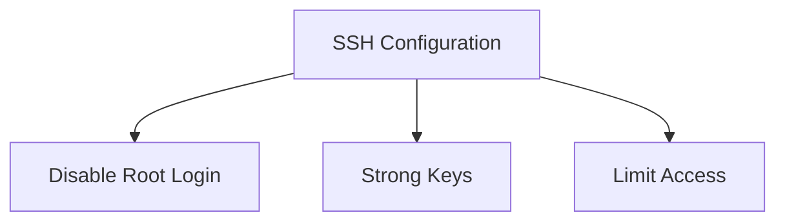
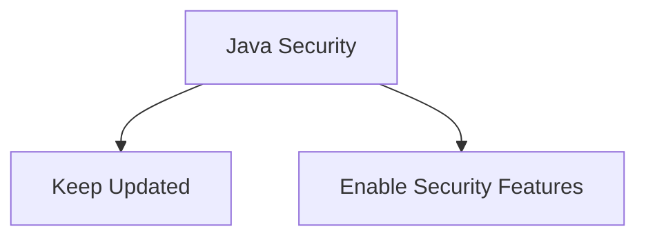
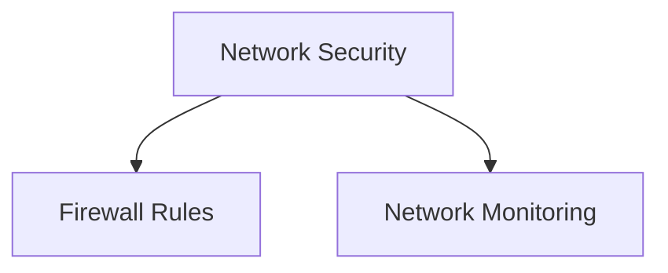

## Creating the Ansible Playbook

### Introduction to Ansible Playbooks

Ansible is an automation tool that simplifies the process of configuring and managing infrastructure. A playbook is a YAML file that contains a series of tasks to be executed on remote hosts. These tasks can range from simple commands to complex configurations.

#### Structure of a Playbook

A typical playbook consists of the following components:

1. **Hosts**: Specifies the target hosts where the tasks will be executed.
2. **Tasks**: A list of actions to be performed on the hosts.
3. **Variables**: Used to store reusable data within the playbook.
4. **Roles**: Organize tasks into reusable units.

### Creating the Playbook

We will create a new playbook named `deploy_nexus.yml`. This playbook will automate the installation and configuration of Nexus on our newly created droplet.

#### Step-by-Step Guide

1. **Open a Text Editor**: Use your preferred text editor to create the playbook.
2. **Define Hosts**: Specify the IP address of the droplet as the target host.
3. **Install Java**: Nexus requires Java to run, so we will install Java version 8.
4. **Install Net Tools**: Install net tools for debugging purposes.

```yaml
---
- name: Deploy Nexus
  hosts: 192.168.1.100  # Replace with your droplet's IP address
  become: yes
  tasks:
    - name: Update package lists
      apt:
        update_cache: yes

    - name: Install Java 8
      apt:
        name: openjdk-8-jdk
        state: present

    - name: Install net-tools
      apt:
        name: net-tools
        state: present
```

### Explanation of Each Task

1. **Update Package Lists**:
   - **Purpose**: Ensures that the package lists are up-to-date before installing any packages.
   - **Command**: `apt update`
   - **Ansible Module**: `apt` with `update_cache: yes`

2. **Install Java 8**:
   - **Purpose**: Installs Java Development Kit (JDK) version . This is necessary because Nexus runs on the Java Virtual Machine (JVM).
   - **Command**: `apt install openjdk-8-jdk`
   - **Ansible Module**: `apt` with `name: openjdk-8-jdk` and `state: present`

3. **Install Net Tools**:
   - **Purpose**: Installs a collection of network utilities such as `ifconfig`, `netstat`, etc., which are useful for debugging network issues.
   - **Command**: `apt install net-tools`
   - **Ansible Module**: `apt` with `name: net-tools` and `state: present`

### Full Example of the Playbook

Here is the complete playbook with detailed comments:

```yaml
---
# deploy_nexus.yml
- name: Deploy Nexus
  hosts: 192.168.1.100  # Replace with your droplet's IP address
  become: yes
  tasks:
    - name: Update package lists
      apt:
        update_cache: yes
      # Ensures that the package lists are up-to-date before installing any packages.

    - name: Install Java 8
      apt:
        name: openjdk-8-jdk
        state: present
      # Installs Java Development Kit (JDK) version 8. Necessary for Nexus to run.

    - name: Install net-tools
      apt:
        name: net-tools
        state: present
      # Installs a collection of network utilities for debugging purposes.
```

### Running the Playbook

To run the playbook, execute the following command:

```bash
ansible-playbook -i inventory deploy_nexus.yml
```

Where `inventory` is a file containing the IP address of the droplet.

### Inventory File Example

The inventory file (`inventory`) should look like this:

```ini
[nexus]
192.168.1.100 ansible_user=your_username ansible_ssh_private_key_file=/path/to/ssh/key
```

### Debugging and Verification

After running the playbook, you can verify the installation by checking if Java and net tools are installed correctly.

```bash
ssh your_username@192.168.1.100
java -version
which ifconfig
```

### How to Prevent / Defend

#### Secure SSH Configuration

Ensure that SSH is configured securely:

1. **Disable Root Login**: Edit `/etc/ssh/sshd_config` and set `PermitRootLogin no`.
2. **Use Strong Keys**: Generate strong SSH keys and disable password authentication.
3. **Limit Access**: Restrict access to specific IP addresses using firewall rules.



#### Secure Java Installation

Ensure that Java is updated regularly to mitigate vulnerabilities:

1. **Keep Java Updated**: Regularly check for updates and apply them.
2. **Use Security Features**: Enable security features such as Java Security Manager.



#### Network Security

Secure network services to prevent unauthorized access:

1. **Firewall Rules**: Configure firewall rules to allow only necessary traffic.
2. **Network Monitoring**: Implement monitoring to detect and respond to suspicious activity.



### Real-World Examples

#### CVE-2021-44228 (Log4Shell)

This vulnerability affected many Java applications, including those running on Nexus. Ensure that all Java dependencies are updated to mitigate this risk.

#### Recent Breaches

Several high-profile breaches have been attributed to misconfigured or outdated software. Regularly auditing and updating your infrastructure can help prevent such incidents.

### Practice Labs

For hands-on practice, consider the following labs:

- **PortSwigger Web Security Academy**: Offers comprehensive training on web security.
- **OWASP Juice Shop**: A deliberately insecure web application for practicing security skills.
- **DVWA (Damn Vulnerable Web Application)**: Another popular web application for security training.

These labs provide practical experience in securing and managing infrastructure, which is essential for mastering DevOps practices.

By following these steps and best practices, you can effectively automate the installation and management of Nexus using Ansible, ensuring a secure and efficient deployment.

---
<!-- nav -->
[[04-Automating Nexus Installation with Ansible|Automating Nexus Installation with Ansible]] | [[DevOps/DevOps Bootcamp/07-Configuration Management (Ansible)/12-Automating Nexus Installation with Ansible/00-Overview|Overview]] | [[06-Droplet Management and Preparation|Droplet Management and Preparation]]
