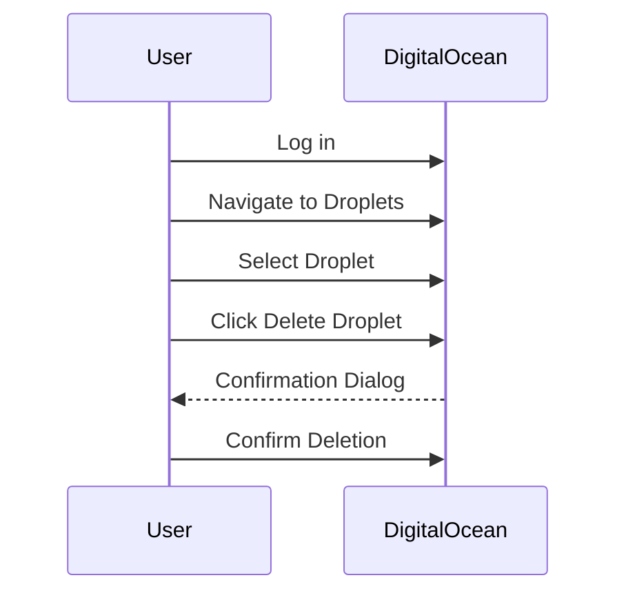
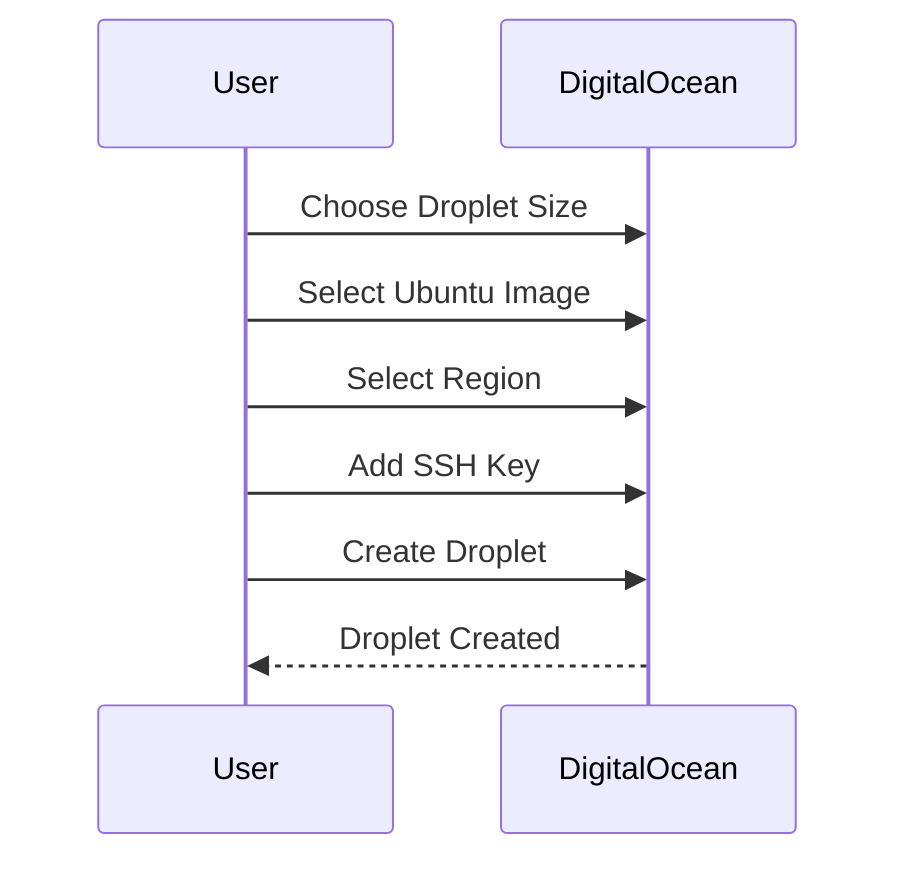
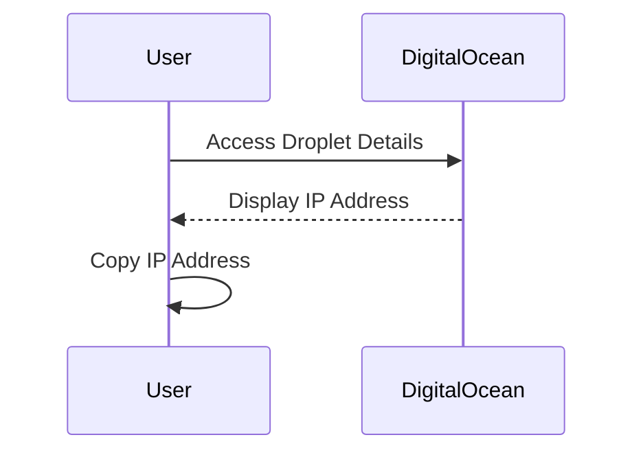

## Droplet Management and Preparation

### Droplet Deletion and Creation

In the context of DevOps, managing infrastructure efficiently is crucial. DigitalOcean provides a service called "Droplets," which are virtual servers that can be created, managed, and destroyed easily. In this scenario, we are preparing to set up a new environment for Nexus, a repository manager, using Ansible. Before proceeding, we need to clean up the previous environment used for Node.js.

#### Deleting the Previous Droplet

To delete the existing droplet:

1. Log in to your DigitalOcean account.
2. Navigate to the "Droplets" section.
3. Locate the droplet you wish to delete.
4. Click on the droplet name to open its details page.
5. Click the "Delete Droplet" button at the bottom of the page.
6. Confirm the deletion by typing the droplet's name in the confirmation dialog.

### Creating a New Droplet

Next, we create a new droplet specifically for our Nexus deployment. This ensures a clean slate and avoids conflicts with previous configurations.

1. **Choose the Droplet Size**: We select the smallest size available, which is typically sufficient for testing purposes.
2. **Select the Image**: We choose Ubuntu, a popular and widely-used Linux distribution.
3. **Select the Region**: We choose the region closest to us for optimal performance.
4. **Add SSH Key**: We use the same SSH key as before to maintain consistency.
5. **Create Droplet**: Finally, we click "Create Droplet."

### Copying the IP Address

Once the droplet is created, we need to copy its IP address. This IP will be used to connect to the droplet via SSH and to configure our Ansible playbook.

---
<!-- nav -->
[[05-Creating the Ansible Playbook|Creating the Ansible Playbook]] | [[DevOps/DevOps Bootcamp/07-Configuration Management (Ansible)/12-Automating Nexus Installation with Ansible/00-Overview|Overview]] | [[DevOps/DevOps Bootcamp/07-Configuration Management (Ansible)/12-Automating Nexus Installation with Ansible/07-Practice Questions & Answers|Practice Questions & Answers]]
